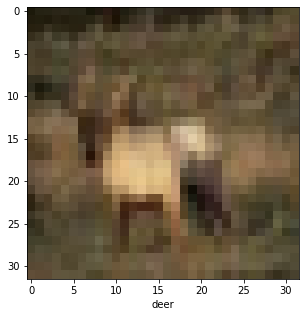
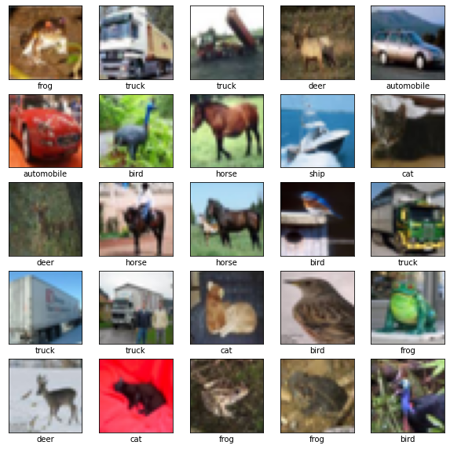
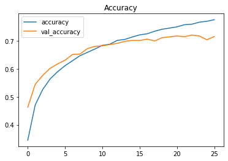

```python
import tensorflow as tf
tf.__version__
```


    '2.5.0'


```python
import os

train_images_path = './input/cifar-10/train'
# https://stackoverflow.com/questions/3207219/how-do-i-list-all-files-of-a-directory
files = [f for f in os.listdir(train_images_path)]
```


```python
print(files[0])
files[0].split('.')[0]
```

    20037.png


    '20037'


```python
len(files)
```


    50001


```python
import os
os.path.join(train_images_path, files[0])
```


    './input/cifar-10/train/20037.png'


```python
import matplotlib.pyplot as plt
img = plt.imread(os.path.join(train_images_path, files[0]))
img.shape
```


    (32, 32, 3)


```python
print(img[0, 0, 0])
int(files[0].split('.')[0])
```

    0.60784316


    20037


```python
import numpy as np
import pandas as pd

train_images_df = pd.DataFrame()

# for i in range(2):
for i in range(len(files)):
    if files[i].endswith('png'):
        img = plt.imread(os.path.join(train_images_path, files[i]))
        img_number = int(files[i].split('.')[0])
        train_images_df = train_images_df.append({'id': img_number, 'img': img}, ignore_index = True)
```


```python
train_images_df.sort_values(by=['id'], inplace = True)
```


```python
train_images_df.img
```


    47627    [[[0.23137255, 0.24313726, 0.24705882], [0.168...
    44496    [[[0.6039216, 0.69411767, 0.73333335], [0.4941...
    46134    [[[1.0, 1.0, 1.0], [0.99215686, 0.99215686, 0....
    38046    [[[0.10980392, 0.09803922, 0.039215688], [0.14...
    39966    [[[0.6666667, 0.7058824, 0.7764706], [0.658823...
                                   ...                        
    25378    [[[0.5686275, 0.6313726, 0.7607843], [0.592156...
    27808    [[[1.0, 0.9607843, 0.5176471], [0.99607843, 0....
    21442    [[[0.13725491, 0.69803923, 0.92156863], [0.156...
    19107    [[[0.7411765, 0.827451, 0.9411765], [0.7294118...
    13162    [[[0.8980392, 0.8980392, 0.9372549], [0.925490...
    Name: img, Length: 50000, dtype: object


```python
train_images = np.array(list(train_images_df.img))
train_images.shape
```


    (50000, 32, 32, 3)


```python
# train_images[0]
```


```python
import pandas as pd
train_labels_df = pd.read_csv('./input/cifar-10/trainLabels.csv')
```


```python
train_labels_df.head()
```


<div>
<style scoped>
    .dataframe tbody tr th:only-of-type {
        vertical-align: middle;
    }

    .dataframe tbody tr th {
        vertical-align: top;
    }

    .dataframe thead th {
        text-align: right;
    }
</style>
<table border="1" class="dataframe">
  <thead>
    <tr style="text-align: right;">
      <th></th>
      <th>id</th>
      <th>label</th>
    </tr>
  </thead>
  <tbody>
    <tr>
      <th>0</th>
      <td>1</td>
      <td>frog</td>
    </tr>
    <tr>
      <th>1</th>
      <td>2</td>
      <td>truck</td>
    </tr>
    <tr>
      <th>2</th>
      <td>3</td>
      <td>truck</td>
    </tr>
    <tr>
      <th>3</th>
      <td>4</td>
      <td>deer</td>
    </tr>
    <tr>
      <th>4</th>
      <td>5</td>
      <td>automobile</td>
    </tr>
  </tbody>
</table>
</div>


```python
label_names = ['airplane', 'automobile', 'bird', 'cat', 'deer', 
               'dog', 'frog', 'horse', 'ship', 'truck']
label_names
```


    ['airplane',
     'automobile',
     'bird',
     'cat',
     'deer',
     'dog',
     'frog',
     'horse',
     'ship',
     'truck']


```python
label_names.index('dog')
```


    5


```python
train_labels_df['label'] = list(map(label_names.index, train_labels_df.label))
```


```python
train_labels_df.label[:5]
```


    0    6
    1    9
    2    9
    3    4
    4    1
    Name: label, dtype: int64


```python
train_labels = np.array(train_labels_df.label)
print(train_labels.shape)
train_labels
```

    (50000,)


    array([6, 9, 9, ..., 9, 1, 1])


```python
pos = 3
plt.figure(figsize = (5, 5))
plt.imshow(train_images[pos])
plt.xlabel(label_names[train_labels[pos]])
```


    Text(0.5, 0, 'deer')


    

    


```python
plt.figure(figsize = (10, 10))
for i in range(25):
    plt.subplot(5, 5, i+1)
    plt.xticks([])
    plt.yticks([])
    plt.grid(False)
    plt.imshow(train_images[i])
    plt.xlabel(label_names[train_labels[i]])
plt.show()
```


    

    


```python
print(train_images.shape)
print(train_labels.shape)

# train = df.sample(frac = 0.7, random_state = 0)
# valid = df.drop(train.index)
```

    (50000, 32, 32, 3)
    (50000,)


```python
all_images = train_images.copy()
all_labels = train_labels.copy()

import math
N = len(all_labels)

# https://numpy.org/doc/stable/reference/random/generated/numpy.random.choice.html
np.random.seed(1)
in_train = np.random.choice(N, math.ceil(N * 0.7), replace = False)
in_valid = np.setdiff1d(range(N), in_train)

train_images = all_images[in_train] 
valid_images = all_images[in_valid]

train_labels = all_labels[in_train]
valid_labels = all_labels[in_valid]
```


```python
print(train_images.shape)
print(valid_images.shape)

print(train_labels.shape)
print(valid_labels.shape)
```

    (35000, 32, 32, 3)
    (15000, 32, 32, 3)
    (35000,)
    (15000,)


```python
from tensorflow.keras import callbacks

early_stopping = callbacks.EarlyStopping(
    patience = 5,
    min_delta = 0.001,
    restore_best_weights = True,
)
```


```python
from tensorflow.keras import models, layers

input_shape = (32, 32, 3)
model = models.Sequential([
    layers.Conv2D(64, (3, 3), activation = 'relu', input_shape = input_shape),
    layers.MaxPooling2D(2, 2),
    layers.Dropout(0.3),
    layers.Conv2D(128, (3, 3), activation = 'relu'),
    layers.MaxPooling2D(2, 2),
    layers.Dropout(0.3),
    layers.Flatten(),
    layers.Dense(128, activation = 'relu'),
    layers.Dropout(0.3),
    layers.Dense(10),
])
```


```python
model.compile(optimizer = 'adam',
              loss = tf.keras.losses.SparseCategoricalCrossentropy(from_logits = True),
              metrics = ['accuracy'])

history = model.fit(
    train_images, train_labels,
    validation_data = (valid_images, valid_labels),
    batch_size = 256,
    epochs = 500,
    callbacks = [early_stopping],
)
```

    Epoch 1/500
    137/137 [==============================] - 19s 138ms/step - loss: 1.7939 - accuracy: 0.3445 - val_loss: 1.5073 - val_accuracy: 0.4627
    Epoch 2/500
    137/137 [==============================] - 18s 135ms/step - loss: 1.4600 - accuracy: 0.4709 - val_loss: 1.3126 - val_accuracy: 0.5447
    Epoch 3/500
    137/137 [==============================] - 18s 134ms/step - loss: 1.3230 - accuracy: 0.5261 - val_loss: 1.2327 - val_accuracy: 0.5767
    Epoch 4/500
    137/137 [==============================] - 19s 137ms/step - loss: 1.2222 - accuracy: 0.5642 - val_loss: 1.1522 - val_accuracy: 0.6021
    Epoch 5/500
    137/137 [==============================] - 19s 137ms/step - loss: 1.1571 - accuracy: 0.5900 - val_loss: 1.0936 - val_accuracy: 0.6180
    Epoch 6/500
    137/137 [==============================] - 19s 141ms/step - loss: 1.0965 - accuracy: 0.6115 - val_loss: 1.0537 - val_accuracy: 0.6313
    Epoch 7/500
    137/137 [==============================] - 19s 137ms/step - loss: 1.0484 - accuracy: 0.6293 - val_loss: 0.9955 - val_accuracy: 0.6517
    Epoch 8/500
    137/137 [==============================] - 19s 138ms/step - loss: 1.0038 - accuracy: 0.6472 - val_loss: 0.9828 - val_accuracy: 0.6531
    Epoch 9/500
    137/137 [==============================] - 19s 141ms/step - loss: 0.9696 - accuracy: 0.6593 - val_loss: 0.9336 - val_accuracy: 0.6729
    Epoch 10/500
    137/137 [==============================] - 19s 140ms/step - loss: 0.9380 - accuracy: 0.6712 - val_loss: 0.9112 - val_accuracy: 0.6807
    Epoch 11/500
    137/137 [==============================] - 20s 143ms/step - loss: 0.9042 - accuracy: 0.6843 - val_loss: 0.9124 - val_accuracy: 0.6825
    Epoch 12/500
    137/137 [==============================] - 20s 143ms/step - loss: 0.8869 - accuracy: 0.6885 - val_loss: 0.8997 - val_accuracy: 0.6873
    Epoch 13/500
    137/137 [==============================] - 20s 143ms/step - loss: 0.8490 - accuracy: 0.7022 - val_loss: 0.8882 - val_accuracy: 0.6915
    Epoch 14/500
    137/137 [==============================] - 20s 144ms/step - loss: 0.8363 - accuracy: 0.7056 - val_loss: 0.8677 - val_accuracy: 0.6987
    Epoch 15/500
    137/137 [==============================] - 20s 146ms/step - loss: 0.8084 - accuracy: 0.7142 - val_loss: 0.8553 - val_accuracy: 0.7021
    Epoch 16/500
    137/137 [==============================] - 19s 141ms/step - loss: 0.7924 - accuracy: 0.7219 - val_loss: 0.8555 - val_accuracy: 0.7017
    Epoch 17/500
    137/137 [==============================] - 20s 143ms/step - loss: 0.7758 - accuracy: 0.7258 - val_loss: 0.8396 - val_accuracy: 0.7067
    Epoch 18/500
    137/137 [==============================] - 20s 144ms/step - loss: 0.7465 - accuracy: 0.7348 - val_loss: 0.8651 - val_accuracy: 0.7001
    Epoch 19/500
    137/137 [==============================] - 20s 143ms/step - loss: 0.7321 - accuracy: 0.7420 - val_loss: 0.8291 - val_accuracy: 0.7119
    Epoch 20/500
    137/137 [==============================] - 19s 141ms/step - loss: 0.7156 - accuracy: 0.7462 - val_loss: 0.8231 - val_accuracy: 0.7146
    Epoch 21/500
    137/137 [==============================] - 19s 140ms/step - loss: 0.7019 - accuracy: 0.7506 - val_loss: 0.8106 - val_accuracy: 0.7179
    Epoch 22/500
    137/137 [==============================] - 19s 142ms/step - loss: 0.6860 - accuracy: 0.7583 - val_loss: 0.8258 - val_accuracy: 0.7153
    Epoch 23/500
    137/137 [==============================] - 19s 140ms/step - loss: 0.6721 - accuracy: 0.7601 - val_loss: 0.8107 - val_accuracy: 0.7212
    Epoch 24/500
    137/137 [==============================] - 19s 139ms/step - loss: 0.6522 - accuracy: 0.7674 - val_loss: 0.8108 - val_accuracy: 0.7179
    Epoch 25/500
    137/137 [==============================] - 20s 146ms/step - loss: 0.6437 - accuracy: 0.7705 - val_loss: 0.8476 - val_accuracy: 0.7044
    Epoch 26/500
    137/137 [==============================] - 19s 141ms/step - loss: 0.6316 - accuracy: 0.7763 - val_loss: 0.8231 - val_accuracy: 0.7159


```python
history_df = pd.DataFrame(history.history)
print(f"Validation accuracy: {history_df.val_accuracy.max()}")

history_df.loc[:, ['accuracy', 'val_accuracy']].plot(title = 'Accuracy')
```

    Validation accuracy: 0.7211999893188477


    <AxesSubplot:title={'center':'Accuracy'}>


    

    


```python
def read_images(images_path):
    files = [f for f in os.listdir(images_path)]
    images_df = pd.DataFrame()

    # for i in range(2):
    for i in range(len(files)):
        if files[i].endswith('png'):
            img = plt.imread(os.path.join(images_path, files[i]))
            img_number = int(files[i].split('.')[0])
            images_df = images_df.append({'id': img_number, 'img': img}, ignore_index = True)
            
    images_df.sort_values(by=['id'], inplace = True)
    return np.array(list(images_df.img))

test_images = read_images('./input/cifar-10/test')
```


```python
test_images.shape
```


    (300000, 32, 32, 3)


```python
predictions = model.predict(test_images)

test_labels = list(map(np.argmax, predictions))
test_labels = list(map(lambda x: label_names[x], test_labels))
```


```python
output = pd.DataFrame({'id': range(1, len(test_labels)+1), 'label': test_labels})
output.to_csv("cnn_submission.csv", index = False)
```

# Reference

[Tensorflow tutorial - CNN](https://www.tensorflow.org/tutorials/images/cnn)
