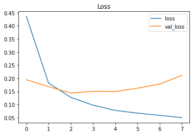
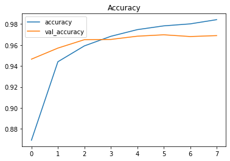

```python
import pandas as pd
train = pd.read_csv('./input/digit-recognizer/train.csv')
test = pd.read_csv('./input/digit-recognizer/test.csv')
```


```python
train.columns
```


    Index(['label', 'pixel0', 'pixel1', 'pixel2', 'pixel3', 'pixel4', 'pixel5',
           'pixel6', 'pixel7', 'pixel8',
           ...
           'pixel774', 'pixel775', 'pixel776', 'pixel777', 'pixel778', 'pixel779',
           'pixel780', 'pixel781', 'pixel782', 'pixel783'],
          dtype='object', length=785)


```python
test.columns
```


    Index(['pixel0', 'pixel1', 'pixel2', 'pixel3', 'pixel4', 'pixel5', 'pixel6',
           'pixel7', 'pixel8', 'pixel9',
           ...
           'pixel774', 'pixel775', 'pixel776', 'pixel777', 'pixel778', 'pixel779',
           'pixel780', 'pixel781', 'pixel782', 'pixel783'],
          dtype='object', length=784)


```python
train.dtypes
```


    label       int64
    pixel0      int64
    pixel1      int64
    pixel2      int64
    pixel3      int64
                ...  
    pixel779    int64
    pixel780    int64
    pixel781    int64
    pixel782    int64
    pixel783    int64
    Length: 785, dtype: object


```python
train.shape
```


    (42000, 785)


```python
df = train

train = df.sample(frac = 0.7, random_state = 0)
valid = df.drop(train.index)

print(train.shape)
print(valid.shape)
```

    (29400, 785)
    (12600, 785)


```python
X_train = train
y_train = X_train.pop('label')

print(X_train.shape)
print(y_train.shape)
```

    (29400, 784)
    (29400,)


```python
X_valid = valid
y_valid = X_valid.pop('label')

print(X_valid.shape)
print(y_valid.shape)
```

    (12600, 784)
    (12600,)


```python
input_shape = [X_train.shape[1]]
print(input_shape)
```

    [784]


```python
from tensorflow import keras
from tensorflow.keras import layers


model = keras.Sequential([
    layers.BatchNormalization(input_shape = input_shape),
    layers.Dense(512, activation = 'relu'),
    layers.BatchNormalization(),
    layers.Dropout(0.3),
    layers.Dense(512, activation = 'relu'),
    layers.BatchNormalization(),
    layers.Dropout(0.3),
    layers.Dense(512, activation = 'relu'),
    layers.BatchNormalization(),
    layers.Dropout(0.3),
    layers.Dense(10, activation = 'softmax'),
])
```


```python
# 0.965
"""
model = keras.Sequential([
    layers.BatchNormalization(input_shape = input_shape),
    layers.Dense(256, activation = 'relu'),
    layers.BatchNormalization(),
    layers.Dropout(0.3),
    layers.Dense(10, activation = 'softmax'),
])
"""
```


    "\nmodel = keras.Sequential([\n    layers.BatchNormalization(input_shape = input_shape),\n    layers.Dense(256, activation = 'relu'),\n    layers.BatchNormalization(),\n    layers.Dropout(0.3),\n    layers.Dense(10, activation = 'softmax'),\n])\n"


```python
# 0.968
"""
model = keras.Sequential([
    layers.BatchNormalization(input_shape = input_shape),
    layers.Dense(256, activation = 'relu'),
    layers.BatchNormalization(),
    layers.Dropout(0.3),
    layers.Dense(256, activation = 'relu'),
    layers.BatchNormalization(),
    layers.Dropout(0.3),
    layers.Dense(256, activation = 'relu'),
    layers.BatchNormalization(),
    layers.Dropout(0.3),
    layers.Dense(10, activation = 'softmax'),
])
"""
```


    "\nmodel = keras.Sequential([\n    layers.BatchNormalization(input_shape = input_shape),\n    layers.Dense(256, activation = 'relu'),\n    layers.BatchNormalization(),\n    layers.Dropout(0.3),\n    layers.Dense(256, activation = 'relu'),\n    layers.BatchNormalization(),\n    layers.Dropout(0.3),\n    layers.Dense(256, activation = 'relu'),\n    layers.BatchNormalization(),\n    layers.Dropout(0.3),\n    layers.Dense(10, activation = 'softmax'),\n])\n"


```python
from tensorflow.keras import callbacks

early_stopping = callbacks.EarlyStopping(
    patience = 5,
    min_delta = 0.001,
    restore_best_weights = True,
)
```


```python
# https://www.tensorflow.org/api_docs/python/tf/keras/losses/SparseCategoricalCrossentropy
model.compile(optimizer = 'adam',
              loss = 'sparse_categorical_crossentropy',
              metrics = ['accuracy'])

history = model.fit(
    X_train, y_train,
    validation_data = (X_valid, y_valid),
    batch_size = 256,
    epochs = 500,
    callbacks = [early_stopping],
    verbose = 0,
)
```


```python
history_df = pd.DataFrame(history.history)
history_df.head()
```


<div>
<style scoped>
    .dataframe tbody tr th:only-of-type {
        vertical-align: middle;
    }

    .dataframe tbody tr th {
        vertical-align: top;
    }

    .dataframe thead th {
        text-align: right;
    }
</style>
<table border="1" class="dataframe">
  <thead>
    <tr style="text-align: right;">
      <th></th>
      <th>loss</th>
      <th>accuracy</th>
      <th>val_loss</th>
      <th>val_accuracy</th>
    </tr>
  </thead>
  <tbody>
    <tr>
      <th>0</th>
      <td>0.435630</td>
      <td>0.869184</td>
      <td>0.194276</td>
      <td>0.946508</td>
    </tr>
    <tr>
      <th>1</th>
      <td>0.181544</td>
      <td>0.944048</td>
      <td>0.167870</td>
      <td>0.957063</td>
    </tr>
    <tr>
      <th>2</th>
      <td>0.126965</td>
      <td>0.959150</td>
      <td>0.143358</td>
      <td>0.965079</td>
    </tr>
    <tr>
      <th>3</th>
      <td>0.097101</td>
      <td>0.968299</td>
      <td>0.149927</td>
      <td>0.965317</td>
    </tr>
    <tr>
      <th>4</th>
      <td>0.077166</td>
      <td>0.974660</td>
      <td>0.149076</td>
      <td>0.968413</td>
    </tr>
  </tbody>
</table>
</div>


```python
history_df.loc[:, ['loss', 'val_loss']].plot(title = 'Loss')
print(history_df.val_loss.min())
```

    0.14335761964321136


    

    


```python
history_df.loc[:, ['accuracy', 'val_accuracy']].plot(title = 'Accuracy')
print(history_df.val_accuracy.max())
```

    0.9697619080543518


    

    


```python
import numpy as np

predictions = model.predict(X_train)

print(list(map(np.argmax, predictions[:5])))
print(y_train[:5])
```

    [3, 6, 9, 5, 6]
    16275    3
    19204    6
    18518    9
    25780    5
    16228    6
    Name: label, dtype: int64


```python
predictions = model.predict(test)

y_test = list(map(np.argmax, predictions))
output = pd.DataFrame({'ImageId': range(1, len(y_test)+1), 'Label': y_test})
```


```python
output.to_csv("dl_submission.csv", index = False)
```

# Reference

[Kaggle - Intro to Deep Learning - Dropout and Batch Normalization](https://www.kaggle.com/ryanholbrook/dropout-and-batch-normalization)

[Kaggle - Intro to Deep Learning - Binary Classification](https://www.kaggle.com/ryanholbrook/binary-classification)

[Tensorflow - Tutorial - Basic classification: Classify images of clothing](https://www.tensorflow.org/tutorials/keras/classification)

[UD187 - Lesson 3: Your First Model - Fashion MNIST](https://classroom.udacity.com/courses/ud187/lessons)
