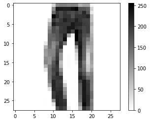
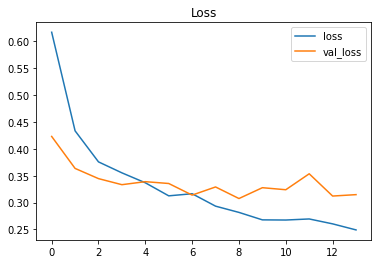
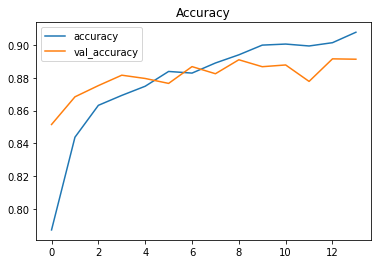

```python
import tensorflow as tf
tf.__version__
```


    '2.5.0'


```python
import pandas as pd

train = pd.read_csv('./input/fashion-mnist/fashion-mnist_train.csv')
test = pd.read_csv('./input/fashion-mnist/fashion-mnist_test.csv')
```


```python
print(train.shape)
train.columns
```

    (60000, 785)


    Index(['label', 'pixel1', 'pixel2', 'pixel3', 'pixel4', 'pixel5', 'pixel6',
           'pixel7', 'pixel8', 'pixel9',
           ...
           'pixel775', 'pixel776', 'pixel777', 'pixel778', 'pixel779', 'pixel780',
           'pixel781', 'pixel782', 'pixel783', 'pixel784'],
          dtype='object', length=785)


```python
print(test.shape)
test.columns
```

    (10000, 785)


    Index(['label', 'pixel1', 'pixel2', 'pixel3', 'pixel4', 'pixel5', 'pixel6',
           'pixel7', 'pixel8', 'pixel9',
           ...
           'pixel775', 'pixel776', 'pixel777', 'pixel778', 'pixel779', 'pixel780',
           'pixel781', 'pixel782', 'pixel783', 'pixel784'],
          dtype='object', length=785)


```python
train.dtypes
```


    label       int64
    pixel1      int64
    pixel2      int64
    pixel3      int64
    pixel4      int64
                ...  
    pixel780    int64
    pixel781    int64
    pixel782    int64
    pixel783    int64
    pixel784    int64
    Length: 785, dtype: object


```python
df = train.copy()

train = df.sample(frac = 0.7, random_state = 0)
valid = df.drop(train.index)

print(train.shape)
print(valid.shape)
```

    (42000, 785)
    (18000, 785)


```python
def split_Xy(df):
    X = df
    y = X.pop('label')
    return X, y

X_train, y_train = split_Xy(train)
print(X_train.shape, y_train.shape)
```

    (42000, 784) (42000,)


```python
X_valid , y_valid = split_Xy(valid)
print(X_valid.shape, y_valid.shape)
```

    (18000, 784) (18000,)


```python
X_test , y_test = split_Xy(test)
print(X_test.shape, y_test.shape)
```

    (10000, 784) (10000,)


```python
y_train.unique()
```


    array([1, 6, 8, 7, 0, 5, 2, 9, 4, 3])


```python
input_shape = [X_train.shape[1]]
print(input_shape)
```

    [784]


```python
import numpy as np

# https://numpy.org/doc/stable/reference/generated/numpy.reshape.html
img1 = np.reshape(list(X_train.iloc[0]), (28, 28))
```


```python
# https://www.tensorflow.org/tutorials/keras/classification
import matplotlib.pyplot as plt

plt.figure()
plt.imshow(img1, cmap = plt.cm.binary)
plt.colorbar()
plt.grid(False)
plt.show()
```


    

    


```python
from tensorflow import keras
from tensorflow.keras import layers

# val: 0.852, test: 0.862
"""
model = tf.keras.Sequential([
    tf.keras.layers.Flatten(input_shape= input_shape),
    tf.keras.layers.Dense(128, activation='relu'),
    tf.keras.layers.Dense(10, activation = 'softmax')
])
"""
```


    "\nmodel = tf.keras.Sequential([\n    tf.keras.layers.Flatten(input_shape= input_shape),\n    tf.keras.layers.Dense(128, activation='relu'),\n    tf.keras.layers.Dense(10, activation = 'softmax')\n])\n"


```python
# val: 0.8287222385406494, test: 0.8965

model = keras.Sequential([
    layers.BatchNormalization(input_shape = input_shape),
    layers.Dense(512, activation = 'relu'),
    layers.BatchNormalization(),
    layers.Dropout(0.3),
    layers.Dense(512, activation = 'relu'),
    layers.BatchNormalization(),
    layers.Dropout(0.3),
    layers.Dense(512, activation = 'relu'),
    layers.BatchNormalization(),
    layers.Dropout(0.3),
    layers.Dense(10, activation = 'softmax'),
])
```


```python
from tensorflow.keras import callbacks

early_stopping = callbacks.EarlyStopping(
    patience = 5,
    min_delta = 0.001,
    restore_best_weights = True,
)
```


```python
# https://www.tensorflow.org/api_docs/python/tf/keras/losses/SparseCategoricalCrossentropy
# https://stackoverflow.com/questions/34240703/what-are-logits-what-is-the-difference-between-softmax-and-softmax-cross-entrop

model.compile(optimizer = 'adam',
              loss = 'sparse_categorical_crossentropy',
              # If you don't use softmax for the last layer, you need to set from_logits as True
#              loss=tf.keras.losses.SparseCategoricalCrossentropy(from_logits=True),
              metrics = ['accuracy'])

history = model.fit(
    X_train, y_train,
    validation_data = (X_valid, y_valid),
    batch_size = 256,
    epochs = 500,
    callbacks = [early_stopping],
    verbose = 0,
)
```


```python
history_df = pd.DataFrame(history.history)
history_df.head()
```


<div>
<style scoped>
    .dataframe tbody tr th:only-of-type {
        vertical-align: middle;
    }

    .dataframe tbody tr th {
        vertical-align: top;
    }

    .dataframe thead th {
        text-align: right;
    }
</style>
<table border="1" class="dataframe">
  <thead>
    <tr style="text-align: right;">
      <th></th>
      <th>loss</th>
      <th>accuracy</th>
      <th>val_loss</th>
      <th>val_accuracy</th>
    </tr>
  </thead>
  <tbody>
    <tr>
      <th>0</th>
      <td>0.616424</td>
      <td>0.787405</td>
      <td>0.422871</td>
      <td>0.851556</td>
    </tr>
    <tr>
      <th>1</th>
      <td>0.433273</td>
      <td>0.843810</td>
      <td>0.363476</td>
      <td>0.868389</td>
    </tr>
    <tr>
      <th>2</th>
      <td>0.375605</td>
      <td>0.863214</td>
      <td>0.344510</td>
      <td>0.875222</td>
    </tr>
    <tr>
      <th>3</th>
      <td>0.355234</td>
      <td>0.869262</td>
      <td>0.333250</td>
      <td>0.881556</td>
    </tr>
    <tr>
      <th>4</th>
      <td>0.336782</td>
      <td>0.874833</td>
      <td>0.338851</td>
      <td>0.879556</td>
    </tr>
  </tbody>
</table>
</div>


```python
history_df.loc[:, ['loss', 'val_loss']].plot(title = 'Loss')
print(history_df.val_loss.min())
```

    0.30752870440483093


    

    


```python
history_df.loc[:, ['accuracy', 'val_accuracy']].plot(title = 'Accuracy')
print(history_df.val_accuracy.max())
```

    0.8914999961853027


    

    


```python
import numpy as np

predictions = model.predict(test)
print(predictions[0])
sum(predictions[0])
```

    [8.6097133e-01 9.1057484e-07 8.2688441e-04 7.9999409e-05 8.7240129e-05
     1.0928179e-06 1.3795617e-01 2.3996046e-07 7.5647637e-05 5.0428582e-07]


    1.000000023047562


```python
pred_test = list(map(np.argmax, predictions))
pd.Series(pred_test[:5])
```


    0    0
    1    1
    2    2
    3    2
    4    3
    dtype: int64


```python
y_test[:5]
```


    0    0
    1    1
    2    2
    3    2
    4    3
    Name: label, dtype: int64


```python
(pd.Series(pred_test) == y_test).sum()/len(y_test)
```


    0.8917


```python
# https://www.tensorflow.org/tutorials/keras/classification#evaluate_accuracy

test_loss, test_acc = model.evaluate(X_test, y_test)
print(f"Test loss: {test_loss}, Test accuracy: {test_acc}")
```

    313/313 [==============================] - 0s 920us/step - loss: 0.3041 - accuracy: 0.8917
    Test loss: 0.3041037321090698, Test accuracy: 0.891700029373169


# Reference

[Kaggle - Intro to Deep Learning - Dropout and Batch Normalization](https://www.kaggle.com/ryanholbrook/dropout-and-batch-normalization)

[Kaggle - Intro to Deep Learning - Binary Classification](https://www.kaggle.com/ryanholbrook/binary-classification)

[Tensorflow - Tutorial - Basic classification: Classify images of clothing](https://www.tensorflow.org/tutorials/keras/classification)

[UD187 - Lesson 3: Your First Model - Fashion MNIST](https://classroom.udacity.com/courses/ud187/lessons)
