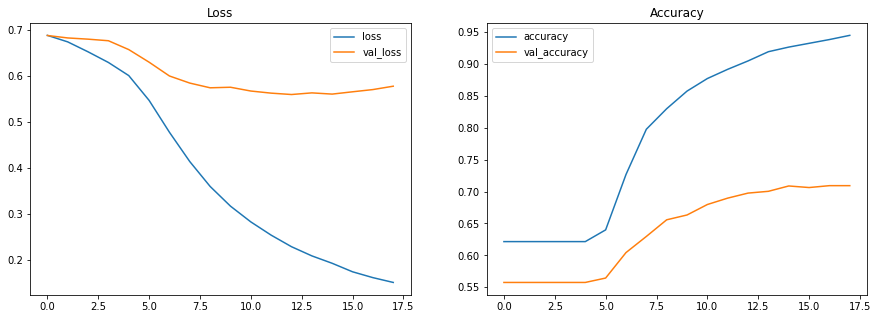
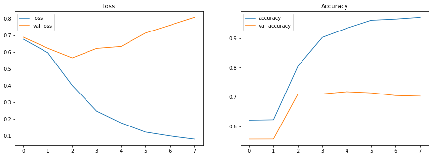
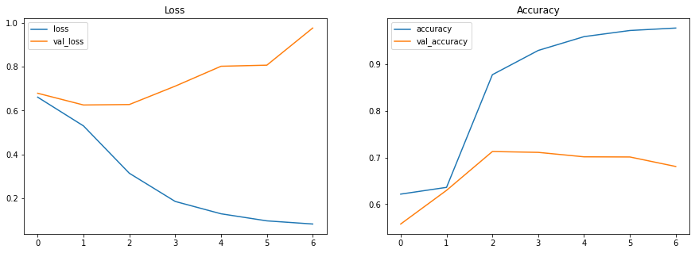

# Natural Language Processing with Disaster Tweets

[](https://www.kaggle.com/c/nlp-getting-started/data?select=train.csv)


```python
import tensorflow as tf

keras = tf.keras

tf.__version__
```


    '2.5.0'


# Prepare Data


```python
import pandas as pd

train_data = pd.read_csv('../input/nlp-getting-started/train.csv')
print(len(train_data))
train_data.head(5)
```

    7613


<div>
<style scoped>
    .dataframe tbody tr th:only-of-type {
        vertical-align: middle;
    }

    .dataframe tbody tr th {
        vertical-align: top;
    }

    .dataframe thead th {
        text-align: right;
    }
</style>
<table border="1" class="dataframe">
  <thead>
    <tr style="text-align: right;">
      <th></th>
      <th>id</th>
      <th>keyword</th>
      <th>location</th>
      <th>text</th>
      <th>target</th>
    </tr>
  </thead>
  <tbody>
    <tr>
      <th>0</th>
      <td>1</td>
      <td>NaN</td>
      <td>NaN</td>
      <td>Our Deeds are the Reason of this #earthquake M...</td>
      <td>1</td>
    </tr>
    <tr>
      <th>1</th>
      <td>4</td>
      <td>NaN</td>
      <td>NaN</td>
      <td>Forest fire near La Ronge Sask. Canada</td>
      <td>1</td>
    </tr>
    <tr>
      <th>2</th>
      <td>5</td>
      <td>NaN</td>
      <td>NaN</td>
      <td>All residents asked to 'shelter in place' are ...</td>
      <td>1</td>
    </tr>
    <tr>
      <th>3</th>
      <td>6</td>
      <td>NaN</td>
      <td>NaN</td>
      <td>13,000 people receive #wildfires evacuation or...</td>
      <td>1</td>
    </tr>
    <tr>
      <th>4</th>
      <td>7</td>
      <td>NaN</td>
      <td>NaN</td>
      <td>Just got sent this photo from Ruby #Alaska as ...</td>
      <td>1</td>
    </tr>
  </tbody>
</table>
</div>


```python
test_data = pd.read_csv('../input/nlp-getting-started/test.csv')
print(len(test_data))
test_data.head(5)
```

    3263


<div>
<style scoped>
    .dataframe tbody tr th:only-of-type {
        vertical-align: middle;
    }

    .dataframe tbody tr th {
        vertical-align: top;
    }

    .dataframe thead th {
        text-align: right;
    }
</style>
<table border="1" class="dataframe">
  <thead>
    <tr style="text-align: right;">
      <th></th>
      <th>id</th>
      <th>keyword</th>
      <th>location</th>
      <th>text</th>
    </tr>
  </thead>
  <tbody>
    <tr>
      <th>0</th>
      <td>0</td>
      <td>NaN</td>
      <td>NaN</td>
      <td>Just happened a terrible car crash</td>
    </tr>
    <tr>
      <th>1</th>
      <td>2</td>
      <td>NaN</td>
      <td>NaN</td>
      <td>Heard about #earthquake is different cities, s...</td>
    </tr>
    <tr>
      <th>2</th>
      <td>3</td>
      <td>NaN</td>
      <td>NaN</td>
      <td>there is a forest fire at spot pond, geese are...</td>
    </tr>
    <tr>
      <th>3</th>
      <td>9</td>
      <td>NaN</td>
      <td>NaN</td>
      <td>Apocalypse lighting. #Spokane #wildfires</td>
    </tr>
    <tr>
      <th>4</th>
      <td>11</td>
      <td>NaN</td>
      <td>NaN</td>
      <td>Typhoon Soudelor kills 28 in China and Taiwan</td>
    </tr>
  </tbody>
</table>
</div>


```python
sample_submission = pd.read_csv('../input/nlp-getting-started/sample_submission.csv')
sample_submission.head(5)
```


<div>
<style scoped>
    .dataframe tbody tr th:only-of-type {
        vertical-align: middle;
    }

    .dataframe tbody tr th {
        vertical-align: top;
    }

    .dataframe thead th {
        text-align: right;
    }
</style>
<table border="1" class="dataframe">
  <thead>
    <tr style="text-align: right;">
      <th></th>
      <th>id</th>
      <th>target</th>
    </tr>
  </thead>
  <tbody>
    <tr>
      <th>0</th>
      <td>0</td>
      <td>0</td>
    </tr>
    <tr>
      <th>1</th>
      <td>2</td>
      <td>0</td>
    </tr>
    <tr>
      <th>2</th>
      <td>3</td>
      <td>0</td>
    </tr>
    <tr>
      <th>3</th>
      <td>9</td>
      <td>0</td>
    </tr>
    <tr>
      <th>4</th>
      <td>11</td>
      <td>0</td>
    </tr>
  </tbody>
</table>
</div>


```python
train_texts = train_data.text.to_numpy()
train_targets = train_data.target.to_numpy()

test_texts = test_data.text.to_numpy()
test_ids = test_data.id.to_numpy()
```


```python
vocab_size = 7000
```


```python
from keras.preprocessing.text import Tokenizer

tokenizer = Tokenizer(num_words = vocab_size, oov_token = '<OOV>')
tokenizer.fit_on_texts(train_texts)
word_index = tokenizer.word_index
for index, (text, text_index) in enumerate(word_index.items()):
    if index >= 5:
        break
    print(text, text_index)
```

    <OOV> 1
    t 2
    co 3
    http 4
    the 5


```python
reverse_word_index = dict([(value, key) for (key, value) in word_index.items()])
```


```python
for index, text in enumerate(train_texts):
    if index >= 5:
        break
    print(text)
    print(tokenizer.texts_to_sequences([text]))
```

    Our Deeds are the Reason of this #earthquake May ALLAH Forgive us all
    [[120, 4634, 25, 5, 869, 9, 22, 264, 139, 1620, 4635, 90, 41]]
    Forest fire near La Ronge Sask. Canada
    [[190, 46, 230, 800, 6955, 6956, 1405]]
    All residents asked to 'shelter in place' are being notified by officers. No other evacuation or shelter in place orders are expected
    [[41, 1752, 1621, 8, 6957, 7, 6958, 25, 137, 6959, 21, 1753, 40, 442, 257, 58, 2159, 7, 715, 1406, 25, 1107]]
    13,000 people receive #wildfires evacuation orders in California 
    [[836, 2922, 60, 4636, 1501, 257, 1406, 7, 97]]
    Just got sent this photo from Ruby #Alaska as smoke from #wildfires pours into a school 
    [[35, 101, 1222, 22, 321, 23, 6960, 2160, 31, 272, 23, 1501, 6961, 70, 6, 188]]


```python
for index, text in enumerate(test_texts):
    if index >= 5:
        break
    print(text)
    print(tokenizer.texts_to_sequences([text]))
    
```

    Just happened a terrible car crash
    [[35, 914, 6, 1952, 131, 93]]
    Heard about #earthquake is different cities, stay safe everyone.
    [[475, 57, 264, 12, 1202, 2649, 606, 2322, 246]]
    there is a forest fire at spot pond, geese are fleeing across the street, I cannot save them all
    [[78, 12, 6, 190, 46, 20, 826, 3576, 1, 25, 5168, 872, 5, 770, 11, 1415, 506, 98, 41]]
    Apocalypse lighting. #Spokane #wildfires
    [[480, 3940, 1, 1501]]
    Typhoon Soudelor kills 28 in China and Taiwan
    [[218, 796, 478, 2565, 7, 943, 10, 1207]]


```python
import numpy as np

sequences = tokenizer.texts_to_sequences(train_texts)
np.max(list(map(len, sequences)))
```


    33


```python
maxlen = 33
```


```python
from keras.preprocessing.sequence import pad_sequences

def tokenize_and_pad_sequence(texts):
    sequences = tokenizer.texts_to_sequences(texts)
    return pad_sequences(
        sequences,
        maxlen = maxlen,
        padding = 'post',
        truncating = 'post',
    )

train_sequences = tokenize_and_pad_sequence(train_texts)
test_sequences = tokenize_and_pad_sequence(test_texts)
```

# Build and Train Model


```python
import pandas as pd
import matplotlib.pyplot as plt

def plot_item(history_df, colname = 'loss', f = np.min, ax = None):
    val_colname = f'val_{colname}'
    print(f'{colname}: {f(history_df[colname]):.4f} - {val_colname}: {f(history_df[val_colname]):.4f}')
    history_df.loc[:, [colname, val_colname]].plot(title = colname.capitalize() , ax = ax)

def show_history(history):
    history_df = pd.DataFrame(history.history)
    
    fig, axes = plt.subplots(nrows = 1, ncols = 2, figsize = (15, 5))
    plot_item(history_df, 'loss', ax = axes[0])
    plot_item(history_df, 'accuracy', ax = axes[1], f = np.max)
```


```python
def fit_model(model, validation_split = 0.8, epochs = 500, patience = 5, verbose = 0):
    model.compile(
        optimizer = 'adam',
        loss = keras.losses.BinaryCrossentropy(from_logits = True),
        metrics = ['accuracy'],
    )

    early_stopping = keras.callbacks.EarlyStopping(
        patience = patience,
        restore_best_weights = True,
    )
    
    callbacks = [early_stopping]
    if validation_split == 0:
        callbacks = []

    history = model.fit(
        train_sequences, train_targets,
        validation_split = validation_split,
        epochs = epochs,
        callbacks = callbacks,
        verbose = verbose,
    )
    return history 
```


```python
embedding_dim = 16
```

## DNN


```python
tf.random.set_seed(1)
model_dnn = keras.Sequential([
    keras.layers.Embedding(vocab_size, embedding_dim, input_length = maxlen),
    keras.layers.GlobalAveragePooling1D(),
    keras.layers.Dense(16, activation = 'relu'),
    keras.layers.Dense(1),
])
model_dnn.summary()
```

    Model: "sequential_15"
    _________________________________________________________________
    Layer (type)                 Output Shape              Param #   
    =================================================================
    embedding_17 (Embedding)     (None, 33, 16)            112000    
    _________________________________________________________________
    global_average_pooling1d_10  (None, 16)                0         
    _________________________________________________________________
    dense_30 (Dense)             (None, 16)                272       
    _________________________________________________________________
    dense_31 (Dense)             (None, 1)                 17        
    =================================================================
    Total params: 112,289
    Trainable params: 112,289
    Non-trainable params: 0
    _________________________________________________________________


```python
history_dnn = fit_model(model_dnn)
show_history(history_dnn)
```

    loss: 0.1512 - val_loss: 0.5598
    accuracy: 0.9448 - val_accuracy: 0.7092


    

    


## LTSM


```python
tf.random.set_seed(1)
model_lstm_bi = keras.Sequential([
    keras.layers.Embedding(vocab_size, embedding_dim, input_length = maxlen),
    keras.layers.Bidirectional(keras.layers.LSTM(embedding_dim)),
    keras.layers.Dense(16, activation = 'relu'),
    keras.layers.Dense(1),
])

model_lstm_bi.summary()
```

    Model: "sequential_16"
    _________________________________________________________________
    Layer (type)                 Output Shape              Param #   
    =================================================================
    embedding_18 (Embedding)     (None, 33, 16)            112000    
    _________________________________________________________________
    bidirectional_9 (Bidirection (None, 32)                4224      
    _________________________________________________________________
    dense_32 (Dense)             (None, 16)                528       
    _________________________________________________________________
    dense_33 (Dense)             (None, 1)                 17        
    =================================================================
    Total params: 116,769
    Trainable params: 116,769
    Non-trainable params: 0
    _________________________________________________________________


```python
history_lstm_bi = fit_model(model_lstm_bi, verbose = 1)  
show_history(history_lstm_bi)
```

    Epoch 1/500
    48/48 [==============================] - 4s 42ms/step - loss: 0.6768 - accuracy: 0.6216 - val_loss: 0.6889 - val_accuracy: 0.5575
    Epoch 2/500
    48/48 [==============================] - 1s 15ms/step - loss: 0.5960 - accuracy: 0.6229 - val_loss: 0.6229 - val_accuracy: 0.5577
    Epoch 3/500
    48/48 [==============================] - 1s 15ms/step - loss: 0.4011 - accuracy: 0.8049 - val_loss: 0.5654 - val_accuracy: 0.7104
    Epoch 4/500
    48/48 [==============================] - 1s 15ms/step - loss: 0.2478 - accuracy: 0.9028 - val_loss: 0.6220 - val_accuracy: 0.7104
    Epoch 5/500
    48/48 [==============================] - 1s 16ms/step - loss: 0.1776 - accuracy: 0.9336 - val_loss: 0.6336 - val_accuracy: 0.7179
    Epoch 6/500
    48/48 [==============================] - 1s 16ms/step - loss: 0.1237 - accuracy: 0.9606 - val_loss: 0.7134 - val_accuracy: 0.7140
    Epoch 7/500
    48/48 [==============================] - 1s 16ms/step - loss: 0.1005 - accuracy: 0.9645 - val_loss: 0.7598 - val_accuracy: 0.7055
    Epoch 8/500
    48/48 [==============================] - 1s 16ms/step - loss: 0.0820 - accuracy: 0.9704 - val_loss: 0.8066 - val_accuracy: 0.7032
    loss: 0.0820 - val_loss: 0.5654
    accuracy: 0.9704 - val_accuracy: 0.7179


    

    


```python
tf.random.set_seed(1)
model_lstm_multiple_bi = keras.Sequential([
    keras.layers.Embedding(vocab_size, embedding_dim, input_length = maxlen),
    keras.layers.Bidirectional(keras.layers.LSTM(embedding_dim, return_sequences = True)),
    keras.layers.Bidirectional(keras.layers.LSTM(embedding_dim)),
    keras.layers.Dense(16, activation = 'relu'),
    keras.layers.Dense(1),
])

model_lstm_multiple_bi.summary()
```

    Model: "sequential_17"
    _________________________________________________________________
    Layer (type)                 Output Shape              Param #   
    =================================================================
    embedding_19 (Embedding)     (None, 33, 16)            112000    
    _________________________________________________________________
    bidirectional_10 (Bidirectio (None, 33, 32)            4224      
    _________________________________________________________________
    bidirectional_11 (Bidirectio (None, 32)                6272      
    _________________________________________________________________
    dense_34 (Dense)             (None, 16)                528       
    _________________________________________________________________
    dense_35 (Dense)             (None, 1)                 17        
    =================================================================
    Total params: 123,041
    Trainable params: 123,041
    Non-trainable params: 0
    _________________________________________________________________


```python
history_lstm_multiple_bi = fit_model(model_lstm_multiple_bi)  
show_history(history_lstm_multiple_bi)
```

    loss: 0.0823 - val_loss: 0.6253
    accuracy: 0.9770 - val_accuracy: 0.7127


    

    


## Final Model


```python
final_model = keras.Sequential([
    keras.layers.Embedding(vocab_size, embedding_dim, input_length = maxlen),
    keras.layers.Bidirectional(keras.layers.LSTM(embedding_dim)),
    keras.layers.Dense(16, activation = 'relu'),
    keras.layers.Dense(1),
])

fit_model(final_model, validation_split = 0, epochs = 5)
```


    <tensorflow.python.keras.callbacks.History at 0x1a47cadf0>


# Predict on Test Data


```python
predicted = final_model.predict(test_sequences)
```


```python
print(predicted[:10])
test_targets = list(map(lambda x: 1 if x > 0 else 0, predicted))
test_targets[:10]
```

    [[ 0.9523836]
     [ 1.2163361]
     [ 6.66016  ]
     [ 2.0975704]
     [ 6.358529 ]
     [ 4.246822 ]
     [-4.582698 ]
     [-2.7803013]
     [-4.2858844]
     [-3.0934145]]


    [1, 1, 1, 1, 1, 1, 0, 0, 0, 0]


```python
result_df = pd.DataFrame({'id': test_ids, 'target': test_targets})
result_df.to_csv('lstm_submission.csv', index = False)
```
