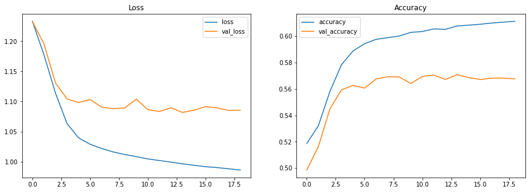

# Sentiment Analysis on Movie Reviews

https://www.kaggle.com/c/sentiment-analysis-on-movie-reviews/data


```python
import tensorflow as tf

keras = tf.keras

tf.__version__
```


    '2.5.0'


# Prepare Data


```python
import pandas as pd
train_data = pd.read_csv('../input/sentiment-analysis-on-movie-reviews/train.tsv.zip', sep = '\t')
print(train_data.Phrase[0])
print(train_data.Phrase[1])
print(train_data.Phrase[2])
train_data.head(5)
```

    A series of escapades demonstrating the adage that what is good for the goose is also good for the gander , some of which occasionally amuses but none of which amounts to much of a story .
    A series of escapades demonstrating the adage that what is good for the goose
    A series


<div>
<style scoped>
    .dataframe tbody tr th:only-of-type {
        vertical-align: middle;
    }

    .dataframe tbody tr th {
        vertical-align: top;
    }

    .dataframe thead th {
        text-align: right;
    }
</style>
<table border="1" class="dataframe">
  <thead>
    <tr style="text-align: right;">
      <th></th>
      <th>PhraseId</th>
      <th>SentenceId</th>
      <th>Phrase</th>
      <th>Sentiment</th>
    </tr>
  </thead>
  <tbody>
    <tr>
      <th>0</th>
      <td>1</td>
      <td>1</td>
      <td>A series of escapades demonstrating the adage ...</td>
      <td>1</td>
    </tr>
    <tr>
      <th>1</th>
      <td>2</td>
      <td>1</td>
      <td>A series of escapades demonstrating the adage ...</td>
      <td>2</td>
    </tr>
    <tr>
      <th>2</th>
      <td>3</td>
      <td>1</td>
      <td>A series</td>
      <td>2</td>
    </tr>
    <tr>
      <th>3</th>
      <td>4</td>
      <td>1</td>
      <td>A</td>
      <td>2</td>
    </tr>
    <tr>
      <th>4</th>
      <td>5</td>
      <td>1</td>
      <td>series</td>
      <td>2</td>
    </tr>
  </tbody>
</table>
</div>


```python
print(train_data.Phrase[63])
train_data[62:64+5]
```

    This quiet , introspective and entertaining independent is worth seeking .


<div>
<style scoped>
    .dataframe tbody tr th:only-of-type {
        vertical-align: middle;
    }

    .dataframe tbody tr th {
        vertical-align: top;
    }

    .dataframe thead th {
        text-align: right;
    }
</style>
<table border="1" class="dataframe">
  <thead>
    <tr style="text-align: right;">
      <th></th>
      <th>PhraseId</th>
      <th>SentenceId</th>
      <th>Phrase</th>
      <th>Sentiment</th>
    </tr>
  </thead>
  <tbody>
    <tr>
      <th>62</th>
      <td>63</td>
      <td>1</td>
      <td>.</td>
      <td>2</td>
    </tr>
    <tr>
      <th>63</th>
      <td>64</td>
      <td>2</td>
      <td>This quiet , introspective and entertaining in...</td>
      <td>4</td>
    </tr>
    <tr>
      <th>64</th>
      <td>65</td>
      <td>2</td>
      <td>This quiet , introspective and entertaining in...</td>
      <td>3</td>
    </tr>
    <tr>
      <th>65</th>
      <td>66</td>
      <td>2</td>
      <td>This</td>
      <td>2</td>
    </tr>
    <tr>
      <th>66</th>
      <td>67</td>
      <td>2</td>
      <td>quiet , introspective and entertaining indepen...</td>
      <td>4</td>
    </tr>
    <tr>
      <th>67</th>
      <td>68</td>
      <td>2</td>
      <td>quiet , introspective and entertaining</td>
      <td>3</td>
    </tr>
    <tr>
      <th>68</th>
      <td>69</td>
      <td>2</td>
      <td>quiet</td>
      <td>2</td>
    </tr>
  </tbody>
</table>
</div>


```python
test_data = pd.read_csv('../input/sentiment-analysis-on-movie-reviews/test.tsv.zip', sep = '\t')
test_data.head()
```


<div>
<style scoped>
    .dataframe tbody tr th:only-of-type {
        vertical-align: middle;
    }

    .dataframe tbody tr th {
        vertical-align: top;
    }

    .dataframe thead th {
        text-align: right;
    }
</style>
<table border="1" class="dataframe">
  <thead>
    <tr style="text-align: right;">
      <th></th>
      <th>PhraseId</th>
      <th>SentenceId</th>
      <th>Phrase</th>
    </tr>
  </thead>
  <tbody>
    <tr>
      <th>0</th>
      <td>156061</td>
      <td>8545</td>
      <td>An intermittently pleasing but mostly routine ...</td>
    </tr>
    <tr>
      <th>1</th>
      <td>156062</td>
      <td>8545</td>
      <td>An intermittently pleasing but mostly routine ...</td>
    </tr>
    <tr>
      <th>2</th>
      <td>156063</td>
      <td>8545</td>
      <td>An</td>
    </tr>
    <tr>
      <th>3</th>
      <td>156064</td>
      <td>8545</td>
      <td>intermittently pleasing but mostly routine effort</td>
    </tr>
    <tr>
      <th>4</th>
      <td>156065</td>
      <td>8545</td>
      <td>intermittently pleasing but mostly routine</td>
    </tr>
  </tbody>
</table>
</div>


```python
sample_submission_data = pd.read_csv('../input/sentiment-analysis-on-movie-reviews/sampleSubmission.csv')
sample_submission_data.head()
```


<div>
<style scoped>
    .dataframe tbody tr th:only-of-type {
        vertical-align: middle;
    }

    .dataframe tbody tr th {
        vertical-align: top;
    }

    .dataframe thead th {
        text-align: right;
    }
</style>
<table border="1" class="dataframe">
  <thead>
    <tr style="text-align: right;">
      <th></th>
      <th>PhraseId</th>
      <th>Sentiment</th>
    </tr>
  </thead>
  <tbody>
    <tr>
      <th>0</th>
      <td>156061</td>
      <td>2</td>
    </tr>
    <tr>
      <th>1</th>
      <td>156062</td>
      <td>2</td>
    </tr>
    <tr>
      <th>2</th>
      <td>156063</td>
      <td>2</td>
    </tr>
    <tr>
      <th>3</th>
      <td>156064</td>
      <td>2</td>
    </tr>
    <tr>
      <th>4</th>
      <td>156065</td>
      <td>2</td>
    </tr>
  </tbody>
</table>
</div>


```python
split_size = int(len(train_data) * 0.8)

total_phrases = train_data.Phrase.to_numpy()
train_phrases = total_phrases[:split_size]
valid_phrases = total_phrases[split_size:]

total_sentiments = train_data.Sentiment.to_numpy()
train_sentiments = total_sentiments[:split_size]
valid_sentiments = total_sentiments[split_size:]
```


```python
train_ds = tf.data.Dataset.from_tensor_slices((train_phrases, train_sentiments))
valid_ds = tf.data.Dataset.from_tensor_slices((valid_phrases, valid_sentiments))
total_ds = tf.data.Dataset.from_tensor_slices((total_phrases, total_sentiments))

for phrase, sentiment in train_ds.take(4):
    print(phrase, sentiment)
print()    
for phrase, sentiment in valid_ds.take(1):
    print(phrase, sentiment)    
```

    tf.Tensor(b'A series of escapades demonstrating the adage that what is good for the goose is also good for the gander , some of which occasionally amuses but none of which amounts to much of a story .', shape=(), dtype=string) tf.Tensor(1, shape=(), dtype=int64)
    tf.Tensor(b'A series of escapades demonstrating the adage that what is good for the goose', shape=(), dtype=string) tf.Tensor(2, shape=(), dtype=int64)
    tf.Tensor(b'A series', shape=(), dtype=string) tf.Tensor(2, shape=(), dtype=int64)
    tf.Tensor(b'A', shape=(), dtype=string) tf.Tensor(2, shape=(), dtype=int64)
    
    tf.Tensor(b"he 's the best brush in the business", shape=(), dtype=string) tf.Tensor(4, shape=(), dtype=int64)


```python
word_set = set()
lines = []
for line, _ in train_ds:
    line = line.numpy().decode('utf-8')
    lines.append(line)
    for w in line.split(' '):
        word_set.add(w)

print(len(word_set))
for index, w in enumerate(word_set):
    if index >= 10:
        break
    print(f'{index:3}: {w}')
```

    16007
      0: 
      1: Ago
      2: goth-vampire
      3: threatens
      4: Represents
      5: flip-flop
      6: ills
      7: frank
      8: privy
      9: conveys


```python
from tensorflow.keras.preprocessing.text import Tokenizer

local = True
# vocab_size = 1000
vocab_size = 5000
# vocab_size = 10000
if local:
    vocab_size = 1000
    
tokenizer = Tokenizer(num_words = vocab_size, oov_token = '<OOV>')
tokenizer.fit_on_texts(lines)
word_index = tokenizer.word_index
for index, (a, b) in enumerate(word_index.items()):
    if index >= 5:
        break
    print(a, b)
```

    <OOV> 1
    the 2
    a 3
    of 4
    and 5


```python
reverse_word_index = dict([(value, key) for (key, value) in word_index.items()])
```


```python
for line in lines:
    print(line)
    sequences = tokenizer.texts_to_sequences([line])[0]
    print(sequences)
    print([f'{id}: {reverse_word_index[id]}' for id in sequences])
    break
```

    A series of escapades demonstrating the adage that what is good for the goose is also good for the gander , some of which occasionally amuses but none of which amounts to much of a story .
    [3, 318, 4, 1, 1, 2, 1, 10, 52, 9, 46, 14, 2, 1, 9, 179, 46, 14, 2, 1, 65, 4, 79, 597, 1, 20, 516, 4, 79, 1, 6, 55, 4, 3, 43]
    ['3: a', '318: series', '4: of', '1: <OOV>', '1: <OOV>', '2: the', '1: <OOV>', '10: that', '52: what', '9: is', '46: good', '14: for', '2: the', '1: <OOV>', '9: is', '179: also', '46: good', '14: for', '2: the', '1: <OOV>', '65: some', '4: of', '79: which', '597: occasionally', '1: <OOV>', '20: but', '516: none', '4: of', '79: which', '1: <OOV>', '6: to', '55: much', '4: of', '3: a', '43: story']


```python
import numpy as np
sequences = tokenizer.texts_to_sequences(lines[:30])
np.max(list(map(len, sequences)))

maxlen = 50
```


```python
from tensorflow.keras.preprocessing.sequence import pad_sequences

def pad_f(sequences):
    return pad_sequences(sequences, maxlen = maxlen, padding = 'post', truncating = 'post')
```


```python
batch_size = 32

def tokenize_and_pad_sequence(text_batch):
    texts = map(lambda t: t.numpy().decode('utf-8'), text_batch)
    sequences = tokenizer.texts_to_sequences(texts)
    return pad_f(sequences)
    
# https://www.tensorflow.org/api_docs/python/tf/function
@tf.function
def encode_text_batch(text_batch):
    return tf.py_function(
        func = tokenize_and_pad_sequence,
        inp = [text_batch],
        Tout = tf.int32,
    )

def create_batch_ds_inner(ds):
    ds = ds.batch(batch_size)
    ds = ds.map(lambda text_batch, label_batch: (encode_text_batch(text_batch), label_batch))
    return ds.cache()

def create_batch_ds(ds, do_shuffle = True):
    ds = create_batch_ds_inner(ds)
    if do_shuffle:
        ds = ds.shuffle(100)
    return ds.prefetch(tf.data.AUTOTUNE)

for text, _ in train_ds:
    print(text)
    break
    
train_batch_ds = create_batch_ds(train_ds)
valid_batch_ds = create_batch_ds(valid_ds, do_shuffle = False)
total_batch_ds = create_batch_ds(total_ds, do_shuffle = False)

for text_batch, label_batch in create_batch_ds(train_ds, do_shuffle = False).take(1):
    print(label_batch.shape)
    print(text_batch.shape)
    print(text_batch[0])
    for index in text_batch[0]:
        index = index.numpy()
        if index > 0:
            print(f'{index}: {reverse_word_index[index]}')
    
```

    tf.Tensor(b'A series of escapades demonstrating the adage that what is good for the goose is also good for the gander , some of which occasionally amuses but none of which amounts to much of a story .', shape=(), dtype=string)
    (32,)
    (32, 50)
    tf.Tensor(
    [  3 318   4   1   1   2   1  10  52   9  46  14   2   1   9 179  46  14
       2   1  65   4  79 597   1  20 516   4  79   1   6  55   4   3  43   0
       0   0   0   0   0   0   0   0   0   0   0   0   0   0], shape=(50,), dtype=int32)
    3: a
    318: series
    4: of
    1: <OOV>
    1: <OOV>
    2: the
    1: <OOV>
    10: that
    52: what
    9: is
    46: good
    14: for
    2: the
    1: <OOV>
    9: is
    179: also
    46: good
    14: for
    2: the
    1: <OOV>
    65: some
    4: of
    79: which
    597: occasionally
    1: <OOV>
    20: but
    516: none
    4: of
    79: which
    1: <OOV>
    6: to
    55: much
    4: of
    3: a
    43: story


# Build and Train Model


```python
import pandas as pd
import matplotlib.pyplot as plt

def plot_item(history_df, colname = 'loss', f = np.min, ax = None):
    val_colname = f'val_{colname}'
    print(f'{colname}: {f(history_df[colname]):.4f} - {val_colname}: {f(history_df[val_colname]):.4f}')
    history_df.loc[:, [colname, val_colname]].plot(title = colname.capitalize() , ax = ax)

def show_history(history):
    history_df = pd.DataFrame(history.history)
    
    fig, axes = plt.subplots(nrows = 1, ncols = 2, figsize = (15, 5))
    plot_item(history_df, 'loss', ax = axes[0])
    plot_item(history_df, 'accuracy', ax = axes[1], f = np.max)
```


```python
def fit_model(model, train_batch_ds = train_batch_ds, epochs = 500, patience = 2):
    model.compile(
        optimizer = 'adam',
        loss = keras.losses.SparseCategoricalCrossentropy(from_logits = True),
        metrics = ['accuracy'],
    )

    early_stopping = keras.callbacks.EarlyStopping(
        patience = patience,
        restore_best_weights = True,
    )

    history = model.fit(
        train_batch_ds, 
        validation_data = valid_batch_ds,
        epochs = epochs,
        callbacks = [early_stopping],
    )
    return history 
```

## DNN


```python
embedding_dim = 20

if local:
    embedding_dim = 16

# word size: 1000
#   6: val_accuracy: 0.5685
#   16: val_accuracy: 0.5709
#   32: val_accuracy: 0.5696
model_dnn = keras.Sequential([
    keras.layers.Embedding(vocab_size, embedding_dim, input_length = maxlen),
    keras.layers.GlobalAveragePooling1D(),
    keras.layers.Dense(16, activation = 'relu'),
    keras.layers.Dense(5),
])
model_dnn.summary()
```

    Model: "sequential"
    _________________________________________________________________
    Layer (type)                 Output Shape              Param #   
    =================================================================
    embedding (Embedding)        (None, 50, 16)            16000     
    _________________________________________________________________
    global_average_pooling1d (Gl (None, 16)                0         
    _________________________________________________________________
    dense (Dense)                (None, 16)                272       
    _________________________________________________________________
    dense_1 (Dense)              (None, 5)                 85        
    =================================================================
    Total params: 16,357
    Trainable params: 16,357
    Non-trainable params: 0
    _________________________________________________________________


```python
history_dnn = fit_model(model_dnn, patience = 5)  
show_history(history_dnn)
```

    Epoch 1/500
    3902/3902 [==============================] - 23s 6ms/step - loss: 1.2331 - accuracy: 0.5187 - val_loss: 1.2327 - val_accuracy: 0.4985
    Epoch 2/500
    3902/3902 [==============================] - 3s 711us/step - loss: 1.1775 - accuracy: 0.5321 - val_loss: 1.1957 - val_accuracy: 0.5164
    Epoch 3/500
    3902/3902 [==============================] - 3s 712us/step - loss: 1.1138 - accuracy: 0.5581 - val_loss: 1.1306 - val_accuracy: 0.5449
    Epoch 4/500
    3902/3902 [==============================] - 3s 705us/step - loss: 1.0632 - accuracy: 0.5783 - val_loss: 1.1042 - val_accuracy: 0.5592
    Epoch 5/500
    3902/3902 [==============================] - 3s 720us/step - loss: 1.0394 - accuracy: 0.5887 - val_loss: 1.0982 - val_accuracy: 0.5626
    Epoch 6/500
    3902/3902 [==============================] - 3s 721us/step - loss: 1.0288 - accuracy: 0.5942 - val_loss: 1.1032 - val_accuracy: 0.5606
    Epoch 7/500
    3902/3902 [==============================] - 3s 715us/step - loss: 1.0219 - accuracy: 0.5976 - val_loss: 1.0905 - val_accuracy: 0.5675
    Epoch 8/500
    3902/3902 [==============================] - 3s 725us/step - loss: 1.0161 - accuracy: 0.5988 - val_loss: 1.0879 - val_accuracy: 0.5692
    Epoch 9/500
    3902/3902 [==============================] - 3s 733us/step - loss: 1.0118 - accuracy: 0.6001 - val_loss: 1.0891 - val_accuracy: 0.5690
    Epoch 10/500
    3902/3902 [==============================] - 3s 728us/step - loss: 1.0083 - accuracy: 0.6028 - val_loss: 1.1037 - val_accuracy: 0.5640
    Epoch 11/500
    3902/3902 [==============================] - 3s 734us/step - loss: 1.0045 - accuracy: 0.6035 - val_loss: 1.0863 - val_accuracy: 0.5695
    Epoch 12/500
    3902/3902 [==============================] - 3s 723us/step - loss: 1.0018 - accuracy: 0.6055 - val_loss: 1.0833 - val_accuracy: 0.5705
    Epoch 13/500
    3902/3902 [==============================] - 3s 712us/step - loss: 0.9991 - accuracy: 0.6051 - val_loss: 1.0894 - val_accuracy: 0.5672
    Epoch 14/500
    3902/3902 [==============================] - 3s 705us/step - loss: 0.9963 - accuracy: 0.6077 - val_loss: 1.0817 - val_accuracy: 0.5707
    Epoch 15/500
    3902/3902 [==============================] - 3s 708us/step - loss: 0.9939 - accuracy: 0.6083 - val_loss: 1.0855 - val_accuracy: 0.5686
    Epoch 16/500
    3902/3902 [==============================] - 3s 714us/step - loss: 0.9915 - accuracy: 0.6090 - val_loss: 1.0913 - val_accuracy: 0.5671
    Epoch 17/500
    3902/3902 [==============================] - 3s 705us/step - loss: 0.9901 - accuracy: 0.6099 - val_loss: 1.0893 - val_accuracy: 0.5681
    Epoch 18/500
    3902/3902 [==============================] - 3s 704us/step - loss: 0.9881 - accuracy: 0.6106 - val_loss: 1.0850 - val_accuracy: 0.5682
    Epoch 19/500
    3902/3902 [==============================] - 3s 702us/step - loss: 0.9861 - accuracy: 0.6112 - val_loss: 1.0854 - val_accuracy: 0.5676
    loss: 0.9861 - val_loss: 1.0817
    accuracy: 0.6112 - val_accuracy: 0.5707


    

    


## LSTM


```python
model_lstm_bi = keras.Sequential([
    keras.layers.Embedding(vocab_size, embedding_dim, input_length = maxlen),
    keras.layers.Bidirectional(keras.layers.LSTM(embedding_dim)),
    keras.layers.Dense(16, activation = 'relu'),
    keras.layers.Dense(5),
])

model_lstm_bi.summary()
```


```python
history_lstm_bi = fit_model(model_lstm_bi, patience = 5)  
show_history(history_lstm_bi)
```


```python
model_lstm_multiple_bi = keras.Sequential([
    keras.layers.Embedding(vocab_size, embedding_dim, input_length = maxlen),
    keras.layers.Bidirectional(keras.layers.LSTM(embedding_dim, return_sequences = True)),
    keras.layers.Bidirectional(keras.layers.LSTM(embedding_dim)),
    keras.layers.Dense(16, activation = 'relu'),
    keras.layers.Dense(5),
])

model_lstm_multiple_bi.summary()
```


```python
history_lstm_multiple_bi = fit_model(model_lstm_multiple_bi, patience = 5)  
show_history(history_lstm_multiple_bi)
```

# Predict on Test Data


```python
test_ds = tf.data.Dataset.from_tensor_slices(test_data.Phrase.to_numpy())
test_ds = test_ds.batch(batch_size)
test_ds = test_ds.map(lambda text_batch: encode_text_batch(text_batch))

for text_batch in test_ds.take(1):
    print(text_batch.shape)
    print(text_batch[0])
```

    (32, 50)
    tf.Tensor(
    [ 17   1   1  20 588   1 429   0   0   0   0   0   0   0   0   0   0   0
       0   0   0   0   0   0   0   0   0   0   0   0   0   0   0   0   0   0
       0   0   0   0   0   0   0   0   0   0   0   0   0   0], shape=(50,), dtype=int32)


```python
predicted = model_dnn.predict(test_ds)
```


```python
labels = list(map(tf.argmax, predicted))
labels = list(map(lambda x: x.numpy(), labels))
```


```python
result_df = pd.DataFrame({'PhraseId': test_data.PhraseId, 'Sentiment': labels})
result_df.head()
```


<div>
<style scoped>
    .dataframe tbody tr th:only-of-type {
        vertical-align: middle;
    }

    .dataframe tbody tr th {
        vertical-align: top;
    }

    .dataframe thead th {
        text-align: right;
    }
</style>
<table border="1" class="dataframe">
  <thead>
    <tr style="text-align: right;">
      <th></th>
      <th>PhraseId</th>
      <th>Sentiment</th>
    </tr>
  </thead>
  <tbody>
    <tr>
      <th>0</th>
      <td>156061</td>
      <td>2</td>
    </tr>
    <tr>
      <th>1</th>
      <td>156062</td>
      <td>2</td>
    </tr>
    <tr>
      <th>2</th>
      <td>156063</td>
      <td>2</td>
    </tr>
    <tr>
      <th>3</th>
      <td>156064</td>
      <td>2</td>
    </tr>
    <tr>
      <th>4</th>
      <td>156065</td>
      <td>2</td>
    </tr>
  </tbody>
</table>
</div>


```python
result_df.to_csv('dnn_submission.csv', index = False)
```


```python
def predict_and_write_csv(model, csv_name):
    predicted = model.predict(test_ds)
    labels = list(map(tf.argmax, predicted))
    labels = list(map(lambda x: x.numpy(), labels))
    result_df = pd.DataFrame({'PhraseId': test_data.PhraseId, 'Sentiment': labels})
    result_df.to_csv(csv_name, index = False)

predict_and_write_csv(model_dnn, 'dnn_submission.csv')    
```
