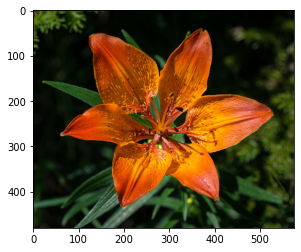

```python
import tensorflow as tf

keras = tf.keras
tf.__version__
```


    '2.5.0'


```python
model = keras.models.load_model('./tf-flower-photo-tfrec.h5')
model
```


    <tensorflow.python.keras.engine.sequential.Sequential at 0x115022190>


```python
import PIL 
import requests
import io

# https://en.wikipedia.org/wiki/Lilium_bulbiferum
flower_url = 'https://upload.wikimedia.org/wikipedia/commons/thumb/9/9a/Lilium_bulbiferum_var._bulbiferum_01.JPG/576px-Lilium_bulbiferum_var._bulbiferum_01.JPG'
response = requests.get(flower_url)
img = PIL.Image.open(
    io.BytesIO(response.content)
)
```


```python
type(img)
```


    PIL.JpegImagePlugin.JpegImageFile


```python
image = tf.keras.preprocessing.image.img_to_array(img).astype(int)
```


```python
import matplotlib.pyplot as plt
plt.imshow(image)
```


    <matplotlib.image.AxesImage at 0x195bad100>


    

    


```python
import numpy as np
predicted = model.predict(np.array([image]))[0]
```


```python
# https://stackoverflow.com/questions/6910641/how-do-i-get-indices-of-n-maximum-values-in-a-numpy-array
arr = tf.nn.softmax(predicted).numpy()
```


```python
def get_top_k(arr, k = 5):
    return arr.argsort()[-k:][::-1]
print(get_top_k(arr))
arr[get_top_k(arr)]
```

    [  5 101  20  45  17]


    array([9.9921584e-01, 4.5422450e-04, 3.1280855e-04, 1.3330260e-05,
           1.1016223e-06], dtype=float32)


```python
class_names = [
    'pink primrose', 'hard-leaved pocket orchid', 'canterbury bells', 'sweet pea', 'wild geranium', # 0-4
    'tiger lily', 'moon orchid',              'bird of paradise', 'monkshood',        'globe thistle',         # 00 - 09
           'snapdragon',       "colt's foot",               'king protea',      'spear thistle', 'yellow iris',       'globe-flower',         'purple coneflower',        'peruvian lily',    'balloon flower',   'giant white arum lily', # 10 - 19
           'fire lily',        'pincushion flower',         'fritillary',       'red ginger',    'grape hyacinth',    'corn poppy',           'prince of wales feathers', 'stemless gentian', 'artichoke',        'sweet william',         # 20 - 29
           'carnation',        'garden phlox',              'love in the mist', 'cosmos',        'alpine sea holly',  'ruby-lipped cattleya', 'cape flower',              'great masterwort', 'siam tulip',       'lenten rose',           # 30 - 39
           'barberton daisy',  'daffodil',                  'sword lily',       'poinsettia',    'bolero deep blue',  'wallflower',           'marigold',                 'buttercup',        'daisy',            'common dandelion',      # 40 - 49
           'petunia',          'wild pansy',                'primula',          'sunflower',     'lilac hibiscus',    'bishop of llandaff',   'gaura',                    'geranium',         'orange dahlia',    'pink-yellow dahlia',    # 50 - 59
           'cautleya spicata', 'japanese anemone',          'black-eyed susan', 'silverbush',    'californian poppy', 'osteospermum',         'spring crocus',            'iris',             'windflower',       'tree poppy',            # 60 - 69
           'gazania',          'azalea',                    'water lily',       'rose',          'thorn apple',       'morning glory',        'passion flower',           'lotus',            'toad lily',        'anthurium',             # 70 - 79
           'frangipani',       'clematis',                  'hibiscus',         'columbine',     'desert-rose',       'tree mallow',          'magnolia',                 'cyclamen ',        'watercress',       'canna lily',            # 80 - 89
           'hippeastrum ',     'bee balm',                  'pink quill',       'foxglove',      'bougainvillea',     'camellia',             'mallow',                   'mexican petunia',  'bromelia',         'blanket flower',        # 90 - 99
          'trumpet creeper',  'blackberry lily',           'common tulip',     'wild rose'
]
```


```python
np.array(class_names)[get_top_k(arr)]
```


    array(['tiger lily', 'blackberry lily', 'fire lily', 'wallflower',
           'peruvian lily'], dtype='<U25')


```python
type(get_top_k(arr))
```


    numpy.ndarray


