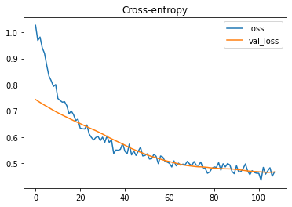
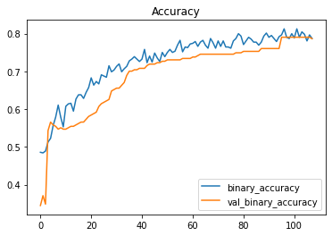

```python
import pandas as pd
from IPython.display import display

titanic = pd.read_csv('./input/titanic/train.csv')
display(titanic.head())

# https://www.kaggle.com/c/titanic/data
# Survived: 1 = Yes, 0 = No
```


<div>
<style scoped>
    .dataframe tbody tr th:only-of-type {
        vertical-align: middle;
    }

    .dataframe tbody tr th {
        vertical-align: top;
    }

    .dataframe thead th {
        text-align: right;
    }
</style>
<table border="1" class="dataframe">
  <thead>
    <tr style="text-align: right;">
      <th></th>
      <th>PassengerId</th>
      <th>Survived</th>
      <th>Pclass</th>
      <th>Name</th>
      <th>Sex</th>
      <th>Age</th>
      <th>SibSp</th>
      <th>Parch</th>
      <th>Ticket</th>
      <th>Fare</th>
      <th>Cabin</th>
      <th>Embarked</th>
    </tr>
  </thead>
  <tbody>
    <tr>
      <th>0</th>
      <td>1</td>
      <td>0</td>
      <td>3</td>
      <td>Braund, Mr. Owen Harris</td>
      <td>male</td>
      <td>22.0</td>
      <td>1</td>
      <td>0</td>
      <td>A/5 21171</td>
      <td>7.2500</td>
      <td>NaN</td>
      <td>S</td>
    </tr>
    <tr>
      <th>1</th>
      <td>2</td>
      <td>1</td>
      <td>1</td>
      <td>Cumings, Mrs. John Bradley (Florence Briggs Th...</td>
      <td>female</td>
      <td>38.0</td>
      <td>1</td>
      <td>0</td>
      <td>PC 17599</td>
      <td>71.2833</td>
      <td>C85</td>
      <td>C</td>
    </tr>
    <tr>
      <th>2</th>
      <td>3</td>
      <td>1</td>
      <td>3</td>
      <td>Heikkinen, Miss. Laina</td>
      <td>female</td>
      <td>26.0</td>
      <td>0</td>
      <td>0</td>
      <td>STON/O2. 3101282</td>
      <td>7.9250</td>
      <td>NaN</td>
      <td>S</td>
    </tr>
    <tr>
      <th>3</th>
      <td>4</td>
      <td>1</td>
      <td>1</td>
      <td>Futrelle, Mrs. Jacques Heath (Lily May Peel)</td>
      <td>female</td>
      <td>35.0</td>
      <td>1</td>
      <td>0</td>
      <td>113803</td>
      <td>53.1000</td>
      <td>C123</td>
      <td>S</td>
    </tr>
    <tr>
      <th>4</th>
      <td>5</td>
      <td>0</td>
      <td>3</td>
      <td>Allen, Mr. William Henry</td>
      <td>male</td>
      <td>35.0</td>
      <td>0</td>
      <td>0</td>
      <td>373450</td>
      <td>8.0500</td>
      <td>NaN</td>
      <td>S</td>
    </tr>
  </tbody>
</table>
</div>


```python
print(titanic.Embarked.unique())
print(titanic.Embarked.isnull().sum())
```

    ['S' 'C' 'Q' nan]
    2


```python
df = titanic.copy()

print(df.isnull().sum())
# df_dropped = df.dropna(axis = 1)
# print(df_dropped.shape)
```

    PassengerId      0
    Survived         0
    Pclass           0
    Name             0
    Sex              0
    Age            177
    SibSp            0
    Parch            0
    Ticket           0
    Fare             0
    Cabin          687
    Embarked         2
    dtype: int64


```python
df_train = df.sample(frac = 0.7, random_state = 0)
df_valid = df.drop(df_train.index)

print(df_train.shape)
print(df_valid.shape)
```

    (624, 12)
    (267, 12)


```python
X_train = df_train.copy()
y_train = X_train.pop('Survived')
print(y_train.shape)
print(X_train.shape)
```

    (624,)
    (624, 11)


```python
X_valid = df_valid.copy()
y_valid = X_valid.pop('Survived')
print(y_valid.shape)
print(X_valid.shape)
```

    (267,)
    (267, 11)


```python
print(X_train.head(5))
print(X_train.dtypes)
```

         PassengerId  Pclass                                            Name  \
    495          496       3                           Yousseff, Mr. Gerious   
    648          649       3                              Willey, Mr. Edward   
    278          279       3                              Rice, Master. Eric   
    31            32       1  Spencer, Mrs. William Augustus (Marie Eugenie)   
    255          256       3         Touma, Mrs. Darwis (Hanne Youssef Razi)   
    
            Sex   Age  SibSp  Parch         Ticket      Fare Cabin Embarked  
    495    male   NaN      0      0           2627   14.4583   NaN        C  
    648    male   NaN      0      0  S.O./P.P. 751    7.5500   NaN        S  
    278    male   7.0      4      1         382652   29.1250   NaN        Q  
    31   female   NaN      1      0       PC 17569  146.5208   B78        C  
    255  female  29.0      0      2           2650   15.2458   NaN        C  
    PassengerId      int64
    Pclass           int64
    Name            object
    Sex             object
    Age            float64
    SibSp            int64
    Parch            int64
    Ticket          object
    Fare           float64
    Cabin           object
    Embarked        object
    dtype: object


```python
# Not considered:
#   PassengerId
#   Name
features_num = [
    'SibSp',
    'Parch',
    'Fare',
    'Age', # with NA, dropped before
]


features_cat = [
    'Pclass',
    'Sex',
    'Embarked',
 #   'Ticket', # Many different values
]
```


```python
from sklearn.preprocessing import StandardScaler, OneHotEncoder
from sklearn.impute import SimpleImputer
from sklearn.pipeline import make_pipeline
from sklearn.compose import make_column_transformer

transformer_num = make_pipeline(
    SimpleImputer(strategy = "constant"),
    StandardScaler(),
)

transformer_cat = make_pipeline(
    SimpleImputer(strategy = "constant", fill_value = "NA"),
    OneHotEncoder(handle_unknown = 'ignore'),
)

preprocessor = make_column_transformer(
    (transformer_num, features_num),
    (transformer_cat, features_cat),
)
```


```python
X_train = preprocessor.fit_transform(X_train)
X_valid = preprocessor.transform(X_valid)
```


```python
print(pd.DataFrame(X_train).head())
input_shape = [X_train.shape[1]]
print(input_shape)
```

             0         1         2         3    4    5    6    7    8    9    10  \
    0 -0.499374 -0.446072 -0.338690 -1.360968  0.0  0.0  1.0  0.0  1.0  1.0  0.0   
    1 -0.499374 -0.446072 -0.480245 -1.360968  0.0  0.0  1.0  0.0  1.0  0.0  0.0   
    2  3.600746  0.866894 -0.038159 -0.959403  0.0  0.0  1.0  0.0  1.0  0.0  1.0   
    3  0.525656 -0.446072  2.367362 -1.360968  1.0  0.0  0.0  1.0  0.0  1.0  0.0   
    4 -0.499374  2.179860 -0.322553  0.302661  0.0  0.0  1.0  1.0  0.0  1.0  0.0   
    
        11  
    0  0.0  
    1  1.0  
    2  0.0  
    3  0.0  
    4  0.0  
    [12]


```python
from tensorflow import keras
from tensorflow.keras import layers

model = keras.Sequential([
    layers.BatchNormalization(input_shape = input_shape),
    layers.Dense(16, activation = 'relu'),
    layers.BatchNormalization(),
    layers.Dropout(0.3),
    layers.Dense(16, activation = 'relu'),
    layers.BatchNormalization(),
    layers.Dropout(0.3),
    layers.Dense(16, activation = 'relu'),
    layers.BatchNormalization(),
    layers.Dropout(0.3),
    layers.Dense(1, activation = 'sigmoid'),
])

"""
model = keras.Sequential([
    layers.BatchNormalization(input_shape = input_shape),
    layers.Dense(8, activation = 'relu'),
    layers.BatchNormalization(),
    layers.Dropout(0.3),
    layers.Dense(8, activation = 'relu'),
    layers.BatchNormalization(),
    layers.Dropout(0.3),
    layers.Dense(1, activation = 'sigmoid'),
])
"""

model.compile(
    optimizer = 'adam',
    loss = 'binary_crossentropy',
    metrics = ['binary_accuracy'],
)
```


```python
early_stopping = keras.callbacks.EarlyStopping(
    patience = 5,
    min_delta = 0.001,
    restore_best_weights = True,
)
history = model.fit(
    X_train, y_train,
    validation_data = (X_valid, y_valid),
    batch_size = 256,
    epochs = 200,
    callbacks = [early_stopping],
    verbose = 0,
)
```


```python
history_df = pd.DataFrame(history.history)
history_df.loc[:, ['loss', 'val_loss']].plot(title = 'Cross-entropy')
history_df.loc[:, ['binary_accuracy', 'val_binary_accuracy']].plot(title = 'Accuracy')
print(f"Maximum validation accuracy: {history_df.val_binary_accuracy.max()}")
```

    Maximum validation accuracy: 0.7902621626853943


    

    


    

    


```python
test = pd.read_csv('./input/titanic/test.csv')

X_test = preprocessor.fit_transform(test)
```


```python
predictions = model.predict(X_test)
print(predictions[:5])

output = pd.DataFrame({'PassengerId': test.PassengerId, 'Survived': map(lambda x: 1 if x >= 0.5 else 0, predictions)})
print(output.head())
```

    [[0.1570583 ]
     [0.438381  ]
     [0.09300303]
     [0.14117298]
     [0.34687418]]
       PassengerId  Survived
    0          892         0
    1          893         0
    2          894         0
    3          895         0
    4          896         0


```python
print(model.predict(X_train[:5]))
print(y_train[:5])
```

    [[0.17443764]
     [0.12484699]
     [0.11190069]
     [0.9170251 ]
     [0.51736206]]
    495    0
    648    0
    278    0
    31     1
    255    1
    Name: Survived, dtype: int64


```python
output.to_csv('my_submission.csv', index=False)
```
