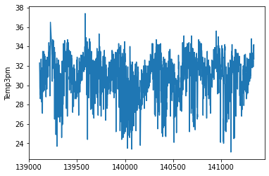
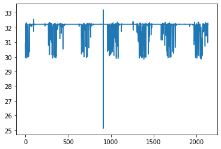

```python
import tensorflow as tf

keras = tf.keras
tf.__version__
```


    '2.5.0'


```python
import pandas as pd

df = pd.read_csv('./input/weatherAUS.csv')
df.head()
```


<div>
<style scoped>
    .dataframe tbody tr th:only-of-type {
        vertical-align: middle;
    }

    .dataframe tbody tr th {
        vertical-align: top;
    }

    .dataframe thead th {
        text-align: right;
    }
</style>
<table border="1" class="dataframe">
  <thead>
    <tr style="text-align: right;">
      <th></th>
      <th>Date</th>
      <th>Location</th>
      <th>MinTemp</th>
      <th>MaxTemp</th>
      <th>Rainfall</th>
      <th>Evaporation</th>
      <th>Sunshine</th>
      <th>WindGustDir</th>
      <th>WindGustSpeed</th>
      <th>WindDir9am</th>
      <th>...</th>
      <th>Humidity9am</th>
      <th>Humidity3pm</th>
      <th>Pressure9am</th>
      <th>Pressure3pm</th>
      <th>Cloud9am</th>
      <th>Cloud3pm</th>
      <th>Temp9am</th>
      <th>Temp3pm</th>
      <th>RainToday</th>
      <th>RainTomorrow</th>
    </tr>
  </thead>
  <tbody>
    <tr>
      <th>0</th>
      <td>2008-12-01</td>
      <td>Albury</td>
      <td>13.4</td>
      <td>22.9</td>
      <td>0.6</td>
      <td>NaN</td>
      <td>NaN</td>
      <td>W</td>
      <td>44.0</td>
      <td>W</td>
      <td>...</td>
      <td>71.0</td>
      <td>22.0</td>
      <td>1007.7</td>
      <td>1007.1</td>
      <td>8.0</td>
      <td>NaN</td>
      <td>16.9</td>
      <td>21.8</td>
      <td>No</td>
      <td>No</td>
    </tr>
    <tr>
      <th>1</th>
      <td>2008-12-02</td>
      <td>Albury</td>
      <td>7.4</td>
      <td>25.1</td>
      <td>0.0</td>
      <td>NaN</td>
      <td>NaN</td>
      <td>WNW</td>
      <td>44.0</td>
      <td>NNW</td>
      <td>...</td>
      <td>44.0</td>
      <td>25.0</td>
      <td>1010.6</td>
      <td>1007.8</td>
      <td>NaN</td>
      <td>NaN</td>
      <td>17.2</td>
      <td>24.3</td>
      <td>No</td>
      <td>No</td>
    </tr>
    <tr>
      <th>2</th>
      <td>2008-12-03</td>
      <td>Albury</td>
      <td>12.9</td>
      <td>25.7</td>
      <td>0.0</td>
      <td>NaN</td>
      <td>NaN</td>
      <td>WSW</td>
      <td>46.0</td>
      <td>W</td>
      <td>...</td>
      <td>38.0</td>
      <td>30.0</td>
      <td>1007.6</td>
      <td>1008.7</td>
      <td>NaN</td>
      <td>2.0</td>
      <td>21.0</td>
      <td>23.2</td>
      <td>No</td>
      <td>No</td>
    </tr>
    <tr>
      <th>3</th>
      <td>2008-12-04</td>
      <td>Albury</td>
      <td>9.2</td>
      <td>28.0</td>
      <td>0.0</td>
      <td>NaN</td>
      <td>NaN</td>
      <td>NE</td>
      <td>24.0</td>
      <td>SE</td>
      <td>...</td>
      <td>45.0</td>
      <td>16.0</td>
      <td>1017.6</td>
      <td>1012.8</td>
      <td>NaN</td>
      <td>NaN</td>
      <td>18.1</td>
      <td>26.5</td>
      <td>No</td>
      <td>No</td>
    </tr>
    <tr>
      <th>4</th>
      <td>2008-12-05</td>
      <td>Albury</td>
      <td>17.5</td>
      <td>32.3</td>
      <td>1.0</td>
      <td>NaN</td>
      <td>NaN</td>
      <td>W</td>
      <td>41.0</td>
      <td>ENE</td>
      <td>...</td>
      <td>82.0</td>
      <td>33.0</td>
      <td>1010.8</td>
      <td>1006.0</td>
      <td>7.0</td>
      <td>8.0</td>
      <td>17.8</td>
      <td>29.7</td>
      <td>No</td>
      <td>No</td>
    </tr>
  </tbody>
</table>
<p>5 rows × 23 columns</p>
</div>


```python
df.columns
```


    Index(['Date', 'Location', 'MinTemp', 'MaxTemp', 'Rainfall', 'Evaporation',
           'Sunshine', 'WindGustDir', 'WindGustSpeed', 'WindDir9am', 'WindDir3pm',
           'WindSpeed9am', 'WindSpeed3pm', 'Humidity9am', 'Humidity3pm',
           'Pressure9am', 'Pressure3pm', 'Cloud9am', 'Cloud3pm', 'Temp9am',
           'Temp3pm', 'RainToday', 'RainTomorrow'],
          dtype='object')


```python
df.Location.unique()
```


    array(['Albury', 'BadgerysCreek', 'Cobar', 'CoffsHarbour', 'Moree',
           'Newcastle', 'NorahHead', 'NorfolkIsland', 'Penrith', 'Richmond',
           'Sydney', 'SydneyAirport', 'WaggaWagga', 'Williamtown',
           'Wollongong', 'Canberra', 'Tuggeranong', 'MountGinini', 'Ballarat',
           'Bendigo', 'Sale', 'MelbourneAirport', 'Melbourne', 'Mildura',
           'Nhil', 'Portland', 'Watsonia', 'Dartmoor', 'Brisbane', 'Cairns',
           'GoldCoast', 'Townsville', 'Adelaide', 'MountGambier', 'Nuriootpa',
           'Woomera', 'Albany', 'Witchcliffe', 'PearceRAAF', 'PerthAirport',
           'Perth', 'SalmonGums', 'Walpole', 'Hobart', 'Launceston',
           'AliceSprings', 'Darwin', 'Katherine', 'Uluru'], dtype=object)


```python
df.tail()
```


<div>
<style scoped>
    .dataframe tbody tr th:only-of-type {
        vertical-align: middle;
    }

    .dataframe tbody tr th {
        vertical-align: top;
    }

    .dataframe thead th {
        text-align: right;
    }
</style>
<table border="1" class="dataframe">
  <thead>
    <tr style="text-align: right;">
      <th></th>
      <th>Date</th>
      <th>Location</th>
      <th>MinTemp</th>
      <th>MaxTemp</th>
      <th>Rainfall</th>
      <th>Evaporation</th>
      <th>Sunshine</th>
      <th>WindGustDir</th>
      <th>WindGustSpeed</th>
      <th>WindDir9am</th>
      <th>...</th>
      <th>Humidity9am</th>
      <th>Humidity3pm</th>
      <th>Pressure9am</th>
      <th>Pressure3pm</th>
      <th>Cloud9am</th>
      <th>Cloud3pm</th>
      <th>Temp9am</th>
      <th>Temp3pm</th>
      <th>RainToday</th>
      <th>RainTomorrow</th>
    </tr>
  </thead>
  <tbody>
    <tr>
      <th>145455</th>
      <td>2017-06-21</td>
      <td>Uluru</td>
      <td>2.8</td>
      <td>23.4</td>
      <td>0.0</td>
      <td>NaN</td>
      <td>NaN</td>
      <td>E</td>
      <td>31.0</td>
      <td>SE</td>
      <td>...</td>
      <td>51.0</td>
      <td>24.0</td>
      <td>1024.6</td>
      <td>1020.3</td>
      <td>NaN</td>
      <td>NaN</td>
      <td>10.1</td>
      <td>22.4</td>
      <td>No</td>
      <td>No</td>
    </tr>
    <tr>
      <th>145456</th>
      <td>2017-06-22</td>
      <td>Uluru</td>
      <td>3.6</td>
      <td>25.3</td>
      <td>0.0</td>
      <td>NaN</td>
      <td>NaN</td>
      <td>NNW</td>
      <td>22.0</td>
      <td>SE</td>
      <td>...</td>
      <td>56.0</td>
      <td>21.0</td>
      <td>1023.5</td>
      <td>1019.1</td>
      <td>NaN</td>
      <td>NaN</td>
      <td>10.9</td>
      <td>24.5</td>
      <td>No</td>
      <td>No</td>
    </tr>
    <tr>
      <th>145457</th>
      <td>2017-06-23</td>
      <td>Uluru</td>
      <td>5.4</td>
      <td>26.9</td>
      <td>0.0</td>
      <td>NaN</td>
      <td>NaN</td>
      <td>N</td>
      <td>37.0</td>
      <td>SE</td>
      <td>...</td>
      <td>53.0</td>
      <td>24.0</td>
      <td>1021.0</td>
      <td>1016.8</td>
      <td>NaN</td>
      <td>NaN</td>
      <td>12.5</td>
      <td>26.1</td>
      <td>No</td>
      <td>No</td>
    </tr>
    <tr>
      <th>145458</th>
      <td>2017-06-24</td>
      <td>Uluru</td>
      <td>7.8</td>
      <td>27.0</td>
      <td>0.0</td>
      <td>NaN</td>
      <td>NaN</td>
      <td>SE</td>
      <td>28.0</td>
      <td>SSE</td>
      <td>...</td>
      <td>51.0</td>
      <td>24.0</td>
      <td>1019.4</td>
      <td>1016.5</td>
      <td>3.0</td>
      <td>2.0</td>
      <td>15.1</td>
      <td>26.0</td>
      <td>No</td>
      <td>No</td>
    </tr>
    <tr>
      <th>145459</th>
      <td>2017-06-25</td>
      <td>Uluru</td>
      <td>14.9</td>
      <td>NaN</td>
      <td>0.0</td>
      <td>NaN</td>
      <td>NaN</td>
      <td>NaN</td>
      <td>NaN</td>
      <td>ESE</td>
      <td>...</td>
      <td>62.0</td>
      <td>36.0</td>
      <td>1020.2</td>
      <td>1017.9</td>
      <td>8.0</td>
      <td>8.0</td>
      <td>15.0</td>
      <td>20.9</td>
      <td>No</td>
      <td>NaN</td>
    </tr>
  </tbody>
</table>
<p>5 rows × 23 columns</p>
</div>


```python
df.Sunshine.isnull().sum()
```


    69835


```python
df.shape
```


    (145460, 23)


```python
A = df.copy()
B = df.dropna(axis = 0)
```


```python
for loc in df.Location.unique():
    print(f'{loc:<10} {B[B.Location == loc].shape[0]}')
```

    Albury     0
    BadgerysCreek 0
    Cobar      534
    CoffsHarbour 1380
    Moree      1913
    Newcastle  0
    NorahHead  0
    NorfolkIsland 2464
    Penrith    0
    Richmond   0
    Sydney     1690
    SydneyAirport 2870
    WaggaWagga 2416
    Williamtown 1198
    Wollongong 0
    Canberra   1078
    Tuggeranong 0
    MountGinini 0
    Ballarat   0
    Bendigo    0
    Sale       1678
    MelbourneAirport 2929
    Melbourne  1898
    Mildura    2594
    Nhil       0
    Portland   1863
    Watsonia   2730
    Dartmoor   0
    Brisbane   2953
    Cairns     2444
    GoldCoast  0
    Townsville 2419
    Adelaide   0
    MountGambier 2465
    Nuriootpa  2008
    Woomera    1734
    Albany     0
    Witchcliffe 0
    PearceRAAF 0
    PerthAirport 2913
    Perth      3025
    SalmonGums 0
    Walpole    0
    Hobart     1939
    Launceston 0
    AliceSprings 2223
    Darwin     3062
    Katherine  0
    Uluru      0


```python
darwin = B[B.Location == 'Darwin']
darwin.shape
```


    (3062, 23)


```python
darwin
```


<div>
<style scoped>
    .dataframe tbody tr th:only-of-type {
        vertical-align: middle;
    }

    .dataframe tbody tr th {
        vertical-align: top;
    }

    .dataframe thead th {
        text-align: right;
    }
</style>
<table border="1" class="dataframe">
  <thead>
    <tr style="text-align: right;">
      <th></th>
      <th>Date</th>
      <th>Location</th>
      <th>MinTemp</th>
      <th>MaxTemp</th>
      <th>Rainfall</th>
      <th>Evaporation</th>
      <th>Sunshine</th>
      <th>WindGustDir</th>
      <th>WindGustSpeed</th>
      <th>WindDir9am</th>
      <th>...</th>
      <th>Humidity9am</th>
      <th>Humidity3pm</th>
      <th>Pressure9am</th>
      <th>Pressure3pm</th>
      <th>Cloud9am</th>
      <th>Cloud3pm</th>
      <th>Temp9am</th>
      <th>Temp3pm</th>
      <th>RainToday</th>
      <th>RainTomorrow</th>
    </tr>
  </thead>
  <tbody>
    <tr>
      <th>139111</th>
      <td>2008-07-01</td>
      <td>Darwin</td>
      <td>20.0</td>
      <td>33.1</td>
      <td>0.0</td>
      <td>4.4</td>
      <td>11.0</td>
      <td>E</td>
      <td>41.0</td>
      <td>ENE</td>
      <td>...</td>
      <td>81.0</td>
      <td>32.0</td>
      <td>1016.0</td>
      <td>1012.1</td>
      <td>1.0</td>
      <td>2.0</td>
      <td>25.4</td>
      <td>32.3</td>
      <td>No</td>
      <td>No</td>
    </tr>
    <tr>
      <th>139112</th>
      <td>2008-07-02</td>
      <td>Darwin</td>
      <td>19.4</td>
      <td>32.4</td>
      <td>0.0</td>
      <td>6.0</td>
      <td>10.4</td>
      <td>ENE</td>
      <td>50.0</td>
      <td>SE</td>
      <td>...</td>
      <td>81.0</td>
      <td>17.0</td>
      <td>1016.8</td>
      <td>1012.4</td>
      <td>1.0</td>
      <td>1.0</td>
      <td>24.3</td>
      <td>31.9</td>
      <td>No</td>
      <td>No</td>
    </tr>
    <tr>
      <th>139113</th>
      <td>2008-07-03</td>
      <td>Darwin</td>
      <td>18.2</td>
      <td>31.8</td>
      <td>0.0</td>
      <td>8.0</td>
      <td>11.0</td>
      <td>E</td>
      <td>46.0</td>
      <td>ESE</td>
      <td>...</td>
      <td>38.0</td>
      <td>24.0</td>
      <td>1017.2</td>
      <td>1013.0</td>
      <td>0.0</td>
      <td>1.0</td>
      <td>24.3</td>
      <td>31.2</td>
      <td>No</td>
      <td>No</td>
    </tr>
    <tr>
      <th>139114</th>
      <td>2008-07-04</td>
      <td>Darwin</td>
      <td>17.3</td>
      <td>30.7</td>
      <td>0.0</td>
      <td>7.0</td>
      <td>10.4</td>
      <td>E</td>
      <td>44.0</td>
      <td>SE</td>
      <td>...</td>
      <td>55.0</td>
      <td>16.0</td>
      <td>1017.3</td>
      <td>1013.6</td>
      <td>2.0</td>
      <td>6.0</td>
      <td>21.3</td>
      <td>29.8</td>
      <td>No</td>
      <td>No</td>
    </tr>
    <tr>
      <th>139115</th>
      <td>2008-07-05</td>
      <td>Darwin</td>
      <td>15.5</td>
      <td>30.8</td>
      <td>0.0</td>
      <td>7.0</td>
      <td>10.8</td>
      <td>ESE</td>
      <td>46.0</td>
      <td>E</td>
      <td>...</td>
      <td>37.0</td>
      <td>16.0</td>
      <td>1016.3</td>
      <td>1012.6</td>
      <td>1.0</td>
      <td>1.0</td>
      <td>22.2</td>
      <td>29.6</td>
      <td>No</td>
      <td>No</td>
    </tr>
    <tr>
      <th>...</th>
      <td>...</td>
      <td>...</td>
      <td>...</td>
      <td>...</td>
      <td>...</td>
      <td>...</td>
      <td>...</td>
      <td>...</td>
      <td>...</td>
      <td>...</td>
      <td>...</td>
      <td>...</td>
      <td>...</td>
      <td>...</td>
      <td>...</td>
      <td>...</td>
      <td>...</td>
      <td>...</td>
      <td>...</td>
      <td>...</td>
      <td>...</td>
    </tr>
    <tr>
      <th>142298</th>
      <td>2017-06-20</td>
      <td>Darwin</td>
      <td>19.3</td>
      <td>33.4</td>
      <td>0.0</td>
      <td>6.0</td>
      <td>11.0</td>
      <td>ENE</td>
      <td>35.0</td>
      <td>SE</td>
      <td>...</td>
      <td>63.0</td>
      <td>32.0</td>
      <td>1013.9</td>
      <td>1010.5</td>
      <td>0.0</td>
      <td>1.0</td>
      <td>24.5</td>
      <td>32.3</td>
      <td>No</td>
      <td>No</td>
    </tr>
    <tr>
      <th>142299</th>
      <td>2017-06-21</td>
      <td>Darwin</td>
      <td>21.2</td>
      <td>32.6</td>
      <td>0.0</td>
      <td>7.6</td>
      <td>8.6</td>
      <td>E</td>
      <td>37.0</td>
      <td>SE</td>
      <td>...</td>
      <td>56.0</td>
      <td>28.0</td>
      <td>1014.6</td>
      <td>1011.2</td>
      <td>7.0</td>
      <td>0.0</td>
      <td>24.8</td>
      <td>32.0</td>
      <td>No</td>
      <td>No</td>
    </tr>
    <tr>
      <th>142300</th>
      <td>2017-06-22</td>
      <td>Darwin</td>
      <td>20.7</td>
      <td>32.8</td>
      <td>0.0</td>
      <td>5.6</td>
      <td>11.0</td>
      <td>E</td>
      <td>33.0</td>
      <td>E</td>
      <td>...</td>
      <td>46.0</td>
      <td>23.0</td>
      <td>1015.3</td>
      <td>1011.8</td>
      <td>0.0</td>
      <td>0.0</td>
      <td>24.8</td>
      <td>32.1</td>
      <td>No</td>
      <td>No</td>
    </tr>
    <tr>
      <th>142301</th>
      <td>2017-06-23</td>
      <td>Darwin</td>
      <td>19.5</td>
      <td>31.8</td>
      <td>0.0</td>
      <td>6.2</td>
      <td>10.6</td>
      <td>ESE</td>
      <td>26.0</td>
      <td>SE</td>
      <td>...</td>
      <td>62.0</td>
      <td>58.0</td>
      <td>1014.9</td>
      <td>1010.7</td>
      <td>1.0</td>
      <td>1.0</td>
      <td>24.8</td>
      <td>29.2</td>
      <td>No</td>
      <td>No</td>
    </tr>
    <tr>
      <th>142302</th>
      <td>2017-06-24</td>
      <td>Darwin</td>
      <td>20.2</td>
      <td>31.7</td>
      <td>0.0</td>
      <td>5.6</td>
      <td>10.7</td>
      <td>ENE</td>
      <td>30.0</td>
      <td>ENE</td>
      <td>...</td>
      <td>73.0</td>
      <td>32.0</td>
      <td>1013.9</td>
      <td>1009.7</td>
      <td>6.0</td>
      <td>5.0</td>
      <td>25.4</td>
      <td>31.0</td>
      <td>No</td>
      <td>No</td>
    </tr>
  </tbody>
</table>
<p>3062 rows × 23 columns</p>
</div>


```python
darwin.columns
```


    Index(['Date', 'Location', 'MinTemp', 'MaxTemp', 'Rainfall', 'Evaporation',
           'Sunshine', 'WindGustDir', 'WindGustSpeed', 'WindDir9am', 'WindDir3pm',
           'WindSpeed9am', 'WindSpeed3pm', 'Humidity9am', 'Humidity3pm',
           'Pressure9am', 'Pressure3pm', 'Cloud9am', 'Cloud3pm', 'Temp9am',
           'Temp3pm', 'RainToday', 'RainTomorrow'],
          dtype='object')


```python
features = ['MinTemp', 'MaxTemp', 'Rainfall', 'Evaporation', 'Sunshine','WindGustSpeed', 
            'WindSpeed9am', 'WindSpeed3pm', 'Humidity9am', 'Humidity3pm', 'Pressure9am', 
            'Pressure3pm', 'Cloud9am', 'Cloud3pm', 'Temp9am', 'Temp3pm',
            # 'RainToday', 'RainTomorrow'
           ]
darwin.loc[:,features].head()
```


<div>
<style scoped>
    .dataframe tbody tr th:only-of-type {
        vertical-align: middle;
    }

    .dataframe tbody tr th {
        vertical-align: top;
    }

    .dataframe thead th {
        text-align: right;
    }
</style>
<table border="1" class="dataframe">
  <thead>
    <tr style="text-align: right;">
      <th></th>
      <th>MinTemp</th>
      <th>MaxTemp</th>
      <th>Rainfall</th>
      <th>Evaporation</th>
      <th>Sunshine</th>
      <th>WindGustSpeed</th>
      <th>WindSpeed9am</th>
      <th>WindSpeed3pm</th>
      <th>Humidity9am</th>
      <th>Humidity3pm</th>
      <th>Pressure9am</th>
      <th>Pressure3pm</th>
      <th>Cloud9am</th>
      <th>Cloud3pm</th>
      <th>Temp9am</th>
      <th>Temp3pm</th>
    </tr>
  </thead>
  <tbody>
    <tr>
      <th>139111</th>
      <td>20.0</td>
      <td>33.1</td>
      <td>0.0</td>
      <td>4.4</td>
      <td>11.0</td>
      <td>41.0</td>
      <td>13.0</td>
      <td>17.0</td>
      <td>81.0</td>
      <td>32.0</td>
      <td>1016.0</td>
      <td>1012.1</td>
      <td>1.0</td>
      <td>2.0</td>
      <td>25.4</td>
      <td>32.3</td>
    </tr>
    <tr>
      <th>139112</th>
      <td>19.4</td>
      <td>32.4</td>
      <td>0.0</td>
      <td>6.0</td>
      <td>10.4</td>
      <td>50.0</td>
      <td>15.0</td>
      <td>28.0</td>
      <td>81.0</td>
      <td>17.0</td>
      <td>1016.8</td>
      <td>1012.4</td>
      <td>1.0</td>
      <td>1.0</td>
      <td>24.3</td>
      <td>31.9</td>
    </tr>
    <tr>
      <th>139113</th>
      <td>18.2</td>
      <td>31.8</td>
      <td>0.0</td>
      <td>8.0</td>
      <td>11.0</td>
      <td>46.0</td>
      <td>22.0</td>
      <td>19.0</td>
      <td>38.0</td>
      <td>24.0</td>
      <td>1017.2</td>
      <td>1013.0</td>
      <td>0.0</td>
      <td>1.0</td>
      <td>24.3</td>
      <td>31.2</td>
    </tr>
    <tr>
      <th>139114</th>
      <td>17.3</td>
      <td>30.7</td>
      <td>0.0</td>
      <td>7.0</td>
      <td>10.4</td>
      <td>44.0</td>
      <td>22.0</td>
      <td>13.0</td>
      <td>55.0</td>
      <td>16.0</td>
      <td>1017.3</td>
      <td>1013.6</td>
      <td>2.0</td>
      <td>6.0</td>
      <td>21.3</td>
      <td>29.8</td>
    </tr>
    <tr>
      <th>139115</th>
      <td>15.5</td>
      <td>30.8</td>
      <td>0.0</td>
      <td>7.0</td>
      <td>10.8</td>
      <td>46.0</td>
      <td>20.0</td>
      <td>19.0</td>
      <td>37.0</td>
      <td>16.0</td>
      <td>1016.3</td>
      <td>1012.6</td>
      <td>1.0</td>
      <td>1.0</td>
      <td>22.2</td>
      <td>29.6</td>
    </tr>
  </tbody>
</table>
</div>


```python
N = len(darwin)
N
```


    3062


```python
train = darwin[:int(0.7*N)][features]
valid = darwin[int(0.7*N):int(0.9*N)][features]
test = darwin[int(0.9*N):][features]

len(train), len(valid), len(test)
```


    (2143, 612, 307)


```python
train.shape
```


    (2143, 16)


```python
train.head()
```


<div>
<style scoped>
    .dataframe tbody tr th:only-of-type {
        vertical-align: middle;
    }

    .dataframe tbody tr th {
        vertical-align: top;
    }

    .dataframe thead th {
        text-align: right;
    }
</style>
<table border="1" class="dataframe">
  <thead>
    <tr style="text-align: right;">
      <th></th>
      <th>MinTemp</th>
      <th>MaxTemp</th>
      <th>Rainfall</th>
      <th>Evaporation</th>
      <th>Sunshine</th>
      <th>WindGustSpeed</th>
      <th>WindSpeed9am</th>
      <th>WindSpeed3pm</th>
      <th>Humidity9am</th>
      <th>Humidity3pm</th>
      <th>Pressure9am</th>
      <th>Pressure3pm</th>
      <th>Cloud9am</th>
      <th>Cloud3pm</th>
      <th>Temp9am</th>
      <th>Temp3pm</th>
    </tr>
  </thead>
  <tbody>
    <tr>
      <th>139111</th>
      <td>20.0</td>
      <td>33.1</td>
      <td>0.0</td>
      <td>4.4</td>
      <td>11.0</td>
      <td>41.0</td>
      <td>13.0</td>
      <td>17.0</td>
      <td>81.0</td>
      <td>32.0</td>
      <td>1016.0</td>
      <td>1012.1</td>
      <td>1.0</td>
      <td>2.0</td>
      <td>25.4</td>
      <td>32.3</td>
    </tr>
    <tr>
      <th>139112</th>
      <td>19.4</td>
      <td>32.4</td>
      <td>0.0</td>
      <td>6.0</td>
      <td>10.4</td>
      <td>50.0</td>
      <td>15.0</td>
      <td>28.0</td>
      <td>81.0</td>
      <td>17.0</td>
      <td>1016.8</td>
      <td>1012.4</td>
      <td>1.0</td>
      <td>1.0</td>
      <td>24.3</td>
      <td>31.9</td>
    </tr>
    <tr>
      <th>139113</th>
      <td>18.2</td>
      <td>31.8</td>
      <td>0.0</td>
      <td>8.0</td>
      <td>11.0</td>
      <td>46.0</td>
      <td>22.0</td>
      <td>19.0</td>
      <td>38.0</td>
      <td>24.0</td>
      <td>1017.2</td>
      <td>1013.0</td>
      <td>0.0</td>
      <td>1.0</td>
      <td>24.3</td>
      <td>31.2</td>
    </tr>
    <tr>
      <th>139114</th>
      <td>17.3</td>
      <td>30.7</td>
      <td>0.0</td>
      <td>7.0</td>
      <td>10.4</td>
      <td>44.0</td>
      <td>22.0</td>
      <td>13.0</td>
      <td>55.0</td>
      <td>16.0</td>
      <td>1017.3</td>
      <td>1013.6</td>
      <td>2.0</td>
      <td>6.0</td>
      <td>21.3</td>
      <td>29.8</td>
    </tr>
    <tr>
      <th>139115</th>
      <td>15.5</td>
      <td>30.8</td>
      <td>0.0</td>
      <td>7.0</td>
      <td>10.8</td>
      <td>46.0</td>
      <td>20.0</td>
      <td>19.0</td>
      <td>37.0</td>
      <td>16.0</td>
      <td>1016.3</td>
      <td>1012.6</td>
      <td>1.0</td>
      <td>1.0</td>
      <td>22.2</td>
      <td>29.6</td>
    </tr>
  </tbody>
</table>
</div>


```python
train.tail()
```


<div>
<style scoped>
    .dataframe tbody tr th:only-of-type {
        vertical-align: middle;
    }

    .dataframe tbody tr th {
        vertical-align: top;
    }

    .dataframe thead th {
        text-align: right;
    }
</style>
<table border="1" class="dataframe">
  <thead>
    <tr style="text-align: right;">
      <th></th>
      <th>MinTemp</th>
      <th>MaxTemp</th>
      <th>Rainfall</th>
      <th>Evaporation</th>
      <th>Sunshine</th>
      <th>WindGustSpeed</th>
      <th>WindSpeed9am</th>
      <th>WindSpeed3pm</th>
      <th>Humidity9am</th>
      <th>Humidity3pm</th>
      <th>Pressure9am</th>
      <th>Pressure3pm</th>
      <th>Cloud9am</th>
      <th>Cloud3pm</th>
      <th>Temp9am</th>
      <th>Temp3pm</th>
    </tr>
  </thead>
  <tbody>
    <tr>
      <th>141336</th>
      <td>23.2</td>
      <td>35.0</td>
      <td>0.0</td>
      <td>10.6</td>
      <td>11.8</td>
      <td>37.0</td>
      <td>9.0</td>
      <td>22.0</td>
      <td>64.0</td>
      <td>35.0</td>
      <td>1012.4</td>
      <td>1007.3</td>
      <td>1.0</td>
      <td>1.0</td>
      <td>29.4</td>
      <td>34.1</td>
    </tr>
    <tr>
      <th>141337</th>
      <td>22.8</td>
      <td>35.7</td>
      <td>0.0</td>
      <td>8.6</td>
      <td>11.5</td>
      <td>39.0</td>
      <td>11.0</td>
      <td>30.0</td>
      <td>61.0</td>
      <td>47.0</td>
      <td>1013.1</td>
      <td>1009.1</td>
      <td>2.0</td>
      <td>1.0</td>
      <td>29.2</td>
      <td>32.7</td>
    </tr>
    <tr>
      <th>141338</th>
      <td>26.0</td>
      <td>35.6</td>
      <td>0.0</td>
      <td>7.6</td>
      <td>10.2</td>
      <td>37.0</td>
      <td>20.0</td>
      <td>24.0</td>
      <td>58.0</td>
      <td>52.0</td>
      <td>1013.1</td>
      <td>1009.5</td>
      <td>3.0</td>
      <td>6.0</td>
      <td>30.3</td>
      <td>33.5</td>
    </tr>
    <tr>
      <th>141339</th>
      <td>25.8</td>
      <td>34.4</td>
      <td>0.0</td>
      <td>7.8</td>
      <td>10.0</td>
      <td>33.0</td>
      <td>13.0</td>
      <td>17.0</td>
      <td>69.0</td>
      <td>46.0</td>
      <td>1013.5</td>
      <td>1009.1</td>
      <td>8.0</td>
      <td>7.0</td>
      <td>29.8</td>
      <td>34.2</td>
    </tr>
    <tr>
      <th>141340</th>
      <td>23.5</td>
      <td>33.6</td>
      <td>5.6</td>
      <td>7.6</td>
      <td>8.3</td>
      <td>63.0</td>
      <td>11.0</td>
      <td>17.0</td>
      <td>85.0</td>
      <td>56.0</td>
      <td>1014.0</td>
      <td>1010.1</td>
      <td>7.0</td>
      <td>6.0</td>
      <td>25.2</td>
      <td>32.7</td>
    </tr>
  </tbody>
</table>
</div>


```python
valid.head()
```


<div>
<style scoped>
    .dataframe tbody tr th:only-of-type {
        vertical-align: middle;
    }

    .dataframe tbody tr th {
        vertical-align: top;
    }

    .dataframe thead th {
        text-align: right;
    }
</style>
<table border="1" class="dataframe">
  <thead>
    <tr style="text-align: right;">
      <th></th>
      <th>MinTemp</th>
      <th>MaxTemp</th>
      <th>Rainfall</th>
      <th>Evaporation</th>
      <th>Sunshine</th>
      <th>WindGustSpeed</th>
      <th>WindSpeed9am</th>
      <th>WindSpeed3pm</th>
      <th>Humidity9am</th>
      <th>Humidity3pm</th>
      <th>Pressure9am</th>
      <th>Pressure3pm</th>
      <th>Cloud9am</th>
      <th>Cloud3pm</th>
      <th>Temp9am</th>
      <th>Temp3pm</th>
    </tr>
  </thead>
  <tbody>
    <tr>
      <th>141341</th>
      <td>21.5</td>
      <td>33.5</td>
      <td>20.0</td>
      <td>7.0</td>
      <td>10.5</td>
      <td>63.0</td>
      <td>20.0</td>
      <td>22.0</td>
      <td>71.0</td>
      <td>46.0</td>
      <td>1014.1</td>
      <td>1008.5</td>
      <td>7.0</td>
      <td>7.0</td>
      <td>27.3</td>
      <td>32.6</td>
    </tr>
    <tr>
      <th>141342</th>
      <td>24.0</td>
      <td>34.2</td>
      <td>0.0</td>
      <td>6.6</td>
      <td>9.4</td>
      <td>41.0</td>
      <td>15.0</td>
      <td>15.0</td>
      <td>71.0</td>
      <td>56.0</td>
      <td>1012.8</td>
      <td>1009.9</td>
      <td>6.0</td>
      <td>3.0</td>
      <td>29.7</td>
      <td>32.1</td>
    </tr>
    <tr>
      <th>141343</th>
      <td>25.2</td>
      <td>33.8</td>
      <td>0.0</td>
      <td>5.0</td>
      <td>11.3</td>
      <td>35.0</td>
      <td>9.0</td>
      <td>24.0</td>
      <td>63.0</td>
      <td>61.0</td>
      <td>1013.9</td>
      <td>1009.5</td>
      <td>4.0</td>
      <td>1.0</td>
      <td>29.9</td>
      <td>32.3</td>
    </tr>
    <tr>
      <th>141344</th>
      <td>24.9</td>
      <td>33.7</td>
      <td>0.0</td>
      <td>6.8</td>
      <td>11.4</td>
      <td>33.0</td>
      <td>11.0</td>
      <td>19.0</td>
      <td>59.0</td>
      <td>51.0</td>
      <td>1013.5</td>
      <td>1009.0</td>
      <td>2.0</td>
      <td>1.0</td>
      <td>30.8</td>
      <td>33.4</td>
    </tr>
    <tr>
      <th>141345</th>
      <td>26.5</td>
      <td>33.9</td>
      <td>0.0</td>
      <td>7.8</td>
      <td>11.7</td>
      <td>35.0</td>
      <td>11.0</td>
      <td>28.0</td>
      <td>56.0</td>
      <td>50.0</td>
      <td>1012.7</td>
      <td>1008.6</td>
      <td>1.0</td>
      <td>1.0</td>
      <td>30.6</td>
      <td>33.1</td>
    </tr>
  </tbody>
</table>
</div>


```python
valid.tail()
```


<div>
<style scoped>
    .dataframe tbody tr th:only-of-type {
        vertical-align: middle;
    }

    .dataframe tbody tr th {
        vertical-align: top;
    }

    .dataframe thead th {
        text-align: right;
    }
</style>
<table border="1" class="dataframe">
  <thead>
    <tr style="text-align: right;">
      <th></th>
      <th>MinTemp</th>
      <th>MaxTemp</th>
      <th>Rainfall</th>
      <th>Evaporation</th>
      <th>Sunshine</th>
      <th>WindGustSpeed</th>
      <th>WindSpeed9am</th>
      <th>WindSpeed3pm</th>
      <th>Humidity9am</th>
      <th>Humidity3pm</th>
      <th>Pressure9am</th>
      <th>Pressure3pm</th>
      <th>Cloud9am</th>
      <th>Cloud3pm</th>
      <th>Temp9am</th>
      <th>Temp3pm</th>
    </tr>
  </thead>
  <tbody>
    <tr>
      <th>141969</th>
      <td>20.3</td>
      <td>33.6</td>
      <td>0.0</td>
      <td>5.8</td>
      <td>11.0</td>
      <td>43.0</td>
      <td>13.0</td>
      <td>20.0</td>
      <td>66.0</td>
      <td>19.0</td>
      <td>1014.0</td>
      <td>1010.0</td>
      <td>1.0</td>
      <td>1.0</td>
      <td>26.7</td>
      <td>33.2</td>
    </tr>
    <tr>
      <th>141970</th>
      <td>19.6</td>
      <td>33.3</td>
      <td>0.0</td>
      <td>7.6</td>
      <td>11.1</td>
      <td>50.0</td>
      <td>20.0</td>
      <td>26.0</td>
      <td>64.0</td>
      <td>21.0</td>
      <td>1015.4</td>
      <td>1011.0</td>
      <td>2.0</td>
      <td>1.0</td>
      <td>24.7</td>
      <td>32.4</td>
    </tr>
    <tr>
      <th>141971</th>
      <td>19.1</td>
      <td>32.2</td>
      <td>0.0</td>
      <td>8.8</td>
      <td>11.0</td>
      <td>44.0</td>
      <td>26.0</td>
      <td>19.0</td>
      <td>32.0</td>
      <td>19.0</td>
      <td>1016.6</td>
      <td>1011.5</td>
      <td>1.0</td>
      <td>1.0</td>
      <td>23.3</td>
      <td>31.1</td>
    </tr>
    <tr>
      <th>141972</th>
      <td>20.5</td>
      <td>33.3</td>
      <td>0.0</td>
      <td>8.6</td>
      <td>11.0</td>
      <td>41.0</td>
      <td>20.0</td>
      <td>24.0</td>
      <td>45.0</td>
      <td>27.0</td>
      <td>1014.5</td>
      <td>1010.5</td>
      <td>1.0</td>
      <td>1.0</td>
      <td>23.8</td>
      <td>32.2</td>
    </tr>
    <tr>
      <th>141973</th>
      <td>18.8</td>
      <td>33.6</td>
      <td>0.0</td>
      <td>8.2</td>
      <td>11.0</td>
      <td>44.0</td>
      <td>19.0</td>
      <td>24.0</td>
      <td>34.0</td>
      <td>37.0</td>
      <td>1014.3</td>
      <td>1010.0</td>
      <td>1.0</td>
      <td>1.0</td>
      <td>22.8</td>
      <td>31.1</td>
    </tr>
  </tbody>
</table>
</div>


```python
test.head()
```


<div>
<style scoped>
    .dataframe tbody tr th:only-of-type {
        vertical-align: middle;
    }

    .dataframe tbody tr th {
        vertical-align: top;
    }

    .dataframe thead th {
        text-align: right;
    }
</style>
<table border="1" class="dataframe">
  <thead>
    <tr style="text-align: right;">
      <th></th>
      <th>MinTemp</th>
      <th>MaxTemp</th>
      <th>Rainfall</th>
      <th>Evaporation</th>
      <th>Sunshine</th>
      <th>WindGustSpeed</th>
      <th>WindSpeed9am</th>
      <th>WindSpeed3pm</th>
      <th>Humidity9am</th>
      <th>Humidity3pm</th>
      <th>Pressure9am</th>
      <th>Pressure3pm</th>
      <th>Cloud9am</th>
      <th>Cloud3pm</th>
      <th>Temp9am</th>
      <th>Temp3pm</th>
    </tr>
  </thead>
  <tbody>
    <tr>
      <th>141974</th>
      <td>19.0</td>
      <td>32.6</td>
      <td>0.0</td>
      <td>8.0</td>
      <td>10.9</td>
      <td>35.0</td>
      <td>17.0</td>
      <td>22.0</td>
      <td>39.0</td>
      <td>30.0</td>
      <td>1013.5</td>
      <td>1010.1</td>
      <td>1.0</td>
      <td>1.0</td>
      <td>23.8</td>
      <td>30.9</td>
    </tr>
    <tr>
      <th>141975</th>
      <td>17.6</td>
      <td>31.4</td>
      <td>0.0</td>
      <td>6.8</td>
      <td>10.7</td>
      <td>31.0</td>
      <td>9.0</td>
      <td>19.0</td>
      <td>60.0</td>
      <td>44.0</td>
      <td>1013.1</td>
      <td>1010.0</td>
      <td>1.0</td>
      <td>1.0</td>
      <td>24.4</td>
      <td>30.3</td>
    </tr>
    <tr>
      <th>141976</th>
      <td>18.7</td>
      <td>32.6</td>
      <td>0.0</td>
      <td>4.6</td>
      <td>10.8</td>
      <td>33.0</td>
      <td>13.0</td>
      <td>20.0</td>
      <td>59.0</td>
      <td>48.0</td>
      <td>1012.3</td>
      <td>1008.7</td>
      <td>0.0</td>
      <td>2.0</td>
      <td>25.1</td>
      <td>30.8</td>
    </tr>
    <tr>
      <th>141977</th>
      <td>22.1</td>
      <td>31.6</td>
      <td>0.0</td>
      <td>8.0</td>
      <td>10.9</td>
      <td>48.0</td>
      <td>30.0</td>
      <td>11.0</td>
      <td>25.0</td>
      <td>17.0</td>
      <td>1013.6</td>
      <td>1011.2</td>
      <td>1.0</td>
      <td>0.0</td>
      <td>24.3</td>
      <td>30.7</td>
    </tr>
    <tr>
      <th>141978</th>
      <td>18.8</td>
      <td>30.6</td>
      <td>0.0</td>
      <td>11.6</td>
      <td>10.9</td>
      <td>46.0</td>
      <td>31.0</td>
      <td>13.0</td>
      <td>20.0</td>
      <td>10.0</td>
      <td>1014.9</td>
      <td>1011.9</td>
      <td>1.0</td>
      <td>1.0</td>
      <td>20.5</td>
      <td>29.3</td>
    </tr>
  </tbody>
</table>
</div>


```python
target_feature = 'Temp3pm'
target_feature_pos = train.columns.get_loc(target_feature)

import seaborn as sns

_ = sns.lineplot(data = train, x = train.index, y = target_feature)
```


    

    


```python
end = 365 * 2
_ = sns.lineplot(data = train[:end], x = train[:end].index, y = target_feature)
```


    

    


```python
# https://www.tensorflow.org/api_docs/python/tf/data/Dataset
dataset = tf.data.Dataset.from_tensor_slices([[1, 2, 3], [2, 3, 4]])
for val in dataset:
    print(type(val))
    print(val)
```

    <class 'tensorflow.python.framework.ops.EagerTensor'>
    tf.Tensor([1 2 3], shape=(3,), dtype=int32)
    <class 'tensorflow.python.framework.ops.EagerTensor'>
    tf.Tensor([2 3 4], shape=(3,), dtype=int32)


```python
AA = train #.to_numpy()
## AA[0:2]

dataset = tf.data.Dataset.from_tensor_slices(AA)
for val in dataset:
    print(type(val))
    print(val)
    break
```

    <class 'tensorflow.python.framework.ops.EagerTensor'>
    tf.Tensor(
    [2.0000e+01 3.3100e+01 0.0000e+00 4.4000e+00 1.1000e+01 4.1000e+01
     1.3000e+01 1.7000e+01 8.1000e+01 3.2000e+01 1.0160e+03 1.0121e+03
     1.0000e+00 2.0000e+00 2.5400e+01 3.2300e+01], shape=(16,), dtype=float64)


```python
# https://www.tensorflow.org/api_docs/python/tf/data/Dataset#window
window_size = 7
train_dataset = tf.data.Dataset.from_tensor_slices(train)
train_dataset = train_dataset.window(window_size+1, shift = 1, drop_remainder = True)
for window in train_dataset:
    print(type(window))
    print(len(list(window.as_numpy_iterator())))
    # lambda window: (window[:-1], window[-1])
    break
print("----------------------------------------")

train_dataset = tf.data.Dataset.from_tensor_slices(train)
train_dataset = train_dataset.window(window_size+1, shift = 1, drop_remainder = True)
train_dataset = train_dataset.flat_map(lambda x: x.batch(window_size+1))    
for window in train_dataset:
    print(window.shape)
    break
print("----------------------------------------")
    
train_dataset = tf.data.Dataset.from_tensor_slices(train)
train_dataset = train_dataset.window(window_size+1, shift = 1, drop_remainder = True)    
train_dataset = train_dataset.flat_map(lambda x: x.batch(window_size+1))    
train_dataset = train_dataset.shuffle(1000)    
train_dataset = train_dataset.map(lambda w: (w[:-1], w[-1][target_feature_pos]))    
train_dataset = train_dataset.batch(32).prefetch(1)
for x, y in train_dataset:
    print(x.shape, "|", y.shape)
    break

```

    <class 'tensorflow.python.data.ops.dataset_ops._VariantDataset'>
    8
    ----------------------------------------
    (8, 16)
    ----------------------------------------
    (32, 7, 16) | (32,)


```python
# TODO: Need normalization first?
def window_dataset(series, window_size, batch_size = 32, shuffle_buffer = 1000):
    dataset = tf.data.Dataset.from_tensor_slices(series)
    dataset = dataset.window(window_size+1, shift = 1, drop_remainder = True)    
    dataset = dataset.flat_map(lambda x: x.batch(window_size+1))    
    dataset = dataset.shuffle(shuffle_buffer)    
    dataset = dataset.map(lambda w: (w[:-1], w[-1][target_feature_pos]))    
    dataset = dataset.batch(batch_size).prefetch(1)
    return dataset
```


```python
import numpy as np

keras.backend.clear_session()
tf.random.set_seed(1)
np.random.seed(1)

WINDOW_SIZE = 7
train_window_dataset = window_dataset(train, WINDOW_SIZE)
valid_window_dataset = window_dataset(valid, WINDOW_SIZE)

print(train_window_dataset.element_spec)
input_shape = train.shape[1]
input_shape
```

    (TensorSpec(shape=(None, None, 16), dtype=tf.float64, name=None), TensorSpec(shape=(None,), dtype=tf.float64, name=None))


    16


```python
model = keras.models.Sequential([
    keras.layers.SimpleRNN(100, return_sequences = True, input_shape = [None, input_shape]),
    keras.layers.SimpleRNN(100),
    keras.layers.Dense(1),
    keras.layers.Lambda(lambda x: x * 40.0),
])

model.summary()
```

    Model: "sequential_2"
    _________________________________________________________________
    Layer (type)                 Output Shape              Param #   
    =================================================================
    simple_rnn_3 (SimpleRNN)     (None, None, 100)         11700     
    _________________________________________________________________
    simple_rnn_4 (SimpleRNN)     (None, 100)               20100     
    _________________________________________________________________
    dense_2 (Dense)              (None, 1)                 101       
    _________________________________________________________________
    lambda (Lambda)              (None, 1)                 0         
    =================================================================
    Total params: 31,901
    Trainable params: 31,901
    Non-trainable params: 0
    _________________________________________________________________


```python
model.compile(
    optimizer = 'adam',
    loss = 'huber',
    metrics = ['mae'],
)

early_stopping = keras.callbacks.EarlyStopping(patience = 50, restore_best_weights = True)
history = model.fit(
    train_window_dataset,
    epochs = 500,
    validation_data = valid_window_dataset,
    callbacks = [early_stopping],
#    verbose = 0,
)
```

    Epoch 1/500
    67/67 [==============================] - 1s 6ms/step - loss: 2.2479 - mae: 2.6961 - val_loss: 1.2324 - val_mae: 1.6567
    Epoch 2/500
    67/67 [==============================] - 0s 4ms/step - loss: 1.2623 - mae: 1.6957 - val_loss: 1.0901 - val_mae: 1.5118
    Epoch 3/500
    67/67 [==============================] - 0s 3ms/step - loss: 1.1436 - mae: 1.5738 - val_loss: 1.2780 - val_mae: 1.7240
    Epoch 4/500
    67/67 [==============================] - 0s 4ms/step - loss: 1.1980 - mae: 1.6328 - val_loss: 1.1866 - val_mae: 1.6271
    Epoch 5/500
    67/67 [==============================] - 0s 3ms/step - loss: 1.2214 - mae: 1.6516 - val_loss: 1.2070 - val_mae: 1.6464
    Epoch 6/500
    67/67 [==============================] - 0s 4ms/step - loss: 1.2588 - mae: 1.6920 - val_loss: 1.1969 - val_mae: 1.6351
    Epoch 7/500
    67/67 [==============================] - 0s 4ms/step - loss: 1.2766 - mae: 1.7123 - val_loss: 1.1259 - val_mae: 1.5584
    Epoch 8/500
    67/67 [==============================] - 0s 4ms/step - loss: 1.2488 - mae: 1.6824 - val_loss: 1.1019 - val_mae: 1.5357
    Epoch 9/500
    67/67 [==============================] - 0s 4ms/step - loss: 1.2582 - mae: 1.6905 - val_loss: 1.1325 - val_mae: 1.5642
    Epoch 10/500
    67/67 [==============================] - 0s 4ms/step - loss: 1.1458 - mae: 1.5734 - val_loss: 1.0804 - val_mae: 1.5013
    Epoch 11/500
    67/67 [==============================] - 0s 4ms/step - loss: 1.0952 - mae: 1.5191 - val_loss: 1.4658 - val_mae: 1.9246
    Epoch 12/500
    67/67 [==============================] - 0s 4ms/step - loss: 1.1950 - mae: 1.6235 - val_loss: 1.2516 - val_mae: 1.6938
    Epoch 13/500
    67/67 [==============================] - 0s 4ms/step - loss: 1.1176 - mae: 1.5488 - val_loss: 1.0797 - val_mae: 1.5085
    Epoch 14/500
    67/67 [==============================] - 0s 4ms/step - loss: 1.1982 - mae: 1.6321 - val_loss: 1.1720 - val_mae: 1.6048
    Epoch 15/500
    67/67 [==============================] - 0s 4ms/step - loss: 1.1249 - mae: 1.5510 - val_loss: 1.3041 - val_mae: 1.7253
    Epoch 16/500
    67/67 [==============================] - 0s 4ms/step - loss: 1.2155 - mae: 1.6472 - val_loss: 1.2368 - val_mae: 1.6789
    Epoch 17/500
    67/67 [==============================] - 0s 4ms/step - loss: 1.1200 - mae: 1.5444 - val_loss: 1.0968 - val_mae: 1.5222
    Epoch 18/500
    67/67 [==============================] - 0s 4ms/step - loss: 1.1388 - mae: 1.5654 - val_loss: 1.4452 - val_mae: 1.9038
    Epoch 19/500
    67/67 [==============================] - 0s 4ms/step - loss: 1.1482 - mae: 1.5742 - val_loss: 1.0640 - val_mae: 1.4901
    Epoch 20/500
    67/67 [==============================] - 0s 4ms/step - loss: 1.1653 - mae: 1.5919 - val_loss: 1.2842 - val_mae: 1.7301
    Epoch 21/500
    67/67 [==============================] - 0s 4ms/step - loss: 1.0779 - mae: 1.4993 - val_loss: 1.3881 - val_mae: 1.8407
    Epoch 22/500
    67/67 [==============================] - 0s 4ms/step - loss: 1.1452 - mae: 1.5722 - val_loss: 1.2625 - val_mae: 1.7041
    Epoch 23/500
    67/67 [==============================] - 0s 4ms/step - loss: 1.1120 - mae: 1.5381 - val_loss: 1.1680 - val_mae: 1.5985
    Epoch 24/500
    67/67 [==============================] - 0s 4ms/step - loss: 1.1492 - mae: 1.5768 - val_loss: 1.2389 - val_mae: 1.6772
    Epoch 25/500
    67/67 [==============================] - 0s 4ms/step - loss: 1.0874 - mae: 1.5144 - val_loss: 1.0938 - val_mae: 1.5199
    Epoch 26/500
    67/67 [==============================] - 0s 4ms/step - loss: 1.0654 - mae: 1.4872 - val_loss: 1.1949 - val_mae: 1.6268
    Epoch 27/500
    67/67 [==============================] - 0s 4ms/step - loss: 1.0751 - mae: 1.4994 - val_loss: 1.2332 - val_mae: 1.6752
    Epoch 28/500
    67/67 [==============================] - 0s 4ms/step - loss: 1.0909 - mae: 1.5176 - val_loss: 1.1458 - val_mae: 1.5755
    Epoch 29/500
    67/67 [==============================] - 0s 4ms/step - loss: 1.1346 - mae: 1.5666 - val_loss: 1.0734 - val_mae: 1.4977
    Epoch 30/500
    67/67 [==============================] - 0s 4ms/step - loss: 1.1934 - mae: 1.6236 - val_loss: 1.1797 - val_mae: 1.6176
    Epoch 31/500
    67/67 [==============================] - 0s 4ms/step - loss: 1.1219 - mae: 1.5471 - val_loss: 1.0921 - val_mae: 1.5111
    Epoch 32/500
    67/67 [==============================] - 1s 9ms/step - loss: 1.1036 - mae: 1.5211 - val_loss: 1.7133 - val_mae: 2.1814
    Epoch 33/500
    67/67 [==============================] - 0s 4ms/step - loss: 1.0743 - mae: 1.4964 - val_loss: 1.8334 - val_mae: 2.3073
    Epoch 34/500
    67/67 [==============================] - 0s 4ms/step - loss: 1.1085 - mae: 1.5345 - val_loss: 1.0539 - val_mae: 1.4792
    Epoch 35/500
    67/67 [==============================] - 0s 4ms/step - loss: 1.0872 - mae: 1.5059 - val_loss: 1.3986 - val_mae: 1.8524
    Epoch 36/500
    67/67 [==============================] - 0s 4ms/step - loss: 1.0760 - mae: 1.5024 - val_loss: 1.0534 - val_mae: 1.4756
    Epoch 37/500
    67/67 [==============================] - 0s 4ms/step - loss: 1.2158 - mae: 1.6525 - val_loss: 1.1087 - val_mae: 1.5323
    Epoch 38/500
    67/67 [==============================] - 0s 4ms/step - loss: 1.1644 - mae: 1.5968 - val_loss: 1.0911 - val_mae: 1.5155
    Epoch 39/500
    67/67 [==============================] - 0s 4ms/step - loss: 1.1124 - mae: 1.5343 - val_loss: 1.0960 - val_mae: 1.5191
    Epoch 40/500
    67/67 [==============================] - 0s 4ms/step - loss: 1.1097 - mae: 1.5378 - val_loss: 1.1607 - val_mae: 1.5906
    Epoch 41/500
    67/67 [==============================] - 0s 4ms/step - loss: 1.1992 - mae: 1.6309 - val_loss: 1.0685 - val_mae: 1.4923
    Epoch 42/500
    67/67 [==============================] - 0s 4ms/step - loss: 1.1623 - mae: 1.5902 - val_loss: 1.0674 - val_mae: 1.4910
    Epoch 43/500
    67/67 [==============================] - 0s 4ms/step - loss: 1.1219 - mae: 1.5422 - val_loss: 1.3348 - val_mae: 1.7815
    Epoch 44/500
    67/67 [==============================] - 0s 4ms/step - loss: 1.1155 - mae: 1.5329 - val_loss: 1.0625 - val_mae: 1.4874
    Epoch 45/500
    67/67 [==============================] - 0s 4ms/step - loss: 1.0587 - mae: 1.4777 - val_loss: 1.0967 - val_mae: 1.5162
    Epoch 46/500
     1/67 [..............................] - ETA: 3s - loss: 1.7452 - mae: 2.1839


    ---------------------------------------------------------------------------

    KeyboardInterrupt                         Traceback (most recent call last)

    <ipython-input-223-ffcedac78c7f> in <module>
          6 
          7 early_stopping = keras.callbacks.EarlyStopping(patience = 50, restore_best_weights = True)
    ----> 8 history = model.fit(
          9     train_window_dataset,
         10     epochs = 500,


    /usr/local/Cellar/jupyterlab/3.0.16_1/libexec/lib/python3.9/site-packages/tensorflow/python/keras/engine/training.py in fit(self, x, y, batch_size, epochs, verbose, callbacks, validation_split, validation_data, shuffle, class_weight, sample_weight, initial_epoch, steps_per_epoch, validation_steps, validation_batch_size, validation_freq, max_queue_size, workers, use_multiprocessing)
       1181                 _r=1):
       1182               callbacks.on_train_batch_begin(step)
    -> 1183               tmp_logs = self.train_function(iterator)
       1184               if data_handler.should_sync:
       1185                 context.async_wait()


    /usr/local/Cellar/jupyterlab/3.0.16_1/libexec/lib/python3.9/site-packages/tensorflow/python/eager/def_function.py in __call__(self, *args, **kwds)
        887 
        888       with OptionalXlaContext(self._jit_compile):
    --> 889         result = self._call(*args, **kwds)
        890 
        891       new_tracing_count = self.experimental_get_tracing_count()


    /usr/local/Cellar/jupyterlab/3.0.16_1/libexec/lib/python3.9/site-packages/tensorflow/python/eager/def_function.py in _call(self, *args, **kwds)
        915       # In this case we have created variables on the first call, so we run the
        916       # defunned version which is guaranteed to never create variables.
    --> 917       return self._stateless_fn(*args, **kwds)  # pylint: disable=not-callable
        918     elif self._stateful_fn is not None:
        919       # Release the lock early so that multiple threads can perform the call


    /usr/local/Cellar/jupyterlab/3.0.16_1/libexec/lib/python3.9/site-packages/tensorflow/python/eager/function.py in __call__(self, *args, **kwargs)
       3021       (graph_function,
       3022        filtered_flat_args) = self._maybe_define_function(args, kwargs)
    -> 3023     return graph_function._call_flat(
       3024         filtered_flat_args, captured_inputs=graph_function.captured_inputs)  # pylint: disable=protected-access
       3025 


    /usr/local/Cellar/jupyterlab/3.0.16_1/libexec/lib/python3.9/site-packages/tensorflow/python/eager/function.py in _call_flat(self, args, captured_inputs, cancellation_manager)
       1958         and executing_eagerly):
       1959       # No tape is watching; skip to running the function.
    -> 1960       return self._build_call_outputs(self._inference_function.call(
       1961           ctx, args, cancellation_manager=cancellation_manager))
       1962     forward_backward = self._select_forward_and_backward_functions(


    /usr/local/Cellar/jupyterlab/3.0.16_1/libexec/lib/python3.9/site-packages/tensorflow/python/eager/function.py in call(self, ctx, args, cancellation_manager)
        589       with _InterpolateFunctionError(self):
        590         if cancellation_manager is None:
    --> 591           outputs = execute.execute(
        592               str(self.signature.name),
        593               num_outputs=self._num_outputs,


    /usr/local/Cellar/jupyterlab/3.0.16_1/libexec/lib/python3.9/site-packages/tensorflow/python/eager/execute.py in quick_execute(op_name, num_outputs, inputs, attrs, ctx, name)
         57   try:
         58     ctx.ensure_initialized()
    ---> 59     tensors = pywrap_tfe.TFE_Py_Execute(ctx._handle, device_name, op_name,
         60                                         inputs, attrs, num_outputs)
         61   except core._NotOkStatusException as e:


    KeyboardInterrupt: 


```python
def window_x_only_dataset(series, window_size):
    ds = tf.data.Dataset.from_tensor_slices(series)
    ds = ds.window(window_size, shift = 1, drop_remainder = True)
    ds = ds.flat_map(lambda w: w.batch(window_size))
    ds = ds.batch(32).prefetch(1)
    return ds

predicted_train = model.predict(window_x_only_dataset(train, WINDOW_SIZE))
```


```python
end = 365 * 2
_ = sns.lineplot(data = train[:end], x = train[:end].index, y = target_feature)
```


    

    


```python
print(train.shape)
print(predicted_train.shape)
```

    (2143, 16)
    (2137, 1)


```python
predicted = predicted_train[:, 0]
predicted[:5]
```


    array([30.917831, 30.42372 , 29.944696, 30.042906, 30.082285],
          dtype=float32)


```python
sns.lineplot(x = range(len(predicted)), y = predicted)
```


    <AxesSubplot:>


    

    


```python
real = train[window_size-1:].to_numpy()[:,target_feature_pos]
real.shape
predicted.shape
keras.metrics.mean_absolute_error(real, predicted).numpy()
```


    1.6221427


```python
sns.lineplot(x = range(len(predicted)), y = predicted)
sns.lineplot(x = range(len(predicted)), y = real)
```


    <AxesSubplot:>


    

    


```python

```
