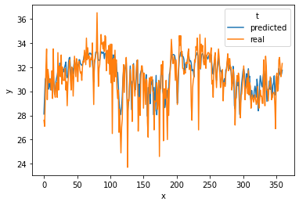

```python
import tensorflow as tf

keras = tf.keras
tf.__version__
```


    '2.5.0'


```python
import pandas as pd

df = pd.read_csv('./input/weatherAUS.csv')
df.head()
```


<div>
<style scoped>
    .dataframe tbody tr th:only-of-type {
        vertical-align: middle;
    }

    .dataframe tbody tr th {
        vertical-align: top;
    }

    .dataframe thead th {
        text-align: right;
    }
</style>
<table border="1" class="dataframe">
  <thead>
    <tr style="text-align: right;">
      <th></th>
      <th>Date</th>
      <th>Location</th>
      <th>MinTemp</th>
      <th>MaxTemp</th>
      <th>Rainfall</th>
      <th>Evaporation</th>
      <th>Sunshine</th>
      <th>WindGustDir</th>
      <th>WindGustSpeed</th>
      <th>WindDir9am</th>
      <th>...</th>
      <th>Humidity9am</th>
      <th>Humidity3pm</th>
      <th>Pressure9am</th>
      <th>Pressure3pm</th>
      <th>Cloud9am</th>
      <th>Cloud3pm</th>
      <th>Temp9am</th>
      <th>Temp3pm</th>
      <th>RainToday</th>
      <th>RainTomorrow</th>
    </tr>
  </thead>
  <tbody>
    <tr>
      <th>0</th>
      <td>2008-12-01</td>
      <td>Albury</td>
      <td>13.4</td>
      <td>22.9</td>
      <td>0.6</td>
      <td>NaN</td>
      <td>NaN</td>
      <td>W</td>
      <td>44.0</td>
      <td>W</td>
      <td>...</td>
      <td>71.0</td>
      <td>22.0</td>
      <td>1007.7</td>
      <td>1007.1</td>
      <td>8.0</td>
      <td>NaN</td>
      <td>16.9</td>
      <td>21.8</td>
      <td>No</td>
      <td>No</td>
    </tr>
    <tr>
      <th>1</th>
      <td>2008-12-02</td>
      <td>Albury</td>
      <td>7.4</td>
      <td>25.1</td>
      <td>0.0</td>
      <td>NaN</td>
      <td>NaN</td>
      <td>WNW</td>
      <td>44.0</td>
      <td>NNW</td>
      <td>...</td>
      <td>44.0</td>
      <td>25.0</td>
      <td>1010.6</td>
      <td>1007.8</td>
      <td>NaN</td>
      <td>NaN</td>
      <td>17.2</td>
      <td>24.3</td>
      <td>No</td>
      <td>No</td>
    </tr>
    <tr>
      <th>2</th>
      <td>2008-12-03</td>
      <td>Albury</td>
      <td>12.9</td>
      <td>25.7</td>
      <td>0.0</td>
      <td>NaN</td>
      <td>NaN</td>
      <td>WSW</td>
      <td>46.0</td>
      <td>W</td>
      <td>...</td>
      <td>38.0</td>
      <td>30.0</td>
      <td>1007.6</td>
      <td>1008.7</td>
      <td>NaN</td>
      <td>2.0</td>
      <td>21.0</td>
      <td>23.2</td>
      <td>No</td>
      <td>No</td>
    </tr>
    <tr>
      <th>3</th>
      <td>2008-12-04</td>
      <td>Albury</td>
      <td>9.2</td>
      <td>28.0</td>
      <td>0.0</td>
      <td>NaN</td>
      <td>NaN</td>
      <td>NE</td>
      <td>24.0</td>
      <td>SE</td>
      <td>...</td>
      <td>45.0</td>
      <td>16.0</td>
      <td>1017.6</td>
      <td>1012.8</td>
      <td>NaN</td>
      <td>NaN</td>
      <td>18.1</td>
      <td>26.5</td>
      <td>No</td>
      <td>No</td>
    </tr>
    <tr>
      <th>4</th>
      <td>2008-12-05</td>
      <td>Albury</td>
      <td>17.5</td>
      <td>32.3</td>
      <td>1.0</td>
      <td>NaN</td>
      <td>NaN</td>
      <td>W</td>
      <td>41.0</td>
      <td>ENE</td>
      <td>...</td>
      <td>82.0</td>
      <td>33.0</td>
      <td>1010.8</td>
      <td>1006.0</td>
      <td>7.0</td>
      <td>8.0</td>
      <td>17.8</td>
      <td>29.7</td>
      <td>No</td>
      <td>No</td>
    </tr>
  </tbody>
</table>
<p>5 rows × 23 columns</p>
</div>


```python
df.columns
```


    Index(['Date', 'Location', 'MinTemp', 'MaxTemp', 'Rainfall', 'Evaporation',
           'Sunshine', 'WindGustDir', 'WindGustSpeed', 'WindDir9am', 'WindDir3pm',
           'WindSpeed9am', 'WindSpeed3pm', 'Humidity9am', 'Humidity3pm',
           'Pressure9am', 'Pressure3pm', 'Cloud9am', 'Cloud3pm', 'Temp9am',
           'Temp3pm', 'RainToday', 'RainTomorrow'],
          dtype='object')


```python
df.Location.unique()
```


    array(['Albury', 'BadgerysCreek', 'Cobar', 'CoffsHarbour', 'Moree',
           'Newcastle', 'NorahHead', 'NorfolkIsland', 'Penrith', 'Richmond',
           'Sydney', 'SydneyAirport', 'WaggaWagga', 'Williamtown',
           'Wollongong', 'Canberra', 'Tuggeranong', 'MountGinini', 'Ballarat',
           'Bendigo', 'Sale', 'MelbourneAirport', 'Melbourne', 'Mildura',
           'Nhil', 'Portland', 'Watsonia', 'Dartmoor', 'Brisbane', 'Cairns',
           'GoldCoast', 'Townsville', 'Adelaide', 'MountGambier', 'Nuriootpa',
           'Woomera', 'Albany', 'Witchcliffe', 'PearceRAAF', 'PerthAirport',
           'Perth', 'SalmonGums', 'Walpole', 'Hobart', 'Launceston',
           'AliceSprings', 'Darwin', 'Katherine', 'Uluru'], dtype=object)


```python
df.tail()
```


<div>
<style scoped>
    .dataframe tbody tr th:only-of-type {
        vertical-align: middle;
    }

    .dataframe tbody tr th {
        vertical-align: top;
    }

    .dataframe thead th {
        text-align: right;
    }
</style>
<table border="1" class="dataframe">
  <thead>
    <tr style="text-align: right;">
      <th></th>
      <th>Date</th>
      <th>Location</th>
      <th>MinTemp</th>
      <th>MaxTemp</th>
      <th>Rainfall</th>
      <th>Evaporation</th>
      <th>Sunshine</th>
      <th>WindGustDir</th>
      <th>WindGustSpeed</th>
      <th>WindDir9am</th>
      <th>...</th>
      <th>Humidity9am</th>
      <th>Humidity3pm</th>
      <th>Pressure9am</th>
      <th>Pressure3pm</th>
      <th>Cloud9am</th>
      <th>Cloud3pm</th>
      <th>Temp9am</th>
      <th>Temp3pm</th>
      <th>RainToday</th>
      <th>RainTomorrow</th>
    </tr>
  </thead>
  <tbody>
    <tr>
      <th>145455</th>
      <td>2017-06-21</td>
      <td>Uluru</td>
      <td>2.8</td>
      <td>23.4</td>
      <td>0.0</td>
      <td>NaN</td>
      <td>NaN</td>
      <td>E</td>
      <td>31.0</td>
      <td>SE</td>
      <td>...</td>
      <td>51.0</td>
      <td>24.0</td>
      <td>1024.6</td>
      <td>1020.3</td>
      <td>NaN</td>
      <td>NaN</td>
      <td>10.1</td>
      <td>22.4</td>
      <td>No</td>
      <td>No</td>
    </tr>
    <tr>
      <th>145456</th>
      <td>2017-06-22</td>
      <td>Uluru</td>
      <td>3.6</td>
      <td>25.3</td>
      <td>0.0</td>
      <td>NaN</td>
      <td>NaN</td>
      <td>NNW</td>
      <td>22.0</td>
      <td>SE</td>
      <td>...</td>
      <td>56.0</td>
      <td>21.0</td>
      <td>1023.5</td>
      <td>1019.1</td>
      <td>NaN</td>
      <td>NaN</td>
      <td>10.9</td>
      <td>24.5</td>
      <td>No</td>
      <td>No</td>
    </tr>
    <tr>
      <th>145457</th>
      <td>2017-06-23</td>
      <td>Uluru</td>
      <td>5.4</td>
      <td>26.9</td>
      <td>0.0</td>
      <td>NaN</td>
      <td>NaN</td>
      <td>N</td>
      <td>37.0</td>
      <td>SE</td>
      <td>...</td>
      <td>53.0</td>
      <td>24.0</td>
      <td>1021.0</td>
      <td>1016.8</td>
      <td>NaN</td>
      <td>NaN</td>
      <td>12.5</td>
      <td>26.1</td>
      <td>No</td>
      <td>No</td>
    </tr>
    <tr>
      <th>145458</th>
      <td>2017-06-24</td>
      <td>Uluru</td>
      <td>7.8</td>
      <td>27.0</td>
      <td>0.0</td>
      <td>NaN</td>
      <td>NaN</td>
      <td>SE</td>
      <td>28.0</td>
      <td>SSE</td>
      <td>...</td>
      <td>51.0</td>
      <td>24.0</td>
      <td>1019.4</td>
      <td>1016.5</td>
      <td>3.0</td>
      <td>2.0</td>
      <td>15.1</td>
      <td>26.0</td>
      <td>No</td>
      <td>No</td>
    </tr>
    <tr>
      <th>145459</th>
      <td>2017-06-25</td>
      <td>Uluru</td>
      <td>14.9</td>
      <td>NaN</td>
      <td>0.0</td>
      <td>NaN</td>
      <td>NaN</td>
      <td>NaN</td>
      <td>NaN</td>
      <td>ESE</td>
      <td>...</td>
      <td>62.0</td>
      <td>36.0</td>
      <td>1020.2</td>
      <td>1017.9</td>
      <td>8.0</td>
      <td>8.0</td>
      <td>15.0</td>
      <td>20.9</td>
      <td>No</td>
      <td>NaN</td>
    </tr>
  </tbody>
</table>
<p>5 rows × 23 columns</p>
</div>


```python
df.Sunshine.isnull().sum()
```


    69835


```python
df.shape
```


    (145460, 23)


```python
A = df.copy()
B = df.dropna(axis = 0)
```


```python
for loc in df.Location.unique():
    print(f'{loc:<10} {B[B.Location == loc].shape[0]}')
```

    Albury     0
    BadgerysCreek 0
    Cobar      534
    CoffsHarbour 1380
    Moree      1913
    Newcastle  0
    NorahHead  0
    NorfolkIsland 2464
    Penrith    0
    Richmond   0
    Sydney     1690
    SydneyAirport 2870
    WaggaWagga 2416
    Williamtown 1198
    Wollongong 0
    Canberra   1078
    Tuggeranong 0
    MountGinini 0
    Ballarat   0
    Bendigo    0
    Sale       1678
    MelbourneAirport 2929
    Melbourne  1898
    Mildura    2594
    Nhil       0
    Portland   1863
    Watsonia   2730
    Dartmoor   0
    Brisbane   2953
    Cairns     2444
    GoldCoast  0
    Townsville 2419
    Adelaide   0
    MountGambier 2465
    Nuriootpa  2008
    Woomera    1734
    Albany     0
    Witchcliffe 0
    PearceRAAF 0
    PerthAirport 2913
    Perth      3025
    SalmonGums 0
    Walpole    0
    Hobart     1939
    Launceston 0
    AliceSprings 2223
    Darwin     3062
    Katherine  0
    Uluru      0


```python
darwin = B[B.Location == 'Darwin']
darwin.shape
```


    (3062, 23)


```python
darwin
```


<div>
<style scoped>
    .dataframe tbody tr th:only-of-type {
        vertical-align: middle;
    }

    .dataframe tbody tr th {
        vertical-align: top;
    }

    .dataframe thead th {
        text-align: right;
    }
</style>
<table border="1" class="dataframe">
  <thead>
    <tr style="text-align: right;">
      <th></th>
      <th>Date</th>
      <th>Location</th>
      <th>MinTemp</th>
      <th>MaxTemp</th>
      <th>Rainfall</th>
      <th>Evaporation</th>
      <th>Sunshine</th>
      <th>WindGustDir</th>
      <th>WindGustSpeed</th>
      <th>WindDir9am</th>
      <th>...</th>
      <th>Humidity9am</th>
      <th>Humidity3pm</th>
      <th>Pressure9am</th>
      <th>Pressure3pm</th>
      <th>Cloud9am</th>
      <th>Cloud3pm</th>
      <th>Temp9am</th>
      <th>Temp3pm</th>
      <th>RainToday</th>
      <th>RainTomorrow</th>
    </tr>
  </thead>
  <tbody>
    <tr>
      <th>139111</th>
      <td>2008-07-01</td>
      <td>Darwin</td>
      <td>20.0</td>
      <td>33.1</td>
      <td>0.0</td>
      <td>4.4</td>
      <td>11.0</td>
      <td>E</td>
      <td>41.0</td>
      <td>ENE</td>
      <td>...</td>
      <td>81.0</td>
      <td>32.0</td>
      <td>1016.0</td>
      <td>1012.1</td>
      <td>1.0</td>
      <td>2.0</td>
      <td>25.4</td>
      <td>32.3</td>
      <td>No</td>
      <td>No</td>
    </tr>
    <tr>
      <th>139112</th>
      <td>2008-07-02</td>
      <td>Darwin</td>
      <td>19.4</td>
      <td>32.4</td>
      <td>0.0</td>
      <td>6.0</td>
      <td>10.4</td>
      <td>ENE</td>
      <td>50.0</td>
      <td>SE</td>
      <td>...</td>
      <td>81.0</td>
      <td>17.0</td>
      <td>1016.8</td>
      <td>1012.4</td>
      <td>1.0</td>
      <td>1.0</td>
      <td>24.3</td>
      <td>31.9</td>
      <td>No</td>
      <td>No</td>
    </tr>
    <tr>
      <th>139113</th>
      <td>2008-07-03</td>
      <td>Darwin</td>
      <td>18.2</td>
      <td>31.8</td>
      <td>0.0</td>
      <td>8.0</td>
      <td>11.0</td>
      <td>E</td>
      <td>46.0</td>
      <td>ESE</td>
      <td>...</td>
      <td>38.0</td>
      <td>24.0</td>
      <td>1017.2</td>
      <td>1013.0</td>
      <td>0.0</td>
      <td>1.0</td>
      <td>24.3</td>
      <td>31.2</td>
      <td>No</td>
      <td>No</td>
    </tr>
    <tr>
      <th>139114</th>
      <td>2008-07-04</td>
      <td>Darwin</td>
      <td>17.3</td>
      <td>30.7</td>
      <td>0.0</td>
      <td>7.0</td>
      <td>10.4</td>
      <td>E</td>
      <td>44.0</td>
      <td>SE</td>
      <td>...</td>
      <td>55.0</td>
      <td>16.0</td>
      <td>1017.3</td>
      <td>1013.6</td>
      <td>2.0</td>
      <td>6.0</td>
      <td>21.3</td>
      <td>29.8</td>
      <td>No</td>
      <td>No</td>
    </tr>
    <tr>
      <th>139115</th>
      <td>2008-07-05</td>
      <td>Darwin</td>
      <td>15.5</td>
      <td>30.8</td>
      <td>0.0</td>
      <td>7.0</td>
      <td>10.8</td>
      <td>ESE</td>
      <td>46.0</td>
      <td>E</td>
      <td>...</td>
      <td>37.0</td>
      <td>16.0</td>
      <td>1016.3</td>
      <td>1012.6</td>
      <td>1.0</td>
      <td>1.0</td>
      <td>22.2</td>
      <td>29.6</td>
      <td>No</td>
      <td>No</td>
    </tr>
    <tr>
      <th>...</th>
      <td>...</td>
      <td>...</td>
      <td>...</td>
      <td>...</td>
      <td>...</td>
      <td>...</td>
      <td>...</td>
      <td>...</td>
      <td>...</td>
      <td>...</td>
      <td>...</td>
      <td>...</td>
      <td>...</td>
      <td>...</td>
      <td>...</td>
      <td>...</td>
      <td>...</td>
      <td>...</td>
      <td>...</td>
      <td>...</td>
      <td>...</td>
    </tr>
    <tr>
      <th>142298</th>
      <td>2017-06-20</td>
      <td>Darwin</td>
      <td>19.3</td>
      <td>33.4</td>
      <td>0.0</td>
      <td>6.0</td>
      <td>11.0</td>
      <td>ENE</td>
      <td>35.0</td>
      <td>SE</td>
      <td>...</td>
      <td>63.0</td>
      <td>32.0</td>
      <td>1013.9</td>
      <td>1010.5</td>
      <td>0.0</td>
      <td>1.0</td>
      <td>24.5</td>
      <td>32.3</td>
      <td>No</td>
      <td>No</td>
    </tr>
    <tr>
      <th>142299</th>
      <td>2017-06-21</td>
      <td>Darwin</td>
      <td>21.2</td>
      <td>32.6</td>
      <td>0.0</td>
      <td>7.6</td>
      <td>8.6</td>
      <td>E</td>
      <td>37.0</td>
      <td>SE</td>
      <td>...</td>
      <td>56.0</td>
      <td>28.0</td>
      <td>1014.6</td>
      <td>1011.2</td>
      <td>7.0</td>
      <td>0.0</td>
      <td>24.8</td>
      <td>32.0</td>
      <td>No</td>
      <td>No</td>
    </tr>
    <tr>
      <th>142300</th>
      <td>2017-06-22</td>
      <td>Darwin</td>
      <td>20.7</td>
      <td>32.8</td>
      <td>0.0</td>
      <td>5.6</td>
      <td>11.0</td>
      <td>E</td>
      <td>33.0</td>
      <td>E</td>
      <td>...</td>
      <td>46.0</td>
      <td>23.0</td>
      <td>1015.3</td>
      <td>1011.8</td>
      <td>0.0</td>
      <td>0.0</td>
      <td>24.8</td>
      <td>32.1</td>
      <td>No</td>
      <td>No</td>
    </tr>
    <tr>
      <th>142301</th>
      <td>2017-06-23</td>
      <td>Darwin</td>
      <td>19.5</td>
      <td>31.8</td>
      <td>0.0</td>
      <td>6.2</td>
      <td>10.6</td>
      <td>ESE</td>
      <td>26.0</td>
      <td>SE</td>
      <td>...</td>
      <td>62.0</td>
      <td>58.0</td>
      <td>1014.9</td>
      <td>1010.7</td>
      <td>1.0</td>
      <td>1.0</td>
      <td>24.8</td>
      <td>29.2</td>
      <td>No</td>
      <td>No</td>
    </tr>
    <tr>
      <th>142302</th>
      <td>2017-06-24</td>
      <td>Darwin</td>
      <td>20.2</td>
      <td>31.7</td>
      <td>0.0</td>
      <td>5.6</td>
      <td>10.7</td>
      <td>ENE</td>
      <td>30.0</td>
      <td>ENE</td>
      <td>...</td>
      <td>73.0</td>
      <td>32.0</td>
      <td>1013.9</td>
      <td>1009.7</td>
      <td>6.0</td>
      <td>5.0</td>
      <td>25.4</td>
      <td>31.0</td>
      <td>No</td>
      <td>No</td>
    </tr>
  </tbody>
</table>
<p>3062 rows × 23 columns</p>
</div>


```python
darwin.columns
```


    Index(['Date', 'Location', 'MinTemp', 'MaxTemp', 'Rainfall', 'Evaporation',
           'Sunshine', 'WindGustDir', 'WindGustSpeed', 'WindDir9am', 'WindDir3pm',
           'WindSpeed9am', 'WindSpeed3pm', 'Humidity9am', 'Humidity3pm',
           'Pressure9am', 'Pressure3pm', 'Cloud9am', 'Cloud3pm', 'Temp9am',
           'Temp3pm', 'RainToday', 'RainTomorrow'],
          dtype='object')


```python
features = ['MinTemp', 'MaxTemp', 'Rainfall', 'Evaporation', 'Sunshine','WindGustSpeed', 
            'WindSpeed9am', 'WindSpeed3pm', 'Humidity9am', 'Humidity3pm', 'Pressure9am', 
            'Pressure3pm', 'Cloud9am', 'Cloud3pm', 'Temp9am', 'Temp3pm',
            # 'RainToday', 'RainTomorrow'
           ]
darwin.loc[:,features].head()
```


<div>
<style scoped>
    .dataframe tbody tr th:only-of-type {
        vertical-align: middle;
    }

    .dataframe tbody tr th {
        vertical-align: top;
    }

    .dataframe thead th {
        text-align: right;
    }
</style>
<table border="1" class="dataframe">
  <thead>
    <tr style="text-align: right;">
      <th></th>
      <th>MinTemp</th>
      <th>MaxTemp</th>
      <th>Rainfall</th>
      <th>Evaporation</th>
      <th>Sunshine</th>
      <th>WindGustSpeed</th>
      <th>WindSpeed9am</th>
      <th>WindSpeed3pm</th>
      <th>Humidity9am</th>
      <th>Humidity3pm</th>
      <th>Pressure9am</th>
      <th>Pressure3pm</th>
      <th>Cloud9am</th>
      <th>Cloud3pm</th>
      <th>Temp9am</th>
      <th>Temp3pm</th>
    </tr>
  </thead>
  <tbody>
    <tr>
      <th>139111</th>
      <td>20.0</td>
      <td>33.1</td>
      <td>0.0</td>
      <td>4.4</td>
      <td>11.0</td>
      <td>41.0</td>
      <td>13.0</td>
      <td>17.0</td>
      <td>81.0</td>
      <td>32.0</td>
      <td>1016.0</td>
      <td>1012.1</td>
      <td>1.0</td>
      <td>2.0</td>
      <td>25.4</td>
      <td>32.3</td>
    </tr>
    <tr>
      <th>139112</th>
      <td>19.4</td>
      <td>32.4</td>
      <td>0.0</td>
      <td>6.0</td>
      <td>10.4</td>
      <td>50.0</td>
      <td>15.0</td>
      <td>28.0</td>
      <td>81.0</td>
      <td>17.0</td>
      <td>1016.8</td>
      <td>1012.4</td>
      <td>1.0</td>
      <td>1.0</td>
      <td>24.3</td>
      <td>31.9</td>
    </tr>
    <tr>
      <th>139113</th>
      <td>18.2</td>
      <td>31.8</td>
      <td>0.0</td>
      <td>8.0</td>
      <td>11.0</td>
      <td>46.0</td>
      <td>22.0</td>
      <td>19.0</td>
      <td>38.0</td>
      <td>24.0</td>
      <td>1017.2</td>
      <td>1013.0</td>
      <td>0.0</td>
      <td>1.0</td>
      <td>24.3</td>
      <td>31.2</td>
    </tr>
    <tr>
      <th>139114</th>
      <td>17.3</td>
      <td>30.7</td>
      <td>0.0</td>
      <td>7.0</td>
      <td>10.4</td>
      <td>44.0</td>
      <td>22.0</td>
      <td>13.0</td>
      <td>55.0</td>
      <td>16.0</td>
      <td>1017.3</td>
      <td>1013.6</td>
      <td>2.0</td>
      <td>6.0</td>
      <td>21.3</td>
      <td>29.8</td>
    </tr>
    <tr>
      <th>139115</th>
      <td>15.5</td>
      <td>30.8</td>
      <td>0.0</td>
      <td>7.0</td>
      <td>10.8</td>
      <td>46.0</td>
      <td>20.0</td>
      <td>19.0</td>
      <td>37.0</td>
      <td>16.0</td>
      <td>1016.3</td>
      <td>1012.6</td>
      <td>1.0</td>
      <td>1.0</td>
      <td>22.2</td>
      <td>29.6</td>
    </tr>
  </tbody>
</table>
</div>


```python
N = len(darwin)
N
```


    3062


```python
train = darwin[:int(0.7*N)][features]
valid = darwin[int(0.7*N):int(0.9*N)][features]
test = darwin[int(0.9*N):][features]

len(train), len(valid), len(test)
```


    (2143, 612, 307)


```python

```


```python
train.shape
```


    (2143, 16)


```python
train.head()
```


<div>
<style scoped>
    .dataframe tbody tr th:only-of-type {
        vertical-align: middle;
    }

    .dataframe tbody tr th {
        vertical-align: top;
    }

    .dataframe thead th {
        text-align: right;
    }
</style>
<table border="1" class="dataframe">
  <thead>
    <tr style="text-align: right;">
      <th></th>
      <th>MinTemp</th>
      <th>MaxTemp</th>
      <th>Rainfall</th>
      <th>Evaporation</th>
      <th>Sunshine</th>
      <th>WindGustSpeed</th>
      <th>WindSpeed9am</th>
      <th>WindSpeed3pm</th>
      <th>Humidity9am</th>
      <th>Humidity3pm</th>
      <th>Pressure9am</th>
      <th>Pressure3pm</th>
      <th>Cloud9am</th>
      <th>Cloud3pm</th>
      <th>Temp9am</th>
      <th>Temp3pm</th>
    </tr>
  </thead>
  <tbody>
    <tr>
      <th>139111</th>
      <td>20.0</td>
      <td>33.1</td>
      <td>0.0</td>
      <td>4.4</td>
      <td>11.0</td>
      <td>41.0</td>
      <td>13.0</td>
      <td>17.0</td>
      <td>81.0</td>
      <td>32.0</td>
      <td>1016.0</td>
      <td>1012.1</td>
      <td>1.0</td>
      <td>2.0</td>
      <td>25.4</td>
      <td>32.3</td>
    </tr>
    <tr>
      <th>139112</th>
      <td>19.4</td>
      <td>32.4</td>
      <td>0.0</td>
      <td>6.0</td>
      <td>10.4</td>
      <td>50.0</td>
      <td>15.0</td>
      <td>28.0</td>
      <td>81.0</td>
      <td>17.0</td>
      <td>1016.8</td>
      <td>1012.4</td>
      <td>1.0</td>
      <td>1.0</td>
      <td>24.3</td>
      <td>31.9</td>
    </tr>
    <tr>
      <th>139113</th>
      <td>18.2</td>
      <td>31.8</td>
      <td>0.0</td>
      <td>8.0</td>
      <td>11.0</td>
      <td>46.0</td>
      <td>22.0</td>
      <td>19.0</td>
      <td>38.0</td>
      <td>24.0</td>
      <td>1017.2</td>
      <td>1013.0</td>
      <td>0.0</td>
      <td>1.0</td>
      <td>24.3</td>
      <td>31.2</td>
    </tr>
    <tr>
      <th>139114</th>
      <td>17.3</td>
      <td>30.7</td>
      <td>0.0</td>
      <td>7.0</td>
      <td>10.4</td>
      <td>44.0</td>
      <td>22.0</td>
      <td>13.0</td>
      <td>55.0</td>
      <td>16.0</td>
      <td>1017.3</td>
      <td>1013.6</td>
      <td>2.0</td>
      <td>6.0</td>
      <td>21.3</td>
      <td>29.8</td>
    </tr>
    <tr>
      <th>139115</th>
      <td>15.5</td>
      <td>30.8</td>
      <td>0.0</td>
      <td>7.0</td>
      <td>10.8</td>
      <td>46.0</td>
      <td>20.0</td>
      <td>19.0</td>
      <td>37.0</td>
      <td>16.0</td>
      <td>1016.3</td>
      <td>1012.6</td>
      <td>1.0</td>
      <td>1.0</td>
      <td>22.2</td>
      <td>29.6</td>
    </tr>
  </tbody>
</table>
</div>


```python
train.tail()
```


<div>
<style scoped>
    .dataframe tbody tr th:only-of-type {
        vertical-align: middle;
    }

    .dataframe tbody tr th {
        vertical-align: top;
    }

    .dataframe thead th {
        text-align: right;
    }
</style>
<table border="1" class="dataframe">
  <thead>
    <tr style="text-align: right;">
      <th></th>
      <th>MinTemp</th>
      <th>MaxTemp</th>
      <th>Rainfall</th>
      <th>Evaporation</th>
      <th>Sunshine</th>
      <th>WindGustSpeed</th>
      <th>WindSpeed9am</th>
      <th>WindSpeed3pm</th>
      <th>Humidity9am</th>
      <th>Humidity3pm</th>
      <th>Pressure9am</th>
      <th>Pressure3pm</th>
      <th>Cloud9am</th>
      <th>Cloud3pm</th>
      <th>Temp9am</th>
      <th>Temp3pm</th>
    </tr>
  </thead>
  <tbody>
    <tr>
      <th>141336</th>
      <td>23.2</td>
      <td>35.0</td>
      <td>0.0</td>
      <td>10.6</td>
      <td>11.8</td>
      <td>37.0</td>
      <td>9.0</td>
      <td>22.0</td>
      <td>64.0</td>
      <td>35.0</td>
      <td>1012.4</td>
      <td>1007.3</td>
      <td>1.0</td>
      <td>1.0</td>
      <td>29.4</td>
      <td>34.1</td>
    </tr>
    <tr>
      <th>141337</th>
      <td>22.8</td>
      <td>35.7</td>
      <td>0.0</td>
      <td>8.6</td>
      <td>11.5</td>
      <td>39.0</td>
      <td>11.0</td>
      <td>30.0</td>
      <td>61.0</td>
      <td>47.0</td>
      <td>1013.1</td>
      <td>1009.1</td>
      <td>2.0</td>
      <td>1.0</td>
      <td>29.2</td>
      <td>32.7</td>
    </tr>
    <tr>
      <th>141338</th>
      <td>26.0</td>
      <td>35.6</td>
      <td>0.0</td>
      <td>7.6</td>
      <td>10.2</td>
      <td>37.0</td>
      <td>20.0</td>
      <td>24.0</td>
      <td>58.0</td>
      <td>52.0</td>
      <td>1013.1</td>
      <td>1009.5</td>
      <td>3.0</td>
      <td>6.0</td>
      <td>30.3</td>
      <td>33.5</td>
    </tr>
    <tr>
      <th>141339</th>
      <td>25.8</td>
      <td>34.4</td>
      <td>0.0</td>
      <td>7.8</td>
      <td>10.0</td>
      <td>33.0</td>
      <td>13.0</td>
      <td>17.0</td>
      <td>69.0</td>
      <td>46.0</td>
      <td>1013.5</td>
      <td>1009.1</td>
      <td>8.0</td>
      <td>7.0</td>
      <td>29.8</td>
      <td>34.2</td>
    </tr>
    <tr>
      <th>141340</th>
      <td>23.5</td>
      <td>33.6</td>
      <td>5.6</td>
      <td>7.6</td>
      <td>8.3</td>
      <td>63.0</td>
      <td>11.0</td>
      <td>17.0</td>
      <td>85.0</td>
      <td>56.0</td>
      <td>1014.0</td>
      <td>1010.1</td>
      <td>7.0</td>
      <td>6.0</td>
      <td>25.2</td>
      <td>32.7</td>
    </tr>
  </tbody>
</table>
</div>


```python
valid.head()
```


<div>
<style scoped>
    .dataframe tbody tr th:only-of-type {
        vertical-align: middle;
    }

    .dataframe tbody tr th {
        vertical-align: top;
    }

    .dataframe thead th {
        text-align: right;
    }
</style>
<table border="1" class="dataframe">
  <thead>
    <tr style="text-align: right;">
      <th></th>
      <th>MinTemp</th>
      <th>MaxTemp</th>
      <th>Rainfall</th>
      <th>Evaporation</th>
      <th>Sunshine</th>
      <th>WindGustSpeed</th>
      <th>WindSpeed9am</th>
      <th>WindSpeed3pm</th>
      <th>Humidity9am</th>
      <th>Humidity3pm</th>
      <th>Pressure9am</th>
      <th>Pressure3pm</th>
      <th>Cloud9am</th>
      <th>Cloud3pm</th>
      <th>Temp9am</th>
      <th>Temp3pm</th>
    </tr>
  </thead>
  <tbody>
    <tr>
      <th>141341</th>
      <td>21.5</td>
      <td>33.5</td>
      <td>20.0</td>
      <td>7.0</td>
      <td>10.5</td>
      <td>63.0</td>
      <td>20.0</td>
      <td>22.0</td>
      <td>71.0</td>
      <td>46.0</td>
      <td>1014.1</td>
      <td>1008.5</td>
      <td>7.0</td>
      <td>7.0</td>
      <td>27.3</td>
      <td>32.6</td>
    </tr>
    <tr>
      <th>141342</th>
      <td>24.0</td>
      <td>34.2</td>
      <td>0.0</td>
      <td>6.6</td>
      <td>9.4</td>
      <td>41.0</td>
      <td>15.0</td>
      <td>15.0</td>
      <td>71.0</td>
      <td>56.0</td>
      <td>1012.8</td>
      <td>1009.9</td>
      <td>6.0</td>
      <td>3.0</td>
      <td>29.7</td>
      <td>32.1</td>
    </tr>
    <tr>
      <th>141343</th>
      <td>25.2</td>
      <td>33.8</td>
      <td>0.0</td>
      <td>5.0</td>
      <td>11.3</td>
      <td>35.0</td>
      <td>9.0</td>
      <td>24.0</td>
      <td>63.0</td>
      <td>61.0</td>
      <td>1013.9</td>
      <td>1009.5</td>
      <td>4.0</td>
      <td>1.0</td>
      <td>29.9</td>
      <td>32.3</td>
    </tr>
    <tr>
      <th>141344</th>
      <td>24.9</td>
      <td>33.7</td>
      <td>0.0</td>
      <td>6.8</td>
      <td>11.4</td>
      <td>33.0</td>
      <td>11.0</td>
      <td>19.0</td>
      <td>59.0</td>
      <td>51.0</td>
      <td>1013.5</td>
      <td>1009.0</td>
      <td>2.0</td>
      <td>1.0</td>
      <td>30.8</td>
      <td>33.4</td>
    </tr>
    <tr>
      <th>141345</th>
      <td>26.5</td>
      <td>33.9</td>
      <td>0.0</td>
      <td>7.8</td>
      <td>11.7</td>
      <td>35.0</td>
      <td>11.0</td>
      <td>28.0</td>
      <td>56.0</td>
      <td>50.0</td>
      <td>1012.7</td>
      <td>1008.6</td>
      <td>1.0</td>
      <td>1.0</td>
      <td>30.6</td>
      <td>33.1</td>
    </tr>
  </tbody>
</table>
</div>


```python
valid.tail()
```


<div>
<style scoped>
    .dataframe tbody tr th:only-of-type {
        vertical-align: middle;
    }

    .dataframe tbody tr th {
        vertical-align: top;
    }

    .dataframe thead th {
        text-align: right;
    }
</style>
<table border="1" class="dataframe">
  <thead>
    <tr style="text-align: right;">
      <th></th>
      <th>MinTemp</th>
      <th>MaxTemp</th>
      <th>Rainfall</th>
      <th>Evaporation</th>
      <th>Sunshine</th>
      <th>WindGustSpeed</th>
      <th>WindSpeed9am</th>
      <th>WindSpeed3pm</th>
      <th>Humidity9am</th>
      <th>Humidity3pm</th>
      <th>Pressure9am</th>
      <th>Pressure3pm</th>
      <th>Cloud9am</th>
      <th>Cloud3pm</th>
      <th>Temp9am</th>
      <th>Temp3pm</th>
    </tr>
  </thead>
  <tbody>
    <tr>
      <th>141969</th>
      <td>20.3</td>
      <td>33.6</td>
      <td>0.0</td>
      <td>5.8</td>
      <td>11.0</td>
      <td>43.0</td>
      <td>13.0</td>
      <td>20.0</td>
      <td>66.0</td>
      <td>19.0</td>
      <td>1014.0</td>
      <td>1010.0</td>
      <td>1.0</td>
      <td>1.0</td>
      <td>26.7</td>
      <td>33.2</td>
    </tr>
    <tr>
      <th>141970</th>
      <td>19.6</td>
      <td>33.3</td>
      <td>0.0</td>
      <td>7.6</td>
      <td>11.1</td>
      <td>50.0</td>
      <td>20.0</td>
      <td>26.0</td>
      <td>64.0</td>
      <td>21.0</td>
      <td>1015.4</td>
      <td>1011.0</td>
      <td>2.0</td>
      <td>1.0</td>
      <td>24.7</td>
      <td>32.4</td>
    </tr>
    <tr>
      <th>141971</th>
      <td>19.1</td>
      <td>32.2</td>
      <td>0.0</td>
      <td>8.8</td>
      <td>11.0</td>
      <td>44.0</td>
      <td>26.0</td>
      <td>19.0</td>
      <td>32.0</td>
      <td>19.0</td>
      <td>1016.6</td>
      <td>1011.5</td>
      <td>1.0</td>
      <td>1.0</td>
      <td>23.3</td>
      <td>31.1</td>
    </tr>
    <tr>
      <th>141972</th>
      <td>20.5</td>
      <td>33.3</td>
      <td>0.0</td>
      <td>8.6</td>
      <td>11.0</td>
      <td>41.0</td>
      <td>20.0</td>
      <td>24.0</td>
      <td>45.0</td>
      <td>27.0</td>
      <td>1014.5</td>
      <td>1010.5</td>
      <td>1.0</td>
      <td>1.0</td>
      <td>23.8</td>
      <td>32.2</td>
    </tr>
    <tr>
      <th>141973</th>
      <td>18.8</td>
      <td>33.6</td>
      <td>0.0</td>
      <td>8.2</td>
      <td>11.0</td>
      <td>44.0</td>
      <td>19.0</td>
      <td>24.0</td>
      <td>34.0</td>
      <td>37.0</td>
      <td>1014.3</td>
      <td>1010.0</td>
      <td>1.0</td>
      <td>1.0</td>
      <td>22.8</td>
      <td>31.1</td>
    </tr>
  </tbody>
</table>
</div>


```python
test.head()
```


<div>
<style scoped>
    .dataframe tbody tr th:only-of-type {
        vertical-align: middle;
    }

    .dataframe tbody tr th {
        vertical-align: top;
    }

    .dataframe thead th {
        text-align: right;
    }
</style>
<table border="1" class="dataframe">
  <thead>
    <tr style="text-align: right;">
      <th></th>
      <th>MinTemp</th>
      <th>MaxTemp</th>
      <th>Rainfall</th>
      <th>Evaporation</th>
      <th>Sunshine</th>
      <th>WindGustSpeed</th>
      <th>WindSpeed9am</th>
      <th>WindSpeed3pm</th>
      <th>Humidity9am</th>
      <th>Humidity3pm</th>
      <th>Pressure9am</th>
      <th>Pressure3pm</th>
      <th>Cloud9am</th>
      <th>Cloud3pm</th>
      <th>Temp9am</th>
      <th>Temp3pm</th>
    </tr>
  </thead>
  <tbody>
    <tr>
      <th>141974</th>
      <td>19.0</td>
      <td>32.6</td>
      <td>0.0</td>
      <td>8.0</td>
      <td>10.9</td>
      <td>35.0</td>
      <td>17.0</td>
      <td>22.0</td>
      <td>39.0</td>
      <td>30.0</td>
      <td>1013.5</td>
      <td>1010.1</td>
      <td>1.0</td>
      <td>1.0</td>
      <td>23.8</td>
      <td>30.9</td>
    </tr>
    <tr>
      <th>141975</th>
      <td>17.6</td>
      <td>31.4</td>
      <td>0.0</td>
      <td>6.8</td>
      <td>10.7</td>
      <td>31.0</td>
      <td>9.0</td>
      <td>19.0</td>
      <td>60.0</td>
      <td>44.0</td>
      <td>1013.1</td>
      <td>1010.0</td>
      <td>1.0</td>
      <td>1.0</td>
      <td>24.4</td>
      <td>30.3</td>
    </tr>
    <tr>
      <th>141976</th>
      <td>18.7</td>
      <td>32.6</td>
      <td>0.0</td>
      <td>4.6</td>
      <td>10.8</td>
      <td>33.0</td>
      <td>13.0</td>
      <td>20.0</td>
      <td>59.0</td>
      <td>48.0</td>
      <td>1012.3</td>
      <td>1008.7</td>
      <td>0.0</td>
      <td>2.0</td>
      <td>25.1</td>
      <td>30.8</td>
    </tr>
    <tr>
      <th>141977</th>
      <td>22.1</td>
      <td>31.6</td>
      <td>0.0</td>
      <td>8.0</td>
      <td>10.9</td>
      <td>48.0</td>
      <td>30.0</td>
      <td>11.0</td>
      <td>25.0</td>
      <td>17.0</td>
      <td>1013.6</td>
      <td>1011.2</td>
      <td>1.0</td>
      <td>0.0</td>
      <td>24.3</td>
      <td>30.7</td>
    </tr>
    <tr>
      <th>141978</th>
      <td>18.8</td>
      <td>30.6</td>
      <td>0.0</td>
      <td>11.6</td>
      <td>10.9</td>
      <td>46.0</td>
      <td>31.0</td>
      <td>13.0</td>
      <td>20.0</td>
      <td>10.0</td>
      <td>1014.9</td>
      <td>1011.9</td>
      <td>1.0</td>
      <td>1.0</td>
      <td>20.5</td>
      <td>29.3</td>
    </tr>
  </tbody>
</table>
</div>


```python
target_feature = 'Temp3pm'
target_feature_pos = train.columns.get_loc(target_feature)
train_ori = train
import seaborn as sns

_ = sns.lineplot(data = train, x = train.index, y = target_feature)
```


    

    


```python
end = 365 * 2
_ = sns.lineplot(data = train[:end], x = train[:end].index, y = target_feature)
```


    

    


```python
# Normalization

normalize = True #False

if normalize:
    train_mean = train.mean()
    train_std = train.std()
    
    target_feature_bak = train.iloc[:,target_feature_pos]
    train = (train - train_mean)/train_std
    train.iloc[:,target_feature_pos] = target_feature_bak
    
    target_feature_bak = valid.iloc[:,target_feature_pos]
    valid = (valid - train_mean)/train_std
    valid.iloc[:,target_feature_pos] = target_feature_bak
    
    target_feature_bak = test.iloc[:,target_feature_pos]
    test = (test - train_mean)/train_std
    test.iloc[:,target_feature_pos] = target_feature_bak
```


```python
# https://www.tensorflow.org/api_docs/python/tf/data/Dataset
dataset = tf.data.Dataset.from_tensor_slices([[1, 2, 3], [2, 3, 4]])
for val in dataset:
    print(type(val))
    print(val)
```

    <class 'tensorflow.python.framework.ops.EagerTensor'>
    tf.Tensor([1 2 3], shape=(3,), dtype=int32)
    <class 'tensorflow.python.framework.ops.EagerTensor'>
    tf.Tensor([2 3 4], shape=(3,), dtype=int32)


```python
AA = train

dataset = tf.data.Dataset.from_tensor_slices(AA)
for val in dataset:
    print(type(val))
    print(val)
    break
```

    <class 'tensorflow.python.framework.ops.EagerTensor'>
    tf.Tensor(
    [-9.48438695e-01  3.89286121e-01 -3.62135041e-01 -1.08013904e+00
      7.73839691e-01  3.10191624e-02 -3.75547036e-01 -6.81225364e-01
      8.52457015e-01 -1.00950940e+00  1.23424853e+00  1.30260234e+00
     -1.33378144e+00 -9.18630055e-01 -5.42952618e-01  3.23000000e+01], shape=(16,), dtype=float64)


```python
# https://www.tensorflow.org/api_docs/python/tf/data/Dataset#window
window_size = 7
train_dataset = tf.data.Dataset.from_tensor_slices(train)
train_dataset = train_dataset.window(window_size+1, shift = 1, drop_remainder = True)
for window in train_dataset:
    print(type(window))
    print(len(list(window.as_numpy_iterator())))
    # lambda window: (window[:-1], window[-1])
    break
print("----------------------------------------")

train_dataset = tf.data.Dataset.from_tensor_slices(train)
train_dataset = train_dataset.window(window_size+1, shift = 1, drop_remainder = True)
train_dataset = train_dataset.flat_map(lambda x: x.batch(window_size+1))    
for window in train_dataset:
    print(window.shape)
    break
print("----------------------------------------")
    
train_dataset = tf.data.Dataset.from_tensor_slices(train)
train_dataset = train_dataset.window(window_size+1, shift = 1, drop_remainder = True)    
train_dataset = train_dataset.flat_map(lambda x: x.batch(window_size+1))    
train_dataset = train_dataset.shuffle(1000)    
train_dataset = train_dataset.map(lambda w: (w[:-1], w[-1][target_feature_pos]))    
train_dataset = train_dataset.batch(32).prefetch(1)
for x, y in train_dataset:
    print(x.shape, "|", y.shape)
    break

```

    <class 'tensorflow.python.data.ops.dataset_ops._VariantDataset'>
    8
    ----------------------------------------
    (8, 16)
    ----------------------------------------
    (32, 7, 16) | (32,)


```python
# TODO: Need normalization first?
def window_dataset(series, window_size, batch_size = 32, shuffle_buffer = 1000):
    dataset = tf.data.Dataset.from_tensor_slices(series)
    dataset = dataset.window(window_size+1, shift = 1, drop_remainder = True)    
    dataset = dataset.flat_map(lambda x: x.batch(window_size+1))    
    dataset = dataset.shuffle(shuffle_buffer)    
    dataset = dataset.map(lambda w: (w[:-1], w[-1][target_feature_pos]))    
    dataset = dataset.batch(batch_size).prefetch(1)
    return dataset
```


```python
import numpy as np

keras.backend.clear_session()
tf.random.set_seed(1)
np.random.seed(1)

WINDOW_SIZE = 30
train_window_dataset = window_dataset(train, WINDOW_SIZE)
valid_window_dataset = window_dataset(valid, WINDOW_SIZE)

print(train_window_dataset.element_spec)
input_shape = train.shape[1]
input_shape
```

    (TensorSpec(shape=(None, None, 16), dtype=tf.float64, name=None), TensorSpec(shape=(None,), dtype=tf.float64, name=None))


    16


```python
model = keras.models.Sequential([
    keras.layers.SimpleRNN(100, return_sequences = True, input_shape = [None, input_shape]),
    keras.layers.SimpleRNN(100),
    keras.layers.Dense(1),
#    keras.layers.Lambda(lambda x: x * 40.0),
])

model.summary()
```

    Model: "sequential"
    _________________________________________________________________
    Layer (type)                 Output Shape              Param #   
    =================================================================
    simple_rnn (SimpleRNN)       (None, None, 100)         11700     
    _________________________________________________________________
    simple_rnn_1 (SimpleRNN)     (None, 100)               20100     
    _________________________________________________________________
    dense (Dense)                (None, 1)                 101       
    =================================================================
    Total params: 31,901
    Trainable params: 31,901
    Non-trainable params: 0
    _________________________________________________________________


```python
model.compile(
    optimizer = 'adam',
    loss = 'huber',
    metrics = ['mae'],
)

early_stopping = keras.callbacks.EarlyStopping(patience = 10, restore_best_weights = True)
history = model.fit(
    train_window_dataset,
    epochs = 500,
    validation_data = valid_window_dataset,
    callbacks = [early_stopping],
#    verbose = 0,
)
```

    Epoch 1/500
    67/67 [==============================] - 2s 12ms/step - loss: 17.2225 - mae: 17.7225 - val_loss: 12.3663 - val_mae: 12.8663
    Epoch 2/500
    67/67 [==============================] - 1s 9ms/step - loss: 8.3671 - mae: 8.8663 - val_loss: 5.3300 - val_mae: 5.8252
    Epoch 3/500
    67/67 [==============================] - 1s 9ms/step - loss: 2.4231 - mae: 2.8941 - val_loss: 1.2680 - val_mae: 1.7145
    Epoch 4/500
    67/67 [==============================] - 1s 9ms/step - loss: 1.1415 - mae: 1.5771 - val_loss: 1.1592 - val_mae: 1.5882
    Epoch 5/500
    67/67 [==============================] - 1s 9ms/step - loss: 1.1426 - mae: 1.5779 - val_loss: 1.1530 - val_mae: 1.5809
    Epoch 6/500
    67/67 [==============================] - 1s 9ms/step - loss: 1.1406 - mae: 1.5769 - val_loss: 1.1495 - val_mae: 1.5765
    Epoch 7/500
    67/67 [==============================] - 1s 9ms/step - loss: 1.1429 - mae: 1.5776 - val_loss: 1.1549 - val_mae: 1.5831
    Epoch 8/500
    67/67 [==============================] - 1s 9ms/step - loss: 1.1419 - mae: 1.5759 - val_loss: 1.1682 - val_mae: 1.5995
    Epoch 9/500
    67/67 [==============================] - 1s 9ms/step - loss: 1.1263 - mae: 1.5605 - val_loss: 1.1065 - val_mae: 1.5391
    Epoch 10/500
    67/67 [==============================] - 1s 9ms/step - loss: 0.9151 - mae: 1.3264 - val_loss: 0.8823 - val_mae: 1.2970
    Epoch 11/500
    67/67 [==============================] - 1s 9ms/step - loss: 0.8203 - mae: 1.2204 - val_loss: 0.8390 - val_mae: 1.2515
    Epoch 12/500
    67/67 [==============================] - 1s 14ms/step - loss: 0.7929 - mae: 1.1892 - val_loss: 0.8267 - val_mae: 1.2345
    Epoch 13/500
    67/67 [==============================] - 1s 9ms/step - loss: 0.8094 - mae: 1.2070 - val_loss: 0.8300 - val_mae: 1.2407
    Epoch 14/500
    67/67 [==============================] - 1s 9ms/step - loss: 0.7993 - mae: 1.1990 - val_loss: 0.8180 - val_mae: 1.2258
    Epoch 15/500
    67/67 [==============================] - 1s 9ms/step - loss: 0.7593 - mae: 1.1529 - val_loss: 0.8166 - val_mae: 1.2247
    Epoch 16/500
    67/67 [==============================] - 1s 9ms/step - loss: 0.7900 - mae: 1.1916 - val_loss: 0.8220 - val_mae: 1.2307
    Epoch 17/500
    67/67 [==============================] - 1s 9ms/step - loss: 0.7655 - mae: 1.1590 - val_loss: 0.8162 - val_mae: 1.2229
    Epoch 18/500
    67/67 [==============================] - 1s 9ms/step - loss: 0.7513 - mae: 1.1439 - val_loss: 0.8126 - val_mae: 1.2174
    Epoch 19/500
    67/67 [==============================] - 1s 9ms/step - loss: 0.7562 - mae: 1.1509 - val_loss: 0.8068 - val_mae: 1.2118
    Epoch 20/500
    67/67 [==============================] - 1s 9ms/step - loss: 0.7461 - mae: 1.1386 - val_loss: 0.8033 - val_mae: 1.2116
    Epoch 21/500
    67/67 [==============================] - 1s 9ms/step - loss: 0.7480 - mae: 1.1400 - val_loss: 0.8137 - val_mae: 1.2200
    Epoch 22/500
    67/67 [==============================] - 1s 9ms/step - loss: 0.7278 - mae: 1.1208 - val_loss: 0.8047 - val_mae: 1.2082
    Epoch 23/500
    67/67 [==============================] - 1s 9ms/step - loss: 0.7323 - mae: 1.1213 - val_loss: 0.8304 - val_mae: 1.2301
    Epoch 24/500
    67/67 [==============================] - 1s 9ms/step - loss: 0.7539 - mae: 1.1498 - val_loss: 0.8216 - val_mae: 1.2233
    Epoch 25/500
    67/67 [==============================] - 1s 9ms/step - loss: 0.7285 - mae: 1.1205 - val_loss: 0.8022 - val_mae: 1.2086
    Epoch 26/500
    67/67 [==============================] - 1s 9ms/step - loss: 0.7176 - mae: 1.1037 - val_loss: 0.8283 - val_mae: 1.2333
    Epoch 27/500
    67/67 [==============================] - 1s 9ms/step - loss: 0.7137 - mae: 1.1065 - val_loss: 0.8155 - val_mae: 1.2183
    Epoch 28/500
    67/67 [==============================] - 1s 9ms/step - loss: 0.7040 - mae: 1.0945 - val_loss: 0.8586 - val_mae: 1.2666
    Epoch 29/500
    67/67 [==============================] - 1s 9ms/step - loss: 0.7106 - mae: 1.0980 - val_loss: 0.8184 - val_mae: 1.2271
    Epoch 30/500
    67/67 [==============================] - 1s 9ms/step - loss: 0.7108 - mae: 1.1025 - val_loss: 0.8114 - val_mae: 1.2149
    Epoch 31/500
    67/67 [==============================] - 1s 9ms/step - loss: 0.6777 - mae: 1.0606 - val_loss: 0.8038 - val_mae: 1.2049
    Epoch 32/500
    67/67 [==============================] - 1s 9ms/step - loss: 0.6790 - mae: 1.0660 - val_loss: 0.8280 - val_mae: 1.2332
    Epoch 33/500
    67/67 [==============================] - 1s 9ms/step - loss: 0.6641 - mae: 1.0480 - val_loss: 0.8021 - val_mae: 1.2045
    Epoch 34/500
    67/67 [==============================] - 1s 9ms/step - loss: 0.6824 - mae: 1.0682 - val_loss: 0.8905 - val_mae: 1.3005
    Epoch 35/500
    67/67 [==============================] - 1s 9ms/step - loss: 0.6903 - mae: 1.0765 - val_loss: 0.8191 - val_mae: 1.2222
    Epoch 36/500
    67/67 [==============================] - 1s 9ms/step - loss: 0.6542 - mae: 1.0377 - val_loss: 0.8466 - val_mae: 1.2591
    Epoch 37/500
    67/67 [==============================] - 1s 9ms/step - loss: 0.6563 - mae: 1.0386 - val_loss: 0.8164 - val_mae: 1.2178
    Epoch 38/500
    67/67 [==============================] - 1s 9ms/step - loss: 0.7364 - mae: 1.1252 - val_loss: 0.8485 - val_mae: 1.2601
    Epoch 39/500
    67/67 [==============================] - 1s 9ms/step - loss: 0.7204 - mae: 1.1085 - val_loss: 0.8353 - val_mae: 1.2420
    Epoch 40/500
    67/67 [==============================] - 1s 9ms/step - loss: 0.6511 - mae: 1.0349 - val_loss: 0.8861 - val_mae: 1.2977
    Epoch 41/500
    67/67 [==============================] - 1s 9ms/step - loss: 0.6337 - mae: 1.0110 - val_loss: 0.8256 - val_mae: 1.2259
    Epoch 42/500
    67/67 [==============================] - 1s 9ms/step - loss: 0.6313 - mae: 1.0070 - val_loss: 0.8025 - val_mae: 1.1996
    Epoch 43/500
    67/67 [==============================] - 1s 9ms/step - loss: 0.6255 - mae: 1.0030 - val_loss: 0.8213 - val_mae: 1.2245


```python
def window_x_only_dataset(series, window_size):
    ds = tf.data.Dataset.from_tensor_slices(series)
    ds = ds.window(window_size, shift = 1, drop_remainder = True)
    ds = ds.flat_map(lambda w: w.batch(window_size))
    ds = ds.batch(32).prefetch(1)
    return ds

predicted_train = model.predict(window_x_only_dataset(train, WINDOW_SIZE))
```


```python
end = 365 * 2
_ = sns.lineplot(data = train[:end], x = train[:end].index, y = target_feature)
```


    

    


```python
print(train.shape)
print(predicted_train.shape)
```

    (2143, 16)
    (2114, 1)


```python
predicted = predicted_train[:, 0]
predicted[:20]
```


    array([28.114145, 29.554737, 31.01006 , 31.118515, 31.4     , 31.442154,
           31.036327, 30.168304, 30.393904, 31.02163 , 30.117813, 31.002937,
           31.188951, 30.998537, 31.554445, 30.705988, 29.766802, 29.981245,
           30.77669 , 31.088257], dtype=float32)


```python
toplot = predicted[:150]
AA = pd.DataFrame({'x': range(len(toplot)), 'y': toplot})
sns.lineplot(data = AA, x = 'x', y = 'y')
# sns.lineplot(x = range(len(toplot)), y = toplot)
# predicted[10:35]
```


    <AxesSubplot:xlabel='x', ylabel='y'>


    

    


```python
real = train[WINDOW_SIZE-1:].to_numpy()[:,target_feature_pos]
print(real.shape)
print(predicted.shape)
keras.metrics.mean_absolute_error(real, predicted).numpy()
```

    (2114,)
    (2114,)


    0.94907665


```python
sns.lineplot(x = range(len(predicted)), y = predicted)
sns.lineplot(x = range(len(predicted)), y = real)
```


    <AxesSubplot:>


    

    


```python
# end = 360

# A = pd.DataFrame({'x': range(len(predicted[:end])), 'y': (predicted[:end] + train_mean[target_feature_pos]) * train_std[target_feature_pos], 't' : 'predicted'})
# B = pd.DataFrame({'x': range(len(predicted[:end])), 'y': (real[:end] + train_mean[target_feature_pos]) * train_std[target_feature_pos], 't': 'real'})
# C = pd.concat([A, B])
# sns.lineplot(data = C, x = 'x', y = 'y', hue = 't')
```


```python
end = 120
A = pd.DataFrame({'x': range(len(predicted[:end])), 'y': predicted[:end], 't': 'predicted'})
B = pd.DataFrame({'x': range(len(predicted[:end])), 'y': real[:end], 't': 'real'})
C = pd.concat([A, B])
sns.lineplot(data = C, x = 'x', y = 'y', hue = 't')
```


    <AxesSubplot:xlabel='x', ylabel='y'>


    

    


```python

```
