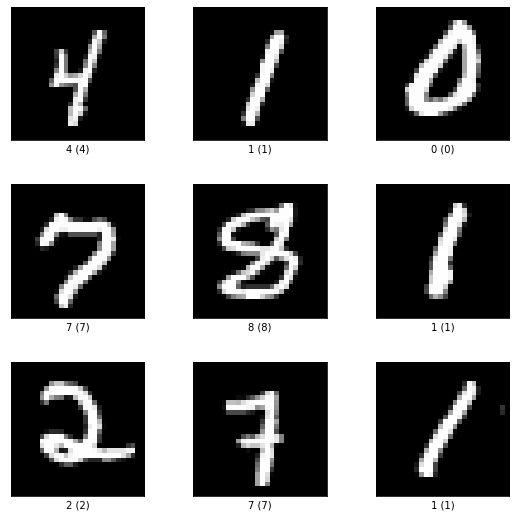

# Mnist

First part follows [Tensorflow dataset guide](https://www.tensorflow.org/datasets/overview) to demonstrate TFDS usage.


```python
import tensorflow as tf
import tensorflow_datasets as tfds

keras = tf.keras
tf.__version__
```


    '2.5.0'


# Demonstration of Different Data Loaders


```python
builders = tfds.list_builders()
builders[:5]
```


    ['abstract_reasoning', 'accentdb', 'aeslc', 'aflw2k3d', 'ag_news_subset']


```python
ds = tfds.load('mnist', split = 'train', shuffle_files = True)
ds
```


    <_OptionsDataset shapes: {image: (28, 28, 1), label: ()}, types: {image: tf.uint8, label: tf.int64}>


```python
# Use tfds.builder

builder = tfds.builder('mnist')
builder.download_and_prepare()
ds = builder.as_dataset(split = 'train', shuffle_files = True)
ds
```


    <_OptionsDataset shapes: {image: (28, 28, 1), label: ()}, types: {image: tf.uint8, label: tf.int64}>


```python
## As dict
for example in ds.take(2):
    print(list(example.keys()))
    image = example['image']
    label = example['label']
    print(image.shape, label)
```

    ['image', 'label']
    (28, 28, 1) tf.Tensor(1, shape=(), dtype=int64)
    ['image', 'label']
    (28, 28, 1) tf.Tensor(7, shape=(), dtype=int64)


```python
## As tuple (as_supervised = True)
ds = tfds.load('mnist', split = 'train', as_supervised = True)
for image, label in ds.take(1):
    print(image.shape, label)
```

    (28, 28, 1) tf.Tensor(4, shape=(), dtype=int64)


```python
## As numpy

for image, label in tfds.as_numpy(ds.take(2)):
    print(image.shape, label)
    print(type(image), type(label))
```

    (28, 28, 1) 4
    <class 'numpy.ndarray'> <class 'numpy.int64'>
    (28, 28, 1) 1
    <class 'numpy.ndarray'> <class 'numpy.int64'>


```python
## Load full dataset in a single batch (batch_size = -1)
ds = tfds.load('mnist', split = 'train', batch_size = 2, as_supervised = True)
for image, label in tfds.as_numpy(ds.take(3)):
    print(image.shape)

ds = tfds.load('mnist', split = 'test', batch_size = -1, as_supervised = True)
image, label = tfds.as_numpy(ds)
print(image.shape)
```

    (2, 28, 28, 1)
    (2, 28, 28, 1)
    (2, 28, 28, 1)
    (10000, 28, 28, 1)


# Benchmark Datasets


```python
batch_size = 32
ds = tfds.load('mnist', split = 'train')
# ds = ds.prefetch(1)
ds = ds.batch(batch_size).prefetch(1)

# https://www.tensorflow.org/datasets/api_docs/python/tfds/benchmark
tfds.benchmark(ds, batch_size = batch_size)
tfds.benchmark(ds, batch_size = batch_size)
```


      0%|          | 1/1875 [00:00<?, ?it/s]


    
    ************ Summary ************
    
    Examples/sec (First included) 57111.48 ex/sec (total: 60000 ex, 1.05 sec)
    Examples/sec (First only) 1317.78 ex/sec (total: 32 ex, 0.02 sec)
    Examples/sec (First excluded) 58431.62 ex/sec (total: 59968 ex, 1.03 sec)


      0%|          | 1/1875 [00:00<?, ?it/s]


    
    ************ Summary ************
    
    Examples/sec (First included) 309057.17 ex/sec (total: 60000 ex, 0.19 sec)
    Examples/sec (First only) 2434.41 ex/sec (total: 32 ex, 0.01 sec)
    Examples/sec (First excluded) 331325.95 ex/sec (total: 59968 ex, 0.18 sec)


<strong>BenchmarkResult:</strong><br/><div>
<style scoped>
    .dataframe tbody tr th:only-of-type {
        vertical-align: middle;
    }

    .dataframe tbody tr th {
        vertical-align: top;
    }

    .dataframe thead th {
        text-align: right;
    }
</style>
<table border="1" class="dataframe">
  <thead>
    <tr style="text-align: right;">
      <th></th>
      <th>duration</th>
      <th>num_examples</th>
      <th>avg</th>
    </tr>
  </thead>
  <tbody>
    <tr>
      <th>first+lasts</th>
      <td>0.194139</td>
      <td>60000</td>
      <td>309057.167541</td>
    </tr>
    <tr>
      <th>first</th>
      <td>0.013145</td>
      <td>32</td>
      <td>2434.410144</td>
    </tr>
    <tr>
      <th>lasts</th>
      <td>0.180994</td>
      <td>59968</td>
      <td>331325.951563</td>
    </tr>
  </tbody>
</table>
</div>


# Visualization


```python
# Set with_info = True for visualization
ds, info = tfds.load('mnist', split = 'train', with_info = True)

tfds.as_dataframe(ds.take(4), info)
```


<style  type="text/css" >
</style><table id="T_2cf8d_" ><thead>    <tr>        <th class="blank level0" ></th>        <th class="col_heading level0 col0" >image</th>        <th class="col_heading level0 col1" >label</th>    </tr></thead><tbody>
                <tr>
                        <th id="T_2cf8d_level0_row0" class="row_heading level0 row0" >0</th>
                        <td id="T_2cf8d_row0_col0" class="data row0 col0" ></td>
                        <td id="T_2cf8d_row0_col1" class="data row0 col1" >4</td>
            </tr>
            <tr>
                        <th id="T_2cf8d_level0_row1" class="row_heading level0 row1" >1</th>
                        <td id="T_2cf8d_row1_col0" class="data row1 col0" ></td>
                        <td id="T_2cf8d_row1_col1" class="data row1 col1" >1</td>
            </tr>
            <tr>
                        <th id="T_2cf8d_level0_row2" class="row_heading level0 row2" >2</th>
                        <td id="T_2cf8d_row2_col0" class="data row2 col0" ></td>
                        <td id="T_2cf8d_row2_col1" class="data row2 col1" >0</td>
            </tr>
            <tr>
                        <th id="T_2cf8d_level0_row3" class="row_heading level0 row3" >3</th>
                        <td id="T_2cf8d_row3_col0" class="data row3 col0" ></td>
                        <td id="T_2cf8d_row3_col1" class="data row3 col1" >7</td>
            </tr>
    </tbody></table>


```python
ds, info = tfds.load('mnist', split = 'train', with_info = True)

fig = tfds.show_examples(ds, info)
```


    

    


# Access the Dataset Metadata


```python
ds, info = tfds.load('mnist', with_info = True)
info.features['label']
```


    ClassLabel(shape=(), dtype=tf.int64, num_classes=10)


```python
print(info.features['label'].num_classes)
print(info.features['label'].names)
print(info.features['label'].int2str(7))
```

    10
    ['0', '1', '2', '3', '4', '5', '6', '7', '8', '9']
    7


```python
print(info.features.shape)
print(info.features['image'])
```

    {'image': (28, 28, 1), 'label': ()}
    Image(shape=(28, 28, 1), dtype=tf.uint8)


```python
print(info.splits)
```

    {'test': <SplitInfo num_examples=10000, num_shards=1>, 'train': <SplitInfo num_examples=60000, num_shards=1>}


```python
print(info.splits['train[15%:75%]'].num_examples)
```

    36000


# From TFDS to Keras

The second part mainly follows [Keras Example Guide](https://www.tensorflow.org/datasets/keras_example).


```python
# https://www.tensorflow.org/datasets/api_docs/python/tfds/load
(train_ds, valid_ds, test_ds), info = tfds.load(
    'mnist',
    split = ['train[:80%]', 'train[80%:]', 'test'],
    shuffle_files = True, 
    as_supervised = True, # Make it supervised tuples
    with_info = True,     # Retrieve metadata
)
```


```python
print(info.features['image'].dtype)
print(info.splits['train'].num_examples)
print(info.features['image'].shape)
input_shape = (info.features['image'].shape)
print(input_shape)
```

    <dtype: 'uint8'>
    60000
    (28, 28, 1)
    (28, 28, 1)


```python
# Normalize the uint8 to float
def normalize_image(image, label):
    return tf.cast(image, tf.float32) / 255.0, label

batch_size = 128

# reshuffle_each_iteration = False, since we want to test for different model(or rebuild the model), the input sequence should be the same
# However, it would make input sequence for each iteration same.
# Origally, I think True can still make the first input same, but it doesn't.
def create_train_set(ds, seed = 1, reshuffle_each_iteration = False):
    # https://www.tensorflow.org/api_docs/python/tf/data/Dataset#map
    ds = ds.map(normalize_image, num_parallel_calls = tf.data.AUTOTUNE)
    # Transformation should be called before cache
    ds = ds.cache()
    # https://www.tensorflow.org/api_docs/python/tf/data/Dataset#shuffle
    # Use 1000 for bigger larger set to fit in memory
    # If we set seed, then the first epoch for this dataset would always start from the same sequence
    ds = ds.shuffle(info.splits['train'].num_examples, seed = seed, reshuffle_each_iteration = reshuffle_each_iteration)
    ds = ds.batch(batch_size)
    # https://www.tensorflow.org/api_docs/python/tf/data/Dataset
    ds = ds.prefetch(tf.data.AUTOTUNE)
    return ds

```


```python
# We don't call shuffle on validation/test set
def create_valid_test_set(ds):    
    ds = ds.map(normalize_image, num_parallel_calls = tf.data.AUTOTUNE)
    ds = ds.batch(batch_size)
    # https://www.tensorflow.org/api_docs/python/tf/data/Dataset#cache
    # For test/test set, we cache after batch
    ds = ds.cache()
    test_ds = ds.prefetch(tf.data.AUTOTUNE)
    return ds

```


```python
train_ds_batched = create_train_set(train_ds)
valid_ds_batched = create_valid_test_set(valid_ds)
test_ds_batched = create_valid_test_set(test_ds)
```


```python
import pandas as pd
import numpy as np

tf.random.set_seed(1)
np.random.seed(1)

model = keras.models.Sequential([
    keras.layers.Flatten(input_shape = input_shape),
    keras.layers.Dense(128, activation = 'relu'),
    keras.layers.Dropout(0.3),
    keras.layers.Dense(10)
])

model.compile(
    optimizer = 'adam',
    loss = keras.losses.SparseCategoricalCrossentropy(from_logits = True),
    metrics = [keras.metrics.SparseCategoricalAccuracy()],
)

early_stopping = keras.callbacks.EarlyStopping(patience = 10, restore_best_weights = True)

history = model.fit(
    train_ds_batched,
    epochs = 500,
    validation_data = valid_ds_batched,
    callbacks = [early_stopping],
)

history_df = pd.DataFrame(history.history)
print(f'val_loss: {history_df.val_loss.min():.4f} - val_sparse_categorical_accuracy: {history_df.val_sparse_categorical_accuracy.max():.4f}')
```

    Epoch 1/500
    375/375 [==============================] - 2s 2ms/step - loss: 0.4658 - sparse_categorical_accuracy: 0.8646 - val_loss: 0.2349 - val_sparse_categorical_accuracy: 0.9327
    Epoch 2/500
    375/375 [==============================] - 0s 1ms/step - loss: 0.2260 - sparse_categorical_accuracy: 0.9354 - val_loss: 0.1759 - val_sparse_categorical_accuracy: 0.9504
    Epoch 3/500
    375/375 [==============================] - 0s 1ms/step - loss: 0.1735 - sparse_categorical_accuracy: 0.9493 - val_loss: 0.1483 - val_sparse_categorical_accuracy: 0.9557
    Epoch 4/500
    375/375 [==============================] - 0s 1ms/step - loss: 0.1444 - sparse_categorical_accuracy: 0.9575 - val_loss: 0.1288 - val_sparse_categorical_accuracy: 0.9625
    Epoch 5/500
    375/375 [==============================] - 0s 1ms/step - loss: 0.1290 - sparse_categorical_accuracy: 0.9614 - val_loss: 0.1186 - val_sparse_categorical_accuracy: 0.9655
    Epoch 6/500
    375/375 [==============================] - 0s 1ms/step - loss: 0.1109 - sparse_categorical_accuracy: 0.9665 - val_loss: 0.1062 - val_sparse_categorical_accuracy: 0.9687
    Epoch 7/500
    375/375 [==============================] - 0s 1ms/step - loss: 0.0997 - sparse_categorical_accuracy: 0.9699 - val_loss: 0.1056 - val_sparse_categorical_accuracy: 0.9693
    Epoch 8/500
    375/375 [==============================] - 0s 1ms/step - loss: 0.0913 - sparse_categorical_accuracy: 0.9724 - val_loss: 0.0988 - val_sparse_categorical_accuracy: 0.9710
    Epoch 9/500
    375/375 [==============================] - 0s 1ms/step - loss: 0.0852 - sparse_categorical_accuracy: 0.9737 - val_loss: 0.0952 - val_sparse_categorical_accuracy: 0.9721
    Epoch 10/500
    375/375 [==============================] - 0s 1ms/step - loss: 0.0790 - sparse_categorical_accuracy: 0.9759 - val_loss: 0.0923 - val_sparse_categorical_accuracy: 0.9729
    Epoch 11/500
    375/375 [==============================] - 0s 1ms/step - loss: 0.0718 - sparse_categorical_accuracy: 0.9781 - val_loss: 0.0910 - val_sparse_categorical_accuracy: 0.9747
    Epoch 12/500
    375/375 [==============================] - 0s 1ms/step - loss: 0.0669 - sparse_categorical_accuracy: 0.9793 - val_loss: 0.0894 - val_sparse_categorical_accuracy: 0.9732
    Epoch 13/500
    375/375 [==============================] - 0s 1ms/step - loss: 0.0626 - sparse_categorical_accuracy: 0.9800 - val_loss: 0.0884 - val_sparse_categorical_accuracy: 0.9757
    Epoch 14/500
    375/375 [==============================] - 0s 1ms/step - loss: 0.0595 - sparse_categorical_accuracy: 0.9817 - val_loss: 0.0855 - val_sparse_categorical_accuracy: 0.9753
    Epoch 15/500
    375/375 [==============================] - 0s 1ms/step - loss: 0.0543 - sparse_categorical_accuracy: 0.9829 - val_loss: 0.0846 - val_sparse_categorical_accuracy: 0.9758
    Epoch 16/500
    375/375 [==============================] - 0s 1ms/step - loss: 0.0524 - sparse_categorical_accuracy: 0.9836 - val_loss: 0.0845 - val_sparse_categorical_accuracy: 0.9753
    Epoch 17/500
    375/375 [==============================] - 0s 1ms/step - loss: 0.0489 - sparse_categorical_accuracy: 0.9840 - val_loss: 0.0880 - val_sparse_categorical_accuracy: 0.9753
    Epoch 18/500
    375/375 [==============================] - 0s 1ms/step - loss: 0.0488 - sparse_categorical_accuracy: 0.9837 - val_loss: 0.0842 - val_sparse_categorical_accuracy: 0.9765
    Epoch 19/500
    375/375 [==============================] - 0s 1ms/step - loss: 0.0460 - sparse_categorical_accuracy: 0.9853 - val_loss: 0.0841 - val_sparse_categorical_accuracy: 0.9758
    Epoch 20/500
    375/375 [==============================] - 0s 1ms/step - loss: 0.0427 - sparse_categorical_accuracy: 0.9859 - val_loss: 0.0879 - val_sparse_categorical_accuracy: 0.9767
    Epoch 21/500
    375/375 [==============================] - 0s 1ms/step - loss: 0.0401 - sparse_categorical_accuracy: 0.9871 - val_loss: 0.0846 - val_sparse_categorical_accuracy: 0.9776
    Epoch 22/500
    375/375 [==============================] - 0s 1ms/step - loss: 0.0394 - sparse_categorical_accuracy: 0.9871 - val_loss: 0.0843 - val_sparse_categorical_accuracy: 0.9772
    Epoch 23/500
    375/375 [==============================] - 0s 1ms/step - loss: 0.0381 - sparse_categorical_accuracy: 0.9876 - val_loss: 0.0895 - val_sparse_categorical_accuracy: 0.9762
    Epoch 24/500
    375/375 [==============================] - 0s 1ms/step - loss: 0.0387 - sparse_categorical_accuracy: 0.9871 - val_loss: 0.0861 - val_sparse_categorical_accuracy: 0.9770
    Epoch 25/500
    375/375 [==============================] - 0s 1ms/step - loss: 0.0354 - sparse_categorical_accuracy: 0.9880 - val_loss: 0.0858 - val_sparse_categorical_accuracy: 0.9778
    Epoch 26/500
    375/375 [==============================] - 0s 1ms/step - loss: 0.0365 - sparse_categorical_accuracy: 0.9879 - val_loss: 0.0884 - val_sparse_categorical_accuracy: 0.9779
    Epoch 27/500
    375/375 [==============================] - 0s 1ms/step - loss: 0.0336 - sparse_categorical_accuracy: 0.9890 - val_loss: 0.0845 - val_sparse_categorical_accuracy: 0.9779
    Epoch 28/500
    375/375 [==============================] - 0s 1ms/step - loss: 0.0304 - sparse_categorical_accuracy: 0.9899 - val_loss: 0.0857 - val_sparse_categorical_accuracy: 0.9777
    Epoch 29/500
    375/375 [==============================] - 1s 1ms/step - loss: 0.0313 - sparse_categorical_accuracy: 0.9899 - val_loss: 0.0865 - val_sparse_categorical_accuracy: 0.9779
    val_loss: 0.0841 - val_sparse_categorical_accuracy: 0.9779


```python
model.evaluate(test_ds_batched)
```

    79/79 [==============================] - 0s 3ms/step - loss: 0.0759 - sparse_categorical_accuracy: 0.9792


    [0.07592277228832245, 0.979200005531311]


```python
for image, label in test_ds_batched.take(1):
    predicted = model.predict(image)
    true_labels = label
    break
    
print(predicted.shape)
print(predicted[:1])
print(list(map(np.argmax, predicted[:10])))
print(true_labels[:10].numpy())

pd.DataFrame({'real': true_labels[:10].numpy(), 'predicted': map(np.argmax, predicted[:10])})
```

    (128, 10)
    [[-14.500157   -6.972598   14.633423   -2.306548   -5.9908423  -6.6004353
       -6.8253746  -8.3344345  -3.8601477 -12.037413 ]]
    [2, 0, 4, 8, 7, 0, 6, 3, 1, 8]
    [2 0 4 8 7 0 6 3 1 8]


<div>
<style scoped>
    .dataframe tbody tr th:only-of-type {
        vertical-align: middle;
    }

    .dataframe tbody tr th {
        vertical-align: top;
    }

    .dataframe thead th {
        text-align: right;
    }
</style>
<table border="1" class="dataframe">
  <thead>
    <tr style="text-align: right;">
      <th></th>
      <th>real</th>
      <th>predicted</th>
    </tr>
  </thead>
  <tbody>
    <tr>
      <th>0</th>
      <td>2</td>
      <td>2</td>
    </tr>
    <tr>
      <th>1</th>
      <td>0</td>
      <td>0</td>
    </tr>
    <tr>
      <th>2</th>
      <td>4</td>
      <td>4</td>
    </tr>
    <tr>
      <th>3</th>
      <td>8</td>
      <td>8</td>
    </tr>
    <tr>
      <th>4</th>
      <td>7</td>
      <td>7</td>
    </tr>
    <tr>
      <th>5</th>
      <td>0</td>
      <td>0</td>
    </tr>
    <tr>
      <th>6</th>
      <td>6</td>
      <td>6</td>
    </tr>
    <tr>
      <th>7</th>
      <td>3</td>
      <td>3</td>
    </tr>
    <tr>
      <th>8</th>
      <td>1</td>
      <td>1</td>
    </tr>
    <tr>
      <th>9</th>
      <td>8</td>
      <td>8</td>
    </tr>
  </tbody>
</table>
</div>


# Other Tests


```python
# https://www.tensorflow.org/api_docs/python/tf/data/Dataset#shuffle

ds = tf.data.Dataset.range(3)
dataset = ds.shuffle(2, seed = 1)
print(list(dataset.as_numpy_iterator()))
print(list(dataset.as_numpy_iterator()))
```

    [0, 2, 1]
    [1, 0, 2]


```python
dataset = ds.shuffle(2, seed = 1)
print(list(dataset.as_numpy_iterator()))
```

    [0, 2, 1]

