# spoken_digit

https://www.tensorflow.org/datasets/catalog/spoken_digit

The code is mainly based on https://www.tensorflow.org/tutorials/audio/simple_audio


```python
import tensorflow as tf
import tensorflow_datasets as tfds

keras = tf.keras
tf.__version__
```


    '2.5.0'


# Prepare the Data


```python
# pip install pydub
(train_ds, valid_ds, test_ds), info = tfds.load(
    'spoken_digit', 
    split = ['train[:80%]', 'train[80%:90%]', 'train[90%:]'],
    with_info = True, 
    as_supervised = True
)
info
```


    tfds.core.DatasetInfo(
        name='spoken_digit',
        full_name='spoken_digit/1.0.9',
        description="""
        A free audio dataset of spoken digits. Think MNIST for audio.
        
        A simple audio/speech dataset consisting of recordings of spoken digits in wav files at 8kHz.
        The recordings are trimmed so that they have near minimal silence at the beginnings and ends.
        
        5 speakers
        2,500 recordings (50 of each digit per speaker)
        English pronunciations
        
        Files are named in the following format: {digitLabel}_{speakerName}_{index}.wav
        """,
        homepage='https://github.com/Jakobovski/free-spoken-digit-dataset',
        data_path='/Users/zhengjiaxun/tensorflow_datasets/spoken_digit/1.0.9',
        download_size=11.42 MiB,
        dataset_size=45.68 MiB,
        features=FeaturesDict({
            'audio': Audio(shape=(None,), dtype=tf.int64),
            'audio/filename': Text(shape=(), dtype=tf.string),
            'label': ClassLabel(shape=(), dtype=tf.int64, num_classes=10),
        }),
        supervised_keys=('audio', 'label'),
        disable_shuffling=False,
        splits={
            'train': <SplitInfo num_examples=2500, num_shards=1>,
        },
        citation="""@ONLINE {Free Spoken Digit Dataset,
            author = "Zohar Jackson",
            title  = "Spoken_Digit",
            year   = "2016",
            url    = "https://github.com/Jakobovski/free-spoken-digit-dataset"
        }""",
    )


```python
class_names = info.features['label'].names
print(class_names)
print(info.features['label'].num_classes)
print(info.splits['train'].num_examples)
```

    ['0', '1', '2', '3', '4', '5', '6', '7', '8', '9']
    10
    2500


```python
for audio, label in train_ds.take(1):
    print(audio)
    print(label)
    print(class_names[label])
```

    tf.Tensor([   0    0 -256 ... -512 -256 -512], shape=(1525,), dtype=int64)
    tf.Tensor(2, shape=(), dtype=int64)
    2


```python
tfds.as_dataframe(train_ds.take(5), info)
```


<style  type="text/css" >
</style><table id="T_4289e_" ><thead>    <tr>        <th class="blank level0" ></th>        <th class="col_heading level0 col0" >audio</th>        <th class="col_heading level0 col1" >label</th>    </tr></thead><tbody>
                <tr>
                        <th id="T_4289e_level0_row0" class="row_heading level0 row0" >0</th>
                        <td id="T_4289e_row0_col0" class="data row0 col0" ><audio controls src="data:audio/ogg;base64,UklGRg4MAABXQVZFZm10IBAAAAABAAEAQB8AAIA+AAACABAAZGF0YeoLAAAAAAAAVvUAAFb1AABW9QAAAAAAAAAAAAAAAAAAAABW9Vb1VvVW9Vb1VvUB4Kvqq+qr6qvqAeBW9avqVvVW9QAAVvUAAAAAVvUAAKoKAACqCgAAqgqqCqoKqgqqCqoKVRWqClUVqgpVFQAAqgpW9Vb1VvUB4AHgrMpW1QHArMoBwKzKrMpW1VbVAeCr6lb1q+oAAFb1AABW9QAAVvVW9avqVvWr6lb1VvUAAFb1qgqqClUV/x+qKqoqqipUNaoqVDX/H6oqVRVVFVb1VvVW1VbVAcABwFa1AaCsqla1rKoBwKzKAeCr6gAAAABVFVUV/x//H1UVqgpW9Vb1AeAB4KzKVtUBwFbVVtVW1Vb1VvVVFVUVqipUNf8//z+qSlRV/z+qSlQ1VDWqKv8fAABW9QHgrMpWtQGgAaBXlVeVV5Wsqla1rMoB4KvqAABVFf8fqiqqKqoqqipVFaoKVvWr6lbVrMqsyla1AcABwKzKAeCr6lb1VRVVFVQ1VDWqSlRVVFVUVVRVqkqqSv8/qir/HwAAVvWsygHAAaABoKyKV5WsiqyKAaABoAHAVtUB4AAAqgr/H6oq/z9UNf8/qir/H6oKVvWr6lbVAcABwKyqVrWsqgHAAcAB4Fb1AABVFf8f/z//P1RVVFX/X/9fVFVUVapKVDVUNVUVAACr6gHAVrUBoFeVAYCsigGAV5UBoAGgrMpW1Vb1AAD/H/8f/z9UNapKVDVUNf8fAABW9VbVVtUBwKyqrKqsqgGgVrUBwKzKq+pW9QAA/x+qKqpKVFVUVf9f/1//X1RV/1+qSlQ1qiqqClb1VtUBwAGgV5VXlQGAAYCsiqyKAaCsqqzKVtVW9aoK/x+qKv8/VDX/P1Q1qir/H6oKq+oB4AHAAcCsqqyqAaBWtVa1rMpW1avqVvWqCqoqVDWqSqpK/1+paqlq/1//X6pKqkr/P6oqVRVW9azKAcABoAGgV5UBgAGAAYCsigGgrKqsylbVAACqCv8fqir/P6pKVDX/P1Q1VRWqCqvqAeCsyla1VrUBoKyqrKoBwAHAVtWr6lb1VRX/H/8//z9UVf9fVFX/X1RV/1+qSqpKVDWqKqoKVvUB4KzKVrVXlVeVAYCsiqyKV5UBoFa1AcAB4Fb1AABVFf8fVDX/P1Q1/z//H/8fAABW9VbVVtWsyla1VrVWtayqAcCsyqzKq+qr6qoKVRVUNf8/qkpUVVRV/19UVVRVqkqqSlQ1VDVVFaoKq+pW1QHArKoBoAGgrIpXlayKAaCsqqyqrMpW1Vb1AABVFf8f/x9UNVQ1qiqqKqoKqgqr6qvqrMqsyqzKVrUBwAHAVrWsyqzKq+pW9QAAVRX/H1Q1VDWqSv8/VFX/P6pK/z+qSlQ1VDX/H1UVVvWr6lbVAcABwFa1rKpXlQGgV5VXlayqVrWsygHgVvUAAFUV/x+qKqoqqir/H/8fVRUAAAAAAeAB4FbVrMqsygHAAcCsygHAVtVW1Vb1AACqCv8f/x9UNVQ1qkr/P6pKqkqqSv8//z+qKqoqVRWqCgAAAeAB4AHAAcCsqqyqrKoBoAGgAaBWtVa1rMoB4KvqAAAAAFUVVRWqKv8fqipVFf8fqgqqClb1q+oB4FbVVtVW1azKAcCsyqzKAeCr6lb1AACqCv8f/x+qKqoq/z//P1Q1qkr/P/8//z+qKlQ1/x9VFVb1q+pW1azKVrWsqqyqV5UBoFeVAaABoAHAAcAB4KvqAACqClUVqir/H1Q1qiqqKv8f/x9VFQAAVvWr6lbVrMoBwAHAVrUBwFa1rMqsygHgq+pW9VUV/x9UNVQ1VDWqSv8/VFVUVf8/qkpUNVQ1/x9VFVb1VvUB4KzKAcABoAGgAaABoAGgAaBWtQHAVtUB4Fb1qgqqCv8fqir/H1Q1qiqqKqoqVRVVFVb1VvVW1VbVAcABwFa1AcBWtQHArMpW1QHgq+pW9VUVVRWqKqoq/z9UNapKqkr/P6pKVDX/P1Q1qiqqKqoKqgpW9VbVrMpWtVa1rKoBoKyqAaCsqla1VrVW1VbVVvUAAFUVVRX/H/8fqir/H6oqVRVVFQAAAACr6gHgVtWsygHAAcABwAHAAcCsylbVAeCr6gAAVRVVFVQ1VDX/P/8/qkr/P6pKVDX/P6oqVDX/H/8fVRUAAAAAq+pW1VbVAcABwKyqVrWsqla1VrUBwAHAAeCr6qvqAAAAAFUVqgpVFaoKVRVVFQAAAABW9Vb1q+pW1VbVAcCsygHArMoBwFbVVtWr6lb1VvWqClUVqiqqKv8/VDX/P1Q1VDWqKqoqqipVFf8fqgpVFQAAqgoAAFb1VvUB4AHgVtWsyqzKAcCsyqzKAcCsyqzKAeAB4AHgVvWr6gAAAABW9QAAVvUAAFb1VvWr6lb1q+oB4AHgAeBW1QHgVtUB4AHgq+qr6gAAAAAAAFUV/x//H6oq/x+qKqoqqir/H/8f/x+qClUVAACqCqoKAACqCqoKAAAAAKvqVvUB4AHgVtVW1VbVrMpW1azKVtWsylbVVtUB4FbVq+qr6qvqq+pW9avqAAAAAFb1AAAAAFb1VvWr6lb1VvWr6lb1q+pW9avqAABW9QAAAABVFaoK/x//H/8f/x9VFVUVqgpVFaoKqgoAAKoKAACqCgAAqgpVFQAAqgpW9Vb1q+qr6lbVAeCsyqzKAcABwAHAVrWsygHAVtWsygHgAeBW9avqAABW9aoKqgqqClUVqgqqCgAAAABW9Vb1q+pW9Vb1VvVW9Vb1VvVW9QAAqgoAAFUVqgr/H/8fqgpVFaoKVRWqClUVqgqqCgAAqgoAAKoKqgoAAKoKAAAAAFb1q+qr6lbVVtVW1azKrMoBwKzKAcCsyqzKrMoB4AHgVvVW9Vb1AAAAAKoKVRVVFaoKqgoAAAAAVvVW9avqVvVW9avqVvWr6lb1q+pW9QAAAAAAAFUVqgpVFaoKVRWqClUVVRUAAKoKAAAAAFb1AAAAAAAAVvUAAFb1AABW9QAAVvVW9avqq+pW1QHgVtWsylbVAcCsygHAVtVW1QHgVtWr6qvqAABW9aoKqgoAAFUVqgqqCgAAqgpW9QAAq+pW9avqVvWr6lb1VvWr6gAAAAAAAKoKAACqClUVVRUAAKoKAACqCgAAAAAAAFb1AAAAAFb1AABW9QAAAABW9QAAVvUAAFb1q+qr6gHgAeBW1VbVrMqsylbVrMpW1QHgAeCr6qvqq+oAAFb1qgoAAKoKAACqCqoKAAAAAAAAVvVW9avqq+oB4Kvqq+pW9avqAAAAAAAAqgoAAFUVVRWqClUVqgqqCqoKAACqClb1AABW9QAAAABW9QAAVvUAAAAAVvUAAAAAVvVW9avqq+oB4KvqVtUB4FbVAeBW1QHgVtUB4KvqAeBW9Vb1AAAAAKoKAACqClb1AABW9Vb1q+pW9avqq+qr6qvqAeBW9avqAABW9QAAAACqCgAAVRWqClUVqgpVFQAAqgoAAKoKAAAAAFb1AABW9QAAAABW9QAAVvUAAFb1AAAAAFb1VvWr6lb1AeCr6qvqAeBW1QHgVtUB4FbVq+qr6qvqVvVW9avqAABW9QAAAABW9QAAVvWr6lb1q+pW9avqVvVW9avqAAAAAFb1qgoAAKoKAABVFaoKVRVVFQAAqgqqCqoKAABW9QAAVvUAAAAAq+pW9avqVvWr6lb1q+pW9Vb1VvVW9avqVvVW9QHgq+oB4KvqAeCr6qvqq+qr6qvqq+qr6lb1VvVW9avqVvWr6lb1q+pW9avqVvWr6lb1VvUAAFb1AABW9QAAAACqCgAAqgoAAKoKAACqCgAAqgqqCgAAAABW9QAAAAAAAFb1VvWr6lb1VvWr6lb1q+pW9avqVvVW9Vb1q+pW9avqVvWr6lb1q+qr6gHgq+qr6gHgq+oB4Kvqq+oB4Fb1q+pW9avqVvVW9Vb1AABW9QAAVvUAAAAAVvUAAFb1AACqCgAAqgoAAKoKqgoAAKoKAACqCgAAqgoAAFb1AABW9QAAVvWr6lb1VvWr6lb1q+pW9Vb1q+pW9Vb1q+pW9avqVvVW9avqVvVW9avqVvWr6qvqq+oB4KvqAeBW9avqVvWr6g=="  controlsList="nodownload" /></td>
                        <td id="T_4289e_row0_col1" class="data row0 col1" >2</td>
            </tr>
            <tr>
                        <th id="T_4289e_level0_row1" class="row_heading level0 row1" >1</th>
                        <td id="T_4289e_row1_col0" class="data row1 col0" ><audio controls src="data:audio/ogg;base64,UklGRgYXAABXQVZFZm10IBAAAAABAAEAQB8AAIA+AAACABAAZGF0YeIWAAAAAAAAAAAAACD8AAAg/AAAIPwAACD8AAAg/D/4IPxe9D/4XvRe9F70P/g/+CD8P/gAACD8AAAAACD8AAAAACD8IPwg/D/4P/he9D/4P/g/+F70P/g/+CD8P/gAAAAAIPwAACD8AAA/+CD8P/gg/CD8IPwAAAAAwQfgA6ILwQeDD8EHogvgA+ADAAA/+D/4nOyc7Lvou+i76JzsffB98CD8IPzgA+ADwQfBB+AD4AMg/CD8XvRe9H3wXvR98F70P/he9CD8IPzgAwAA4APgAwAA4AMAAAAAIPwg/F70P/he9D/4XvQ/+D/4IPw/+AAAIPzgAwAAwQfgA6ILogtkE2QTgw9kE2QTwQfBByD8P/i76Nrk+eAY3TfZ+eC76H3wP/gAAOADoguiC4MPogvBBwAAAABe9F70nOx98JzsffCc7F70P/g/+AAAAADBB+ADwQfgAwAA4AMAAAAAIPwg/F70P/g/+F70P/g/+CD8IPw/+AAAAAAAAOAD4AOiC6ILZBNkEyYbRRcmG2QTogvBBz/4ffD54BjdddFW1VbVVtX54LvoXvQAAMEHwQeDD4MPgw+iC+ADAAA/+D/4nOyc7LvonOy76H3wffAg/CD84APgA8EH4APBB+AD4AMAAAAAP/gg/CD8XvQ/+F70P/he9F70P/g/+CD8AADgA6ILgw9FFyYb6CIHH+giJhtFF6IL4AN98NrkVtV10bPJs8mUzVbVGN2c7F704APBB2QTRRdFF4MPgw/gAwAAP/he9H3wu+i76NrknOx98F70IPwAAAAAwQfBB6ILwQfgA+ADAAAAAD/4IPw/+D/4XvRe9H3wXvR98D/4P/gAAAAAoguDDyYb6CLJJqoqqiqqKugiRRfBBz/42uRW1bPJ0sURvtLFlM1W1drknOwAAKILZBMmGyYbJhtkE4MP4AMAAF70ffCc7Lvo+eDa5NrknOx98CD8AACiC6ILgw+DD6ILogvgA+ADAAAg/D/4XvRe9F70ffB98JzsffB98D/4IPwAAKILgw8mG+giySaLLosuiy7oIgcfogte9NrkddHSxTC6Eb4wuvHBddE32ZzsP/iiC0UXJhvoIgcfBx9FF6ILwQc/+F70u+ja5Bjd+eD54LvoffBe9AAA4AODD4MPZBNkE4MPwQfgAwAAIPwg/D/4XvR98Jzsu+ic7LvoffB98CD8wQeiCyYbBx+LLmwyLjpNNk02ySYmGyD8nOx10dLFMLpusk+2T7azyXXR2uRe9MEHZBMHH8km6CLoIgcfZBOiCwAAP/i76NrkN9k32TfZ+eDa5H3wP/jgA6ILgw9FF4MPZBOiC6ILAAAg/CD8XvRe9JzsnOyc7Nrku+i76H3wffAAAKILRRcHH6oqbDIuOi46LjqLLugiogte9DfZ0sVPtm6yja5PthG+ddH54F70AABkEyYbySbJJqoqBx8mG6IL4ANe9Jzs+eAY3TfZVtU32drku+g/+AAAoguDD0UXJhtkE4MP4AMAACD8XvRe9JzsffC76Jzsu+ic7H3wXvQg/KILZBPoIskmbDIuOi46Dz5NNqoqZBMg/Bjds8kwuo2urKpusjC6s8kY3bvoAACDDwcfqiqqKqoq6CJFF4MPAAA/+Nrk+eA32VbVVtVW1fngnOwg/OADZBNFFyYbBx9kE4MP4AMg/H3wffC76Lvo2uS76NrknOyc7F70P/jgA6ILgw8HH+giiy5NNi46TTYuOosu6CKiC33wddERvqyqy6asqo2u0sVW1ZzsAABkEwcfqiqLLskm6CJkE8EHP/h98PngN9l10VbVddH54JzsXvTBB2QTJhvJJugiBx9kEwAAP/i76PngGN0Y3drku+h98F70AAAAAMEHwQfgA8EH4AOiC2QTZBMHH8kmiy5sMk02iy7JJqILXvRW1RG+rKrLpqyqT7aUzfngIPyDDwcf6CKqKgcfJhuiC+ADXvSc7NrkGN1W1TfZN9m76H3wAACDDyYbBx/oIiYbRReiCz/4nOwY3TfZVtUY3drkXvQAAMEHZBODD6ILogsg/D/4nOyc7H3wIPyiC0UXqipNNtBF0EXQRS46Bx8g/DfZT7YJn2aTZpOsqtLF2uTBByYbiy5sMmwyySZkE8EHffC76DfZVtVW1XXRGN3a5F704ANkEwcfySboIgcfgw/BB170u+gY3TfZVtX54LvoP/jgA2QTRRcmG4MPogs/+H3w+eAY3TfZ2uRe9KILBx9NNu9Bc1FzUbFJ70HJJqIL+eBPtkeXAYCkiwmf8cHa5IMPqioPPg8+TTYHH+ADXvT54DfZddF10TfZ+eCc7D/44AODD0UXBx8HHyYbogvgA33wu+j54Nrk2uS76JzsP/gAAKILgw9FF0UXgw8AAF702uQY3VbVVtX54JzswQcmG002Dz6xSbFJ0EUPPmwyRRcAADfZT7ZHl+KDpIuNrhjdogtsMtBFDz6LLoMPP/ja5PngGN0Y3drk2uSc7JzsXvQg/KILgw9FF4MPogsg/D/4nOx98H3wP/gAAAAAAABe9F70XvQAAOADgw+DD6ILAACc7PngVtUY3RjdnOw/+MEHBx+qKi46LjoPPmwyiy6qKgcfZBNe9HXRy6aFj6SL6qJW1cEHbDIPPi46JhvBB33wu+i76H3wu+i76DfZ+eC76D/4ogtkE2QTgw8AAD/4ffA/+CD84AMAAAAAP/g/+F70P/h98D/4IPzBB6ILogvBBz/4ffD54BjdN9n54F70P/jgA8EHRRcHH6oqbDJNNmwyiy7JJiYbogsg/FbVT7YomyibT7b54KILiy5NNosugw8g/Jzsu+ic7Jzsu+gY3fng2uRe9OADgw9kE6ILIPxe9H3wIPzgA4MPwQcAAH3wu+he9CD8gw9kE8EHP/ic7H3wAADgA6ILP/h98NrkGN276H3wAAAg/AAAIPzBB0UXiy5NNk02qioHH0UXRRdFF2QTffCzyQmfR5esqvnggw9sMmwy6CLgA7vonOx98F70P/ja5DfZN9na5D/4ZBMmG2QTIPx98NrkXvTgA0UXgw/gA33w+eCc7D/4gw9FF0UXIPy76NrkP/iDDyYbwQec7FbVVtUY3T/44AMAAD/4u+ic7AAAJhtNNi46bDImG8EHogtFF6oqiy4mG9rkrKrDh2aT0sWiC2wybDJFFz/4GN276D/44AMg/LvoVtWUzbvo4AMHHyYbwQfa5BjdGN0/+IMPBx9FFyD8nOz54F70wQcmGyYbgw/gA33wffBe9AAA4APgA170u+ja5LvoXvQg/AAAXvSc7LvonOwg/IMP6CLJJkUXZBODD2QTBx9sMk02bDKDD/ngja4om8umddEAAEUXBx+iCz/4XvQ/+MEH4AN98PngN9k32X3wwQeiC8EHffDa5NrkXvSDD0UXRRfBBz/4ffB98F704APBB+AD4APBB6ILRRfBB170GN354H3wAACiCyD8XvS76LvonOxe9H3wffB98F704AMmG+giySYmG6ILogtkE6oqqiqLLiYbAAB10U+2rKoRvpzswQdkE8EHIPw/+D/4wQfgA1702uQ32VbVnOwAAKIL4AM/+Jzsu+g/+OADgw/BB+ADP/g/+CD8IPzgA+ADAADBB6ILRRdkE2QTP/gY3Rjd2uQg/MEHAABe9LvonOx98D/4XvS76NrknOw/+IMPJhsHH0UXgw/gA6ILJhuqKk02iy7JJoMPnOwRvuqiy6azySD8gw9FF8EHAAA/+AAAAAA/+JzsN9k32fngIPyiC+ADP/i76LvoffDgA4MPZBPBB+ADXvQg/D/4IPwg/OADwQdkE2QTJhtkEwAAXvTa5NrkGN276H3wIPzgAyD8P/ic7Jzsu+h98F70IPwAAMEHwQdkE2QTJhtFFyYbZBMmGwcfqirJJgcfIPyUzcumrKrSxV70ZBNFF8EHXvRe9AAA4APgA5zsVtVW1fngIPzBB8EHP/h98LvoXvQAAKILwQfgAwAAIPwAAOADP/gg/CD8ogtFF0UXRRfBBwAAIPw/+Lvo2uT54LvoIPzgA8EHIPyc7Lvo2uSc7H3wP/g/+CD8IPyiC2QTJhtkE6ILwQdkEwcfqiqqKgcfJhvBB170VtUwujC6s8m76OADwQeiCwAAAAAAAD/4P/i76Png2uSc7CD8AAAg/H3wffBe9CD8wQfBBwAA4AMAAMEH4AMAACD8IPzBB6ILRRdkE8EH4AMg/F702uS76NrkffBe9CD8XvQ/+F70XvR98JzsffB98D/4AAAg/OADAADBB4MPgw+DD4MPJhsHHwcfBx9FF2QTgw8AALvoddGUzZTNGN1e9AAA4APBBwAAAAA/+F70u+gY3drku+he9D/4IPw/+F70IPwg/MEH4APBByD8AADBB+AD4AMAACD8AADgA8EHwQfgA8EH4APgAyD8XvS76NrkffB98D/4XvQ/+CD8P/g/+H3wffB98H3wIPwg/AAAAADgA4MPgw9kE4MPZBMHHwcfBx9FF2QTwQcg/LvoddGUzZTNGN198OADogvBBwAAIPwg/D/4ffC76PngnOx98CD8IPw/+CD8P/gAAOADwQcAAOADAADgA+ADAAAg/D/44APgA6ILwQfBB8EH4APgAz/4XvS76H3wXvRe9H3wu+he9CD84ANe9H3wu+g/+D/4IPxe9D/4AADBB4MPgw9kE4MPZBMHHyYbBx9FF4MP4AMg/Lvo+eA32TfZGN354D/4AADgA+ADP/g/+F70XvSc7Lvo2uR98F70IPwg/CD8AAAAAOAD4APgAyD8AAAAAOADAAAAAAAAAADBB+ADoguiC6ILwQcAAF70nOwg/F70ffCc7H3wffAAACD8P/he9F70XvR98F70ffA/+D/4IPw/+AAAIPzBB2QTRRcmG0UXJhtkEyYbRRfBByD8ffCc7Nrku+i76Nrku+he9D/4AAAAAF70ffB98D/4ffCc7JzsffBe9AAAP/gg/AAAIPwAACD8AAAg/AAAAADgA+AD4AMAAMEH4APgA+AD4APBB8EHP/h98JzsP/g/+CD8P/gg/CD8XvRe9JzsP/g/+D/4ffBe9D/4AAAg/CD8IPwAAMEH4AOiC+ADgw9FF+giRRdkE6ILIPw/+H3wXvRe9CD8ffB10TfZXvTgAwAAffDa5D/4wQfgA7vou+h98OADAABe9JzsXvTBB8EHAABe9CD84APBB+ADIPwg/MEH4APgA170XvQg/MEHIPx98H3wAADgAwAAXvRe9AAAAAAg/H3wXvRe9AAAP/he9D/4IPzgAwAAAAAAAKILgw9kE2QTJhtFF4MPwQc/+D/4XvRe9Jzs2uSc7JzsffCc7F70ffA/+CD8XvQ/+F70P/h98F70P/he9D/4P/g/+AAAIPzgAwAAIPwg/AAAAADgAwAAAAAAAOADIPwAACD84APgAyD8IPw/+CD8P/gg/D/4AAAg/H3wXvRe9CD8XvQ/+D/4IPwAAF70P/gAAOAD4AMAAAAAoguiC4MPwQfBB2QTZBOiCyD8XvQAAOAD4AO76FbVN9m76F70u+i76JzswQeDD+ADXvRe9CD84AN98LvonOwg/OADP/g/+D/4ogvBBwAAXvQg/AAA4AMAAD/4XvQg/CD8AAAg/CD8P/gAACD8IPwg/CD8AAA/+CD8IPw/+AAAIPwg/AAA4AMAACD84APBB4MPgw9FF0UXZBODDwAAIPw/+F70nOy76NrknOyc7JzsnOxe9D/4P/gg/CD8IPwg/CD8XvRe9F70ffBe9H3wP/he9AAAAADgA+ADAADgAwAA4AMAAAAAAAAg/AAAAADgAyD8AAAAAOADAAAAAD/4IPw/+D/4ffB98F70XvQg/CD8P/gAAAAA4AMAACD8AAAAAAAAP/gg/AAA4APgA+ADAADgA+ADwQfgA+AD4APBBwAAIPw/+D/4P/he9JzsnOx98F70P/h98F70P/gg/CD8IPw/+AAAAAAAACD8P/he9CD8IPxe9F70ffA/+F70P/he9D/4AAAg/AAAIPwAAAAAwQcAAOAD4APgA8EHoguiC6ILZBODD2QTgw+DD8EHwQcg/D/4XvRe9Jzs2uTa5Pngu+i76H3wnOx98F70P/gg/D/4P/gg/CD8AAA/+D/4IPw/+D/4P/g/+CD8IPwAACD8AAAg/OADAADBB+ADwQfBB6IL4APBB8EHwQcAAOADIPwg/F70P/h98F70nOx98H3wffBe9F70P/g/+CD8P/gg/D/4AAAg/AAAAAAAAOADAADgAwAA4APgA8EHwQfBB+ADogvBB8EHAAAAACD8AAA/+F70nOx98JzsffCc7LvonOyc7F70XvR98F70XvQg/CD8P/gg/D/4IPw/+CD8P/gg/AAAIPwAACD84AMAAOAD4APgA+ADwQfBB8EHwQeiC8EHoguiC4MPgw+iC6ILwQfBBwAAAAA/+D/4ffB98LvonOy76Lvo2uS76LvoffCc7H3wffA/+D/4IPwg/AAAIPzgAwAAAAAAAAAA4APgAyD8AAAg/OADAADgAyD84APgAyD8AAAg/OAD4AMAACD8AAAg/AAAP/g/+D/4P/g/+D/4XvQ/+F70P/he9D/4P/gg/D/4AAAAAAAA4AMAAMEH4APBB8EH4APBB+ADwQfgA8EHwQcAAAAAP/gg/F70XvRe9JzsffCc7H3wffB98D/4XvQ/+F70P/gg/CD8XvQ/+F70P/g/+F70P/g/+D/4IPw/+AAAAADgAwAAwQfBB+ADwQfgA8EH4APBB+ADwQfgA8EHwQfgA8EHwQfgA8EHAAAAAAAAAAAg/CD8ffBe9H3wXvR98Lvou+i76H3wnOyc7JzsXvRe9F70P/g/+AAAIPwAACD84AMAAOAD4AMAAOADAADgAwAA4APgA+AD4AMAAAAAAAAAAAAAIPwAAAAAAAAg/CD8P/gg/D/4IPw/+D/4P/he9D/4XvQ/+F70P/g/+AAAIPwAAOADAADgA+ADwQfgA8EHwQfBB+ADwQcAAOADAAAAAD/4IPw/+H3wffCc7H3wffCc7H3wffA/+D/4XvQ/+D/4XvQ/+F70P/g/+F70P/he9D/4P/g/+CD8IPwAAAAA4APgA8EHwQfBB8EHwQfBB8EHwQfgA8EH4APBB+ADwQfBB+AD4APgAwAAIPwAAD/4IPxe9D/4XvR98H3wnOy76JzsnOyc7LvoffB98D/4XvQg/CD8AAAAAAAAIPwAAOAD4AMAAAAAIPwAAAAAIPwAACD8AAAg/AAAIPwAACD8AAAg/AAAIPwAACD8AAAg/CD8AAAg/D/4IPw/+CD8IPw/+D/4IPwg/CD8IPwAAAAA4APgAwAA4APgA8EHwQcAAOADAAAAAAAAP/g/+D/4ffBe9JzsffCc7H3wnOxe9H3wP/he9D/4IPw/+CD8P/gg/AAAP/gg/D/4AAAg/CD8IPwg/AAAIPwAAAAA4APgA+ADAADgA+ADAADgAwAA4AMAAOADIPwAAAAAP/gg/D/4IPw/+CD8P/gg/D/4IPw/+CD8AAAg/AAAIPwAAAAAP/gg/CD8P/g/+F70P/he9D/4P/he9D/4XvQ/+D/4P/gg/D/4IPwg/AAAIPwAACD8AAAg/AAAIPwAAAAAIPwAACD8AAAg/AAAAAAAAAAA4AMAAOADAADgAwAA4AMg/AAAIPwAACD8AAAg/AAAIPwg/CD8P/gg/D/4IPw/+F70P/g/+F70P/he9D/4XvQ/+F70P/he9CD8P/gg/D/4AAAAAAAAIPwAACD8AAAg/AAAIPwAACD8AAAAACD8AAAAACD8AAAAACD8AAAg/AAAAAAg/AAAAAAg/AAAAAAg/AAAIPwg/AAAIPwAACD8AAAAAA=="  controlsList="nodownload" /></td>
                        <td id="T_4289e_row1_col1" class="data row1 col1" >1</td>
            </tr>
            <tr>
                        <th id="T_4289e_level0_row2" class="row_heading level0 row2" >2</th>
                        <td id="T_4289e_row2_col0" class="data row2 col0" ><audio controls src="data:audio/ogg;base64,UklGRpYyAABXQVZFZm10IBAAAAABAAEAQB8AAIA+AAACABAAZGF0YXIyAAAh/3v/0v1C/oX+6f28/WP9Y/15/UH8pv0g/Qr96f2Q/Zv+6f04/97+vv9CAPUA3wCHAkQCnQLKAnwDkwM5A2YDDQPgAusB6wE4AZwAyABOAcoCqQPhBLYG7weXCSkL8QuODEsM2wvwCXMGCwFX/BD2k/Ii8Dfu8+uC6QboBOSq49jlrefx6W7tnO9l8Ozyq/S498f89QCgBuYKbg9ZEQMVohmjG5oeeyHIIE0fux0oGrcXoBfiFUcXiRWcEYUPJwnBBQIEvgHp/WP9E/oP9Fnv2+mI4t3c3dx53Qjbmtz+2z7YrtiB2NHbhd7h4j3n3Oue8dr4nAA2DgYZIB+XKWsrVSssMd8x0i6ZLQUoHx3tFNEMwQXU/1j+mvy8/bz9ZP/1AMj+C/97Ab4BGQQ8B8sEnQKRAYT80PlU+JT0Te4I6oDnMuYw5F7mMORZ3vTceNsd2YPaF+AN4aHmeey08W38uAixDwYZCyHqIfooFS+bL7suNi47JUEeJhgAER4MdgrmCnYKdQiLCM0GRAKzAgECnADgAr4B9f6a/Cn6X/cE9S/zQ++k6uTmw+cE5Fvi+eRE4MfcIN3+2+bZTd2p4VHjgumH8Uj3ZgMhEGgWsB5FJCQlSSrHL/QveS4cKgshgBgtEWAKRwaqBX4FPAftBeACtgazAvUABAb2AtQBtgazAv/9vv81+0j3wvaT8vzow+cy5svicuK25Kff3Np42yjYX9fy2rLeZd9q5zfuXPNvALwOtBOwHrYmGiZhLNUycTP1MbEv1yWlHZ8VYg6hCO8HfgXtBXUIJgfKAgIEFwKy/m8AZQG+/5EBZP+C+mD5gPZc86fumOnY5djlquOq48Hj1N932WDZgNZ1143ZnN4N4VviYuzW8ir8eQ5oFksdiyj8KncstDOsOEQzZjQqLRciohnJEaMKigbjBlADJgcmB2UB1AGRAUH8ef3U/7L+9f4AAI775fc++FDy6u7F6c7m+ubM5Inki+Yj4Vfc8tqM12vYCt283XLiBeaY6fXvr/rkCGUSrhpyJLcojCp6MC81RDP3Mx8uyyTFHH0Umg2LCF4IMAb5BlQJnQLrAVwEmvwK/b4BvP0L/3ACTf3l94H4GfOw63booeZ+4xrkSOae4k7f3dwG17bT8djx2BPaqeEE5KHms++k+1IHLhOvHNUjXih3LEMxDjb4NQ42CjDMJo4dXBVMDlUL2gmhCCcJrQkyCMoC9gLgApv+qAH2ApH/LABO/6z2cvPV8M/oXeT55LPgI+Fy4r7f/tt32RDWaNR32RzXH9tb4svijuoD8yD9xg3jF+kfrSnbKwkutTVIOV03dDchMFskoxsiElULrAdpB2kHGgZdBnUILgI4Ab8DTgG+/3wDOAEWADj/bPr38QDv+ub44mfjAeDf3g3hON+B2GvYidMD04HYw9Y123zhDeHR6kf1LACFD6IZRCJUKaUuejAaN2o6UziKNx8usyIbFwAR5gqhCOQI5gqVB5QFPwvUAd7+wgdCACz+iASR//z50ft09dzr/Ogv4sfcLN5B3KXbNt2N2c3VXtVF0SbW3Nql257il+dt6674UQU3EKMbWyTlKukw6TDVMgM1nzVmNPwqNh/VEkANrQm4CIAJEguVB/QPGBOYCy4CbAuODEcGigZt/MoijgzO5nj7Hdl6vePE3LpjrNm2D7TPtyXDUcO41/TcMve4CLcXtSRkMFZNslGVR0o7jy44ISsebwCn7qXsIvCz77Xz+PM+CT0YpyEBIsoznVP+PU8y8z5KLJEBIP1h6gLiJOM54dHbcfEh7rzdU8WUw5PS1M4+x3q9N84C0fLJ7rQ60orVgOe5+fYRohkKMO5HHl3LVT46nTMvJEIg+PNL6lrgffLA8sgAhQCzIpktHiynIc8qEEncLSgaNh9EIu70U/a66qz2uPecAIr1igYR+BnT9a1BvDLGgafNpMWph9EIyoS8MMRW+irrWQD9DHkfnDHLNSRFtVX5RqolpyEWEYAJS+oe6jLmC/9pB94PVBq9MB8uMSj8G9gWDjbqIeoQ8hw8J6AGV/ys9gv/fAOR/7j3ef109aTKHqqLpozIurlLqiOw6b34033S3dwc14PrtQQtEcMYmh6+MmFM03BqOiAfxx6FIAQGD+Up2rrqjAqCCx8OYBuLOQM1PSkSCzkSbi89KeQIMRdIKAcbPAcm9kQCwgfNBp7xffKM6PTNL6J0pCq6gbhIpue5v9B53SbWw9as5WPdnBGv+pQFLSJyNVxGX2oCRKwYkiP6F/UAUOER5xHn9A9DEYEaVhz7Of4uZCE+CcT4Kx6VJ94PehD1MXYqJRZvAGH7ZQFlAQPzduij6LHcTKxvnqi/bMlBq9LMusq00SjYzPO31Z/TOwVC/kwOUhYNNL0wCH2MStYUcgSqFFwEUuWc3lfcRhVFJAYqSx08OCM0eS4aBirrdPWMKh8uMwqNG581ADGsBwf5vOx5/bIAtPEB4Gbhs8/goMux1M7Tvee5jMhT1tvpV9wS2K3HYfsSC938nBGEHgwy+FVRdlceSQr4BHETlPRp5fTclPTwKdsr8CnHHrc3uSrHHt/vh+Cn/9ZFDDK2BmcU/DvpMGcFf+XT3VwEigYW7//M8di4xsXJg7rYxX2yusqc3j3WaNS5yLDrDNAXAmbyJgcWEf0s3i8BU9hn3xFgCmH7sxGu6Rr1UuU/C94vnzWwLd0e/i6gF74S1eFu3DsF1kUlNuIVNzC7LsAU3wAG6CLfYPlzBqny2udJ113EfbJsurDL58rxuBDFu/tj3ePED9S7277/+wim/XwSRCLwOjJqgUu+AVDyjArNBsL2bu2184wZJEVYQFEl6R8KH1kgRAI1283V7RTrQ2ZDLCCAGC8kAxVO/7rZ/dmH8ZsP9QCC6QTVU7aGvo7K4sIOsoO6Hsra52Tu+NNFwtTfnhNgCowKBhmOHUE+3W82P/TtH+xyBP0MLACW9hz3TyNrS48/YBtMDtMQWxOE/HndxdpLDNhYBVk8J0QTGxd5DhX+h+A3zhjxOhQGCsXpDNA7w0y7uchYvKeuXLNR4wDvk+FZ3jLGWe81+x0Ka/gYE+wjy0T4dZIy6v/j5KoUnQKHAj32B/mNLDdBfUUBEyISMwr/DoH49d402d4P0EyaT2Y0ugyWGLwOZP+62eDgT/AeDKcQL/OO2x+7IL3Su5/Cp64lo+LTSvnC9k3df8Wb7av0Qg+Q/Y4MMReZTf9/nDFaAmvYggvUAVgPZvLB9H8nT0MWUT4axg0K/XkOIf8j4c/XePsWYmBsQC2b/nX3GQSE/M31UtSz7/cT1SM2/a/JrrjVsOjMnL4mpcKlOeGjCvfxXNMQ1k7f5fcpHDkDxPjEGpFStncQOKz2Ytv2AqoU+wiW9hnzcyaeRAJVgRpFBCD9uAjDCdTfKNgj8lc+BnvdT58EDPDx+NH7XPOG7wHggAnRHZIS1+PbuB6qV6sSycyzuaiayzj/rAdA2rDLhd7W8r0QjgyhCKAGYz+JdwlOoQjP1131Jgf6FwQG4fElFlQ6lFaiKs4IBPU4AcMJRPE125XluBnKZPNvLCAh7sDykwPn+wf5qeFm8jQbVx4p+nPEPriRrqW7LL4QpXGxnN5lEtYDGOJb0RTLE/qaHrMRq/QEF9VjaGcQOM313Np98h8OQR4z+ZEBKBrYR6JKFB4I+w/lTv8K/VL0e9+B+AEzt2gdWysPH+xQ8mUB9QCZ+qXsHfnzHjIZAO+Iwvav6q4as9S/6aw+x5r8FB6w65HO1tKy3r7/ggsMEoX+mCuMag1lHx3q7uzh5vnYFiQUQfwZBMYtoUgdO98R1/TG66f/2fY06mbh6wEpPDVugUutCTPoCu6b/rz90v136nIEohnEGjjw6b3Xo/umNszswV+3OtJf91ADnuJ114rVC99C/jcQWxMbCM8qqmWlXwwj/erj5GD5+BV0F+r/jApmIy1CLzWHE4v3HuqE/JT0T/Bl3938uSr9XVhgjh1H9aHm3fxr+PP8+PPp/a4aXBX1ACrLQq3QqMvCh9EeqnOzd9kJDuMGDNB90v3ZKQsqDX0UIgFnBZlN72lJSkf1PecF910XwCU8Bxr1UgfsNG9A1SO+//Hp4vPrAdr4+eRN3TsFdkpgbNVDaQcT6+Hx6wGtCYH4e/D2AvwbRhUn5/S8HKaavF7G/KgjobTR1P+v+qny8elu3D3njw5+Fnb5pPtfGWpaLWIrL2v4H+xtDQYZ/h3l9wT1sQ/3Mx071hT8+fDnvP3UAQzw5tnB42knfGMXU9oaIP1f91kAVAlOAVjtef3uFhAYbfwG1x65QaukucLFy7GDulrgnwSdAuXobNpJyLTxAROJFZUHhf6nIW1eK2+2JiLwrulyBMUcwRai97TxzRccObU1ZRJl8GrnrvjfAJvtNNme4jkjiFUeXYZC3Q1x8d7t9QDx+Lj3jvspC64aBQi35vS8UrStti6xzqaPu9/vWxMXAsLlZ9K72/v3Qv52Cmj02AfzLWhnjm50KCIBYOhICCcJfgVw7+X33iDgMxo33g8T+rHtYPmv+szkHdmL5sMYplBJWwtBOxbwCcf8ifPJ73T14AKkDLQTcgSx7afObLpPsIWtfbJFwonT3PqCCy8ExemO20Le9/GMCiz+fgXkCHFEA3fYWKIZEedQ8oX+WA/IAGrn9QByJMlCBirPCv3qS+o1+w3yO+MQ1qv0wTZjXxdTxy9LDGP9q/RW+jjwSPd7AToUJBRv/pTjAL4jsHuuibM4rnHAse3vGHYKEfgo6SLfvt81+3MGPfa4COUZsWDcbSA/hwIb5o35hf40DN/v6/DRDFozuTsHG0L+rOXi87j3pexX3CPhpQ4oS/JckUEWEZQFJwlmA4v3AO/y+roMhB5hDJvth9E0ua220Lnis4C2GdMvBJoNyP635lXprumk6mj0hO1t/NsLxDqWaephwieA9mn2PviR/9D5g+sK/UobizlJKnIV2vjV8DP5k/Jp5XndyvHHHitPb1GPLlQJdgqlDpQFOvL38SwAARPOGfUA2udkzqrDpr1Jtzqy7rS72z8LVAnh8dXh6d225B/7ZP+Z+lkA7hYsMYJcJFYyGYv3BPXLBDgBFwLe7fUAxx56MF4ouQpt/H70yAAy99fjeNsN8oIcgUu9UBgzmg1LDOcMRALB9Hruef1MDtwcDQNr6UfV5sj1vnOzZK6QvS3PwfSlDh8OHuqv2o7qtfO7+zL3cAIEBtEdb1FkYeAzbwA48Cr8u/vWA3vw7PJDEVUrADHVEvUAye81+6v0P+mc3gbo0g5cRtNhXTc8ByIBcRNCDwr9Vusi8BQNOCG9EC3vftTNxNS/7MEVvHGx5sgd+XoQNfvD5yvcm+1cBBcCjfm66mYDaBaWOKpWeD3YFnj7vgFO//L64vPS7MIHSRmhKJUW5grU/6P5/vtr6SblJ+csALUkF1PoThgkTA4qDSYHr/qu+BbvZQHtFMwVCv1p5e7U2MVYvLSxya/cumHqpAzI/qL3XeTL4m3r4QQkBZT0OP/sA3gdDEMSXH8nVAkz+Zn6AgT//Rr1p+7VEpEh2CdxExkE5vk2/Xj7KOlz5PPrgw16QeRZrDgeDJUH4RO6DPL66OxG8zwHxRw0DGbyQNr2z7XC0700uZGu58q49w0Ujvtk7nvf+eTN9av0n/P07bkKXRcAMetSb0CCHNT/Nfvi8x35l/i08cIHKBo9KXsh3xEuAtr45/tk7pfna+mv+qch9kJMTpsvJwkPB5AQdgoi8DryVPiXCeIVLwQY8SnaRdGTwSC9IL3xuCnaxfquCyIB0eo23VviEPbq/x35dffd/DsFgy3LVa1JaBaO+zH1Ff5CAJf40+7S/WMfmCs7JUANC/9Y/m8AJvas5TDkKfp2Kq1JeE5bJL4BkwN8EqQMMvfA8mn2ORKZHIwKE+va2DDTtsQ7wzW7jLffz3sBwxgXAkvqIt9n49XwKfo27H7j+/dyFVkxQ1G6TI0bbwCL92z6R/Wf8/Tt6wELIVYt+ijJEe0FNv0V/i3vfOHj5GH7OCGeRD1JaSc4AWoJqxYyCNf0kvAh/2IOCh/5BiPy9NxDzzDE374vwiXDUtSr9IoXvP1J6AHgCOo/6TbsH+zi80L+5gr4JDw4v1S7Lo8OZfA68in68vqm/Sr8nxWdIrAtBhkaBh35+PNd9VXpgOe+8MULWjMxSBw5Vw1B/AYKcBGsBx/7Qv4RCREatRXy+g/lHdnW0jPIQLqitzfOzvffEU4BwuUK3azW+OI48N/vmOn1784I5hsEN05ShUDiFRT8UvSB+Fb60Pm7+24PhyJqKVcejgzUAR35R/VA60jmhu/KAkQiADGsOD8rbAuIBOgObQ27++r/PAexD+UZNAwj8k7fZ9J6zhvGtMAWvvfRMfXfAC4C3OvH7S3g2+mw6+/lA/MF98IHkBANNKJK3kCNG3j7fvQT+k39P/rE+NgH/Bs0LHAiHw4g/Wj07vSo8LnoCez++xMcTzJYQIYxmg0jA1ULFhELAS4CygJADVAUMghC7f3Z9M1sybjGh8CDuqHVQgC5CuEEYOgH2VDSTe6z7yvtwPKs9gARviG9Qa1JvTDmChz35/sQ9j/6uPc4AUYV1SO3KMoTgAk1+7n5ifMI6tjlye8yCIkmZjTCOHow2BZzBg8H5wwXAuwDRwYrDzYO1AGc78fcDNC2xGHKl8d2yDvUMvdTGCj4hNw91uzhred+9M737+Wk+zkSsC2nQXdMlCVQA039i/cz+cL2B/laAj4aGibXJYkV2Af++x/71fAy5qDkt/VADTwnMzuXOosoNg59FOgOygKA9iH/EgtSFsoTSvn86Bfgd9mMyFi82LSXx/DnqAGpA/P8VemD2mnWfOEY8VzztPHQ+fQPkiP6SP5OgCmb/hr1uPeu+P77O/S+AV8Z8y3jJk8SLgLx+Pz5yvFe5mfjzPPqELEvVz6sOFoiHw5qCScJXQYkBfAJhQ/VEo4MdvmZ6yzeD9T7xii4/bmgxNvpbwB3DEH8st5Q0rHcDfLY5RXt+uaO+34W9iIpPGpJdDcPBzX7yvFl8FT4Cv0aBn0U+SbKIsMYPwuO+8zzK+1S5ZfnMfVADVUrMTdUOkgoeQ5HBrgI5AgPB0sMjgyWGHwS9f5L6nfZFMsLv07OjMiLxrjXCv33E1oCzuYeytzaiOK66oDngum8/cEWnDHHPlNJtygSC7j3LvFw73LzePvCB1YckiMjIzsWwwkU/C/z/OgO40Dr3Pq8Dj0pkzS/Q5AwvRDI/nYKyhNUCc0GOwU6FOoQDQMy5mnWbs2sxZfHVMfGy4nkWQBEAmLsmtx84dPdt+bt4/PrBPW/A74SERpRNvdERDNuD4v3h/FH9ZEBTf0LAY4MIB8mJ64a+wij+QX31fAq6zTqqfImB6IqYDumP/ooxQv8Cn4WTA41+/X+lAXiFRsXIf9F4gfZc9M8xUC63LrK0cDyfgWw/CLwMOTf3lHjpOpE4HDgxfqsB6gSohkwJlpCeD36F3HxDPAd+eACywSO++MGjBn8Knkfmg3F+iPyoPVE8Tfux+17/9AbFUDxS2UyrgtvALANWxPbC0QCqQNCD98Rpv085XPTuMbCxafOgskRxzjfbAtgCuvwGuR01SbWbevB9EzsBPXtBfYR/BsiMrw/uSreDzP5PfaC+mUBsv6+AYMNgRoBIsMYHgy8/T/6cvN57JDu+PNEAhQe/Du0RIYxkBCbD58Vjgxv/vP8LgLdDTsWvP2M6MPWs89exqDEe7/yyajwLACHAvHpQ88E1e/2afYR5zjfbu1VC4wqiyj6KLEv0R2GEVb6zfWD63wDoAbRDKcQGBNiHaIZ7RQp+uvw5ejq7l31YPnsA3cbXzlzRnkudgoNA/YRGRVeCNL9FPxMDoYR3wBS5bbTs8+PzLbE5LVjzNz6OhSv+qbdZd9b4gnsduhm4czklvbIDxQe2CcBM803fCOIBCX0se1g+VADZgMbCP0MbyDUIeUZwQVr+Bjxx+027PfxKPi6DLosdTmzQnIkdgovBEYVmg32Ar7/hwI7FvQP3v6n32XQmsthyo/M/MiRzrTxNAzNBrLeE9pn42TuNuxE4JvtuPcyGeIVfSXXNk0woxvUAXX3/+wV/sgA3wA8B1AUmyDdHpYYOQOL9zrysOuD68nvSvnzDTYurzyEPrwfKw9iDmIOXASv+p8E1wUEF14IKfqp4bfVLc/4wm3LEcdT1rnoqgXYB0j3h+C20xHnx+3T7ivtXfXwCbobSiwmOKQshxOy/sf8BfcT+ij4ePukDFQa4CIbF8kRRQT//ZT0mOnO5vTtV/yaDcUrdDf/P2knqhTmCuMGFwJCANcFRQSoEooG0v1S5fvXVMcnx/DHfsM02XHxTA4F963ndObG65jpzOTk5sbrIP02DpYYlymCPJsvXRc4ARH4cvPd/Nz6hf6CCxwZDiViHSQUkf+j+SPyNOrO5kzsbPp6EGIunzVpOGknchWnEK4L7ANs+pQFMAY3EEgIpPtN7hfgDNAbtTvDItBj3ZDudgqn/wXms+Dw5xXt/OiO6pvtV/xnBaIZaikAQiIywRbz/Lj3IP3R+938o/kVDzIZlCU/HFkR4AI/+hr1KOk742vpKvyQEO0lBTkkReQodgoh//AJdwwdCssEsgDaCVIHsv454evQuMYAz8bLysDP15EBOxan/1Dhp8683XHxNuxS5R3o6v+mHxEppzA2LlskhhH1AOLzCeyX+GT/QA0kFGAb3Bz7GUQTIgFp9jzlweNh6lzzsv5ADT0pIjIVQMkxARPDCTsF1wU/+iQFkwMAEa0JxfrM5C7Rvc6pwWjDl8eh5vgETA7P6DvjmOn55Jrc/91d5OvwnBFtHiYnATPbPC0iiwhd9ZvtfvRO/98ArQkPFtMffCO4GdoJE/pc8x7q2OUd6A/04AImGLosPytGNUQz+xmcAMf8PAcaBuoQHgxADXMGb/5L6nrOVclHxGXQDsNx0U39ORJHBh/smdpsyS3gwfSC6bDrWQDZGJcpYT3bPBwZ4QRB/Hj7q/Ts8in6fwcBIr4hSx0VD0sMMAbm+Srr0dvO5sH0lAXoDhgkriuZLfs5TzIPFmn28fgAAEwOCAwNA5D99f7d/Jzel8fxuDPI4tOE3KfuWP6C+g3yBeYi3zvjGfNC7Tbsn/MnCekfTTDJQvgkQg+5+TgBxfoT+jP5B/kMEtkYZCFPErMRPAfU/+vwh+CI4qfuOP+MCmAbEy3HPqhDXSYaBqT7JAUnCQQGygLtBYILagnQ+RbedsgAvvnEhs/30cLl//0XAjj/XPNe5nTVI+Ht42rnM/nxCzYfITCBS00wJRZZAHj7XfXK8ezy1/TTEFce4yaCHJwRaQfy+n3yvt973xLpdvlJCtAbdirgM+RIdDfJEc31Cv2HAjAGfwfUAQUI5AjrAb/hHchawCbFg8uxzdzr2gktEbTxG9UF5nbo2udB3B7qCv3TEOohcyb7OZktVBoL/3b5BPVd9cgALP5LDIkVjh3yHCQUowry+p/zi+b55O/lMfVFBB0bejCdQt5AciTYFlEFXATF+kQCnACACegOqQN190Hch9EOwzvDecxN3SblEfjvB+b5ieR+43zhfOFD7zL32vh8Ax0bRSTHPsA0WxMAAL7/qAEp+sT41/SACXcbviHjF5AQQA18A/H4+eTU33/l5vnvB9YUpCxzRm9ASx1hDLkKdQj1/h35xfqhCHwSVAnv9nndj8z7xgXGVckHyHfqrAcPFqv0Wd4Y4lHjs+/I3lbrDfIBE1kgbS2XOlskKBpyBHACkvBb8a74gvoAEb4SCB09GGkYKw95/cH0cuIR59jloPUV/hkVTzK3SFFF5huxD00QjArs8jH19f6hCPYRbwAv82fjNt0Iyk29UcNXy3LzDQPrAZ7iFe1S9I/sJuWl23HxqfIEF/cTyiIvNTE3Hx1OAZEBivWm/cT4EPYsAFkRkB/EGn4WVw3IACn6w+d+4wLiBPV4+4cTuiyGQlJHqSM5ErYGeQ7//VT4NfuVBy0RqgUF9y/iBtexzYzIWsC5yILpwwkaBi7x2dbB47Tx8+vT3Wfj8vqcEfUgQiA4MucsbR7mCtL9XPN+9Dj/mvwkBQsQ3Bx4HREa6A5vACj4mOkm5bbkLe/z/E8Sxi3hRFtEZiNyFQgMaQdI94D2pPtdBnkO4AIR+Lfm8diRztrHaMMlw+Hi1gO5Crv7JuXR6u/lW/EB4L/hJvadAlQaviEhQbosyCB3DHIECPtu7Wn2Qu1qCZoNrxw+GqIZtxcmB2z6zORb4i/i6u7Q+S8VCCx6QY07iSYGGXARlQdI9+f7mvwdCpcJnwSL98DyLeBLyiK/OcFp1grdvvC499z6m+3/7MPnUuVP8C3vHfnq/w8WMyqtOm0tIhKwDQQGnACr9FDycvN2CjEXJRYZFfgVJhiXCV/3D+V84a3nh/HE+BgTWC89SUs9GiaGESsPlQeB+AX3QfwVD/0MDgV19y3vKdrnyvLJ+8YNwQvfnABCAITt6/Ad+Uzsaucd6I/s/+yMCucMBhmWODI5TR9CD9IOAAAo+Ifx3+82/WQQ2Ri0EzIZnxUSC039BujV4WfjLvG39QwSNi7hRHg96iG1Fa4L2ws99s732vgSC20N6wH69e3jhNxjzLXCkL3k1R3o5fcz+RP6fvTO5oDn2ueU9MftFf7XBRsX/SzjNxEpWA/2ETAGY/2f83HxX/ejCi8VWxPAFOUZJRYFCLXzM+jM5G3rZO4WAMQanDEkRd8xmyDoDg0UFf5H9T323v7RDM0GygL17/zoG9VTxarDyb5Zzwzw9gI99hPrI/JJ6Nr4o+j44h/s+ARNEDkSyzVoNl8qqBIhECIB/PlU+Jvtufk8B34WZxTDGIAYWRH4BEf1VOeq49Lsh/FADZ0iBDc6NIApTiE7FqMKBfcV/rD8RwaLCFEFLABD7wLiKcmMyJbFzsbY1GXwRQS1817mvOw79NHqf+XG66D11AHJEaIZkDAvNQwjTxIFCAQGX/f8+VjtFPxJCtgWfBJyFXcbbg9nBRjx5Oas5WTuHPfeDw4l3kA7NtcldBfjF+MG1vKX+Gv48w0kBcIHBPWE7ezhDNC4xrq5ScjN1X70KvzC9tLskvAo+AzwW/Gk6hH42wu+Egsh3C3kKGAb9xMVD0H8bPoB8Qf5TgGkDPMNIRDaGmUS/Qxr+JPyo+hi7I/sMghJGew0wTYbKDQb2BYtEav0bPoc97gIJAVcBNr43Ou25EDLacWfwtHKIt978M8KR/VI5oLpoPXh8aPouPdQ8lkRSRmQMI0s6R+MGRYRdwxS9Cj4cfHH/IgEpAzdDckR/BtxE4sIx/zJ77zs8Od78PAJph8xN4IrGibyHCAfJAWS8K74Nv0/C3v/iARs+tzrVtrdy2TOtMACwlnem/6v+q3nqfIQ9qz2GvVD76743wCnEAcb8StIKOIVDxYMEmAKgvqW9lL0OP9JCpQF5wwiEuUZHw4vBB35RPGc74TtcAKKF4QvXSaaHt0eExwIDM315ffy+hsILwSFACD9We8s3ujMAM9QwUnI5Oar9F31s++J8yrrb/4s/sH0BPWhCA0UPxwJLoIctBMAEV0X9gIU/ND5dvl8A+0F4wZpB1wVGRU+CfUAzver9N7tUPJeCEQiHixLHbwfmh6TFL7/tfOu+DX7fAPF+ur/6f3G66PZj8xCzTi/fdK14j74t/WT8tf0i/eFAFT4cAJt/FQJpxBVKzgh2BZcFQQXTRBOAQIEePuR/4X+AgSR/3YKKw8fDqEIAgQq/HT1W/H482IOVi1dJswVmyAvJJoNa/hU+Pr1//2Z+kf18fj//Rjies7h0f3K4MA71BPrdPWB+N/vwPLI/sIHgvqXCdEMAxXIIIAp4hXOCC8V/AowBgAAagnfAHMGrAd8A34FBQgnCSIBqQMs/qz2qfLx+GIOvyOwHjsWVx5aIqMKFPxK+TP5sPyB+Bz38fiL9zjf6MymzIbP9s+K1TDkO/T48+ruUPJB/GwLrAcFCGIO3iDPKmcl0xAFCC0RuAhj/Wz6uAiACQYKiwihCNoJggvtBaT7bPoI+831UPJW+ugdbi/EGlsTsyItIsf81/R09fX+ufnf70/wFPxl8DfOwcOS0D3WusrV0KDkOP9U+BD2tPHRDMwVNxB3DKgSMTcRKYYRnQKnENoJIgEs/kL+VQseDNMQJgelDnkOigZj/eP12faT8qny8vr/H3wjCB0GGWYjRhXUAQj7XfXd/FT4PfZM7I355eh90srAbs361bjGLc8/6c73t/UV/kr5aBZcFRYRMwrtJQ00wxiLCBsIXRfNBs0Gsv5CDwwSbQ2YC7YG3g+LCIUArvjO94r1R/UF99gWnSJEE00QvB8GGQAACPvl97IAKfqs9t7tX/dN7v/M1L9cwpfYMtdo1BnTHPfI/pLwxfp2CjghnBGgF2MfkjJUGpQFSAi2BkkKFgDxCz8LaxovFU0QZBCaDXYKQv5h+7TxgPaz7ycJ1yVTGJISVBqEHtQBsPw99s31Cv0E9RnzUvQ2/W/e9b6TwQzQkc460tHbf+V2+UUEx/xFBNEdjBnTEG0eqyebDw4FuAhEAusB2Ae6DLMRuhvvGEcXlRbJEX8H6wGFACb2oPWg9SUWnSLAFHkOwxh9FAf5a/gE9RX+gfgx9WbyuPcu8ebIordP0CDdbs180CHuTgEI+yLwTgGzIlIWPgm0E00wLCAK/Uv73wB/B5n6sPw+Cach8x4iEiYYShv6F8gAC/9L+8f85vmbD1skaBZSFrQTyhM/+g3yWO1+9M73TOxG8+Lz/+wiv6i/A9OB2P3KT9Ac93IEmfoQ9gET0x8HGy4TwCX8KvMNE/pK+UL+EfhU+Dj/nhNgGy8VXBXOGWwc5wysB10G6wEBAvELyiJNEBEJkBAPFrL+I/Js+pb2Yfv65qPoS+rK4Fa6J7bU3wHgLc8H2SD9nQIZBIv3uAjpH4Ug0BuJJoQvyA9nBYnz+/fo7Ef1mfrbCz8cAxVjH64apR3aCT4JLADNBt0NkSGJFWkHzRftFJ8EtPHH/Inzgfhh6jLmduj71029r7qRzs3VEthF4gT1bwAvBFIHhxNrGgYZqiUQOGMfggvRDMsEqPBg6DryOP9LDNoJhhFsHN4gjw62Bq4LagndDbobVBrTEGQQvRB2Cov3PvhI9wj7IvA27ILp9d7iwiSyU8VIxnzhidPz63UIFA2pA/ELyyR0FxMtESl8IwwSXBUuAor1Hfnl95wA2AcUDfELMhneD9EMaQf9DCkLXxltHmIOrAeYCzsFn/NQ8qP5u/sy92byjuq56FfLEcettuHR6d3B1C3gr/rVEj/6Vw3fEQwjOSO5Ko0boBcTHG8ASPfv9k7/AACuC5wRXxlpGGsaQxG9EIUPVhy0E5oNugyLCAv/Q+/K8cnvufn179by9O2O6kzMeMpRwx3IsdyH4OjsM/kGCnIEGRUhENMQNBthLK8cYg4VD1QJ9f618wPzQgDTEEANZxQ1HSEhDxZtDWsazCaSElcN0QylDkv7Cu4T6wPzivUR59Hq/+x422XQuMZhuaHVPefq3/Hpxg3aCQkOYg5ZEWAbdiqIJK4LUxhDEZMD1fCs9oT8tgb5BqMK/h1XHlMY0g7AJcIniRVADXARxg3Q+d/vse0B8cbrUOHt46ffPdYM0NHKYcp114zo4+Tl97L+Bgo5EsgPwBSQH2A7NBv0D2USTxJC/irrzven/8ULLgJADfUgZCFsHNwcoCbLJJMUlwmhCOEERPFA64nz6u4d6ALixdpH1czT98A5wQ7jfOH+23Dvvv9mAzQMKg2SEoApOzaqJTsW2hoNFN8A9e/N9SwAiATq/7gI8hyIJF8ZRhU8J5EhFQ+VB38HTf0c91br6OwN8kDrQNrZ1kbkF8+dwNrY3Os54R3oyvHH/D4JRQQEBvIcwDTbK3cbrhrRHVcNU/b38dL9Gga+/xoGFB4aJjQb5RlFJDkjehCdAm/+C//M8+3jGuQ37rbkTs62013kC87Oxu3jffId6M/oP/p8AzMKcgREE8Ytp0GgJuMXGCQRGmP9Vusd+SIBiAQ4/3wSyiI/HMwVjRsCJKAXtgZN/fUAX/ck49/e+eT24N/POdAU3H3SeMpR40LtHehZ77j3ywR8Ax0KkxSQMFQ6SCi1JKsnux0s/hr1CPtcBEcGaQd8ErobrxztFJ4THRvWFJ0CFgAV/sH0+OL+2zvUQ8+kyujMj8wJzArd5OY/6fPrePvKAkgI8QvvGCEwgTqPLhommCs2H7gI8fgh/9cFFQ+tCfwKzhnRHfgVFA0uE5sPaQdC/vv3JfTb6aPZeczzy97NBcaIwgvOAeDh4nDgNuzz/O0FAgTVEj0pDjZ9NPoouSoPJyYYcgSIBLEP0xC5ClIHyhN0F+ETugx5DmcUsQ/2Alj+dvml7EDaQs0XzyvNBMSTwRjReNtW2v/dTOxt/MoCpAyCHEMxzjlvMQgsSSoXIpwRoQj9DP8O0QwnCcUL8w3zDcMJXgjGDc8KGgayANz6m+2+30fVAtHfz4/M389g2d3cK9zs4brq1fA/+hsIrBiUJbsu0i7nLNsrWyQ+Gn0UhhHGDcMJzQZEAg0DqAG+AXsBvgF7Ad7+WP7c+jH1ZfAK7oLpBebM5KHmM+g95/rmEumO6qTqnO+L977/2AcVD+IVgRqZHDUd3BxwImQhxx6uGjsWHw4yCHwD9QBaAsgAbwAL/6T7KPir9Gbyve7D51rgyN7/3a7Yw9ZV2LrZFNyJ5NLs+/eLCNYUExz2IrcojCpWLZM07DTpMPErASIEFxQNfgVC/mz62vi180/wKut26OPkteKH4EHc6d2a3G7c0Nmu2LfVadYX4CrrVvq6DMUc+CQ/K3owODKsOCo+2zzCOGQwGCRQFIsILADE+MzzLe8/6XPkst4T2jLXSdfu1IDWSdcT2oTc/92m3W/ePOWS8PP88QtrGmYj5SqyMak0HDnIQNRBNj9oNggsKx7/DjsFHfl98h7qGOLp3WDZMdW00Z7ROdAC0cDS+NMd2YTced2E3OTmUvSFAGIOIB8/K0MxyzVfObw/RURkQW0+JTaMKj8cWA/4BCn6W/Ha53DgVtri06fOWM0JzDXKNsxl0MDS5dex3G/eDuM27EH8PAcbF08jdyx7Mmg2jTuSQ+JGnkRCQLU1widUGm0NqAGi9+ruZ+Mr3BDWDNC8zAnMHspty+rOcM9Q0jLXH9vd3InkcfGn/7oMNBvtJTYuRjVpOJo+tES0RKY/fzjQLCEhqhTmCsoCbPoN8rnoneCB2DDTZM5hyh3ImMmOyirL3s0u0fjTbNrY5YD2wQWJFfYi2yu+MnQ3jj2GQvdEQ0JsPLIxniTjFx8OXAQI+9f0j+zv5affVtrZ1hnTWc+xzf/MHsrSzKfOtNF110Tgve6y/m0NXxkDJrEv+DV4PTBGwkdRRd5AhzNGJkkZWA9cBNz6D/SO6lHjsdw02djU2NTW0mfSA9Mw05PSBtds2kLe5Ob485wAmAuWGFoioShuL+M3pD2bQLw/jTveL+EkjBnSDlIHvP0a9ejs7+W83e/W2NTK0S7RktDV0NbSwdRr2DbdGOKn7qP5DgX2ERMcUSUSK+kwRjX7OaM7JjhxM/Apph+HE8ULXAQ2/RD2Le9J6FDh8trZ1qvUk9Jx0bPP1dBc0/rVmdq14ujs5vk7BeoQbBxGJrosRDOsOAg9lzq3Nysv1SMcGbwORwYL/7j3W/Ef7BvmqeEU3KPZ2tii14DWrNas1vHYr9q+3z3nRPFs+vkGyA89GG8gDyf9LLIxiDWTNFkxXyohIYoX/w75BtT/8fhE8Uzszubs4QHg090r3E3dIN283SzecODh4gXmN+5T9rL+zghYD2gWYh0BIn0l5So2Lpgr2CeRIWkYhQ8zClEFZP8p+tf0Le/96l7mGuSU41HjiOLL4u3jweMP5a3nTOz38dD5C//CBwkOIhKKF2AbLCDKIp4kkiOQH+UZRBOkDMIH7ANO/9z6JvYu8fTtbes06m3rxuuD623rS+qZ64TtOPDM8831ePtOAcsElQdADQARAxV0F6IZ8RprGl0X6xIqDWoJlAVEAmT/FPw++JT01fB67mTueu4i8E/wkvDr8FvxRvNd9VT48/xZAMoCigZSB2oJzwrnDGIOIRB6EN4PsA3mCvkGvwPgArIAkf///aT78fiW9g/0L/OJ8zv0rPai9x35P/rn+xX+e//UAcsEcwZeCGoJ2gmtCXUIrAfjBuMGqgXsA+AChQBv/k39bfwf+9z6Kfpr+Pv3Bfdf94H4o/l4+/77Tf1ZAGUBqQPBBcIHuAhJCs8KSQqACScJPAcOBewD1AH1/iD9/vuj+dr4zvfl94v3uPdU+Lj38fhW+kv7QfyE/Cz+3v4sADgBqQPhBOMGPgknCWwLowraCVQJXghzBg4FnQJZAGP9V/xs+pf4X/cy90j3rvgy9xH4VPhU+PH45vlt/IX+b/7fAC4CAQKpA3IEOwXXBV0GBQgbCGkH4waUBZ8ELwTrAcgAp/9Y/qb9Nfts+oL6YPnQ+aT7P/qv+oL65/uw/BX+p//q//UA6wEBAiMDGQT4BNcFcwbBBZ8E7AMjA4cCqAFCAHv/hf4g/bD8S/t4+9z6Nfvn+7D8bfw2/Xn9If/I/oUAnADfAEIAAAALARcCWgJ8A4cCUAMCBPYCAQKoAUIAyABCAJv+8/zH/LD8FPyk++f7Kvwg/Sz+ef2Q/RX+3v6+/5EBewGdAmYD4AJwAkQCUAPWAw0DUAPWA1ADAQL1AAAALACF/hkEAQIf+5H/ZP/H/IH45ffQ+Sr8KvxW+rn5OP+oASH/CwH2AuEE4AIBAlkALgJaAnsBWgK/A+0FDgVyBJMDZgPUAVj+WP5j/ef7CPsT+h35bPof+/L6Nfuw/Db9LP6m/Vj+AADU/5wAQgAuAqkDcgThBJUHrQnvB0cGwQXCB7UEAAAsAFoC9QAg/W38kP3d/IT8r/qZ+tH7Nfvy+hP6NfvH/MX6pPv//UIA1AHq/wsBZgNmA3ACkQGzAl0GywTfAG8ATgHUAb7/6f3//W8Ap/8g/Y77IP1X/P77KvyQ/SH///0I+3n9qQPUAQr9LP4uAogEUAOcAG8AAgSgBg0DswKRAcoCqgV+Bd38KvxQA6gBxfod+YT89f7S/cX65/vU/1kAu/vy+pv+ZP9v/m/+If8LAWUB9QC+/9QBRAJCAL4BqQOdAusBZQFvAIUAQgCR/7z9Tv/I/g=="  controlsList="nodownload" /></td>
                        <td id="T_4289e_row2_col1" class="data row2 col1" >9</td>
            </tr>
            <tr>
                        <th id="T_4289e_level0_row3" class="row_heading level0 row3" >3</th>
                        <td id="T_4289e_row3_col0" class="data row3 col0" ><audio controls src="data:audio/ogg;base64,UklGRmQaAABXQVZFZm10IBAAAAABAAEAQB8AAIA+AAACABAAZGF0YUAaAAAAAB8A0v/h/+H/o//x/6P/hP+j/4T/Rv9G/zf/CP8n/9r+yv75/tr++f4I/xj/GP8n/6P/Vv/S/+H/8f9NAC4AugCLAAcB+AAHAUUB+ABlAUUBRQFlASYBVQHoADYByQD4ANkAfACLAE0ATQAuAB8ATQAPAE0AAAAfAPH/4f+U/2X/yv4v/uH9Nv0X/en8q/x8/Mr8yvw2/ZT9EP5t/jf/Zf8+AIsAdAGEAQ8CTQJNAsoCugKqAukCiwLZAnwCiwJNAgACAAIXATYBXQBNANL/hP+E/+n+hP/5/oT/df+z/x8ALgBdAOH/L/6b/uH9Nv1W/aP9bfzK/Fb9+Pyj/cr+fP7p/mX/lP8fACYBZQFVAaMBRQEHAdkAmwB8AIsAfABsALoA2QDoAFUBmwCbAF0A8f/x/7P/wv9W/4T/Rv9G/7P/o//h/z4AiwDJADYBowGjAV0CHwJ8AmwCmwKqApsCTQLCAWwAN//p/tL9Vv34/D78S+T+5ZnkauRb6qns5+z/8bn0B/fh/T4C8APKBmUH2QZ1B9IHswc+CLsI4QekCU4KNwtHC04KXggYBycFbAJNAhcBGP8Q/hf9fPzp/HX9Vv2r/j4AFwFlAwAGXghOCn0MZg2sDk8Q2xBHEU8QGAf5/hf9ovUW8ejwY+vH5N/nHeaw4/7pse3I7BbxbPS59NH7FwFGA5sGuwi6BjcHwgeMBi8I8QerBlYHnAicCMMJNwn5BuEFfAQ2AQAAo/9l/av8k/vC+dH5ZfvR+4T98f/h//ABFwVtBnUJhQtuDKwOIBDqENMRpRM4EygTOBG6Bqv+2fw29T3we+566KDhBeWR43HhROfA6aHpiu7J8i70+PouALoCCAfiCYwIygiUCbsIIAogCl4IqwiECQEKfQqUCR8IGAcXBZMBDwCb/h/8dPur+uj4B/kA+mz64fvh/RD+mwDZAqsELwi7CqQLEQ60D24QZhEREk8SjRLbEvkI8f+7/sn4e/IW8efqU+MN5u7lieL25orq/ukG74PzHvRd+hj/qgBVBdoIGAmUCXUJRgcYCZQJEAgfCE4IswecCIwIEAZdBi8EfABW/4z+H/yT+z76F/ll+Yz6+Ppd/LP9Pv7JACcDugQIB0YJbQrLDOoO6g5PENsQOBF2EZUTlRFuDvkGo/uj+fD3J/kO7Cval9Qr2IjeDeT14onkc+se9BgHZxPDC2UF2QB8/qMH8Qdd+ib1ZfubAIUNVxMBDvITphuWGcwY8QvC+Q/29/Lv7Q7wqewV61X32QBtBIwIfAajAxgJEAhlAwgFowXpCKUTChfUFzkbMRjMFq0aph1wIO40ywyCpLaVr5gft7oCufKY4HUJvBQSHvwoovFK2Mr6bPRV++EDsOdk98UhniBBIkkfFwG7Cp4ahAna/tjs7NdL6Eb7JvcA/nwANv1uDtoKB/Pn6g3kgucX/cIBAAC7CnYP2xJ3GTcN+ARWC4UNERTjGQkRjQz5Dl4KVgkvCMIB4QObBpT/Xf5W/3QFKRXVJyAO6K2HjSOalcilGQsdbf59DDAQMRi2JXz2K9p67Db36QSNEj74i/LKCiAMjRTyFRf7ovO6+tj00fOS7QTdLeofAigPQBj6EqoCFwGEAS74VfWL8lz0swdvFvoWfhQ/DHwEZQdOBrIDTgabBtIFlAm7CNIF8QkQDI0MbgwfBD4AiwI/CpUVrywUKEa6Z4UDjOiz8x2LPwIY2gi6AtH15B0QCGHbqOQk58HzWBv6EpP12QJ8+sIDnh6sDhf5CP8n+Tb7qwYW7Svecum69lcP7CSVFcIDAPzA7e/vyfiq9D78dQs/ELUZvRo3Cdr+s/2z/TcLxBVuENMNlAmjAS8ElAc2BekIGAsIB7MHjAbRAQAEVgtAEoAoaCPxvGCIh4vvqmAaskiAIvoSJvWv3yAOVg018w/2qOY05QEQEhjSB2YL9/RE76QRpRcJDawMbPR65h70/+/I6sn0JveLAmgdIhw3DegAz+cU40X3mwQgEFgZXg6kCTAOVgmEBZQFJ/3JAH0OGROtFBkRTQJs+l3+Rv98BoULhAVGA10C6AAXBQEMnRADHoAkWNJRkN2Q9ZtG/4tH/TDFI9r+E9nR+ZQLuvyj/xbxG9wv/AISZg13FxcB/ull/7sMXhB3Fx8CNOcG7/Dzdf1dAnnkt+I++n4UWjGIJ5T/M+GI2pLtjRCuJPMbIBDhA6P98QfxB7oAGP8AAoUNth/NHvEJk/c06aHtNgXjE8wW4g+E/Yv2svurBFcVOiVpKzzq3piOilGOgeNzPlw9zzCMBjrWgeU+AMIFfQza/hTfwOubAukKSR8gEJLzfPhW/7MJ6xpPEB72Hu7n6rnyAQzpArjmNe2p8CAMoDCHHR8AiupC2anudhWWHyIg+hZ0++H3qgBl//EJsw1OBjAOnRRWDV4I+f7/7//1qgBOBqUT2xCTA/n+L/w+BDEY/S7hA/CutpEBgLTGry6LQ01FrRbG1mDTqe6qAvMZzBRj6c/jBu/p/LYjhyF0BQf3ZPE2+6UV5BsnB8n2U+V55JsA8QcA/uH5mu5s+NMV6xqNED7+LOZ65vABdhXFI/Qf8AMe8lTx6frTD60cMBR1CXwCfPwPBMoIPgQnA7P/Vv0vBBAIGAerBLP/dAF+EpAqswuNwWKeV4EvuQoXgjqjTFEmBefc04ngg/dvGs0gfPzX6sfkyOytFnAi+hRlBYv0sfGUCVcX2xDZBqnst+A98AgD6QLg9Sb1Y+0oDQQkhhdmD0TvO96D8eEHMRzeKjEcjPwO8jzs2fbMFPsa4xeFERcB4fld/lX7o/tlATb9FwFeDAkLuwiMCuEDChV+FkHRF7Tll0OeuvphKJpBPTt8Ahvc3t0O6k4GSiVHD4v0Busz33X9WB0xHtsUugTI8Nn26Qo3DfkMJ/+g3QTZqOQ++kgbEyZAFvgEovP+6YP3CANOCLwQnAz5BtoKCAknB3UH6AAX/asEswnLEMQTwwnS/ej2VfXS/7sKpA2UBwj9k/Vd+B8IdxmvLAMgA9M0pDGMBaBd/kMydEZLNZv6xtiI3tjyvBBhJiAMDu5q5Mfg6AADIBoftBFt/qnwNvlXDzgRjAj/8b3TSdZM7rsMYSgbKY0QAPjf6c/pjPy7Co0MLwwfBNkC4gsJEX0QyggQ/Mn0Tv4/ChkVxBXKCE36g/OL9ukCww+FDy8IRv829zf/ARAjKH8cOtS5q/OJJaRd/u0s2UkVMi741da+2zXxzBYELIUN9/C/3WHZTQCmH58kSBmbAFvsi/ZHC6wQhQ1N8gvUE9db7DAOHCtRJuILNfOB4zTpZQE/DqwQwwsn/8r+IAq0EcwU2gxW/eH3BwGcCiEU0xG6Apv4ZPeE/doKdhEQDOEBm/gm9z4CvBSYKbYfh9bIpRKMz6B8/IEwNkagMMn4n9dp3oP1IRS2J7MLXO6Y4HHfNgH0H4chCROU/wfx+PqFD9MPRgfA7VjSadgt8DgRFCqnJSAKi/KR52vsFwEBCmUJLwYAAm0GhRG0FQEQjAZN+uH5mwbLEOsWtA+b/pLzsveLAmYPfhZHC238ufSD9fkGnhzOLG8WEssVoCqNZLIgCt4ysT6WHR3sG9g06aMDbxwLITb9ieQ74LjqbhBwJAobAAhk98n0LwYCFBgL8PnG3pfSU+UPAqYdxiW0FYT70O+i8S/8nAhtBtr+m/y6ABgN6xgaGQEOXQLo+Aj90geNDrQPCAfC+8L5hP/5CPoQ2g6zBQj9XfrCA34SWSMiHlnULKOfknql4QFLMcg3jyD+7d3X2OzCBfoUKRsQ/K/haujY8uIPpiEoEwD+yfjK/HUNYB7LEB/67uns1ZbKLeonBWgdPDWdFtr+D/Qk5T3wmwBNAOEHZxPTDY0QVxEfABD+0QEPAmYRfxxAFIwKTvyp6mz0qwZXEcUbnRL4Aqv+mwLaCgMglhuGyHGcG5H+poUPmTf2MTEYDeZ42B/6+hCsELQPwe+/3XT18AEoEzEaTgZ8+E4EMBB3FxoZi/gj3b7bzt0X924OVxEoD3UL8AHh/6MBD/bQ8U32m/woDQoZ8hM/DGUF8f83B8sOywwBDLMHygKzBZsECAMABLMFJwluDgkL0QFl+x/8qwhgGmgjgunXp7CeBqjY8q8oIh5mD2z0wOvxBXYVAAYf+lzusOVO/vkMJwezB078NvniDQIapRMYBw7wauAt6gfzyfjoAJsAwgd2E8wUdQs3/5LxJe82/R8GKAtuDF0GdQeFD6wSpA83C8IBZQG7CCgL8Qk3CegADwJOCDcHswl1CboERgfDEVcX6xob2kKWgaDwtJv85i3LDHX/F/nZ+sQXbhSL8jTne+50914Ouw4u9uH30v99CrYfKRsIA6r00O+S7//1B/Xf6zb1dQcoE1AaIBCr+lX1yfYu+roA0QE+AGUJfhKGE08SEAoXAZQFLwyzDbMNNwfoAAAEjAiECbsILwg3B8oKAQyMCqwOChvI7u6gQ6B0tETn7CI3Cw7wkwMIB8wWZxv+6ZDd4fcAACAK0gfI6tDx2xCOFl8YZxPp/Gz4LgK6+KHt9upq5uD18g92E7sOpAuEAdkAFwWy98HxD/oHAW4MZxNOCuEHrA75DigPVg0PBOEDEAqzCR8I+QYnA6sI2g4oC04I4Qd9DIYZGyX82VmPqae0wC74MRaC60TprRiWHzkbPggL2FPpKBGyA6L1TO5j5y8KUSQBEA8EygofCF4KjAb+57/dTPDo9D7+ZQc+AJwIWBmNDmUBjPo18T76AAhsAoT/ugazCcMRAhYYC7oGuw4/Di8MGAnC/4QBnAp9CIwI6QooC2YLCQ92D5YXdhM+uXKeCcTEzHT1B/dS32UFYSjTFV4M6frX6kYJnAxU7SzmRfOj/3YRGRN8/i8KxRsvChcB2fb+5dDxAPiC7cHzmwJGCSgTCRPwARcBugQ+/Iz8jP6y+xAGTw6MCpQNAhK7DrsOAQ75BoQFCAmUB8MJ8Qv5Bl0Gwws/CowKGRFmEbUdFem/nurFUM9o1t/t/Nvo9I8kjhZVAVYJmwCMBJwKc/HW4i764f0u+l4KVQXpCtQbLwr4/CcDdPkH8Yv0yOxU79kCbAKbBJUPIAqUBYQHXf42+4wE8AHh/x8I4QfKCl8SRw1WB5UPbhDDDbsKZQVWB4UNfQpOBH0KRw0fCLML6g4DHD4ATKl+w7fcCsiQ4dXa5+qPHrQV2fgJDesUCAdtCFX5Hebh/fH9a+7RAUYJJwlnE04MCP9tCsoEa+4188Hxiu66+pT9q/ycCsMNygL5BmUFVv3hA7IBs/1tBggJ8QcgDoUR0gu0D9MRLwo/DE4MLwazCZQLygY3CcMNPwpuDm4SXxap6KqxWt4D1T+/p97l2qL32xQf/rr6jhoxFgAAygoQ/NDxPv578orwwgV1CckApBF9DIsCCQ/S///x0flk82Pr0fcn+5P5GAerBpT/dQcXBdL9wgWEBT4AAAYnCW0GhQ3yD6sK2g7qEAEM0w0YD30KhQviDV4IswXaCl4KZgs/EE8U4O/Rts7fK9yEuELZ9d737iAKhP/h+cUb4xcI/30O0geD84T7RffY8gAC8QVO/oUNdhGqAAEKbQii9ej42faK7hf1svma9Aj/0gXZ/LIDRgeE//ADAAaEAboECAn4BE4KERD5CvINIRIJD+oOMBJODNoKhQ/xBz4Iww+EB3UJTxLqEjf/4sD02Pbmyrn7zzPhwOcA/AD8fPqNFNQXkwEwDiESH/iy9+n+fPjR+aMDqgAQCAkRygabBAEQFwHo8j78ovVc7sL3VffB9T4AjP5N+qsECAOr/JQF0geEAZQHjAqMBtoMdQ2cCCgPjRLTDSAQOBNPDtMNfQ6zCeIJIAqbBMIH8QtWDTYFEs2m1lTvu70azAXlgeN78rr86PYgDLwWAAJHDRIWbfzo9icDXfqy+U4ElP3RA6QNqwS6BF4OjATo+Aj/H/hr8HT36PbR8zb7Tfqy+aMBs/+E/YwGjAYAAtIHVgkYCSgNywzDCXYPERCkDTAQ0w8JDYUN0gvSCaQLnAh8BvkGPgYYCTcJZg1L4hrOZPPrzdPI3uHW4OfsEPyS8fAB1BfwA5sGdxeMBE36RgP4/LL70QNt/KoAhQtdAj4ErAxGBaoAZf+r+sL3hPls9pv2uvpk96L3CP3p/OH9dAE+Am0EugYACBAKZg2FCygLsw0RDrsMVw84D/kOAQ4YCxAM0guzB1YHpAnhBycDDwSrBMoG0QGX2HnkivDzzPXaFeVT53vy8PUl7wgJfQov/LsKTxC7/h8AHwJ1/04EXQKj+10GowcI//ADlAfRA2wACP8n/Qj/df1N+KP58fuD95P3uvqr+pv8u/6bAPgEqwicCKsKLww/ChgJygjxB8IH8QdWBz4IbQi7CEYJIAo3CXUHAAbhAx8CdAFlAeEBugK6Ak0Co/nh9/j24PPY8lzwB/MW78Hva/BM8KryJvd09XPzH/hG+XT7PgBdAtEBygSMBOEDVQU2BdEDTgSMBMoCfATKBB8EfAQXA5sAJgFlAZv+CP+z/07+J/+z//H/bADKAqMB+AKjBaMF6Qa7CEYJhAltCpQJuwiUCbsIEAhOCGUH4QWEBRcFPgROBPADRgOTA+H70fXo9Cbxc+1E7UTtoecG69Dra+o170309/LJ9F34o/nh/YQDmwR0BTcJqwjxB14IXgiMBrMHRgXZBBgH+QarBOkE4QPCAUUBs/8f/k7+Pv6E+4T90v3K/vn+NgGjAVUDFwX4BIwGlAcACB8Iwwl1CRgJpAnxCU4IEAgnB6MFTgTKAsIBRQEXAYsADwB8ANr+ZPcX9XPzqfCh7UTvqey46kzu3+2a7ujyXPbo9Nn4Rvuj/ckARgXZBIwGbQiEB30IEAirBmUHlAfSBZQFowcvBlUFwgXpAgACLgJl/+H9m/6M/un8J//p/kb/+ADCAeEB0QP4BDYFCAfSB+EHPgiMCBAI4QcfCLoGNgVdBOkCkwGyAZsA8f8uAIz+bf7p/hD+o/0A+oP14POa8rnwqfDo8ETv6PDJ8j3yovWb+LL34fkn/dL9RQHKBJQFEAarCCcH+Qb5BmUFwgUABg8ELwQABqsEygTpBMIDygKqAskAhP8+AD4AJ/9NAJsATQAAAmwCDwI2Az4E0QMIBWUFhAVdBukG+AQ2BYwECAOqAsIBbAA3/yf/wv3h/eH9Rv34/Lr8q/zx+0b9F/1W/YT7APon+Yv4Lvii9+H3ove6+F34Xfr4+pP7Xfy6/KP9u/7S/6oAbAJdAvgC+AJOBLIDAAQnBW0EdAUABuEFbQbCB8oGqwbpBi8GFwWEBR8EqwRdBCcDqgKbAtEB+AAHASf/s/8PAOn+m/58/nX94f3S/Ub9Rv11/cL9s/0n/5v++f4Y//n+u/6j/+H/o/8+AOgAmwCqAJT/CP/p/pT9o/26/JP7J/v4+g/6F/nC+Zv4F/mE+fj4J/lV+z78bfza/pT/TQCbApMDygRtBkYHdQcQCFYJCAlOCtIJNwlWCR8I+QZ0BW0E2QKTAWwAVv98/tL9fPzR+wj7jPof+i76APp8+pv6EPx8/Nn8lP3a/oz+wv/ZAE0AowHwAQcBdAFNAgcBZQHwAboAPgAHAcL/AABNACf/Vv/p/tL9uvw2/QD8o/uT+7r6+PqT+yf78fvZ/LP9Pv4Y/9L/TQAuAosC2QIABD4ETgTCBeEFlAXhBYQFRgVlBVUFNgUfBPADqgKLApMBiwB1/wAAu/4+/qP96fyb/Hz8q/zR+wD80fvx+7r8L/z4/IT9hP11/en+Vv+j/7oAPgAfADYBhAHRAZsCmwLhAYQBhAF0AYQBJgHJAIsAPgDC//n+Rv/p/mX9s/1G/Sf9F/3x/dn80v11/Zv+8f3p/gj/Zf9sAPgAsgFsAsoCqgLKAicDVQPCA1UD6QKEA4sCbAIfAiYBNgGTAdkAXQAuAKP/o/+U//n+Tv4A/pv+lP0+/tL90v1t/i/+Vv0Q/hj/Pv7a/vH/o/8uAIsA4f8HAXQBBwG6ADYBugCbAGUBmwDx/x8ALgAAAC4AXQDS/wAALgCE/w8A8f8uAFb/s/9G/0b/fP6r/m3+wv0A/vH9Xf6b/nz+lP+z/8L/TQBNAMkAiwD4AF0AVQHCAbIB4QGjAWUBhAEAAnQBHwLhAZMBdAF0AT4ABwE+AGX/yv7a/k7+H/4f/uH9df0Q/l3+4f27/rv+yv7S/2X/hP8fAOH/wv8XASYBugDhAcIBVQEHAeEBdAHRAVUB6ACLAMkALgDJANkAmwAn/6P/yv5d/jf/Tv5t/k7+bf6M/tr+jP5O/if/2v51/4T/4f9dAAcByQCqAE0AmwDZAGUBsgHRAVUBdAFVAaoATQD4AE0AXQAfAPH/o/9sAPH/lP9W/5T/Zf+U/0b/df+U/2wAAADS//H/Rv8+AFb/0v8AANkAyQDoAD4AbADoAMkAfAB8AOH/0v8PAHX/wv/S/4T/bf43/1b/q/5W/1b/Vv9l//n+6f43/w8A0v8uAF0AHwBdAPH/XQBdAEUBbAC6AJsA+ABlAYsA+ACEAckAXQDh//H/o//x/00AVv8uAJT/q/7a/sr+q/6r/oT/Vv8AAGwA2QCqACYBNgHoAHQBdAFsAJsATQAPAIT/DwAn/4T/lP8Y/0b/GP8+/qv+J/83/1b/J//p/lb/wv8fAF0AmwCqAOgAJgFFAaMBhAHCAWUBkwF0ASYBNgFdAB8AbAAAAAAAGP/5/un+fP4+/h/+s/0v/oT9s/3C/av+J/9G/7P/wv8+AF0AFwGTAfABfAKLAosCqgLpAuEBfAImAfgAugAAAHX/df/S/3z+H/4A/kb9hP1W/YT9Rv0Q/j7+Rv+U/00AfAAuAGwAqgAHAXQBwgFVAfABDwIuAtEBAAK6AGwAHwCj/8L/4f+E/5T/lP8Y/3X/+f7p/tr+m/7K/lb/Rv/h/10AugCLAHwAqgAuANkAXQCqAD4AbADS/wAAHwA="  controlsList="nodownload" /></td>
                        <td id="T_4289e_row3_col1" class="data row3 col1" >9</td>
            </tr>
            <tr>
                        <th id="T_4289e_level0_row4" class="row_heading level0 row4" >4</th>
                        <td id="T_4289e_row4_col0" class="data row4 col0" ><audio controls src="data:audio/ogg;base64,UklGRpgVAABXQVZFZm10IBAAAAABAAEAQB8AAIA+AAACABAAZGF0YXQVAADf+wAA3/sAAAAA3/vf+wAAvvcAAL733/u+99/73/vf+9/73/u+9wAAAADf+wAA3/sAAN/7AAC+99/73/vf+9/7AADf+wAA3/sAAAAAIQQAAAAA3/sAAL73vve+99/7vve+9773vve+99/7vve+953zvved853znfO+93zvnfO+953z3/u+9wAAQghCCIQQhBClFKUUxhiEEKUUxhiEEGMM3/u+953zOucZ49fa+N4Z4zrnOud877733/shBAAAQghCCCEEIQS+99/7nfM65zrn+N4Z4zrnGeNb653z3/vf+0IIQgilFKUUhBDGGOccSilrLYwxay1rLUopYwzf+1vrtta21lPKz7kyxrbW19o653zvIQSlFOcchBDnHMYYQgghBHzvGeM657bWttb43vjeOudb653z3/tCCAAAIQQhBAAAAAC+9773vvcAAN/7QgilFOcczjkxRnNOUkrvPSkl3/t873TO8L1srSqlbK0yxrbWGeMAAKUUKSWtNSklSikpJWMM3/sZ47bWU8pTyhHCdM743vjevvdCCGMM5xylFKUUQgghBJ3zfO865zrnW+u+9wAA5xwpJTFG1lo5Z7VWc07nHL73GePPuQmh6JxkjEupEcK21nzv5xwpJe89EEKMMWstCCHf+xnjldLPuc+5rrXPuXTOW+t872MMCCHnHGstxhhjDCEEfO/43rbW19q21nzv3/tCCGstzjnWWpxzvXf3XlJKYwwZ41PKCaEihCKEQ4hLqZXS+N4hBK01EEKUUpRSjDFrLaUUW+t0zvC9bK2Nsa618L3X2gAAYwwIIWstSimMMaUU3/u+99faldJTylPK19pb6yEEhBCMMTFG1lree713WmtSSsYY+N4RwgmhIoQBgCKECaGV0lvrQgiMMRBCc05zTq015xyEEFvrU8rPuSqlbK3PuTLG19ohBOccKSWMMUopay3GGN/7OufX2lPK8L0yxnTOW+vf+2MMSinOOXNOtVY5Zzln914xRgghW+sRwmytppRkjIWQCaFTynzvIQTGGM45EELvPc45pRSEEJ3zttYRwq61jbHwvXTOGePf++ccSimMMUopCCGlFAAAGeO21lPKEcIyxnTOGeO+94QQKSWtNTFGMUbWWtZaGGP3Xu89xhjX2vC9jbHHmKaUhZBLqZXSfO8hBKUUzjnOORBCjDGEEIQQfO+21vC9rrWutTLGdM4Z4wAA5xwIIa01ay3GGKUUnfMZ47bW8L3wvTLGldL43gAAhBAIIRBC7z0xRnNO1loYYxhj7z0pJXzvMsbwveicZIxkjMeY8L0Z49/7YwyMMRBCEELvPQghhBAhBNfaU8quta61jbFTyrbWfO+lFOccjDGtNQghxhgAAFvrttZTyq61EcJ0ztfafO9CCOccrTUQQs45EELvPTFGc05SSowxSikAAFPKMsauteicKqXonK6119qd89/7xhhrLUop7z0IIYQQYwyd89faMsbwvc+5ldLX2jrnAAClFAghay3nHIQQIQS+9xnjttYyxnTOttYZ4zrnQgilFCklay0pJWstSilrLWstay3OOa01rTXnHFvr+N621lPKz7kqpUupEcIZ4zrnW+uEEMYYjDEpJaUUhBCEEAAAGePX2nTO19r43vjeGePf+wAApRSlFCEEIQQhBL73fO865xnjW+ud8773vvdCCGMMYwxjDGMMQghjDEIIQgilFOccay1rLa01ay2lFEIIAABb6xnjMsYRwhHCldKV0tfaOued80IIYwxjDEIIQghCCN/73/t873zvW+t87773nfPf+wAAQghjDAAAvve+99/7nfOd83zvfO/f+9/73/vf+9/7AAAhBL73vve+9wAA3/shBEIIhBDnHCklSilrLa01KSXGGEIIIQSd81vrttZTyjLGldKV0tfa+N5b67733/sAAN/7IQRCCAAAIQQAAAAAQggAACEE3/vf+9/7vvff+53znfNb653znfO+953zvved89/73/sAAL73AADf+9/7AAAAAN/7IQQAACEEYwxjDKUUxhilFMYYhBClFIQQIQQAAL733/u+93zvfO9b6zrnfO9b653zfO++9773nfO+93zvnfOd83zvnfN8753zvvff+9/7AADf+wAA3/sAAN/73/u+9773vved8773vvcAAN/7IQRCCGMMYwxjDGMMQgghBAAAnfO+93zvnfOd87733/sAAEIIQgiEEIQQpRTGGKUUpRSEEGMMQggAAL73nfNb61vrGeMZ4xnjGeM65zrnW+tb653znfO+953zvved8773vved89/7vvff+9/7IQRCCGMMYwxCCGMMQgghBCEE3/vf+7733/u+99/7vvcAAN/7AADf+wAAAADf+wAA3/vf+wAAAAAhBCEEQghCCGMMQghjDEIIYwwhBAAA3/ud853zW+t871vrOud871vrfO9871vrnfN8753znfO+97733/u+99/7AADf+wAAAADf+wAAIQQAACEEIQQhBCEEIQQhBN/7IQQAACEE3/sAAAAAAAAhBN/7AADf+wAAAAC+99/73/u+99/7vvff+7733/u+99/7AADf+wAAIQQAACEEAAAhBAAAAAAAAN/7AADf+53zvved853znfO+953zvved89/7vvff+7733/u+99/7vvff+7733/vf+wAA3/sAAAAAIQQAACEEIQQhBAAA3/sAAN/7AADf+9/7vvff+7733/vf+7733/u+99/7vvff+7733/vf+7733/u+99/7AADf+wAAIQQAACEEAAAhBCEEQggAACEEAAAAAN/73/u+9773vved8773fO+d853zvved89/7vvff+7733/vf+9/7vvff+9/7vvff+773AADf+wAAAAAAAN/7AADf+wAAAADf+wAA3/sAAN/73/vf+7733/vf+7733/u+99/73/u+99/7vvff+9/73/shBAAAQgghBGMMQghjDEIIYwxCCCEE3/sAAL73vved853znfOd83zvW+ud83zvnfOd8773vvff+7733/u+99/7vvff+wAAvvcAAN/7AADf+wAAAAAhBAAAAAAAAAAAIQTf+wAA3/u+99/73/ud8773nfPf+9/7vvff+9/7AADf+yEEAABCCEIIhBCEEGMMpRSEEIQQhBAhBN/7nfO+91vrW+s65zrnOudb61vrW+ud853z3/vf+9/7vvcAAN/73/u+953zvve+99/7vvff+9/7AAAhBCEEAAAhBCEEAAAAAN/7vvff+773vved89/7vvff+7733/vf+wAA3/sAAN/7IQQhBCEEQghCCIQQxhjGGMYY5xznHOccQgid81vrGeMZ47bWdM621vjefO9b653z3/sAAEIIIQQAAN/7AADf+773W+t871vrnfO+953z3/sAAEIIQghCCCEEQgghBCEE3/ud83zvvve+9773nfO+9wAAAAAAAN/73/sAAN/73/u+9wAAAABCCEIIpRSlFCklKSVKKWstSikpJb73GePX2nTOldLPufC9dM5b653zvvff+0IIxhilFGMM3/sAAN/7nfMZ4/jeGeN8753znfPf+yEEYwylFIQQYwxCCGMMIQQAAJ3znfOd83zvW+t87773vvff+9/7AAAhBN/73/u+97733/vf+wAAIQRjDKUUCCEIIUopay2MMYwxCCG+9/je19p0zjLGjbHwvXTOfO+d853zIQRjDAghhBAhBAAAAADf+zrn+N621jrnOud8753zvvdCCGMMpRSEEKUUhBBCCCEE3/vf+9/7vved89/7vve+953znfOd89/7nfO+953z3/u+9773nfPf+wAAIQSEEIQQCCEIIUopSimMMWstSimEEBnj19qV0lPKEcKutVPK+N6+97733/tCCMYYxhiEECEEvvff+3zvOufX2tfaOudb653znfMAAEIIpRSEEIQQQghjDEIIIQQAAN/7AADf+wAAvve+9773vved853zvved89/7nfO+9773vvff+9/7AAAAAGMMpRTGGKUU5xwIIUopKSXnHOccvvdb6/je19q21jLGU8rX2jrnW+ud853zIQRjDGMMIQQAACEE3/ud81vrGeN871vrfO9877733/shBEIIIQRCCEIIhBBCCGMMIQQhBEIIIQQhBN/73/vf+53znfN8753znfOd853zfO++97733/u+9wAAAAAhBAAAAAAAAGMMQgiEEIQQxhjGGAghxhhjDGMMIQTf+1vrOuc65xnjGePX2vjeGeN873zvnfOd8773AAC+9773vvff+9/73/ud8773vvcAAL733/sAAEIIIQRCCAAAQghjDEIIQghCCCEEQggAAAAA3/vf+53zvved81vrfO9b63zvW+ud853znfPf+9/7QghCCIQQhBDGGMYY5xznHMYYpRRCCCEE3/u+9zrnOuf43hnj+N4Z4xnjW+tb653znfO+9773AAAAAL733/u+99/7nfO+953z3/u+9wAA3/sAAN/7IQQAAEIIIQRjDGMMYwxCCEIIQggAACEE3/vf+53znfNb61vrOudb63zvW+ud853z3/vf+yEEQgghBGMMYwyEEIQQpRSlFMYYpRSlFEIIQggAAL73nfNb6zrnW+sZ4xnjGeM653zvW+ud83zvvve+99/7vvff+7733/u+99/7vvff+7733/vf+wAAAAAhBAAAQghCCGMMYwxCCGMMIQRCCAAAAAC+9773nfN873zvW+t871vrnfN87773nfPf+773AADf+9/7IQQhBGMMQgiEEKUUpRTGGMYYhBBjDEIIIQQAAJ3zfO9b61vrGeMZ4xnjW+tb63zvnfOd87733/u+99/7vvff+7733/u+99/73/u+99/7vvcAAN/7IQQAACEEQghCCGMMQghCCCEEQggAACEE3/vf+9/7vved83zvnfOd83zvnfOd853zvvff+773AADf+yEEAABCCEIIYwyEEGMMpRSEEGMMhBAhBCEEAAC+953zW+t87zrnW+s65zrnW+t871vrnfN877733/vf+9/73/u+99/7vvff+9/7vvff+9/7AAAAACEEIQRCCCEEQgghBEIIIQRCCEIIIQQhBN/73/u+953zvvd8753zfO+d83zvnfO+953z3/u+99/73/sAACEEIQQhBEIIQghjDIQQYwxjDEIIYwxCCAAAAAC+9773nfN873zvfO9b63zvW+t873zvnfOd853zvved89/73/vf+7733/u+99/7vvcAAAAA3/sAAAAAIQQAAEIIIQRCCCEEIQQhBAAAIQTf+wAA3/vf+7733/ud8773vved8773vved8773vvff+9/73/sAAN/7AAAAACEEAABCCCEEQghCCCEEQgghBEIIAAAAAN/73/u+9773nfN8753znfN8753zfO+d83zvvved87733/u+99/7vvff+7733/u+9wAAAAAAAAAAAAAAACEEAAAhBAAAIQQhBCEEIQQAAAAA3/sAAAAAvvff+7733/vf+53zvved89/73/u+99/73/vf+wAAAADf+wAA3/sAAAAAIQQAACEEAABCCEIIAAAhBAAAIQQAAL733/u+9773nfO+93zvnfN8753zfO+d853znfO+953z3/vf+7733/sAAN/7AAAAAAAAAAAAAAAA3/sAAN/7AADf+wAA3/sAAN/7AADf+wAA3/sAAN/73/sAAL733/u+99/7vvff+7733/u+99/73/vf+wAAAAAAAAAA3/sAAN/7AADf+wAAAAAAACEEIQTf+wAA3/sAAAAA3/vf+9/7vve+953zvve+953zvved8773vve+99/7vvff+7733/vf+wAA3/sAAN/7AAAAAN/7AADf+wAAvvff+7733/u+9wAA3/sAAAAA3/sAAN/7AADf+wAA3/sAAN/7AAAAAN/7AADf+wAA3/sAAN/7AAAAAN/7AAAAACEEAAAhBAAAIQTf+wAA3/sAAL733/u+99/7vve+953zvve+953zvved89/73/vf+7733/u+99/7vvff+7733/u+99/7vve+99/73/sAAN/7AADf+wAAAADf+wAAAADf+wAA3/sAAN/7AAAAAN/7AAAAAN/7AADf+wAAAAAAAN/7IQQAACEEAAAhBAAAAAAAAAAAvvff+773vved8773vved853zfO++953zvved8773vvff+7733/u+99/73/sAAN/7AAAAAN/7AAAAAAAA3/sAAN/73/sAAAAAIQQAACEEAAAhBCEE3/sAAN/7AAAAAAAAvvff+7733/vf+9/73/vf+773AAAAAN/7AADf+wAAAADf+773AAC+99/7vvff+7733/u+99/7vvff+7733/u+99/7vvff+7733/u+99/73/vf+9/7vvff+7733/u+99/73/sAAN/7AAAAAAAAAAAAAAAA3/sAAAAAIQQAAN/7IQQAAAAA3/sAAN/7AADf+wAA3/sAAN/7AADf+wAA3/vf+7733/vf+53zvved8773nfO+953zvved8773vvff+7733/u+99/73/vf+9/7AAC+9wAA3/sAAN/7AAAAAN/7AADf+wAAAADf+9/7AAAAACEE3/sAAN/7AAAAAN/7AADf+wAA3/sAAAAA3/sAAN/73/sAAN/7AAAAAN/7AADf+9/7vvff+9/7vvff+53zvve+9773vvff+9/73/vf+7733/u+99/73/u+99/7vvff+9/73/vf+wAA3/sAAN/7AADf+wAAAADf+wAA3/sAAN/73/sAAN/7AAAAAN/7AADf+wAAAADf+wAA3/sAAN/7AAAAAN/7AADf+wAAvvff+7733/u+99/73/ud8773vved8773nfO+99/7vvff+7733/vf+7733/u+9wAA3/sAAN/7AADf+wAAAAAAAN/7AAAAAN/7AADf+wAA3/sAAAAA3/sAAAAAAADf+wAAAADf+wAA3/sAAN/7vvff+7733/vf+9/73/vf+7733/vf+9/73/u+99/73/vf+9/7vvff+7733/u+99/73/u+9wAA3/sAAAAA3/sAAN/7AADf+wAA3/sAAAAA3/sAAN/7AADf+wAA3/sAAAAA3/sAAN/7AAAAAAAAAAAAAAAAAAAAAN/73/u+99/7vvff+7733/u+99/73/vf+9/73/vf+9/7vvff+7733/u+99/7vvff+9/7vvff+7733/sAAAAA3/sAAN/7AADf+wAA3/sAAN/7AAAAAN/7AADf+wAAAADf+wAAAADf+wAA3/sAAN/73/u+99/7vvff+7733/u+99/7vvff+9/7vvff+773vvff+7733/u+99/7vvff+7733/u+99/7vvff+9/7vvff+773AAAAAA=="  controlsList="nodownload" /></td>
                        <td id="T_4289e_row4_col1" class="data row4 col1" >7</td>
            </tr>
    </tbody></table>


```python
TOTAL_LENGTH = 9000
```


```python
import matplotlib.pyplot as plt
import numpy as np

def plot_waveform(ax, waveform, label = None, total_length = TOTAL_LENGTH, verbose = False):
    padded = tf.concat([waveform, [0] * (9000 - np.size(waveform))], axis = 0)
    ax.plot(padded.numpy())
    ax.set_yticks(np.arange(-12000, 12000, 2000))
    if verbose:
        print(waveform.shape)
    if label is not None:
        ax.set_title(class_names[label.numpy()])
    
for audio, label in train_ds.take(1):
    ax = plt.axes()
    plot_waveform(ax, audio, label = label, verbose = True)
```

    (1525,)


    
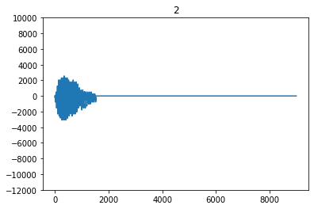
    


```python
nrow, ncol = 3, 3
total = nrow * ncol

fig, axes = plt.subplots(nrow, ncol, figsize = (10, 12))
for i, (audio, label) in enumerate(train_ds.take(total)):
    r, c = i // 3, i % 3
    ax = axes[r][c]
    plot_waveform(ax, audio, label)
```


    
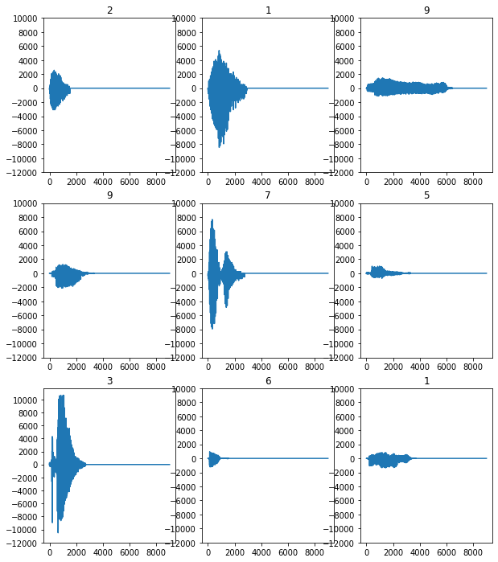
    


## Convert Waveform to Spectrogram


```python
len(next(iter(train_ds))[0])
```


    1525


```python
# https://stackoverflow.com/questions/49626782/typeerror-lambda-missing-1-required-positional-argument-w
# We cannot call the parameter as tuple
list(map(lambda waveform_label: len(waveform_label[0]), [next(iter(train_ds))]))
```


    [1525]


```python
lengths = list(
    map(lambda waveform_label_pair: len(waveform_label_pair[0]), train_ds.as_numpy_iterator())
)
print(min(lengths), max(lengths))
```

    1288 8281


```python
def get_spectrogram(waveform, total_length = TOTAL_LENGTH, verbose = False):
    if verbose:
        print(len(waveform))
    waveform = tf.cast(waveform, tf.float32)
    # TODO: should we pad two ends?
    if len(waveform) < total_length:
        zero_padding = tf.zeros([total_length] - tf.shape(waveform), dtype = tf.float32)
        resized = tf.concat([waveform, zero_padding], 0)
    else:
        resized = waveform[:total_length]
    # padded = tf.concat([zero_padding, waveform], 0)
    # https://www.tensorflow.org/api_docs/python/tf/signal/stft
    spectorgram = tf.signal.stft(
        resized,
        frame_length = 255,
        frame_step = 128,
    )
    if verbose:
        print(spectorgram.shape)
    return tf.abs(spectorgram)
    
for waveform, _ in train_ds.take(1):
    print(get_spectrogram(waveform, verbose = True))
```

    1525
    (69, 129)
    tf.Tensor(
    [[27831.783   13385.691    2025.001   ...  1299.3816    728.5834
         48.29883]
     [29694.773   15497.726     770.877   ...  2986.8875    326.95264
       1435.5938 ]
     [28181.756   13774.739    1131.7078  ...   883.14734  1720.924
        731.37695]
     ...
     [    0.          0.          0.      ...     0.          0.
          0.     ]
     [    0.          0.          0.      ...     0.          0.
          0.     ]
     [    0.          0.          0.      ...     0.          0.
          0.     ]], shape=(69, 129), dtype=float32)


```python
def plot_spectrogram(ax, spectrogram, label = None, verbose = False):
    log_spec = np.log(0.000001 + spectrogram.numpy().T)
    height, width = log_spec.shape[0], log_spec.shape[1]
    if verbose:
        print(f'width: {width} - height: {height}')
    X = np.linspace(0, np.size(spectrogram), num = width, dtype = int)
    Y = range(height)
    if verbose:
        print(len(X), len(Y))
        print(log_spec.shape)
    ax.pcolormesh(X, Y, log_spec, shading = 'auto')
    if label is not None:
        ax.set_title(class_names[label.numpy()])
    
for waveform, label in train_ds.take(1):
    ax = plt.axes()
    spectrogram = get_spectrogram(waveform)
    plot_spectrogram(ax, spectrogram, label, verbose = True)
```

    width: 69 - height: 129
    69 129
    (129, 69)


    
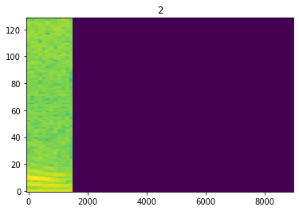
    


```python
# https://stackoverflow.com/questions/7066121/how-to-set-a-single-main-title-above-all-the-subplots-with-pyplot
def plot_waveform_and_spectrogram(waveform, label):
    fig, axes = plt.subplots(2, figsize = (12, 8))
    fig.subplots_adjust(top=0.91)
    fig.suptitle(class_names[label], fontsize = 20)
    axes[0].set_title('Waveform')
    plot_waveform(axes[0], waveform)
    
    axes[1].set_title('Spectrogram')
    spectrogram = get_spectrogram(waveform)
    plot_spectrogram(axes[1], spectrogram)
    
for waveform, label in train_ds.take(1):
    plot_waveform_and_spectrogram(waveform, label)
    
```


    
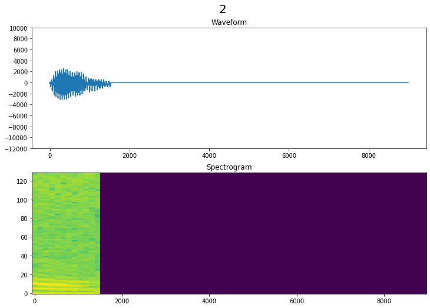
    


```python
for waveform, label in valid_ds.take(1):
    plot_waveform_and_spectrogram(waveform, label)
```


    
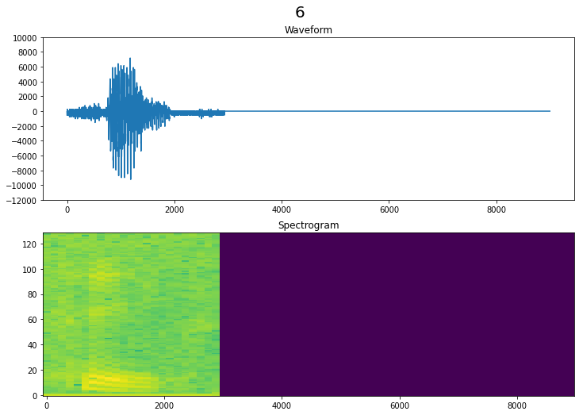
    


```python
nrow, ncol = 3, 3
total = nrow * ncol

fig, axes = plt.subplots(nrow, ncol, figsize = (12, 12))
for i, (audio, label) in enumerate(train_ds.take(total)):
    r, c = i // 3, i % 3
    ax = axes[r][c]
    plot_spectrogram(ax, get_spectrogram(audio), label)
```


    
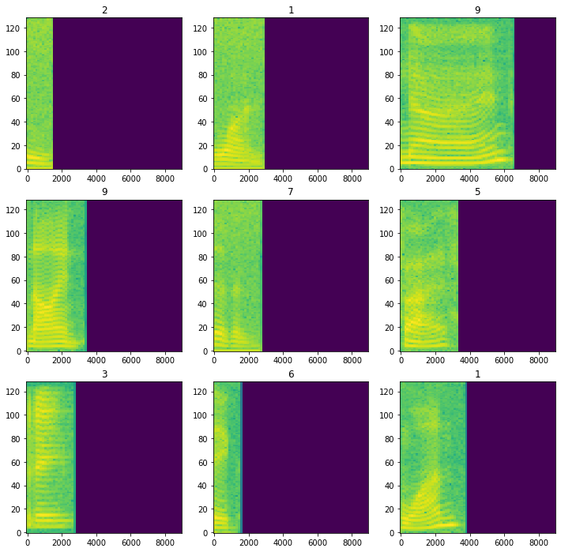
    


```python
# Reference code:
#   tf.expand_dims(get_spectrogram(waveform), -1)
# We use a lambda layer to expand dims below for feeding into covolution layer
def create_batch_dataset(ds, batch_size = 128, is_train = False):
    ds = ds.map(
        lambda waveform, label: (get_spectrogram(waveform), label),
        num_parallel_calls = tf.data.AUTOTUNE
    )
    ds = ds.cache()
    if is_train:
        ds = ds.shuffle(1000)
    return ds.batch(batch_size).prefetch(tf.data.AUTOTUNE)

train_batch_ds = create_batch_dataset(train_ds, is_train = True)
valid_batch_ds = create_batch_dataset(valid_ds)
test_batch_ds = create_batch_dataset(test_ds)
```


```python
sample = next(iter(train_ds))
print(sample)
sample_batch = next(iter(train_batch_ds))
print(sample_batch[0].shape)
input_shape = sample_batch[0].shape[1:]
print(input_shape)
```

    (<tf.Tensor: shape=(1525,), dtype=int64, numpy=array([   0,    0, -256, ..., -512, -256, -512])>, <tf.Tensor: shape=(), dtype=int64, numpy=2>)
    (128, 69, 129)
    (69, 129)


# Build and Train Model


```python
import pandas as pd

def plot_item(history_df, colname = 'loss', f = np.min, ax = None):
    val_colname = f'val_{colname}'
    print(f'{colname}: {f(history_df[colname]):.4f} - {val_colname}: {f(history_df[val_colname]):.4f}')
    history_df.loc[:, [colname, val_colname]].plot(title = colname.capitalize() , ax = ax)

def show_history(history):
    history_df = pd.DataFrame(history.history)
    
    fig, axes = plt.subplots(nrows = 1, ncols = 2, figsize = (15, 5))
    plot_item(history_df, ax = axes[0])
    plot_item(history_df, 'accuracy', f = np.max, ax = axes[1])    
```


```python
def build_and_fit_model(model, epochs = 500):
    model.compile(
        loss = keras.losses.SparseCategoricalCrossentropy(from_logits = True),
        optimizer = 'adam',
        metrics = ['accuracy'],
    )
    
    early_stopping = keras.callbacks.EarlyStopping(
        patience = 5, restore_best_weights = True, verbose = 1
    )
    
    history = model.fit(
        train_batch_ds,
        epochs = epochs,
        validation_data = valid_batch_ds,
        callbacks = [early_stopping],
    )
    return history
```


```python
# Since train_batch_ds would shuffle the sequence, we use a sample in validation set
sample_spectrom = next(iter(valid_batch_ds))[0]
sample_spectrom[0]
```


    <tf.Tensor: shape=(69, 129), dtype=float32, numpy=
    array([[30082.906  , 15256.2295 ,   711.74994, ...,  2749.2073 ,
              385.63535,   384.4248 ],
           [30385.69   , 15545.524  ,  1410.879  , ...,  4907.364  ,
             2979.4673 ,  3499.295  ],
           [30842.479  , 16132.788  ,  1325.7776 , ...,   980.9802 ,
             3173.3442 ,  3537.7363 ],
           ...,
           [    0.     ,     0.     ,     0.     , ...,     0.     ,
                0.     ,     0.     ],
           [    0.     ,     0.     ,     0.     , ...,     0.     ,
                0.     ,     0.     ],
           [    0.     ,     0.     ,     0.     , ...,     0.     ,
                0.     ,     0.     ]], dtype=float32)>


## Adapt Normalization Layer


```python
normalization_layer = keras.layers.experimental.preprocessing.Normalization()
normalization_layer.adapt(train_batch_ds.map(lambda spectrogram, _: spectrogram))
```


```python
normalization_layer([sample_spectrom[0]])
```


    <tf.Tensor: shape=(1, 69, 129), dtype=float32, numpy=
    array([[[ 3.9082756 ,  3.8547199 , -0.02161228, ...,  3.1118    ,
              0.20859306,  0.23805425],
            [ 3.950285  ,  3.933295  ,  0.27255672, ...,  5.768756  ,
              3.4773185 ,  4.206947  ],
            [ 4.013662  ,  4.092801  ,  0.23674901, ...,  0.93489534,
              3.7216408 ,  4.255928  ],
            ...,
            [-0.2655467 , -0.28901353, -0.32109168, ..., -0.27281174,
             -0.2773814 , -0.2517706 ],
            [-0.2655467 , -0.28901353, -0.32109168, ..., -0.27281174,
             -0.2773814 , -0.2517706 ],
            [-0.2655467 , -0.28901353, -0.32109168, ..., -0.27281174,
             -0.2773814 , -0.2517706 ]]], dtype=float32)>


```python
print(sample_spectrom[0][0].shape)
var = (30385.69 - 30082.906)/( 3.9503381 - 3.9083283 )
print(var)
mean = 30082.906 - 3.9083283 * var
print(mean)
```

    (129,)
    7207.461116215696
    1913.7817483446051


```python
print(len(normalization_layer.get_weights()))
for i in range(len(normalization_layer.get_weights())):
    print(normalization_layer.get_weights()[i].shape)
```

    3
    (129,)
    (129,)
    ()


```python
# Shuffle version should not make these values alter
print(normalization_layer.get_weights()[0].shape)
mean = normalization_layer.get_weights()[0][0]
print(normalization_layer.get_weights()[1].shape)
var = normalization_layer.get_weights()[1][0]
print(mean)
print(var)
print(sample_spectrom[0][0][0].numpy())
(30082.906 - mean)/(tf.math.sqrt(var))
```

    (129,)
    (129,)
    1913.9331
    51948332.0
    30082.906


    <tf.Tensor: shape=(), dtype=float32, numpy=3.9082758>


## Build Model

### DNN Only


```python
tf.random.set_seed(1)
np.random.seed(1)
model_dnn = keras.models.Sequential([
    keras.layers.InputLayer(input_shape = input_shape),
    normalization_layer,
    # We add one lambda layer to expand dims, since cov layer take 1 channel dim at last
    keras.layers.Lambda(
        # First df lambda is for batch
        # tf.map_fn is for eager execution (map is not allowed)
        lambda df: tf.map_fn(lambda x: tf.expand_dims(x, -1) , df)
    ),
    # https://www.tensorflow.org/api_docs/python/tf/keras/layers/experimental/preprocessing/Resizing
    keras.layers.experimental.preprocessing.Resizing(32, 64),
    keras.layers.Flatten(),
    keras.layers.Dense(32),
    keras.layers.Dropout(0.3),
    keras.layers.Dense(len(class_names)),
])

model_dnn.summary()
```

    Model: "sequential"
    _________________________________________________________________
    Layer (type)                 Output Shape              Param #   
    =================================================================
    normalization (Normalization (None, 69, 129)           259       
    _________________________________________________________________
    lambda (Lambda)              (None, 69, 129, 1)        0         
    _________________________________________________________________
    resizing (Resizing)          (None, 32, 64, 1)         0         
    _________________________________________________________________
    flatten (Flatten)            (None, 2048)              0         
    _________________________________________________________________
    dense (Dense)                (None, 32)                65568     
    _________________________________________________________________
    dropout (Dropout)            (None, 32)                0         
    _________________________________________________________________
    dense_1 (Dense)              (None, 10)                330       
    =================================================================
    Total params: 66,157
    Trainable params: 65,898
    Non-trainable params: 259
    _________________________________________________________________


```python
history_dnn = build_and_fit_model(model_dnn)
```

    Epoch 1/500
    16/16 [==============================] - 1s 28ms/step - loss: 2.1643 - accuracy: 0.3010 - val_loss: 1.4912 - val_accuracy: 0.5200
    Epoch 2/500
    16/16 [==============================] - 0s 12ms/step - loss: 1.3329 - accuracy: 0.5675 - val_loss: 1.1925 - val_accuracy: 0.6760
    Epoch 3/500
    16/16 [==============================] - 0s 12ms/step - loss: 1.0918 - accuracy: 0.6550 - val_loss: 1.0667 - val_accuracy: 0.6920
    Epoch 4/500
    16/16 [==============================] - 0s 12ms/step - loss: 0.9150 - accuracy: 0.7195 - val_loss: 0.9551 - val_accuracy: 0.7360
    Epoch 5/500
    16/16 [==============================] - 0s 12ms/step - loss: 0.8246 - accuracy: 0.7505 - val_loss: 0.9166 - val_accuracy: 0.7120
    Epoch 6/500
    16/16 [==============================] - 0s 12ms/step - loss: 0.7675 - accuracy: 0.8035 - val_loss: 0.8400 - val_accuracy: 0.7720
    Epoch 7/500
    16/16 [==============================] - 0s 12ms/step - loss: 0.7307 - accuracy: 0.8080 - val_loss: 0.8309 - val_accuracy: 0.7840
    Epoch 8/500
    16/16 [==============================] - 0s 12ms/step - loss: 0.6840 - accuracy: 0.7965 - val_loss: 0.7786 - val_accuracy: 0.7560
    Epoch 9/500
    16/16 [==============================] - 0s 13ms/step - loss: 0.6383 - accuracy: 0.8250 - val_loss: 0.7678 - val_accuracy: 0.7920
    Epoch 10/500
    16/16 [==============================] - 0s 12ms/step - loss: 0.6117 - accuracy: 0.8215 - val_loss: 0.7261 - val_accuracy: 0.7840
    Epoch 11/500
    16/16 [==============================] - 0s 12ms/step - loss: 0.5715 - accuracy: 0.8345 - val_loss: 0.6817 - val_accuracy: 0.7920
    Epoch 12/500
    16/16 [==============================] - 0s 13ms/step - loss: 0.5547 - accuracy: 0.8590 - val_loss: 0.6752 - val_accuracy: 0.8280
    Epoch 13/500
    16/16 [==============================] - 0s 12ms/step - loss: 0.5331 - accuracy: 0.8550 - val_loss: 0.6739 - val_accuracy: 0.8200
    Epoch 14/500
    16/16 [==============================] - 0s 13ms/step - loss: 0.5148 - accuracy: 0.8565 - val_loss: 0.6541 - val_accuracy: 0.8160
    Epoch 15/500
    16/16 [==============================] - 0s 13ms/step - loss: 0.4750 - accuracy: 0.8765 - val_loss: 0.6307 - val_accuracy: 0.8240
    Epoch 16/500
    16/16 [==============================] - 0s 12ms/step - loss: 0.4702 - accuracy: 0.8805 - val_loss: 0.6197 - val_accuracy: 0.8440
    Epoch 17/500
    16/16 [==============================] - 0s 13ms/step - loss: 0.4408 - accuracy: 0.8875 - val_loss: 0.6056 - val_accuracy: 0.8240
    Epoch 18/500
    16/16 [==============================] - 0s 14ms/step - loss: 0.4088 - accuracy: 0.9175 - val_loss: 0.5963 - val_accuracy: 0.8400
    Epoch 19/500
    16/16 [==============================] - 0s 13ms/step - loss: 0.3819 - accuracy: 0.9115 - val_loss: 0.5801 - val_accuracy: 0.8600
    Epoch 20/500
    16/16 [==============================] - 0s 12ms/step - loss: 0.3777 - accuracy: 0.9165 - val_loss: 0.5722 - val_accuracy: 0.8640
    Epoch 21/500
    16/16 [==============================] - 0s 12ms/step - loss: 0.3654 - accuracy: 0.9145 - val_loss: 0.5335 - val_accuracy: 0.8480
    Epoch 22/500
    16/16 [==============================] - 0s 12ms/step - loss: 0.3582 - accuracy: 0.9200 - val_loss: 0.5361 - val_accuracy: 0.8600
    Epoch 23/500
    16/16 [==============================] - 0s 13ms/step - loss: 0.3503 - accuracy: 0.9180 - val_loss: 0.5288 - val_accuracy: 0.8600
    Epoch 24/500
    16/16 [==============================] - 0s 13ms/step - loss: 0.3420 - accuracy: 0.9200 - val_loss: 0.5796 - val_accuracy: 0.8480
    Epoch 25/500
    16/16 [==============================] - 0s 13ms/step - loss: 0.3250 - accuracy: 0.9240 - val_loss: 0.5257 - val_accuracy: 0.8320
    Epoch 26/500
    16/16 [==============================] - 0s 13ms/step - loss: 0.3304 - accuracy: 0.9205 - val_loss: 0.5247 - val_accuracy: 0.8560
    Epoch 27/500
    16/16 [==============================] - 0s 13ms/step - loss: 0.3023 - accuracy: 0.9330 - val_loss: 0.4863 - val_accuracy: 0.8840
    Epoch 28/500
    16/16 [==============================] - 0s 13ms/step - loss: 0.2872 - accuracy: 0.9400 - val_loss: 0.4832 - val_accuracy: 0.8640
    Epoch 29/500
    16/16 [==============================] - 0s 12ms/step - loss: 0.2828 - accuracy: 0.9405 - val_loss: 0.5119 - val_accuracy: 0.8800
    Epoch 30/500
    16/16 [==============================] - 0s 13ms/step - loss: 0.2656 - accuracy: 0.9375 - val_loss: 0.5255 - val_accuracy: 0.8520
    Epoch 31/500
    16/16 [==============================] - 0s 13ms/step - loss: 0.2666 - accuracy: 0.9465 - val_loss: 0.5341 - val_accuracy: 0.8560
    Epoch 32/500
    16/16 [==============================] - 0s 12ms/step - loss: 0.2564 - accuracy: 0.9415 - val_loss: 0.4703 - val_accuracy: 0.8840
    Epoch 33/500
    16/16 [==============================] - 0s 13ms/step - loss: 0.2499 - accuracy: 0.9525 - val_loss: 0.4710 - val_accuracy: 0.8800
    Epoch 34/500
    16/16 [==============================] - 0s 13ms/step - loss: 0.2632 - accuracy: 0.9455 - val_loss: 0.4691 - val_accuracy: 0.8840
    Epoch 35/500
    16/16 [==============================] - 0s 13ms/step - loss: 0.2381 - accuracy: 0.9445 - val_loss: 0.4831 - val_accuracy: 0.8920
    Epoch 36/500
    16/16 [==============================] - 0s 13ms/step - loss: 0.2483 - accuracy: 0.9485 - val_loss: 0.4979 - val_accuracy: 0.8840
    Epoch 37/500
    16/16 [==============================] - 0s 12ms/step - loss: 0.2353 - accuracy: 0.9550 - val_loss: 0.4403 - val_accuracy: 0.8760
    Epoch 38/500
    16/16 [==============================] - 0s 12ms/step - loss: 0.2324 - accuracy: 0.9570 - val_loss: 0.4590 - val_accuracy: 0.8760
    Epoch 39/500
    16/16 [==============================] - 0s 12ms/step - loss: 0.2187 - accuracy: 0.9485 - val_loss: 0.4577 - val_accuracy: 0.9040
    Epoch 40/500
    16/16 [==============================] - 0s 12ms/step - loss: 0.2075 - accuracy: 0.9600 - val_loss: 0.4579 - val_accuracy: 0.8960
    Epoch 41/500
    16/16 [==============================] - 0s 12ms/step - loss: 0.1964 - accuracy: 0.9610 - val_loss: 0.4688 - val_accuracy: 0.8960
    Epoch 42/500
    16/16 [==============================] - 0s 12ms/step - loss: 0.2112 - accuracy: 0.9500 - val_loss: 0.4782 - val_accuracy: 0.8600
    Restoring model weights from the end of the best epoch.
    Epoch 00042: early stopping


```python
show_history(history_dnn)
```

    loss: 0.1964 - val_loss: 0.4403
    accuracy: 0.9610 - val_accuracy: 0.9040


    
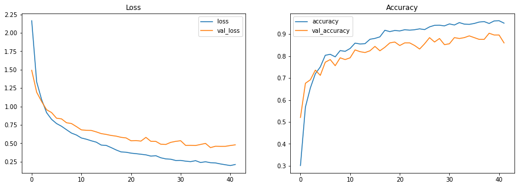
    


### CNN


```python
tf.random.set_seed(1)
np.random.seed(1)
model_cnn1 = keras.models.Sequential([
    keras.layers.InputLayer(input_shape = input_shape),
    normalization_layer,
    # We add one lambda layer to expand dims, since cov layer take 1 channel dim at last
    keras.layers.Lambda(
        # First df lambda is for batch
        # tf.map_fn is for eager execution (map is not allowed)
        lambda df: tf.map_fn(lambda x: tf.expand_dims(x, -1) , df)
    ),
    # https://www.tensorflow.org/api_docs/python/tf/keras/layers/experimental/preprocessing/Resizing
    keras.layers.experimental.preprocessing.Resizing(32, 64),
    keras.layers.Conv2D(32, 3, activation = 'relu'),
    keras.layers.Conv2D(64, 3, activation = 'relu'),
    keras.layers.MaxPooling2D(),
    keras.layers.Dropout(0.3),
    keras.layers.Flatten(),
    keras.layers.Dense(16),
    keras.layers.Dropout(0.3),
    keras.layers.Dense(len(class_names)),
])

model_cnn1.summary()
```

    Model: "sequential_1"
    _________________________________________________________________
    Layer (type)                 Output Shape              Param #   
    =================================================================
    normalization (Normalization (None, 69, 129)           259       
    _________________________________________________________________
    lambda_1 (Lambda)            (None, 69, 129, 1)        0         
    _________________________________________________________________
    resizing_1 (Resizing)        (None, 32, 64, 1)         0         
    _________________________________________________________________
    conv2d (Conv2D)              (None, 30, 62, 32)        320       
    _________________________________________________________________
    conv2d_1 (Conv2D)            (None, 28, 60, 64)        18496     
    _________________________________________________________________
    max_pooling2d (MaxPooling2D) (None, 14, 30, 64)        0         
    _________________________________________________________________
    dropout_1 (Dropout)          (None, 14, 30, 64)        0         
    _________________________________________________________________
    flatten_1 (Flatten)          (None, 26880)             0         
    _________________________________________________________________
    dense_2 (Dense)              (None, 16)                430096    
    _________________________________________________________________
    dropout_2 (Dropout)          (None, 16)                0         
    _________________________________________________________________
    dense_3 (Dense)              (None, 10)                170       
    =================================================================
    Total params: 449,341
    Trainable params: 449,082
    Non-trainable params: 259
    _________________________________________________________________


```python
history_cnn1 = build_and_fit_model(model_cnn1)
```

    Epoch 1/500
    16/16 [==============================] - 3s 175ms/step - loss: 1.9778 - accuracy: 0.3270 - val_loss: 1.4715 - val_accuracy: 0.6680
    Epoch 2/500
    16/16 [==============================] - 3s 169ms/step - loss: 1.3254 - accuracy: 0.6335 - val_loss: 1.0997 - val_accuracy: 0.7080
    Epoch 3/500
    16/16 [==============================] - 3s 160ms/step - loss: 1.0323 - accuracy: 0.7265 - val_loss: 0.9601 - val_accuracy: 0.7640
    Epoch 4/500
    16/16 [==============================] - 3s 160ms/step - loss: 0.8277 - accuracy: 0.7795 - val_loss: 0.9208 - val_accuracy: 0.7920
    Epoch 5/500
    16/16 [==============================] - 3s 163ms/step - loss: 0.7440 - accuracy: 0.7960 - val_loss: 0.8216 - val_accuracy: 0.8280
    Epoch 6/500
    16/16 [==============================] - 3s 165ms/step - loss: 0.6265 - accuracy: 0.8210 - val_loss: 0.6470 - val_accuracy: 0.8600
    Epoch 7/500
    16/16 [==============================] - 3s 160ms/step - loss: 0.5372 - accuracy: 0.8550 - val_loss: 0.6235 - val_accuracy: 0.8840
    Epoch 8/500
    16/16 [==============================] - 3s 166ms/step - loss: 0.4457 - accuracy: 0.8770 - val_loss: 0.5820 - val_accuracy: 0.8960
    Epoch 9/500
    16/16 [==============================] - 3s 168ms/step - loss: 0.4601 - accuracy: 0.8775 - val_loss: 0.5656 - val_accuracy: 0.9000
    Epoch 10/500
    16/16 [==============================] - 3s 168ms/step - loss: 0.4094 - accuracy: 0.8900 - val_loss: 0.5548 - val_accuracy: 0.9120
    Epoch 11/500
    16/16 [==============================] - 3s 169ms/step - loss: 0.3694 - accuracy: 0.9000 - val_loss: 0.4644 - val_accuracy: 0.9040
    Epoch 12/500
    16/16 [==============================] - 3s 167ms/step - loss: 0.3170 - accuracy: 0.9130 - val_loss: 0.4328 - val_accuracy: 0.9200
    Epoch 13/500
    16/16 [==============================] - 3s 169ms/step - loss: 0.2420 - accuracy: 0.9330 - val_loss: 0.4458 - val_accuracy: 0.9240
    Epoch 14/500
    16/16 [==============================] - 3s 165ms/step - loss: 0.2565 - accuracy: 0.9215 - val_loss: 0.3846 - val_accuracy: 0.9120
    Epoch 15/500
    16/16 [==============================] - 3s 159ms/step - loss: 0.2413 - accuracy: 0.9230 - val_loss: 0.3996 - val_accuracy: 0.9280
    Epoch 16/500
    16/16 [==============================] - 3s 161ms/step - loss: 0.2123 - accuracy: 0.9380 - val_loss: 0.3645 - val_accuracy: 0.9400
    Epoch 17/500
    16/16 [==============================] - 3s 163ms/step - loss: 0.2098 - accuracy: 0.9370 - val_loss: 0.3015 - val_accuracy: 0.9640
    Epoch 18/500
    16/16 [==============================] - 3s 166ms/step - loss: 0.1598 - accuracy: 0.9505 - val_loss: 0.3162 - val_accuracy: 0.9320
    Epoch 19/500
    16/16 [==============================] - 3s 163ms/step - loss: 0.1732 - accuracy: 0.9520 - val_loss: 0.4570 - val_accuracy: 0.9480
    Epoch 20/500
    16/16 [==============================] - 3s 164ms/step - loss: 0.1263 - accuracy: 0.9675 - val_loss: 0.5776 - val_accuracy: 0.9600
    Epoch 21/500
    16/16 [==============================] - 3s 163ms/step - loss: 0.1280 - accuracy: 0.9645 - val_loss: 0.3427 - val_accuracy: 0.9440
    Epoch 22/500
    16/16 [==============================] - 3s 163ms/step - loss: 0.1279 - accuracy: 0.9580 - val_loss: 0.3265 - val_accuracy: 0.9680
    Restoring model weights from the end of the best epoch.
    Epoch 00022: early stopping


```python
show_history(history_cnn1)
```

    loss: 0.1263 - val_loss: 0.3015
    accuracy: 0.9675 - val_accuracy: 0.9680


    
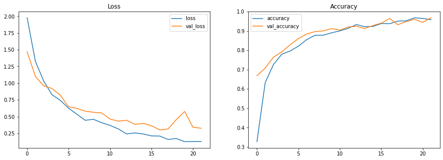
    


```python
tf.random.set_seed(1)
np.random.seed(1)

# If we don't use resize layer, it would be slower but get better performance
# (Need to try different seeds)
model_no_resize = keras.models.Sequential([
    keras.layers.InputLayer(input_shape = input_shape),
    normalization_layer,
    keras.layers.Lambda(lambda df: tf.map_fn(lambda x: tf.expand_dims(x, -1) , df)),
    keras.layers.Conv2D(32, 3, activation = 'relu'),
    keras.layers.Conv2D(64, 3, activation = 'relu'),
    keras.layers.MaxPooling2D(),
    keras.layers.Dropout(0.3),
    keras.layers.Conv2D(64, 3, activation = 'relu'),
    keras.layers.MaxPooling2D(),
    keras.layers.Dropout(0.3),
    keras.layers.Flatten(),
    keras.layers.Dense(16),
    keras.layers.Dropout(0.3),
    keras.layers.Dense(len(class_names)),
])

model_no_resize.summary()
```

    Model: "sequential_2"
    _________________________________________________________________
    Layer (type)                 Output Shape              Param #   
    =================================================================
    normalization (Normalization (None, 69, 129)           259       
    _________________________________________________________________
    lambda_2 (Lambda)            (None, 69, 129, 1)        0         
    _________________________________________________________________
    conv2d_2 (Conv2D)            (None, 67, 127, 32)       320       
    _________________________________________________________________
    conv2d_3 (Conv2D)            (None, 65, 125, 64)       18496     
    _________________________________________________________________
    max_pooling2d_1 (MaxPooling2 (None, 32, 62, 64)        0         
    _________________________________________________________________
    dropout_3 (Dropout)          (None, 32, 62, 64)        0         
    _________________________________________________________________
    conv2d_4 (Conv2D)            (None, 30, 60, 64)        36928     
    _________________________________________________________________
    max_pooling2d_2 (MaxPooling2 (None, 15, 30, 64)        0         
    _________________________________________________________________
    dropout_4 (Dropout)          (None, 15, 30, 64)        0         
    _________________________________________________________________
    flatten_2 (Flatten)          (None, 28800)             0         
    _________________________________________________________________
    dense_4 (Dense)              (None, 16)                460816    
    _________________________________________________________________
    dropout_5 (Dropout)          (None, 16)                0         
    _________________________________________________________________
    dense_5 (Dense)              (None, 10)                170       
    =================================================================
    Total params: 516,989
    Trainable params: 516,730
    Non-trainable params: 259
    _________________________________________________________________


```python
history_no_resize = build_and_fit_model(model_no_resize)
```

    Epoch 1/500
    16/16 [==============================] - 16s 981ms/step - loss: 1.9103 - accuracy: 0.3420 - val_loss: 1.4076 - val_accuracy: 0.6200
    Epoch 2/500
    16/16 [==============================] - 16s 983ms/step - loss: 1.3161 - accuracy: 0.6085 - val_loss: 1.0796 - val_accuracy: 0.7360
    Epoch 3/500
    16/16 [==============================] - 16s 988ms/step - loss: 1.0492 - accuracy: 0.7040 - val_loss: 0.9921 - val_accuracy: 0.8120
    Epoch 4/500
    16/16 [==============================] - 16s 993ms/step - loss: 0.8266 - accuracy: 0.7810 - val_loss: 0.7751 - val_accuracy: 0.8640
    Epoch 5/500
    16/16 [==============================] - 16s 1s/step - loss: 0.6614 - accuracy: 0.8200 - val_loss: 0.6108 - val_accuracy: 0.8960
    Epoch 6/500
    16/16 [==============================] - 17s 1s/step - loss: 0.5281 - accuracy: 0.8530 - val_loss: 0.4208 - val_accuracy: 0.9040
    Epoch 7/500
    16/16 [==============================] - 17s 1s/step - loss: 0.4455 - accuracy: 0.8740 - val_loss: 0.3710 - val_accuracy: 0.9280
    Epoch 8/500
    16/16 [==============================] - 16s 992ms/step - loss: 0.3411 - accuracy: 0.8985 - val_loss: 0.4531 - val_accuracy: 0.9280
    Epoch 9/500
    16/16 [==============================] - 16s 995ms/step - loss: 0.3041 - accuracy: 0.9135 - val_loss: 0.3056 - val_accuracy: 0.9480
    Epoch 10/500
    16/16 [==============================] - 16s 986ms/step - loss: 0.2922 - accuracy: 0.9145 - val_loss: 0.3206 - val_accuracy: 0.9400
    Epoch 11/500
    16/16 [==============================] - 16s 982ms/step - loss: 0.2412 - accuracy: 0.9270 - val_loss: 0.3814 - val_accuracy: 0.9360
    Epoch 12/500
    16/16 [==============================] - 16s 983ms/step - loss: 0.2165 - accuracy: 0.9335 - val_loss: 0.2651 - val_accuracy: 0.9520
    Epoch 13/500
    16/16 [==============================] - 16s 987ms/step - loss: 0.2179 - accuracy: 0.9375 - val_loss: 0.2316 - val_accuracy: 0.9360
    Epoch 14/500
    16/16 [==============================] - 16s 1s/step - loss: 0.1558 - accuracy: 0.9560 - val_loss: 0.2069 - val_accuracy: 0.9400
    Epoch 15/500
    16/16 [==============================] - 16s 997ms/step - loss: 0.1670 - accuracy: 0.9525 - val_loss: 0.3440 - val_accuracy: 0.9240
    Epoch 16/500
    16/16 [==============================] - 16s 988ms/step - loss: 0.1569 - accuracy: 0.9515 - val_loss: 0.5339 - val_accuracy: 0.9400
    Epoch 17/500
    16/16 [==============================] - 15s 968ms/step - loss: 0.1392 - accuracy: 0.9570 - val_loss: 0.3495 - val_accuracy: 0.9480
    Epoch 18/500
    16/16 [==============================] - 16s 973ms/step - loss: 0.1235 - accuracy: 0.9620 - val_loss: 0.3545 - val_accuracy: 0.9560
    Epoch 19/500
    16/16 [==============================] - 16s 976ms/step - loss: 0.1156 - accuracy: 0.9675 - val_loss: 0.3401 - val_accuracy: 0.9600
    Restoring model weights from the end of the best epoch.
    Epoch 00019: early stopping


```python
show_history(history_no_resize)
```

    loss: 0.1156 - val_loss: 0.2069
    accuracy: 0.9675 - val_accuracy: 0.9600


    
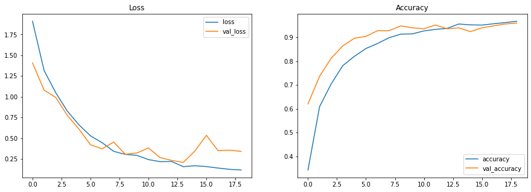
    


```python
tf.random.set_seed(1)
np.random.seed(1)
model_cnn_global_max_pooling2d = keras.models.Sequential([
    keras.layers.InputLayer(input_shape = input_shape),
    normalization_layer,
    keras.layers.Lambda(
        lambda df: tf.map_fn(lambda x: tf.expand_dims(x, -1) , df)
    ),
    keras.layers.experimental.preprocessing.Resizing(32, 64),
    keras.layers.Conv2D(32, 3, activation = 'relu'),
    keras.layers.Conv2D(64, 3, activation = 'relu'),
    keras.layers.MaxPooling2D(),
    keras.layers.Dropout(0.3),
    keras.layers.Conv2D(64, 3, activation = 'relu'),
    keras.layers.Conv2D(128, 3, activation = 'relu'),
    keras.layers.MaxPooling2D(),
    keras.layers.Dropout(0.3),
    keras.layers.GlobalMaxPooling2D(),
    keras.layers.Dense(16),
    keras.layers.Dropout(0.3),
    keras.layers.Dense(len(class_names)),
])

model_cnn_global_max_pooling2d.summary()
```

    Model: "sequential_3"
    _________________________________________________________________
    Layer (type)                 Output Shape              Param #   
    =================================================================
    normalization (Normalization (None, 69, 129)           259       
    _________________________________________________________________
    lambda_3 (Lambda)            (None, 69, 129, 1)        0         
    _________________________________________________________________
    resizing_2 (Resizing)        (None, 32, 64, 1)         0         
    _________________________________________________________________
    conv2d_5 (Conv2D)            (None, 30, 62, 32)        320       
    _________________________________________________________________
    conv2d_6 (Conv2D)            (None, 28, 60, 64)        18496     
    _________________________________________________________________
    max_pooling2d_3 (MaxPooling2 (None, 14, 30, 64)        0         
    _________________________________________________________________
    dropout_6 (Dropout)          (None, 14, 30, 64)        0         
    _________________________________________________________________
    conv2d_7 (Conv2D)            (None, 12, 28, 64)        36928     
    _________________________________________________________________
    conv2d_8 (Conv2D)            (None, 10, 26, 128)       73856     
    _________________________________________________________________
    max_pooling2d_4 (MaxPooling2 (None, 5, 13, 128)        0         
    _________________________________________________________________
    dropout_7 (Dropout)          (None, 5, 13, 128)        0         
    _________________________________________________________________
    global_max_pooling2d (Global (None, 128)               0         
    _________________________________________________________________
    dense_6 (Dense)              (None, 16)                2064      
    _________________________________________________________________
    dropout_8 (Dropout)          (None, 16)                0         
    _________________________________________________________________
    dense_7 (Dense)              (None, 10)                170       
    =================================================================
    Total params: 132,093
    Trainable params: 131,834
    Non-trainable params: 259
    _________________________________________________________________


```python
history_cnn_global_max_pooling2d = build_and_fit_model(model_cnn_global_max_pooling2d)
```

    Epoch 1/500
    16/16 [==============================] - 5s 270ms/step - loss: 2.3270 - accuracy: 0.1120 - val_loss: 2.2827 - val_accuracy: 0.1560
    Epoch 2/500
    16/16 [==============================] - 4s 271ms/step - loss: 2.2434 - accuracy: 0.1675 - val_loss: 2.2009 - val_accuracy: 0.2240
    Epoch 3/500
    16/16 [==============================] - 4s 269ms/step - loss: 2.1470 - accuracy: 0.2120 - val_loss: 2.1055 - val_accuracy: 0.2440
    Epoch 4/500
    16/16 [==============================] - 4s 254ms/step - loss: 2.0327 - accuracy: 0.2750 - val_loss: 1.9494 - val_accuracy: 0.3400
    Epoch 5/500
    16/16 [==============================] - 4s 257ms/step - loss: 1.8790 - accuracy: 0.3360 - val_loss: 1.8415 - val_accuracy: 0.3520
    Epoch 6/500
    16/16 [==============================] - 4s 258ms/step - loss: 1.7096 - accuracy: 0.4005 - val_loss: 1.6034 - val_accuracy: 0.5360
    Epoch 7/500
    16/16 [==============================] - 4s 255ms/step - loss: 1.5055 - accuracy: 0.4720 - val_loss: 1.4907 - val_accuracy: 0.5680
    Epoch 8/500
    16/16 [==============================] - 4s 258ms/step - loss: 1.4353 - accuracy: 0.5210 - val_loss: 1.3616 - val_accuracy: 0.5560
    Epoch 9/500
    16/16 [==============================] - 4s 256ms/step - loss: 1.2535 - accuracy: 0.5760 - val_loss: 1.1597 - val_accuracy: 0.6560
    Epoch 10/500
    16/16 [==============================] - 4s 255ms/step - loss: 1.1173 - accuracy: 0.6350 - val_loss: 1.0462 - val_accuracy: 0.7400
    Epoch 11/500
    16/16 [==============================] - 4s 254ms/step - loss: 1.0491 - accuracy: 0.6505 - val_loss: 0.9740 - val_accuracy: 0.6720
    Epoch 12/500
    16/16 [==============================] - 4s 255ms/step - loss: 0.9127 - accuracy: 0.7055 - val_loss: 0.8085 - val_accuracy: 0.8120
    Epoch 13/500
    16/16 [==============================] - 4s 260ms/step - loss: 0.8677 - accuracy: 0.7135 - val_loss: 0.8141 - val_accuracy: 0.7880
    Epoch 14/500
    16/16 [==============================] - 4s 258ms/step - loss: 0.8329 - accuracy: 0.7360 - val_loss: 0.7664 - val_accuracy: 0.8040
    Epoch 15/500
    16/16 [==============================] - 4s 256ms/step - loss: 0.6857 - accuracy: 0.7840 - val_loss: 0.6036 - val_accuracy: 0.8560
    Epoch 16/500
    16/16 [==============================] - 4s 256ms/step - loss: 0.6122 - accuracy: 0.7885 - val_loss: 0.6190 - val_accuracy: 0.8760
    Epoch 17/500
    16/16 [==============================] - 4s 257ms/step - loss: 0.6093 - accuracy: 0.7990 - val_loss: 0.6172 - val_accuracy: 0.8600
    Epoch 18/500
    16/16 [==============================] - 4s 257ms/step - loss: 0.6133 - accuracy: 0.7975 - val_loss: 0.5295 - val_accuracy: 0.8640
    Epoch 19/500
    16/16 [==============================] - 4s 257ms/step - loss: 0.5461 - accuracy: 0.8225 - val_loss: 0.4831 - val_accuracy: 0.8760
    Epoch 20/500
    16/16 [==============================] - 4s 257ms/step - loss: 0.5007 - accuracy: 0.8425 - val_loss: 0.4455 - val_accuracy: 0.9000
    Epoch 21/500
    16/16 [==============================] - 4s 257ms/step - loss: 0.4629 - accuracy: 0.8540 - val_loss: 0.4205 - val_accuracy: 0.8960
    Epoch 22/500
    16/16 [==============================] - 4s 255ms/step - loss: 0.3876 - accuracy: 0.8660 - val_loss: 0.4120 - val_accuracy: 0.8920
    Epoch 23/500
    16/16 [==============================] - 4s 256ms/step - loss: 0.3923 - accuracy: 0.8840 - val_loss: 0.3217 - val_accuracy: 0.9240
    Epoch 24/500
    16/16 [==============================] - 4s 256ms/step - loss: 0.3788 - accuracy: 0.8830 - val_loss: 0.4092 - val_accuracy: 0.8880
    Epoch 25/500
    16/16 [==============================] - 4s 257ms/step - loss: 0.3418 - accuracy: 0.8910 - val_loss: 0.3140 - val_accuracy: 0.9240
    Epoch 26/500
    16/16 [==============================] - 4s 257ms/step - loss: 0.3318 - accuracy: 0.8915 - val_loss: 0.3176 - val_accuracy: 0.9280
    Epoch 27/500
    16/16 [==============================] - 4s 257ms/step - loss: 0.2915 - accuracy: 0.9060 - val_loss: 0.2659 - val_accuracy: 0.9320
    Epoch 28/500
    16/16 [==============================] - 4s 255ms/step - loss: 0.2837 - accuracy: 0.9000 - val_loss: 0.2687 - val_accuracy: 0.9240
    Epoch 29/500
    16/16 [==============================] - 4s 256ms/step - loss: 0.2765 - accuracy: 0.9130 - val_loss: 0.3478 - val_accuracy: 0.9040
    Epoch 30/500
    16/16 [==============================] - 4s 264ms/step - loss: 0.2550 - accuracy: 0.9185 - val_loss: 0.2369 - val_accuracy: 0.9280
    Epoch 31/500
    16/16 [==============================] - 4s 255ms/step - loss: 0.2241 - accuracy: 0.9315 - val_loss: 0.2756 - val_accuracy: 0.9400
    Epoch 32/500
    16/16 [==============================] - 4s 259ms/step - loss: 0.2247 - accuracy: 0.9260 - val_loss: 0.4038 - val_accuracy: 0.9440
    Epoch 33/500
    16/16 [==============================] - 4s 256ms/step - loss: 0.2406 - accuracy: 0.9245 - val_loss: 0.3505 - val_accuracy: 0.9240
    Epoch 34/500
    16/16 [==============================] - 4s 258ms/step - loss: 0.2314 - accuracy: 0.9210 - val_loss: 0.2973 - val_accuracy: 0.9280
    Epoch 35/500
    16/16 [==============================] - 4s 257ms/step - loss: 0.2150 - accuracy: 0.9240 - val_loss: 0.1970 - val_accuracy: 0.9480
    Epoch 36/500
    16/16 [==============================] - 4s 257ms/step - loss: 0.2071 - accuracy: 0.9270 - val_loss: 0.2137 - val_accuracy: 0.9560
    Epoch 37/500
    16/16 [==============================] - 4s 259ms/step - loss: 0.1876 - accuracy: 0.9380 - val_loss: 0.1715 - val_accuracy: 0.9440
    Epoch 38/500
    16/16 [==============================] - 4s 257ms/step - loss: 0.2299 - accuracy: 0.9260 - val_loss: 0.2402 - val_accuracy: 0.9600
    Epoch 39/500
    16/16 [==============================] - 4s 257ms/step - loss: 0.2118 - accuracy: 0.9285 - val_loss: 0.1637 - val_accuracy: 0.9440
    Epoch 40/500
    16/16 [==============================] - 4s 258ms/step - loss: 0.1681 - accuracy: 0.9445 - val_loss: 0.1955 - val_accuracy: 0.9440
    Epoch 41/500
    16/16 [==============================] - 4s 257ms/step - loss: 0.1847 - accuracy: 0.9450 - val_loss: 0.1556 - val_accuracy: 0.9600
    Epoch 42/500
    16/16 [==============================] - 4s 258ms/step - loss: 0.1786 - accuracy: 0.9460 - val_loss: 0.1924 - val_accuracy: 0.9560
    Epoch 43/500
    16/16 [==============================] - 4s 257ms/step - loss: 0.2033 - accuracy: 0.9360 - val_loss: 0.2129 - val_accuracy: 0.9600
    Epoch 44/500
    16/16 [==============================] - 4s 258ms/step - loss: 0.2114 - accuracy: 0.9320 - val_loss: 0.2437 - val_accuracy: 0.9320
    Epoch 45/500
    16/16 [==============================] - 4s 262ms/step - loss: 0.1659 - accuracy: 0.9530 - val_loss: 0.1848 - val_accuracy: 0.9640
    Epoch 46/500
    16/16 [==============================] - 4s 267ms/step - loss: 0.1661 - accuracy: 0.9470 - val_loss: 0.1767 - val_accuracy: 0.9480
    Restoring model weights from the end of the best epoch.
    Epoch 00046: early stopping


```python
show_history(history_cnn_global_max_pooling2d)
```

    loss: 0.1659 - val_loss: 0.1556
    accuracy: 0.9530 - val_accuracy: 0.9640


    
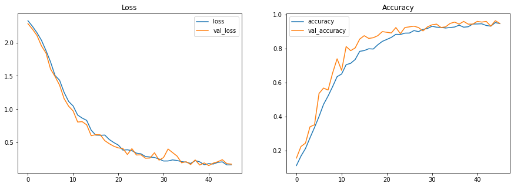
    


```python
model_best = model_cnn_global_max_pooling2d
```

# Evaluation


```python
model_best.evaluate(test_batch_ds)
```

    2/2 [==============================] - 0s 65ms/step - loss: 0.2230 - accuracy: 0.9360


    [0.22297918796539307, 0.9359999895095825]


## Check the Confusion Matrix


```python
test_spectrograms, test_labels = [], []
for spectrogram, label in test_batch_ds.unbatch():
    test_spectrograms.append(spectrogram)
    test_labels.append(label)
    
print(test_spectrograms[0].shape)
print(test_labels[0].shape)
```

    (69, 129)
    ()


```python
predictions = model_best.predict(np.array(test_spectrograms))
test_preds = np.argmax(predictions, axis = 1)

test_acc = sum(test_preds == test_labels) / len(test_labels)
print(f'Test accuracy: {test_acc:.2%}') # It should be the same as above
```

    Test accuracy: 93.60%


```python
import seaborn as sns

# https://www.tensorflow.org/api_docs/python/tf/math/confusion_matrix
confusion_matrix = tf.math.confusion_matrix(test_labels, test_preds)
plt.figure(figsize = (10, 8))

# https://seaborn.pydata.org/generated/seaborn.heatmap.html
sns.heatmap(
    confusion_matrix,
    xticklabels = class_names,
    yticklabels = class_names,
    annot = True,
)

plt.xlabel('Prediction')
plt.ylabel('Label')
plt.show()
```


    
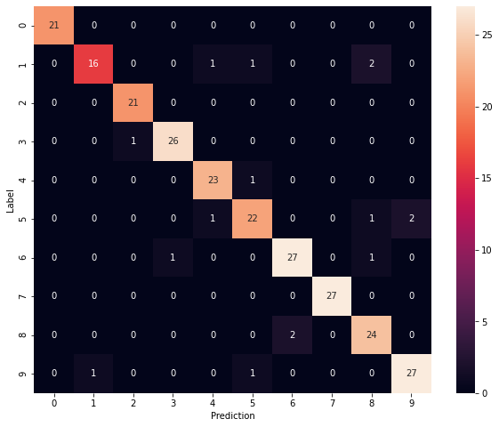
    


## Predict on a Sample


```python
pos = 8
prediction = model_best.predict(np.array([test_spectrograms[pos]]))
answer = class_names[test_labels[pos].numpy()]

plt.bar(class_names, tf.nn.softmax(prediction[0]))
plt.title(f'Prediction for "{answer}"')
plt.show()
```


    
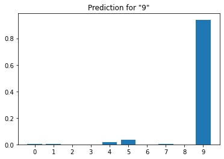
    


```python
import IPython
test_waveforms = list(test_ds.map(lambda waveform, _: waveform).as_numpy_iterator())
print(test_labels[pos])
# 8kHz: https://www.tensorflow.org/datasets/catalog/spoken_digit
IPython.display.display(IPython.display.Audio(test_waveforms[pos], rate = 8000))
```

    tf.Tensor(9, shape=(), dtype=int64)


<audio  controls="controls" >
    <source src="data:audio/wav;base64,UklGRngmAABXQVZFZm10IBAAAAABAAEAQB8AAIA+AAACABAAZGF0YVQmAAC+/Rn/2v+z/w0Bs/+BAXMAWgFoAkICqAH1AY8CaAJ2A48CtQKdA2gCAgN2A2gC6gPDA10EawUeBXkG7QaHB2AHuwjiCG4IIQjtBiwGawWoAcAAAACY/W76HvcC9Zfvve8V7grwsvHn8s7zj/QF+BP5SPpV+6b+QP/AAOcADQGoAbUCjwLcAgIDwwPDA2AH/grwCdcKZg1/DD0KSwtICPgE0QQpA8z+sPyj+9T5YPlg+ZX6/vza/+cAwACPAo8C6gMsBsYG7QaHBzoHeQYFBrUC9QE0AVoBQP9x/XH9L/sv+8b43/ff99H20fYC9dnxmvJN8v/x//GP9Hb1N/bf9zr5SPoI+1j+s//1AXYDqwTRBF0E+AQQBIQEwwO4BZIFoAZ8CYoKyQlxC4oKCAkvCYcHSAhFBV0EcwCoAecADQFm/00AzgECAzcEAgOdAykDaAKPAhsCaAIbAp0DKQOPAgIDAgPcAp0DAgNoAiYAmP2g+Cn1WvPk7xXu1u6U7C7tyO387mXxj/Q6+f78pv5oAg0BNAECA4EBJgANAecADQHRBLsIOgeNDd0QNQ/rEV8SNQ/BDvYP/gquB7gF9QGK/Ir8xvgT+Tr5fPuK/Ev91/yw/Av+zP5m/3MAgQEbAucAs/+z/1oBTQBCAnYDAgM3BMMD0QQQBGgC5f1u+pL39fNw7+HsB+1q6Z7qnuq67BXuJvKd9cn78/5NALUC0QSdA2gCtQJQAzcE3AITB6MJJAvzDIIPthBDEF8SkBCpDycOFgoFBsMDTQAk/Uj6LPj49tH2kvcs+G76SPoI+y/7yfum/k0A6gM6By8JCAkLDEsLfAniCBMHbgjGBmAH3wWPAlj+h/kC9b3voe2G61Hqnuqe6sXqnuqJ7ibyN/Zg+X/+Mv6aAHMAAADz/sAAKQN5Bj0KfwwqEccUiBVUFJYWrxWsEu4UBBFZDJIF9QHX/GD5qvan8xD2nfVr9/XzEPZP9bj3yfv+/H/+KQOdA4cHVgkvCeIISwvXCj0KLwnwCYcHfAkLDJIFwwP1AbD8tfQj7znr6efQ6ETpDOWL40Hmauk87lrzE/mw/I8CAgMpA1oBWgFoArgF4gjzDCcOthCsEl8SOBK5E9IS6xF3ERwQ+wceBfUBMv4W/Mb4Hve19AL1zvPA8jTzT/WE9tT5o/tx/Wb/wwMTBxYKSwuzDXQOZg1mDeULMgwICbsIhwcTB/gEs/9I+t/3zvPy8LrsOevQ6IPodecP6IPoeOpw72j0BfjX/E0ATQBCAoEBjwL4BIQEFgpZDIIPxBFJFi0U0hJiFYUSgg+CD40N+wcQBNr/S/3U+bv6+PY39k/1EPa19BD2tfRr9635yfvM/nMAKQO4BW4IigokCyQLigqYC9oNZg1ODicOGQ1uCM4Blfpo9OTvX+tq6dvmv+Rk45bhi+Mo51HqMfCg+HH9cwA0AcAAmgDa/48CqwQWCrMNsw0fEzsVOBLEETsVvBb5EogV6xHJCVMGwwML/kj63/d29U/1QvQm8svw5/Ln8ur1uPch+rD8C/5CAqAGSwtxC38MJw4yDAsMcQsZDScOGQ2NDU4OLwncAk0ACPun8xXurOso50vkMOIJ4iLhv+RB5i7tmvLf9wj7AABaAc4BtQLqAwUGOgfBDrYQkBBsEyIWkxNsE5MTURHaDUMQcQuuB+oDNAGK/FX7E/kF+Lj3G/T18w3zG/S19BD2rfnJ+xb8TQD7B4oKwQ6KCiQLownwCZUIRQWeEeATbBPlC+ULEwcbAu34defV4LbbON102SfZq92x4+TvYPmz/5IF1AcWCskJjwLG+MjtsvHR9iH6owlaGkQe7B9jI8slPCMzGhMHivwI+wX4EPYN80/1SPprBSEI0QQZ/9f88/5V+9z07+2J7of5TQAQBFMGFgrmGecnnByN/4zxw/U3BIUSCAmEBBobAypnG5oAI++Z5Cjnud4jyNq/UtH26Kr2vv0L/o8CnhFvFgUGDfPT6zHwc/Ji7h3pT/VrBdAdozCPKT4YXA8+GGwTQgJt7PPluPeHB4oKKQPDAyQLbBMnDof5Lu2h7bj3E/lo9Mvw+/n+CnoUNQ8TB+oDsQpJFoUSmvLt39H22xuUITsVxgYUFXMnAhzU+UjhO+AB547mPNUKyczXdvW1Aq355O8v+8kJmAut+XjqLu0I+zL+5/KG66D4PQpnG4EoeyIqEcEOgg95BvUBY/wF+Bb81AdICO0GLwm7CGAHUAPi+n7wy/Cd9W768Pu+/fP+EASjCT0KawXcAoEBqwRcD38MaPQ87o8COBLyJdQuaSk7FSwGh/l77ennRd653jvgZ+YG3zvg0+vc9Pv5oPj49jf2xvgF+KD4Fvyj+9T5KfWt+f78EASAGucnIyQqEZgLRQX1ATIMEATi+q35uwgyDIoKLAaz/84BnQML/pryV/C19D38tQJNAPP+qAEWCqYMVgnOAVj+1AfrERMHaPSE9msF1RWpNqdBHR58+132L/tN8oDlStZ/12fmROn74Crcnuov+0D/lfpw71fwUvgQBCwGIfq19Gj0CPudA5j9MgxKJFMtzRqHBxn/pv62EE4Oo/uk8E0AwQ7PD+IIE/kh+twC3wVg+Ynu1u6t+aAGeQYL/nz7UAPBDr4LkgXw++X9wQ6vFaAGEPYNAYoKIS8nTowmNPME6hn/jf9C9IvjitUE6l32+evM19rYkemt+X/+uuzb5hv0SAiKCrP/qvan89/3ivwW/AL1own4K7wvEB2gBiT9+AQwFxkNwPKh7TL+KhGFEmAHLPij+9QHSAiH+SDsFe5I+qMJuAVu+h73HgWpD9oNaAJg+RsCQA1ADXH9lfpCAqwS4DpHSEokAvVO58Dyw/Wk8LbbStaA5Sbyt+m229LdX+taATL+I++67N/3/gqmDPgEpPCU7PXzzP4bAqAGIySVL8EnHBCuB1X7VfsnDkgImP2t+RMHBBGeEf4KFvxj/HH9vv0N8+/tJvIv+6MJ+wfa/9r/OgdZDPAJQgIL/uoDOgfUB7gFkxOWPexGUh/i+uTvdvUT+cb4meSC2qbluuxk4yfZxNw56zr5lfoC9VrzDfO7+kD/6gML/hD2GPGy8RD2C/67Ies43yzuFHkGuAW1AlAD1/wv+1ADZg0OD2AHawUQBIcHhASH+bfpD+iy8ZX6zP6N/wAARQWxCggJtQLJ+779IQixCgID1/zX/BESbFPeXhAdAedW4pryo/s39orVYscw4hXuoN+K1Vbi/O5m/5j9+eu/5I/0sQqxCucAP/GG63Pykvd5+Bn/syZzQMowfRfRBPP+qAGrBEj6ZfF//o0NSRYOD84BbvrGBgEOmP3T6/7jIOwT+YQEwwOm/hsCvgscELsIf/6m/s4BCAkQBD0K/DwtVN8sWP667JrySPoI++Dep8zJ1FbibN6+1iTWmeQe93z7tfTc9Cz4pv5zACH6//GX74T2L/t5+FX7dA7gOt5FUy2NDQv+DQEFBoQEuPey8cz+HxNaGoIPTQCt+TQBQgKH+Ynubex29agBuAXAALD8dgNcDzgSownz/m76IQhKJGBHqkSAGi/7uPcsBqAGVfvY4wDZmeTQ6LbbB8aTxcHZ9fPJ+8LnF+NI+uAT3RCn8+3fPuO7+vsHMv697x73uROhOydONyvqA9f8cQvSEmsFj/SG6yYAchmAGooKvv1j/LgFigqj+/7j4N7k748CZg1jCgUGYwqpD6MJjwJY/loBgBo2RJdLVSK+/cb4uAWmDIEBg+gq3DboB+0t38jGdcDOzDbo+/k87r/k+etCApsOBQb18zDikelY/qAGWP5F924IkR5zQDZEVSKBAVX7SwuNDUgIN/YH7cz+4BP8FdEE/vxm/0UFhwcs+EHm4+Hc9HkG+wfAAKgBfwxyGakPBQZNAJIFg0TjVpQhR+xt7I8C2g22ED/xFOCb55fv8OJJyGy3zb7C56D44+FPzmTjrxXLJWYNwueQ22LumgApA/XzI+9uCBkmdkPpQ20hawWSBRwQLwlL/Rv0NPNrBbkTnhHM/m76KQOKCsYGI++j4pvnIfoTB7sIWP6w/E4OYyOJIwgJ3PSNDT1YF1hUFFPfud6N/78Z/xis677WluHZ8ablr8dbsw/B3uke9zbohd1n5s4B3RBxCxjxvOHQ6OL6+wdFBSkDCAnyJZxDiDy1G/P+L/trBVkMIQjR9rX0awU+GOMWRQXD9Sz4EASaALLxiOB94u34fwwBDoEBY/zlC3sioiIOD5L37B/4Uh03Mv5e3dvmMv6/GaYMGubd20HmV/Bp22rC7KoMvgj7eQbT62ze5O+dAzIMs//m5PDi1u7z/m4IfAm1AlERFTwvSYcuvgs6+cn7lQjzDAv+svET+TUP6RxiFZoAj/RL/dEEyftc6CrcKOfM/t0Q1wpm/3/+fRdmJtkmZg15Bvw8XUT/GC7tiOA563kGzRqV+h/eP9j+4/vgE9KAvhS5Xt1F96sEJgCJ7vDiFe6KCkIC8+Wa2UfsIQiqHZ8fzRr7LlQ7ijE+GMAAG/Qh+qYMjQ3cAvP+CAliFW8WMgyw/J31+PZF97Lxt+nI7WD5CAnXCjoHawVpENMgLiJEHtkmmzVgIFj+pPBz8rv6dgP1AT/x7Orp52Tj+tLIxsLAe8Zs3g3zEPaM8cP1Mv7a/1oBp/OA5Q/ow/W7CN0Q4BNiFWwsTEABNUwZtQLX/Gb/igpTBgj71/yxCosYTBkLDCT9xvhx/fv5P/GO5obrIfqYCwEOXQSPAr4LhiB4H8UfbCzlMuEhjwKJ7jnr3/cmAL79CvAz5Rfjq92w1XbOXMH2wavdfPsmALX0jPG19Lv6JP3D9Q/oROkC9a4H7hTrEeAToC02RJs1bxZCApX6WgFADcYGbvrJ+zIMmRlaGpgLQP+m/kD/h/kH7c3llOzX/OgOdxH7B+oDmw76IOEh+iBUOw825QsN8wrwE/mN/zcEN/YS65Hpm+dI4bjQNcFWuyTWBOqe6hfjWvMcEA4PWP7+4wPcuuw0AVoB3/fl/fAJUh8+P7hFtikREnELFgpICDQBT/UN87gFVxfmGXcR3wVCAm4IIQid9djj2ONX8OoD8AmVCIEBXQQEEYMdxR9XFzouPj8WI9T5gOWe6q35oAaz/23s5uS36RLrON00zK65kMJv4a/uFe4K8JL3mgDMDFADROkU4CPvJP1QAwUGUAM9ClgltUI7PAUf3wWaAKAGsQrnALLxzvMTB/8Y/xiNDQAAqAEhCM4BwPJB5gHnkvcLDJsOHgWN/1YJchkZJuwf6ioYP2AgyftE6d7pJvKz/yYAy/BR6kTpgOUn2ebLm8A7x53cfeKp6NT56A4cEIEBG/SU7CbyBfjA8ozxMv5ODnIZ3yxUOxo0RyF6FBYKtQI9/OL6UvhzAHwJURFGExwQ8Al5BvgESPp+8BLrMfCg+I8CYwoTB0UFSwtJFloa5ydHSAo+uwgo5zboEPYy/vD7l+8j7w3zuPf566rPrrkavyLhI+8J4orVgOUhCEchChdC9L/kBOp5+Lv6uPcb9O346xFkMV1EcjJ9F0ANdA6mDMz+svFR6rj3wQ7/GAcUuwjqA5gL8wyaAK/u5uTh7Jj9uwi7CGgCuAVjCoAaYCAaNERFdiqaAA/oxer/8T386vVl8TTza/eB8zDiwMtAv3bOJNZ50QvX9fOCDwcUfAld9krvgfPc9Gj0nuqs63H9URGEK2U/0jmwI+YZXxKHB2P8XfYN8xP5oAbEEawSQxBmDY0N/grl/eTv0+tU7V32DQETB/gEuAWmDCIW5hlnG8wzEETEKvv5Ld+p6If5GwKn80TpYu7f9531xNxOwD28u9N33NrYF+MZ/+cABQYqEQgJ3PR46vLw//Gq9gj7AAC7CEch2D+hOwAnthC7CDoHoAZu+tPrcO+BAbkTchmQEJ0DOgcLDMMDa/fp5x3pdvXRBMwM+ASPAhYKpxqtINQutzcOKBESefh77V/r9fNX8O/tJvIC9ZfvfeIv1JbIzszczePIgtq+/cQR8AmPAnH9qAGaAAL1K+rQ6KTwZv93EZ4RYCChO3A9GylsE6sEsPz1AT383PRo9AAAHxNyGXoUkgU3BAgJGwKd9ezqR+xS+KAGvgv7B6AGNQ+/Ga0g1iM7PEM3mw7/8Tbo7+3/8RD2+et+8Nz0V/AJ4t/QGMoCzmzeNdrP2ivqjf/VFV8So/vc9CT95f0e9xjx7Oqt+SEIgg/9I3s7tDQ5IA0avgtCApX6hPbL8KD43wW2EPkSQxCYC04OmAuY/fzubeyn87D83ALtBpUIYwrHFEQewhw0KLExTxxsE3MAwPJi7nb1gfMm8rX0BOrp54XduNBnvwfGzNcB5+Hs2+Yu7Q0BpxpDENH2y/C19B736vX/8eTvGf/gE1oaNyusOZ0qmRnSEkUFKfX181rzj/QZ/6YMQxC2EPYPuwg6BwIDCPtw74zxHvdY/jcE1Ae7CL4LhRJ1HGcbJifPT+IvWvOT3gTqEPat+XPyYeD87iH6EPaQ2x3CS73J1JTsFOAt3z/xGQ0UFScOOvlU7afzC/5P9dPr/O7nAF8S6RwKF8EncD2jMGUYnQMs+J318/6j+zf2cwDBDqQXfRezDbUC6gOEBBP5I+9i7u34RQULDMkJ7QZLC28WCCJmJg1BKjgvCeTvIOyX74zxsvGp6BXuoPjR9n3izswHxhvNoN8f3jjdB+1NAOsRJAtx/a/uQvQNAUD/9fOD6EX3sQoXGOATthAJMIg8Zib+Cj386vWK/HMAJvKa8s4B0hJ9F1wPAgOj+5UI3wWE9lHqy/Dz/h4FYwoAAI3/Zg0gIf0j9jZfYEIpnurt30fs/O4x8CjnRd7X/NwCie4bze7GG83H38P159lazG3sCAmbDhkNIQgs+CH6mgCg+KHtVO3i+qsEURH5Eic1g0TXMRobGQ3DA4T2zvO67M7z0QSFEi0UqQ8LDAgJzAwFBnb1+evW7qb+3AKPAp0DIQjSEigcyCJfOUZhYS546mze0+s87rfpGuZT3xP5SAjD9arPZcqt0kLbHNsNzBbVuPcaG6wSGPEV7or8FgrqAwftadtC9AQR9g8TB2IV4z2USP4xBBGj+0D/6gMW/E7nEuuz/5kZjhvMDNwCxgZcD7gF8vAz5XDv2v9FBYQEmgCVCNUVoiJEHhErPGMTR2v3/dVZ5Rjxl+9Z5cHZgfPwCW765stkvEHN8OJk4/HJG83Z8UEb9BrM/tPry/C1AvgEve9Q3F/rJAt9F3QOwQ41NvJMnjhJFnMAf/6PAgj7juYP6LP/ZRhPHLYQXQTRBNISIQjc9PPlrOsW/JIFDQHM/nELyhdjIzwjg0QgYWEuve9h4CvqZ+YJ4g7aPuPa/3kG0+s50qrPydQI1O7GWsyG638MiBVFBfP+9QEv+8jtHekg7Izxa/eBAb4LBxSpNj9NeDhnG4USzAxaAXb1FOBZ5T38wQ7PD2kQ0hKsEkMQ5wAx8BXufvA/8er1VfvOARES5hllGDsV4DradFpBX+uz2FfwGPGg313PxtGoAawSnfVlykHN+N3j4cvJdLImy4r84SEcEGD58/77B6gBr+4i4ablsvEmAKAGQgKWFiRLC0y5LNUVRhPaDc4B+esv1IbrSAiQEEsLwQ75Etsb1RVI+qHt2fH7+QL1G/Ru+tQHpxqJI9UVXUT/f1c+uuzw4p31t+m+1knIJNagBt0QX+u1zXTZW9p50YLBWb743U0AKhHcAtf8BQbUB+X9r+4P6Kno3PSw/E0A0QSbNbZQzzYWIx0eNh1xC9H2Ndoq3Gv3kgUQBPgE7hQdHp8fSAjZ8bLxOvnG+JTseOpY/pYWHR4KF1soh27OaGkQ9uid9YT20t2kyTvHQvQqEZj9s9hY1/XaDtpPznK9TMvb5uoDXQQv+3/+4BMOD9buDOVU7UL0CvBj/BAEPhicQ3lGdiojJIwm9BqPAqHtdNlc6PD7pv5x/VkMDRp1HK8VgQGj+6P7L/uX79buDfPRBKQXvxkOKAVGYVVXPpYWIfq19B3pL9R2zmHg+PYv+zTzXOi53uzR8cllyhvNANlt7Cz49QF2AwIDawUREq4Hy/Cv7g3zlOz7+fAJrBI7POlDPTFpKYEovBYAAErvKtyZ5P/xfPvl/RYK1RUNGrwWqwSN/+X9bvpw76HtHvd2A1kM3h6bNR5FLVRiPAEOoPjk7yrcmcv3z0XeUvh//nvt4N6d3L7WJsuyyh7QANmJ7pX6s//cAjcEBQY9Co8CQvSd9dz0QvTM/nYDyhfsRqE7aSmdKp0qnhEL/pvnRd5i7vXzXfbz/kYT/BVnG7MNkgV5Bk0AzvMu7Qrw0fbzDDgSOSDdN5hZEVI/JjcE1PlX8JTT+cRPzsjtpv7O8yXkjubt3/TMasLAy6jaNdre6V32Zv8FBuII5wAW/FkMYAeE9lzohPbGBj0K3yzlMtcxQzf5OWoeUwYh+sXqOeuZ5IPoqvblC88PHBBJFg4PTg4eBQX4MfBC9LX0EPZuCLUbXitwPcRRaEJ1HIcHSPqx413P5stY13vtCvBn5tjjZ+aa2SvDNcFp28LnR9M56ywG8/5r97sIfwwNAbgFMv4F+Pv55wDa/y8JDzbIO5IsUy2VL60glQg/8aDfX+vv7S7tSu9FBV8SrxVGE5UI2g1ZDCYAMfCJ7sP1uAVsE+MWjykcUGxTUy0REu0Gh/kf3r3I6c7C5w3zv+RC247mIuGf0VzBOMTg3hrm7d8r6kIC+wcQBFoBlQj7B8AAZv929dH2YwpdBOgOIDrFOOoqFzFhLhQVeQb/8YjgUerk7y7ttfT7B74L7hSTE74LfwwWCiT9c/Jz8nn41wpJFp8feDhxS5Y98iVGE7UCCvCK1bXNjdhn5rTmBt/j4Tvgz9os0VHD39DC55Tst+mP9Bv0dgOEBHz7GwL+CuIICPtx/fUB8AnOAQAnWTOoKPgrSC8LJScOvv0P6HvtYu4r6sjtGf8sBnEL+RLzDGkQ2g2N/yH6YPkF+ED/Tg4lGR4sVDvIOw82RyHaDYf5D+gv1NTSmtkU4K7gbN7d2zXasNXZytTSxNzt36noefi49w0BaALz/sAAWQzM/kj6yftgB3cRqAEFH4g8yjCzJt8sJifxF/gE/O7569z0CvBf66D4eQYWCioRMgx/DKwSYAd5+Jj96vWoAWkQiBXRK1w22jTlMnMnGQ3+/CDsqNoA2bbb9dp02c/aotR/10TQPspj1bbbjuYu7ZfvwPJ2A3MALPj1AT381wp8+8DyLAaLGDoHuyH5OZ0qsTEGLZEeQA3tBqHte+2y8YbruuzJ+wAALAZODrEKzw/PDwUGFvx//lX7zgFADVIfAyq8Lz0xLC3eHuULFvzF6gbfud5T30LbsNUpzhDPXc9PziTWads12jboie5q6er1NAHR9in1s/95BmsFaPQ9/K8V1RWTE7ksijH+MaYzNCiTE9ISdgOX7wrwZfH/8dH2bvrX/LMNqQ9LC88PthCHBxAE8/6m/swM2Bi1G6srJzW5LJckvxlWCYf5UerS3criMOIc2znSLNFazIHMOdKw1RHd8OLW7pL3V/B+8JryXfZ5+BsCE/nU+QUGdA4qEU4OEyAdN1YwGSYDKoEomRkQBI/0DfNF9w3zbezq9c4BxgZuCC8JWQwKF3QOawXRBFYJLAYcEBES1RWxMfsuhiBdHVoaYwqS99jjU98z5e3fhM9PzgXRi8rxyXnRgto/2Mri9ujI7cjtG/RC9F321/zRBC/7uPc3BHcRthB3EbksPTHULmkpgSjCHPwVNwQe99z0+Pa97wftWvM39loB6gPtBlkMLRQBDtoNFgqYC2MK6xEEETAXjymJI4Aa/xhJFi8JbvpR6jbowufn2Q3MZcomy/nEI8gT0tTSXt2G6yPvgfMC9dH2LPi7+hb8C/6j+/781wp6FOsR0yCSLJUv7S2uLn4lKBxUFEUFrfk39qfzr+5i7lfwT/Uv+/P+tQKKCpsOkBCCDw4P6A4fE54RFBWcHCgcfRcUFS0Uigp2A0j6DfOv7njqiODM19fVxtEs0aLU8tdC22/hm+eG61Ttve8/8Z31a/f+/LP/GwJTBnELownzDKwSMBeAGgIcah4gIZwcvBYwFzgSNQ+KCp0DWgHl/fv5Rfd5+JX6PfxzALUCHgXtBnwJdA5fEkYT1RWAGm8WbBOIFYIPoAZrBX/+kvfZ8V/r8OIU4H/XhM82z4TP3M2H0rPY0t1W4kHmhuuv7qfz1Pl//twC1AdjCnQOaRCyGJ8f4SGXJIEo3CkxJeQk0yDYGEYTSwt2A5j9Ovmd9aTwy/C97w3zAvW49xb8cwDDA6AG2g3gE6QXWhqnGuYZ5hlXF88PcQudA/D76vVX8OnnVuKC2tTSn9F2zv/KrdIZ2Fva7d8l5L/kt+mM8Wj0E/nnAPgEowmCD4IPvBZVIqUlTSfHLWwsjCbZJr4kjhv8FQ4PEwcNAbv6mvIx8H7wGPEm8mj0dvU6+Vj+zgF5BswMkxP/GKcatRuDHc0avBb5Ev4KhAR//qD45O+e6r/kd9wL18bR6c550d/QotRb2vjdVuJB5njqyO2B8yH6gQFgB/sHyQkBDkMQYhXsH4kjGyk6LnYqWCWXJIYgTBnuFMEO6gNL/Yf5y/Bw72Lu8vAN80X3L/sW/E0AawXiCLMNOxUXGEwZGhsCHOMWUREnDkgIaAJj/AL1MfCR6X3ihd0y18bROdL60pTTJNYq3IjgS+Tp5znrTfJS+Nf8jwLiCK4HCwxpEFwPlhbhIQsl2SZsLI8p4SFHIdAdYhXdELMNwwOm/gX4c/IY8b3vSu808zf2Uvj+/M4BLAa+C0YTMxo2HRAdgx2cHH0XxBFZDDoHs//7+cDylOxq6crid9xx1tTSHtDJ1NfVP9jE3Mrio+IE6jzuNPNu+poAwwMTB8kJ5QsOD0YTixj6IAslACffLA4o+iDsH5wcBxQODz0KNAE9/BP5NPMx8Ffwl++y8Tf2YPky/qgBEwemDJ4R4xaOG80a2BjmGRES6A5jCo8CmP2H+UL0oe146j7jbN712n/XitV/13/Xs9gt32/h5uQS62LuNPOV+iYAUAOgBvAJbghADZ4R+RLbG3AkCCLWI00nRyHQHRobyhepD3ELeQbnALv68Ptj/NH2T/U39nPy9fOj+5j9GwK7CEAN6A65E7kTkxMwF9ISwQ7MDMYGwABL/fj2ZfEK8OzqcuTH30LbANlm2BnY9drV4H3i6eeU7Nbu9fO7+poAzgEeBdQHlQhjCiQL2g2pDy0UixjbG0Qe9x33HXUcshgiFl8S2g18CRAEzP5g+dH2j/Qp9QL1a/eH+Zj9TQC4BWMK2g13EYgVlha5E7kTKhG7CO0GjwIW/Hn4EPY/8aHtnurC5zvgXt0c2w7ad9yT3jDi5uQd6ZTsI+/A8of5WP4NAZIF7Qa7CHkGFgqYCzUPkxMXGCUZgBpBGw0aTxw+GGIVRhPPDz0KrgcpAxb8h/lF90X3hPaH+W76Mv5QA6AGyQmxCmkQ4BOsEncRxBFLC64HhAR//mP8ivxF9w3zNPPL8C7tD+iW4dXg8OJk4zvgS+Sp6ETpeOp+8PLw3PTi+iT9mP12AxAE3AITB/sHrgcBDusRRhOLGPQavxm1G80aixi8FtISNQ+xCu0G3ALAACT9SPqV+mD5cf1x/ZoAAgNTBrEKsQpREWkQJw6CD1kM1AceBUICMv5//vD7uPe49yn1p/NX8PnrZ+Zk43LkPuO/5JnkQeZO51HqeOoH7eTvhPat+bD8WP6z/zcE+ARTBtcKwQ4qEXoUFxiZGUEb5hnYGEwZIhZGE+gO5QsyDJsOOgdaAagBFvzG+LD8Mv5Y/hAEawVFBYcH+ATGBmMKlQjfBToHaAIAAPP+Y/x5+KD4kveS9x733PS97+zq3umb507n6eep6NPre+3T61Ttie4x8Gj0hPbt+Lv6Y/wmAI8CNwSuBxYKZg0OD/kS+RJfEogVehT8FZMToRR3EcEOzAwWClMGHgV2A4EBQgINAecAUAPfBV0EOgegBu0GuAXfBUUFEATcAloBTQDM/gv+lfqV+uL6Bfi49531ve9t7HvtB+267F/rIOwg7JTsR+wg7K/uV/CB89/3oPjJ+5j9JgBoAjcElQiYC6MJsw1ODqkPDg/dEDUPXA+eEQ4PGQ3oDiQLSwt8CZUIEwc6B3kGBQaSBTcE6gPcAlADtQKdAxAEnQOEBGgCdgOPAkICzgGN/xn/Gf+j++L6Uvi19JryZfFw70rvI+9K7/Lwl++976/ur+5+8HPy3PSd9fj2SPpL/U0AgQH1AfUBoAY6B4cHbgh8CXELpgwcEAEOwQ41D38MfwymDNcK+wcWCuIIowluCMYG0QQQBNEEXQRaAUICmgDnAEICTQBaAQv+dgOV+gQRPQqS93kGFvwv+6zrKOc26MXql+887iDsV/Cg+Df2tfSX76fzUvg39lL49fNP9aD4Uvj7+df8NwSgBksLSwsvCS8J+wcFBmsFxgbiCJgLJAskC0ANMgwyDGMK1AcvCYoKbgh5BuoD0QQQBGgCwADcAhAEBQbRBOoDHgW1AloB5f0k/df8QP9j/Hn4nfWq9ur1ZfEV7i7tCvA39ur1p/OB86r2w/Vz8sDy5/Kd9dH20fZr91L4yfsy/qgBdgPDA50D0QTtBqsEEwdTBm4IFgpZDBkNWQyVCDIM1woLDHEL1wovCcYGBQa4BasEwACBASkDRQVdBIEBtQKEBPgEwABzAI3/zgECA84BDQGaAPUBGf9u+rX0j/T7+Xn46vUQ9p31Ovnf94HzTfKq9kX3nfWd9ar2tfSn80/16vW495X6Pfy1ArUC2v+1AocHYAcsBtQHfAmKCiEI0QSEBGsFhwd2A/gELAZICO0GnQNNADQBhATa/43/mP1aAfUBWP7AAFoBqwS4BbgFGwJQA1ADAgPcAjQBjf9Y/sAAAADJ+9T5FvzX/LD81Pn7+SH6lfp5+BP50fZP9Wv3Ifri+of5Uvji+n/+WP5x/df8UAPRBCwGUANdBIQEdgNQA4EBmgDDA2sFqwRQA9wCDQGBARn/QP9x/X/+5wBzAE0AmgAbAmgC/vzw+00ARQUFBhAEdgMpA5IFhARQA8AAdgMsBg==" type="audio/wav" />
    Your browser does not support the audio element.
</audio>


